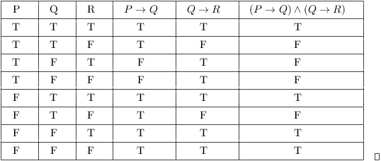

- [Back to Main](../main.md)

# 11. Basic Logic
### Concept) Proposition
- Def.)
  - A proposition is a statement that is either true or false.
    - e.g.) Philadelphia is the capital of Pennsylvania.
    - cf.) Things that do not have a true-false answer are NOT propositions.
        - e.g.) What is today’s weather going to be like

 

### Concept) Boolean Operators
|Operator|Symbol|
|:-:|:-:|
|Conjunction|$`\wedge`$|
|Disjunction|$`\vee`$|
|Exclusive (XOR)|$`\oplus`$|
|NOT|$`\neg`$|

 

#### E.g.) English Expression vs Boolean Expression
- Consider an English expression s.t.
  - "Dinner is eaten in our house at 7pm or at 8pm"
- We can break this down into
  $`\begin{cases}
    p & \textrm{: I eat dinner at 7 pm.} \\
    q & \textrm{: I eat dinner at 8 pm.} \\
  \end{cases}`$.
- Then the expression "or" implies $`p \vee q`$.
- However, $`p, q`$ are mutually exclusive.
- Thus, $`p \oplus q`$ is the precise boolean expression for the original expression.

 

### Concept) The Order of Operations for Boolean Algebra
1. $`\neg`$
2. $`\wedge`$
3. $`\vee`$

 

### Concept) Truth Table

  

- [Back to Main](../main.md)