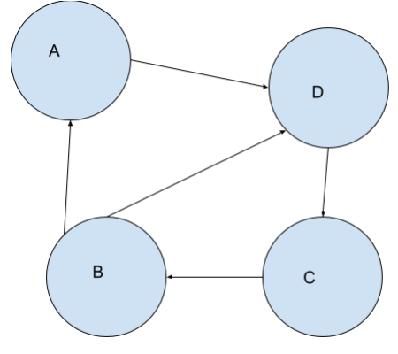

- [Back to Main](../main.md)

# 20. Graph Theory
### Concept) Graph
- Def.)
  - A graph $`G`$ is defined by a combination of a vertex set $`V`$ and an edge set $`E \subseteq V\times V`$
- Notation)
  - $`G = (V,E)`$
- e.g.)
  |Vertices|Edges|Graphic|
  |:-:|:-:|:-:|
  |$`V=\{A,B,C,D\}`$|$`E=\{\overline{AB}, \overline{AD}, \overline{BD}, \overline{BC}, \overline{CD}\}`$||

 

### Terms)
- Endpoint
  - The two vertices that are part of an edge are its **endpoints**.
- Incident
  - When a vertex is an **endpoint** of an edge we say the edge is **incident** on the vertex.
- Directed Graph
  - A graph that there can be an edge from vertex $`u`$ to vertex $`v`$ without having an edge from vertex $`v`$ to vertex $`u`$ 
- Undirected Graph
  - $`(u,v) \in E \leftrightarrow (v,u)\in E`$
- Loop
  - An edge that joins a vertex to itself
- Complete Graph $`(K_n)`$
  - Def.)
    - A graph where every vertex is connected to every other vertex
  - Prop.)
    - A connected graph with $`n`$ vertices have $`\begin{pmatrix} n\\2 \end{pmatrix}`$ edges.

  

### Concept) Path
- Def.)
  - A path is an alternating sequence of vertices and edges that satisfy...
    1. it starts and ends with a vertex.
    2. each edge joins the vertex before it in the sequence to the vertex after it in the sequence.
    3. no vertex appears more than once.

### Concept) Walk
- Def.)
  - A walk is an alternating sequence of vertices and edges that satisfy...
    1. it starts and ends with a vertex.
    2. each edge joins the vertex before it in the sequence to the vertex after it in the sequence.
- Prop.)
  - If there is a walk between two vertices $`u`$ and $`v`$, there has to be a path between them.
    - Pf.)
      - Case 1)
        - There is no vertex that is repeated in the walk. In this case then by definition this walk is a path and we are done.
      - Case 2)
        - There exists a vertex $`x`$ in this walk such that it is repeated. 
        - For this vertex, we can make a shorter walk by removing the part of the walk that is between the first and last occurrences of the the vertex.
        - Repeat the process of finding these repeated vertices and making shorter walks.
        - Therefore, eventually we will have no repeated vertices in our walk and our walk will reduce to a path.

 

### Concept) Degree
- Def.)
  - The degree of a vertex is the number of edges that are incident on it.
- Prop.)
  - Sum of the degrees of the vertices is twice the number of edges.
    - Pf.)
      - Consider a graph with $`e`$ edges.
      - Base Case) $`e=0`$
        - Then the degree is zero.
        - Thus, the proposition holds.
      - Suppose the proposition holds for a graph with $`k`$ edges.
        - i.e.) The sum of the degrees in the graph is $`2k`$.
      - Now, if we add an edge, the number of edges is $`k+1`$.
      - There will be two cases of adding an edge.
        1. The edge is a loop.
           - Then, the sum of the degrees will increase by 2.
           - Thus, the sum is $`2k+2`$.
        2. The edge was connecting two distinct vertices.
           - Then, the sum of the degrees will increase by 2.
           - Thus, the sum is $`2k+2`$.
       - In either case, the sum of degree is $`2k+2 = 2(k+1)`$.
       - Thus, the theorem holds for $`k+1`$ edges.
       - QED.

 

### E.g.) Pf by Graph
- Theorem)
  - In any group of 6 people you are bound to find either 
    - a group of 3 distinct mutual friends 
    - or 3 distinct mutual enemies 
      - (obviously this assumes for any given pair of people they are either mutual friends or mutual enemies).
- Pf.)
  - Consider there is a graph with 6 vertices.
  - If two distinct vertices are connected, they are friends.
  - Else, they are enemies.
  - Suppose there are at least three vertices connected to each other.
    - Then there is a group of three distinct friends.
  - Suppose not.
    - Then each connection will have at most two vertices.
    - The possible connections will be
      - $`(2,2,2), (2,2,1,1), (2,1,1,1,1), (1,1,1,1,1,1)`$
      - In any case of the above, there are at least three groups.
      - Selecting one member from each group, we can have three mutual enemies.

- [Back to Main](../main.md)