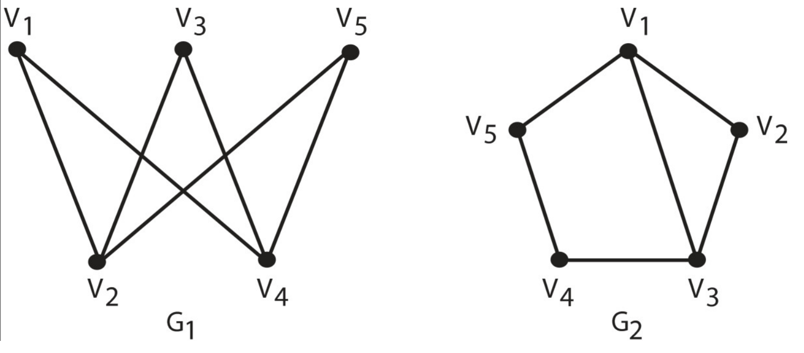

- [Back to Main](../main.md)

# Graph Theory 2
### Concept) Isomorphism
- Def.)
  - Let
    - $`G = (V, E)`$
    - $`G' = (V', E')`$
  - Then
    - $`G`$ and $`G'`$ are isomorphic if there is a bijection $`f:V\rightarrow V'`$ such that for every pair of vertices $`x,y\in V`$, $`(x,y)\in E \wedge (f(x), f(y))\in E'`$
      - the function $`f`$ is called the isomorphism from $`G`$ to $`G'`$.
- Props.)
  - Necessary Conditions for Isomorphism
    - The two graphs have to have the same number of edges and vertices.
    - Under an isomorphism the degree of a vertex is preserved. 
      - So if the vertex $`v`$ had a degree of $`k`$ in graph $`G`$. 
      - Then $`f(v)\in G'`$ must have the same degree $`k`$.
    - The degree sequence of two isomorphic graphs has to be the same. 
      - where the degree sequence of a graph is a list of the degrees of all of the vertices in non-increasing order.
  - Graphs satisfying the above but not isomorphic   
    |Graph|
    |:-:|
    ||

 

### Concept) Circuit (Cycle)
- Def.)
  - A [walk](20.md#concept-walk) in which the first vertex is the same as the last vertex.
- Props.)
  - Length
    - e.g.) A sequence of one vertex $`\langle a \rangle`$ is a circuit of length 0.
  - Cycle
    - A circuit is a **cycle** if it has length at least three and there are no additional repeated vertices, besides the first and the last.

 

### Concept) Eulerian Trail
- Def.)
  - A trail in a finite graph that visits every **edge** exactly once (allowing for revisiting vertices). 
  - Similarly, an Eulerian circuit or Eulerian cycle is an Eulerian trail that starts and ends on the same vertex.

 

### Theorem) Ore's Theorem
- Theorem)
  - Let 
    - $`G`$ : a (finite and simple) graph with $`n \ge 3`$ vertices. 
    - $`\textrm{deg} v`$ : the degree of a vertex $`v \in G`$.
      - i.e. the number of incident edges in $`G`$ to $`v`$. 
  - $`\forall v,w \in G`$ such that $`v`$ and $`w`$ are non-adjacent and  $`\textrm{deg} v + \textrm{deg} w \ge n`$
    - then $`G`$ is Hamiltonian.

 

### Concept) Hamiltonian Path
- Def.)
  - A path in an undirected or directed graph that visits each **vertex** exactly once.

 

### Concept) Connectedness
- Def.)
  - A **vertex** $`v`$ is said to be **connected** to vertex $`w`$ in a graph $`G`$ if there is a path in $`G`$ from $`v`$ to $`w`$.
  - A **graph** is said to be **connected** if every vertex is connected to every other vertex in the graph and is **disconnected** otherwise.
- Props.)
  - For undirected graphs,
    - a path from $`v`$ to $`w`$ implies that there is also a path from $`w`$ to $`v`$.
  - By definition, every vertex is connected to itself by a path of length 0.
  - Isolated Vertex
    - A vertex that is not connected with any other vertex is called an **isolated** vertex.

 

### Concept) Tree
- Def.)
  - A connected acyclic (no cycles present) graph

  

- [Back to Main](../main.md)