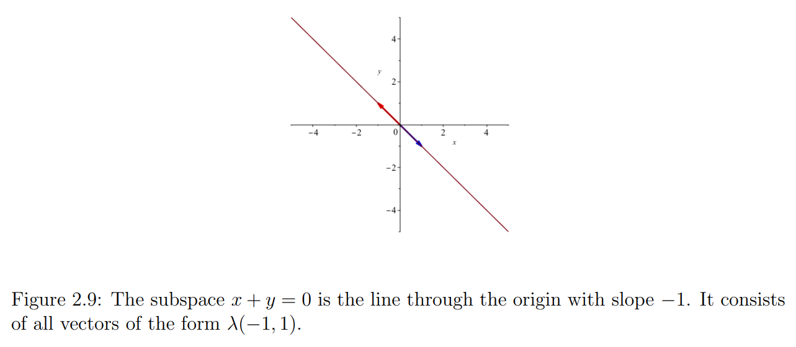

[Back to main](../../main.md)

# 2.4 Linear Independence and Subspaces
### Tech.) Using Families instead of Sets
- Defining the concept of [linear independence](#concept-linear-independence) and [linear dependence](#concept-linear-dependence) below, we will use [families](03.md#22-indexed-families) instead of [sets](03.md#concept-index-set).
- The reason that we do this is because the definition of linear combinations for [families](03.md#22-indexed-families) of vectors has the advantage that the vectors being combined need not be distinct.
  - i.e.) Allowing multiple occurrences of vectors.
  - e.g.)
    - Consider $`I=\{1,2,3\}`$ and the families $`(u,v,u)`$ and $`(\lambda_1, \lambda_2, \lambda_1)`$.
    - Then, their linear combination is $`\displaystyle\sum_{i\in I}\lambda_i u_i = \lambda_1 u + \lambda_2 v + \lambda_1 u`$
  - When used?)
    - Consider a matrix containing identical columns.
      - We will say that the matrix is linearly dependent, which is only allowed under the definition of linear dependence of families, not the sets.
- On the other hand, using [sets](03.md#concept-index-set) of vectors in the definition of a linear combination does not allow
such linear combinations due to the violation on the uniqueness.
- Thus, in order to define the [linear dependence](#concept-linear-dependence), using a [family](03.md#22-indexed-families) is more proper.

 

### Concept) Vector Space and Linear Combination
- Def.)
  - Let $`E`$ be a vector space.
  - A vector $`v \in E`$ is a **linear combination** of a family $`(u_i)_{i\in I}`$ of elements of $`E`$
    - iff. there is a family $`(\lambda_i)_{i\in I}`$ of scalars in $`\mathbb{R}`$ such that
      - $`\displaystyle v = \sum_{i\in I} \lambda_i u_i`$
  - cf.) When $`I = \emptyset`$, we stipulate that $`v = 0`$.

 

### Concept) Linear Independence
- Def.)
  - A family $`(u_i)_{i\in I}`$ is linearly independent 
    - iff. for every family $`(\lambda_i)_{i\in I}`$ of scalars in $`\mathbb{R}`$,
      - $`\displaystyle \left(\sum_{i\in I} \lambda_i u_i = 0 \right) \Rightarrow \left(\lambda_i = 0, \forall i \in I \right)`$.
  - cf.) When $`I = \emptyset`$, the family $`\emptyset`$ is linearly independent.
- Prop.)
  - This definition actually implies that a nontrivial linearly independent [family](03.md#22-indexed-families) is a [set](03.md#concept-index-set)!

 

### Concept) Linear Dependence
- Def.)
  - A family $`(u_i)_{i\in I}`$ is linearly dependent 
    - iff. there is some family $`(\lambda_i)_{i\in I}`$ of scalars in $`\mathbb{R}`$ such that
      - $`\displaystyle \sum_{i\in I} \lambda_i u_i = 0`$ and $`\lambda_j \ne 0, \exists j\in I`$
- cf.)
  - We used [families](03.md#22-indexed-families) in order to properly define linear dependence.

#### E.g.)
1. $`\forall \lambda, \mu \in \mathbb{R} \textrm{ s.t. } \lambda\ne 0 \wedge \mu\ne 0`$ are linearly dependent.
2. $`(1,0,0), (0,1,0), (0,0,1) \in\mathbb{R}^3`$ are linearly independent.
3. $`(1,1,1,1), (0,1,1,1), (0,0,1,1), (0,0,0,1) \in \mathbb{R}^4`$ are linearly independent.
4. $`u=(1,1), v=(0,1), w=(2,3)`$ are linearly dependent.
   - Why?)
     - $`2u + v = w \Leftrightarrow 2u+v-w = 0`$
       - i.e.) $`\exists \lambda_1, \lambda_2, \lambda_3 \ne 0 \textrm{ s.t. } \lambda_1 u+ \lambda_2 v+ \lambda_3 w = 0`$

 

### Concept) Linear Subspace
- Def.)
  - Given a [vector space](02.md#concept-vector-space) $`E`$, a subset $`F \subset E`$ is a linear subspace of $`E`$
      - iff. $`F`$ is nonempty and $`\lambda u + \mu v \in F, \forall u,v \in F, \forall \lambda, \mu \in \mathbb{R}`$
- Prop.)
  - $`F`$ is a vector space.
    - Why?)
      - The restriction of $`+ : E\times E \rightarrow E`$ to $`F\times F`$ is a function $`+ : F\times F \rightarrow F`$.
      - The restriction of $`\cdot : E\times E \rightarrow E`$ to $`F\times F`$ is a function $`\cdot : F\times F \rightarrow F`$.
  - Every subspace contains the vector 0.
    - Why?)
      - $`\forall u\in F, (\lambda=\mu=0) \Rightarrow \lambda u + \mu u = 0.`$
  - The intersection of any family of subspaces of a vector space $`E`$ is a subspace.
  - Let $`F`$ be any subspace of a vector space $`E`$.
    - Then for any nonempty finite index set $`I`$,
      - if $`(u_i)_{i\in I}`$ is any family of vectors $`u_i \in F`$ and $`(\lambda_i)_{i\in I}`$ is any family of scalars,
        - then $`\displaystyle \sum_{i\in I} \lambda_i u_i \in F`$
- Notation)
  - The subspace $`\{0\}`$ will be denoted by
    - $`(0)`$ or $`0`$.
- e.g.)
  - Consider $`\mathbb{R}^2`$.
    - The set of vectors $`u=(x,y) \textrm{ s.t. } x+y=0`$ is the subspace of $`\mathbb{R}^2`$.
      ||
      |:-:|
      ||

  

[Back to main](../../main.md)