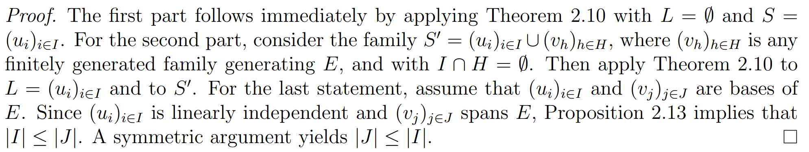

[Back to main](../../main.md)

# 2.5 Bases of Vector Space
### Concept) Span (Generate)
- Def.)
  - Given a vector space $`E`$ and a subspace $`V \subseteq E`$ 
    - a family $`(v_i)_{i\in I}`$ of vectors $`v_i \in V`$ **spans (generates)** $`V`$
      - iff. $`\displaystyle \forall v\in V, \exists (\lambda_i)_{i\in I} \subseteq \mathbb{R} \textrm{ s.t. } v = \sum_{i\in I} \lambda_i v_i`$.
    - Also, the elements of $`(v_i)_{i\in I}`$ are generators of $`V`$.
    - And $`V`$ is spanned (generated) by $`(v_i)_{i\in I}`$.
- cf.)
  - Span was the [smallest subspace](04.md#prop-28-smallest-subspace-is-span).

 

### Concept) Basis
- Def.)
  - A family $`(u_i)_{i\in I}`$ that [spans](#concept-span-generate) $`V`$ and is [linearly independent](04.md#concept-linear-independence) is called a **basis** of $`V`$
- e.g.)
  - In $`\mathbb{R}^3`$, the vectors $`(1,0,0), (0,1,0), \textrm{ and } (0,0,1)`$ form a basis.
  - Harr Basis in wavelet theory
    - $`(1,1,1,1), (1,1,-1,-1), (1,-1,0,0), (0,0,1,-1)`$ form a basis of $`\mathbb{R}^4`$.
  - In the subspace of polynomials in $`\mathbb{R}[X]`$ of degree at most $`n`$, the polynomials $`1, X, X^2, \cdots, X^n`$ form a basis.
  - Bernstein polynomials in the theory of spline curves
    - $`\begin{pmatrix} n\\k \end{pmatrix} (1-X)^{n-k}X^k`$ for $`k=0, \cdots, n`$ form a basis of that space.

 

### Lemma 2.9)
- Target)
  - Formalize the mechanism for building a basis incrementally!
- Theorem)
  - Given a linearly independent family of $`(u_i)_{i\in I}`$ of elements of a vector space $`E`$,
    - if $`v\in E`$ is not a linear combination of $`(u_i)_{i\in I}`$
      - then the family $`\displaystyle (u_i)_{i\in I} \cup_k (v)`$ is linearly independent.
        - where $`k \notin I`$
- Pf.)
  - Assume $`\displaystyle \exists \mu \in \mathbb{R}, \textrm{ s.t. } \mu v + \sum_{i\in I} \lambda_i u_i = 0,  \;\forall (\lambda_i)_{i\in I} \subseteq \mathbb{R}`$
  - If $`\mu \ne 0`$
    - then $`\mu`$ has inverse. $`(\because \mu \in \mathbb{R} \wedge \mathbb{R} \textrm{ is a field.})`$
  - Thus, $`\displaystyle v = - \sum_{i\in I} (\mu^{-1}\lambda_i) u_i`$.
    - i.e.) $`v`$ is a linear combination of $`(u_i)_{i\in I}`$
      - Contradiction! ($`v`$ was linearly independent to $`(u_i)_{i\in I}`$).
  - Hence, $`\mu = 0`$.
  - Then, $`\displaystyle \mu v + \sum_{i\in I} \lambda_i u_i = 0\cdot v + \sum_{i\in I} \lambda_i u_i = 0`$
  - Since the family $`(u_i)_{i\in I}`$ is linearly independent, $`\lambda_i = 0, \forall i\in I`$.
  - Therefore, $`\mu = \lambda_i = 0, \forall i\in I`$.
    - i.e.) $`\displaystyle (u_i)_{i\in I} \cup_k (v)`$ is linearly independent.

 

### Theorem 2.10)
- Target)
  - d
- Theorem)
  - Given
    - any finite family $`S = (u_i)_{i\in I}`$ generating a vector space $`E`$
    - any linearly independent subfamily $`L = (u_j)_{j\in J}`$ of $`S`$
      - where $`J \subseteq I`$
  - there is a [basis](#concept-basis) $`B`$ of $`E`$ s.t. $`L\subseteq B \subseteq S`$. 
- Pf.)
  - Consider the set of linearly independent families $`B`$ such that $`L\subseteq B \subseteq S`$.
  - Since $`B`$ is nonempty and finite,
    - it has **maximum** element.
      - i.e.) A subfamily $`B = (u_h)_{h\in H}`$ of $`S`$ with $`H \subseteq I`$ of **maximum** cardinality.
  - Put $`B = (u_h)_{h\in H}`$.
  - We claim that $`B`$ [generates](#concept-span-generate) $`E`$.
  - Suppose not.
    - i.e.) $`B`$ does not generate $`E`$.
      - then $`\exists u_p \in S`$ that is not a linear combination of vectors in $`B`$ where $`p \notin H`$.
        - Why?) $`S`$ generates $`E`$!
    - Then by [Lemma 2.9](#lemma-29), the family $`B' = (u_h)_{h\in (H \cup \{p\})}`$ is linearly independent.
    - Thus, $`L\subseteq B \subset B' \subseteq S`$.
      - Contradiction!
        - Why?) We assumed the **maximality** of $`B`$!
  - Thus, $`B`$ [generates](#concept-span-generate) $`E`$.
    - i.e.) $`B`$ is a basis of $`E`$.

 

### Concept) Maximal Linearly Independent Family
- Why needed?)
  - Another way to define the concept of [basis](#concept-basis).
- Def.)
  - Let $`(v_i)_{i\in I}`$ be a family of vectors in a vector space $`E`$.
  - We say that $`(v_i)_{i\in I}`$ a **maximal linearly independent family** of $`E`$
    - if...
      - $`(v_i)_{i\in I}`$ is linearly independent
      - the family $`(v_i)_{i\in I} \cup_k \{w\}`$ is **linearly dependent**, $`\forall w \in E`$
        - i.e.) $`(v_i)_{i\in I} \cup_k \{w\}`$ denotes a family obtained by adding any vector $`w`$ to the family $`(v_i)_{i\in I}`$.

 

### Concept) Minimal Generating Family
- Def.)
  - Let $`(v_i)_{i\in I}`$ be a family of vectors in a vector space $`E`$.
  - We say that $`(v_i)_{i\in I}`$ a **Minimal generating family** of $`E`$
    - if...
      - $`(v_i)_{i\in I}`$ spans $`E`$
      - for any index $`p\in I`$, the family $`(v_i)_{i\in (I-\{p\})}`$ **does not span** $`E`$.
        - where $`(v_i)_{i\in (I-\{p\})}`$ denotes a family obtained by removing $`v_p`$ from the family $`(v_i)_{i\in I}`$.

 

### Proposition 2.11) 
- Given a vector space $`E`$,
  - for any family $`B = (v_i)_{i\in I}`$ of vectors of $`E`$,
    - the following properties are equivalent:
      - $`(1)`$ $`B`$ is a basis of $`E`$.
      - $`(2)`$ $`B`$ is a [maximal linearly independent family](#concept-maximally-linearly-independent-family) of $`E`$.
      - $`(3)`$ $`B`$ is a [minimal generating family](#concept-Minimal-generating-family) of $`E`$.
- Pfs.)
  - $`(1) \Leftrightarrow (2)`$
    - Assume $`(1)`$.
      - Since $`B`$ is a [basis](#concept-basis), it is a linearly independent family.
      - Now, we want to claim that $`B`$  is a [maximal linearly independent family](#concept-maximal-linearly-independent-family) of $`E`$.
      - Suppose not.
        - Then $`\exists w\in E`$ s.t. the family $`B'`$ obtained by adding $`w`$ to $`B`$ is **linearly independent**.
        - However, $`w\in E`$ can be expressed by the linear combination of vectors in $`B`$ because $`B`$ is a basis of $`E`$.
          - Contradiction!
    - Conversely, assume $`(2)`$.
      - We claim that $`B`$ spans $`E`$ (because it is the basis of $`E`$).
      - Suppose not.
        - Then $`\exists w\in E`$, which is not a linear combination of vectors in $`B`$.
        - By [Lemma 2.9](#lemma-29), $`B'`$ obtained by adding $`w`$ to $`B`$ is linearly independent.
        - Then $`B \subset B'`$.
          - Contradiction!
            - Why?) $`B`$ was the maximal linearly independent family!
  - $`(1) \Leftrightarrow (3)`$
    - Assume $`(1)`$.
      - Since $`B`$ is a basis, it is generating a family of $`E`$.
      - We claim that $`B`$ is a Minimal generating family.
      - Suppose not.
        - Then there is a proper subfamily $`B'`$ that spans $`E`$.
        - Then $`\forall w \in B-B'`$ can be expressed as a linear combination of vectors from $`B'`$.
          - Contradiction : $`B`$ was linearly independent!
    - Conversely, assume $`(3)`$.
      - We claim that $`B`$ is linearly independent.
      - Suppose not.
        - Then $`\exists w \in B`$ that can be expressed as a linear combination of vectors in $`B' = B-\{w\}`$
        - Since $`B`$ generates $`E`$, the family $`B'`$ also generates $`E`$
          - where $`B'`$ is a proper subfamily of $`B`$.
            - Contradiction : $`B`$ was the minimal generating family of $`E`$!
      - Now, by the property of minimal generating family, $`B`$ spans $`E`$.
      - Combining the property that $`B`$ is linearly independent, $`B`$ is a basis of $`E`$.

 

### Proposition 2.12) Replacement Lemma 1
- Target)
  - This lemma will be used to prove [Theorem 2.14](#theorem-214)
- Theorem)   
   - Let
     - $`E`$ : a vector space
     - $`(u_i){i\in I}`$ : a finite linearly independent family in $`E`$
       - where $`|I| = m`$
     - $`(v_j)_{j\in J}`$ : a finite family s.t. every $`u_i`$ is a linear combination of $`(v_j)_{j\in J}`$
       - where $`|J| = n`$
   - Then there exists...
     - a set $`L`$
       - s.t. 
         - $`L\cap I = \emptyset`$
         - $`|L|=n-m = |J|-|I|`$
     - an injection $`\rho : L\rightarrow J`$ (a relabeling function)
       - s.t. 
         - the families $`(u_i){i\in I} \cup (v_{\rho(l)})_{l\in L}`$ and $`(v_j)_{j\in J}`$ generate the same subspace of $`E`$.
   - In particular, $`m\le n`$

### Proposition 2.13) Replacement Lemma 2
- Target)
  - More complete and formal version of [Replacement Lemma 1](#proposition-212-replacement-lemma-1)
- Theorem)   
   - Let
     - $`E`$ : a vector space
     - $`(u_1, \cdots, u_m)`$ : a finite linearly independent family in $`E`$
     - $`(v_1, \cdots, v_n)`$ : a finite family s.t. every $`u_i`$ is a linear combination of $`(v_1, \cdots, v_n)`$
   - Then we must have...
     - $`m\le n`$
     - there is a replacement of $`m`$ of the vectors $`v_j`$ by $`(u_1, \cdots, u_m)`$
       - i.e.) $`(u_1, \cdots, u_m, v_{m+1}, \cdots, v_n)`$
         - that generates the same subspace of $`E`$ as $`(v_1, \cdots, v_n)`$.
           - i.e.) $`(u_1, \cdots, u_m, v_{m+1}, \cdots, v_n)`$ and $`(v_1, \cdots, v_n)`$ generate the same subspace of $`E`$.

### Theorem 2.14)
- Theorem)
  - Let $`E`$ be a finitely generated vector space.
  - Any family $`(u_i)_{i\in I}`$ generating $`E`$ **contains** a subfamily $`(u_j)_{j\in J} `$ which is a basis of $`E`$.
  - Any linearly independent family $`(u_i)_{i\in I}`$ can be **extended** to a family $`(u_j)_{j\in J}`$ which is a basis of $`E`$ with $`I\subseteq J`$
  - For every two bases $`(u_i)_{i\in I}`$ and $`(u_j)_{j\in J}`$ of $`E`$
    - we have $`|I| = |J| = n, \exists n \ge 0`$.
- Pf.)
  ||
  |:-:|
  ||

 

### Concept) Dimension
- Def.)
  - When a vector space $`E`$ is not finitely generated, we say $`E`$ is of **infinite dimension**.
  - The **dimension** of a finitely generated vector space $`E`$ is the common dimension $`n`$ of all of its [bases](#concept-basis) and is denoted by $`\textrm{dim}(E)`$.
  - If $`E`$ is a vector space of dimension $`n\ge 1`$,
    - for any subspace $`U`$ of $`E`$,
      - if $`\textrm{dim}(U) = 1`$, then $`U`$ is called a line.
      - if $`\textrm{dim}(U) = 2`$, then $`U`$ is called a plane.
      - if $`\textrm{dim}(U) = n-1`$, then $`U`$ is called a hyperplane.
      - if $`\textrm{dim}(U) = k`$, then $`U`$ is called a $`k`$-plane.

 

### Proposition 2.15)
- Theorem)
  - Let
    - $`E`$ : a vector space
    - $`(u_i)_{i\in I}`$ : a family of vectors in $`E`$.
    - $`v\in E`$
      - s.t. $`\displaystyle v = \sum_{i\in I} \lambda_i u_i`$.
  - Then the family $`(\lambda_i)_{i\in I}`$ of scalars s.t. $`\displaystyle v = \sum_{i\in I} \lambda_i u_i`$ is **unique**
    - iff. $`(u_i)_{i\in I}`$ is linearly independent.
- Pf.)
  - $`\left((u_i)_{i\in I} \textrm{ is linearly independent.} \right) \;\Rightarrow \displaystyle \left((\lambda_i)_{i\in I} \textrm{ is unique.}\right)`$
    - Suppose $`\exists (\mu_i)_{i\in I} \in \mathbb{R} \textrm{ s.t. } \displaystyle v = \sum_{i\in I} \mu_i u_i`$.
    - Then $`0=\displaystyle v-v = \sum_{i\in I} \lambda_i u_i - \sum_{i\in I} \mu_i u_i = \displaystyle \sum_{i\in I} (\lambda_i - \mu_i) u_i`$.
    - Since $`(u_i)_{i\in I}`$ linearly independent,
      - $`(\lambda_i - \mu_i = 0) \Leftrightarrow (\lambda_i = \mu_i), \forall i\in I`$
  - $`\displaystyle \left((\lambda_i)_{i\in I} \textrm{ is unique.}\right) \;\Rightarrow \left((u_i)_{i\in I} \textrm{ is linearly independent.} \right)`$
    - Suppose not.
      - i.e.) $`(u_i)_{i\in I} \textrm{ is linearly dependent.}`$
    - Then $`\exists (\mu_i)_{i\in I}`$ of scalars not all null
      - s.t. $`\displaystyle \sum_{i\in I} \mu_i u_i = 0`$
        - and $`\mu_j\ne 0, \exists j\in I`$
    - Thus,   
      $`\begin{aligned}
        v &= \sum_{i\in I} \lambda_i u_i + 0 \\
        &= \sum_{i\in I} \lambda_i u_i + \sum_{i\in I} \mu_i u_i \\
        &= \sum_{i\in I} (\lambda_i + \mu_i) u_i \\
      \end{aligned}`$
      - where $`\exists j\in I, (\mu_j \ne 0) \Rightarrow (\lambda_j + \mu_j \ne \lambda_j)`$.
        - Contradiction : $`\exists j\in I \textrm{ s.t. } \lambda_j \textrm{ is not unique. }`$

 

### Concept) Component (Coordinate) w.r.t. Basis
- Def.)
  - If $`(u_i)_{i\in I}`$ is a basis of a vector space $`E`$,
    - $`\forall v\in E`$
      - if $`(x_i)_{i\in I}`$ is a unique family of scalars in $`\mathbb{R} \textrm{ s.t. }`\displaystyle v = \sum_{i\in I}x_i u_i`$,
        - then $`x_i`$ is called the **component (coordinate)** of index $`i`$ of $`v`$ w.r.t. the basis $`(u_i)_{i\in I}`$.

  

[Back to main](../../main.md)