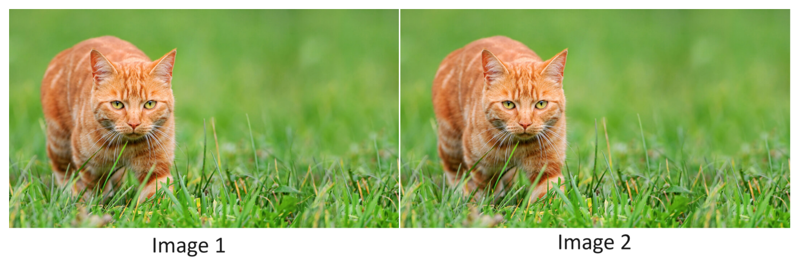

[Back to Main](../main.md)

# 2. k-Nearest Neighbors
### Concept) k-Nearest Neighbors (k-NN)
- Desc.)
  - In k-NN, the model it self is the data.
- Model)
  - Settings)
    - $`\mathcal{D} = \{(\mathbf{x}_1, y_1), \cdots, (\mathbf{x}_n, y_n)\}`$
    - $`\text{dist}(\mathbf{x}, \mathbf{z})`$ : the [distance](#concept-distance) between points $`\mathbf{x}`$ and $`\mathbf{z}`$
    - $`N_\mathbf{x} \subseteq \mathcal{D}`$ : the $`k`$ nearest neighbors
      - where $`\forall \mathbf{z} \in \mathcal{D}\backslash N_\mathbf{x}, \forall \mathbf{z}'\in N_\mathbf{x}, \; \text{dist}(\mathbf{x}, \mathbf{z}) \ge \text{dist}(\mathbf{x}, \mathbf{z}')`$ 
  - Procedure)
    - The $`k`$-Nearest neighbors classifier takes the majority vote of the labels in $`N_\mathbf{x}`$:
      - $`h(\mathbf{x}) = \text{mode}(\{y|(\mathbf{x}, y) \in N_\mathbf{x}\})`$
- Props.)
  - k-NN is a powerful tool.
- Limits)
  1. What if the distance metric is shows poor performance for the data?
     - e.g.) Comparing two images.
       ||
       |:-|
       ||
       |- They look identical.   - But what if every pixel in Image 2 are the ones that shifted one pixel to the right from the Image 2?   - If we use [Minkowski Distance](#eg-minkowski-distance) with $`p=2`$, i.e. the Euclidean distance, then the distance matrix will be massiv.   - Thus, the k-NN algorithm will predict that they are distinctive images!|
  2. [Curse of Dimensionality](#concept-curse-of-dimensionality)

 

### Concept) Distance
- Desc.)
  - Distance metric is crucial in the k-NN classifier.
    - for the "fairness" and the "closeness".

#### e.g.) Minkowski Distance
- Model)
  - $`\displaystyle \text{dist}(\mathbf{x}, \mathbf{z}) = \left( \sum_{i=1}^d |[\mathbf{x}]_i - [\mathbf{z}]_i|^p \right)^{\frac{1}{p}}`$
    - where 
      - $`d`$ is the dimension
      - $`[\mathbf{\cdot}]_i`$ denotes the $`i`$-th feature of $`\cdot`$.

#### e.g.) Normalized Compression Distance (NCD)
- Desc.)
  - Showed up in a recent paper at ACL 2023.
  - Defined when the inputs $`\mathbf{x}`$ are text documents rather than real valued vectors.
    - i.e.) $`\mathbf{x}_i`$ is a sequence of English words of possibly different lengths.
- Model)
  - $`\displaystyle \text{NCD}(\mathbf{x}, \mathbf{z}) = \frac{\text{GLZEN}(\mathbf{x} \oplus \mathbf{z}) - \min\{ \text{GLZEN}(\mathbf{x}) , \text{GLZEN}(\mathbf{z})\}}{\max\{ \text{GLZEN}(\mathbf{x}) , \text{GLZEN}(\mathbf{z})\}}`$
    - where
      - $`\text{GLZEN}(\cdot)`$ : the length of $`\cdot`$ after being compressed by the `gzip` compression tool.
      - $`\mathbf{x}_i \oplus \mathbf{x}_j`$ : the string concatenation of $`\mathbf{x}_i`$ and $`\mathbf{x}_j`$.
        - e.g.) "ABC" $`\oplus`$ "abc" = "ABCabc""
- Result)
  - If $`\mathbf{x} = \mathbf{z}`$, then the compression worked well!
  - [Implementation in GitHub](https://github.com/Sentdex/Simple-kNN-Gzip)

 

### Concept) Curse of Dimensionality
- e.g.)
  - Suppose
    - Training data is drawn uniformly at random from a unit cube $`[0,1]^d`$
      - the data size is $`n`$.
    - $`\mathbf{x}`$ : a test point
    - $`\ell`$ : the side length of the smallest hypercube that contains $`N_{\mathbf{x}}`$.
    - k-NN classifier with $`k`$ neighbors
  - Then
    - $`\displaystyle \ell^d \approx \frac{k}{n}`$ 
      - Why?)
        - The size of the data is $`n`$ and we are looking for the hypercube that contains $`k`$ neighbors.
    - Thus, $`\displaystyle \ell = \left(\frac{k}{n}\right)^\frac{1}{d}`$.
  - Put $`k=1`$ and $`n=100`$.
  - Then
    |$`d`$|$`\ell = 0.01^d`$
    |:-:|:-:|
    |10|0.64|
    |100|0.95|
    |1000|0.9954|
    - i.e.)
      - As the dimension $`d`$ increases, the side length of the hypercube gets closer to the side length of the unit cube!
        - i.e.) k-NN becomes useless!

[Back to Main](../main.md)