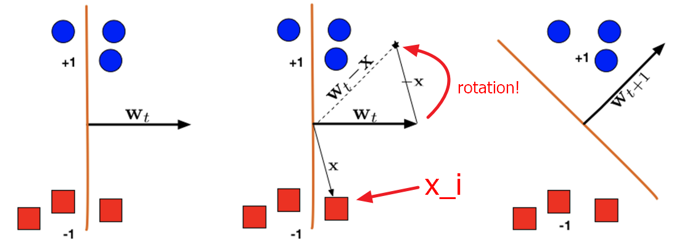

[Back to Main](../main.md)

# 3. Linear Models and Perceptron

# 3.1 Linear Predictors
- Main Concept)
  - Hypothesis class of linear predictors
    - Advantages)
      - Intuitive to understand
      - Computationally efficient to train and evaluate

 

# 3.2 Binary Classification with Linear Predictors
### Settings)
- $`\mathcal{X} = \mathbb{R}^d`$ : the input space
- $`\mathcal{Y} = \{-1, 1\}`$ : the label space
- $`\mathcal{H} := \{x \mapsto \text{sign}(w^\top x + b) | w\in\mathbb{R}^d, b\in\mathbb{R}\}`$ : the hypothesis class
  - where 
    - $`w`$ : the weight vector
    - $`b`$ : the bias
    - $`\text{sign}(a) = \begin{cases} 1 & \text{if } a\ge 0 \\ -1 & \text{otherwise.} \end{cases}`$
- $`\ell(\hat{y}, y) = \begin{cases} 0 & \text{if } \hat{y}=y \\ 1 & \text{otherwise.} \end{cases}`$ : the loss function
- $`\gamma = \min_i{\Vert w^\top x_i\Vert }`$ : the margin 
  - i.e.) minimum distance of any point from the hyperplane
    - Using the property that the distance from a point to a plane that passes through the origin, we can get:
      - $`\displaystyle \gamma = \min_{i\in\{1,2,\cdots,m\}} |w^\top x_i|`$

#### Remark 1) Drop the bias term.
- Why doing this?)
  - For the simplicity.
- Justification)
  - Consider the halfspaces with bias.
    - $`w^\top x + b \gt 0`$
    - $`w^\top x + b \lt 0`$
  - These halfspaces can be transformed using the following mapping.
    - $`x\mapsto \begin{bmatrix} x\\1 \end{bmatrix}, w\mapsto \begin{bmatrix} w\\ b \end{bmatrix}`$
      - Then
        - $`w^\top x \gt 0`$
        - $`w^\top x \lt 0`$
  - This increases the dimension of the weight vector by 1 and this extra dimension absorbs the bias.

#### Remark 2) The weight vector has norm 1.
- i.e.)
  - $`\Vert w\Vert =1`$
- Why doing this?)
  - For the simplicity
- Justification)
  - Recall that our classifier's returns the sign.
    - i.e.) $`\text{sign}(w^\top x)`$
  - Even if we multiply $`\alpha = \frac{1}{\Vert w\Vert }`$, we can get the equivalent value.
    - i.e.) $`\text{sign}(\alpha w^\top x) = \text{sign}(w^\top x)`$
      - Why?)
        - Scalar multiplication does not affect the shape of the hyperplane $`w^\top x = 0`$

#### Remark 3) The data points have norm at most 1.
- i.e.)
  - $`\Vert x_i\Vert  \le 1, \forall i`$
- Why doing this?)
  - For the simplicity
- Justification)
  - Putting $`\beta = \max_i \Vert x_i\Vert `$ and dividing $`x_i`$ with $`\beta`$ we can get the desired result $`\frac{1}{\beta}x_i \le 1, \forall i`$.
  - Simultaneously multiplying and dividing with $`\beta`$ does not affect the classifier.
    - i.e.) $`\text{sign}(w^\top x) = \text{sign}\left((\beta w)^\top \left(\frac{1}{\beta}x\right)\right)`$
  - Considering [Remark 2](#remark-2-the-data-points-have-norm-at-most-1), we can modify as follows:
    - $`\displaystyle\text{sign}\left((\beta w)^\top \left(\frac{1}{\beta \Vert w\Vert }x\right)\right)`$

#### Remark 4) Separability
- We assume that $`\exists w_* \in \mathbb{R}^d \text{ s.t. } \underbrace{y_i}_{\text{actual label value}} = \underbrace{\text{sign}(w_*^\top x_i)}_{\text{prediction made by our classifier}}, \forall i\in\{1,2,\cdots,m\}`$.
  - i.e.)
    - There is exists $`w_*`$ that perfectly separates examples into two classes.

 

#### Interpretation) The Sign of the Inner Product of Weight and Example
- Our classifier returns $`\text{sign}(w^\top x)`$.
  - Then, what does this mean?
- Recall that $`w^\top x = \langle w, x \rangle = \Vert w\Vert \cdot\Vert x\Vert \cos\theta`$
  - where $`\theta`$ is the angle between $`w`$ and $`x`$.
- Here, $`\Vert w\Vert , \Vert x\Vert  \gt 0`$.
- Thus, $`\cos(\theta)`$ determines the **sign**!
  - Geometrical meaning
    |$`\theta`$|$`\cos(\theta)`$|$`w`$ and $`x`$|Halfspace|$`\text{sign}(w^\top x)`$|
    |:-|:-:|:-:|:-:|:-:|
    |$`\theta=0`$|$`\cos(\theta)=1`$|Aligned in the same direction|Same halfspace|+1|
    |$`\theta\in(0, \frac{\pi}{2})`$|$`\cos(\theta)\gt0`$||Same halfspace|+1|
    |$`\theta=\frac{\pi}{2}`$|$`\cos(\theta)=0`$|Perpendicular|$`x`$ is on the line!|0|
    |$`\theta\in(\frac{\pi}{2}, \frac{3\pi}{2})`$|$`\cos(\theta)\lt0`$||Different halfspace|-1|
    |$`\theta=\frac{3\pi}{2}`$|$`\cos(\theta)=0`$|Perpendicular|$`x`$ is on the line!|0|
    |$`\theta\in(\frac{3\pi}{2},2\pi)`$|$`\cos(\theta)\gt0`$||Same halfspace|+1|
- Recall that 
  - $`w`$ determines the line(plane) that separates the space.
  - $`w^\top x_i`$ classifies each $`x_i`$ by the sign.
    - If $`w`$ and $`x_i`$ are in the same halfspace, $`\text{sign}(w^\top x_i) = +1`$
    - If $`w`$ and $`x_i`$ are in the different halfspace, $`\text{sign}(w^\top x_i) = -1`$
  - For each $`x_i`$, the label is given as $`y_i\in \{+1,-1\}`$.
- Therefore, we are looking for a classifier $`w`$ that 
  - geometrically separate $`x_i`$
  - logically classify $`x_i`$
    - corresponding to the label $`y_i`$

 

# 3. Perceptron
## 3.1 Algorithm)
- Goal)
  - Solve the ERM problem in the [linearly separable case](#remark-4-separability).
- Algorithm)
  - Initialize $`w_1 = 0 \in \mathbb{R}^d`$
  - `for` $`t=1,2,\cdots`$ `do`
    - `if` $`\exists i\in \{1, \cdots, m\}`$ s.t. $`y_i \ne \text{sign}(w_t^\top x_i)`$ `then` update $`w_{t+1} = w_t + y_ix_i`$
    - `else` output $`w_t`$
  - `end for`
- Interpretation)
  - `for` $`t=1,2,\cdots`$ `do`
    - The algorithm repeats updating until every points are properly classified!
  - $`i\in \{1, \cdots, m\}`$
    - $`i`$ denotes the $`i`$-th example.
    - Be careful, $`x_i`$ is the $`i`$-th point, not the $`i`$-th feature of $`x`$!
      - cf.) It was $`[x]_i`$
  - The update $`w_{t+1} = w_t + y_ix_i`$
    - Recall that the update happens when $`y_i \ne \text{sign}(w_t^\top x_i)`$, i.e. $`w`$ misclassifies.
    - There can be two [misclassification / update] cases.
      1. $`y_i = +1 \Rightarrow y_ix_i = x_i \Rightarrow w_{t+1} = w_t+x_i`$
      2. $`y_i = -1 \Rightarrow y_ix_i = -x_i \Rightarrow w_{t+1} = w_t-x_i`$
         ||
         |:-|
         ||
         |- In this case we update $`w_{t+1}=w_t-x_i. (\because y_i = -1)`$.   - Then, subtracting $`x`$ from $`w_t`$ rotates $`w_t`$ anti-clockwise.  - The newly generated plane $`w_{t+1}x=0`$ perfectly separates the points.|

 

### Analysis) Do perceptron converges?
- Assumptions for simplicity)
  - $`\Vert x_i \Vert_2 \le 1`$
    - i.e.) The data lies in the unit ball.
  - $`\Vert w_* \Vert_2 = 1`$
    - Normalized!
  - $`\displaystyle \gamma = \min_{i\in\{1,2,\cdots, m\}} \vert w_*^\top x_i \vert`$ : the margin
    - Derivation)
      - Recall that the margin was the minimum distance from the hyperplane to any point.
      - The distance from the plane $`w_*^\top x=0`$ to a point $`x_i`$ is given by
        - $`\displaystyle d_i = \frac{\vert w_*^\top x_i\vert }{\Vert w_* \Vert} = \vert w_*^\top x_i\vert  \; (\because\Vert w_* \Vert_2 = 1)`$
      - Thus, $`\displaystyle\gamma = \min_{i\in\{1,2,\cdots, m\}} d_i = \min_{i\in\{1,2,\cdots, m\}}\vert w_*^\top x_i\vert `$

#### Lemma 1)
- Lemma)
  - $`y_i(w_*^\top x_i) \ge \gamma, \forall i\in\{1,2,\cdots, m\}`$.
- Pf.)
  - Recall that we [assumed](#remark-4-separability) $`\exists w_* \in \mathbb{R}^d \text{ s.t. } y_i = \text{sign}(w_*^\top x_i), \forall i\in\{1,2,\cdots,m\}`$.
  - Thus, $`y_i(w_*^\top x_i) = \text{sign}(w_*^\top x_i)(w_*^\top x_i) = \vert w_*^\top x_i \vert`$
  - By the definition of $`\gamma`$, 
    - $`\gamma \le \vert w_*^\top x_i \vert = y_i(w_*^\top x_i)`$

#### Lemma 2)
- Lemma)
  - $`\forall i\in \{1,2,\cdots, m\} \textrm{ s.t. } y_i \ne \text{sign}(w_t^\top x_i), \text{ we get } y_i(w_t^\top x_i) \le 0`$.
- Pf.)
  - $`y_i \ne \text{sign}(w_t^\top x_i) \Leftrightarrow y_i = -\text{sign}(w_t^\top x_i)`$
  - Thus, $`y_i(w_t^\top x_i) = -\text{sign}(w_t^\top x_i)(w_t^\top x_i) = -\vert w_t^\top x_i \vert \le 0`$

#### Theorem 3) Convergence Theorem
- Theorem)
  - The [Perceptron algorithm](#31-algorithm) stops after at most $`\frac{1}{\gamma^2}`$ rounds, and returns a hyperplane $`w`$ 
    - s.t. $`\text{sign}(w^\top x_i) = y_i, \forall i\in[m]`$
      - i.e.) all points are correctly classified.
- Pf.)
  - By the terminating condition of the algorithm, if the algorithm terminates, it must have all points correctly classified.
  - Thus, we want to assert that the algorithm terminates.
  - Consider that as the algorithm progresses, $`w_t \rightarrow w_*`$.
  - We can measure this by tracking the angle between $`w_t`$ and $`w_*`$.
    - $`w_*^\top w_t = \langle w_t, w_* \rangle = \Vert w_t \Vert\Vert w_* \Vert \cos(\theta)`$ where $`\theta`$ is the angle between $`w_t`$ and $`w_*`$.
    - Thus, $`\displaystyle \cos(\theta) = \frac{w_*^\top w_t}{\Vert w_t \Vert\Vert w_* \Vert} = \frac{w_*^\top w_t}{\Vert w_t \Vert} (\because \Vert w_* \Vert = 1)`$
  - Suppose at time $`t`$, we update with $`(x_i, y_i), \exists i`$.
    - Then $`w_{t+1} = w_t + y_ix_i`$   
    - Thus,   
      $`\begin{aligned}
        w_*^\top w_{t+1} &= w_*^\top(w_t + y_ix_i) \\
        &= w_*^\top w_t + y_i w_*^\top x_i \\
        &\ge w_*^\top w_t + \gamma & (\because \text{Lemma 1 : } y_i w_*^\top x_i \ge \gamma)
      \end{aligned}`$
    - Hence, after $`T`$ rounds, we have   
      $`\begin{aligned}
        w_*^\top w_{T+1} &\ge w_*^\top w_T + \gamma \\
        &\ge (w_*^\top w_{T-1} + \gamma) + \gamma \\
        &\ge ((w_*^\top w_{T-2} + \gamma) + \gamma) + \gamma \\
        &\vdots \\
        &\ge w_*^\top w_1 + T\gamma \\
        &= T\gamma & \because w_1\equiv0\in\mathbb{R}^d \\
      \end{aligned}`$
  - Also, consider that   
    $`\begin{aligned}
      \Vert w_{t+1} \Vert_2^2 &= (w_t + y_ix_i)^\top(w_t + y_ix_i) \\
      &= w_t^\top w_t + y_ix_i^\top w_t + y_i w_t^\top x_i + y_i^2 x_i^\top x_i \\
      &= \Vert w_t \Vert_2^2 + 2y_i w_t^\top x_i + y_i^2 \Vert x_i\Vert_2^2 & (\because x_i^\top w_t = w_t^\top x_i \in \mathbb{R})
    \end{aligned}`$
    - Here,
      - $`2y_i w_t^\top x_i \le 0 \; (\because\text{Lemma 2})`$
      - $`y_i^2 \Vert x_i\Vert_2^2 \le 1 \; (\because y_i^2 =1, \Vert x_i\Vert_2^2 \le 1)`$ 
    - Thus,   
      $`\Vert w_{t+1} \Vert_2^2 \le \Vert w_t \Vert_2^2+1`$
    - Hence, after $`T`$ rounds, we have   
      $`\begin{aligned}
        \Vert w_{T+1} \Vert_2^2 &\le \Vert w_T \Vert_2^2+1 \\
        &\le (\Vert w_{T-1} \Vert_2^2 + 1)+1 \\
        &\le ((\Vert w_{T-2} \Vert_2^2 + 1) + 1)+1 \\
        &\vdots \\
        &\le \Vert w_{1} \Vert_2^2 + T \\
        &= T & \because w_1\equiv0\in\mathbb{R}^d \\
      \end{aligned}`$
    - Therefore, $`\Vert w_{T+1} \Vert_2 \le \sqrt{T}`$
  - Combining $`\begin{cases} w_*^\top w_{T+1} \ge T\gamma \\ \Vert w_{T+1} \Vert_2 \le \sqrt{T} \end{cases}`$, we have   
    - $`\displaystyle 1 \ge \cos(\theta) = \frac{w_*^\top w_{T+1}}{\Vert w_{T+1} \Vert} \ge \frac{T\gamma}{\sqrt{T}} = \gamma\sqrt{T}`$
  - Therefore, $`T \le \frac{1}{\gamma^2}`$.

[Back to Main](../main.md)