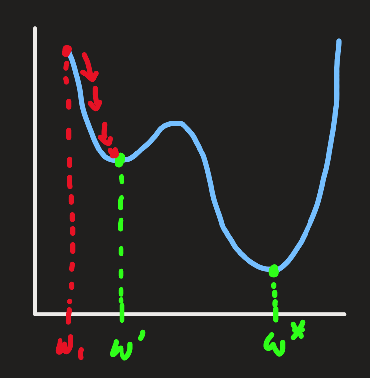

[Back to Main](../main.md)

# 4. Gradient Descent

### Ideation) Why Gradient Descent?
- Recall that our goal was to find a model $`h`$ that minimizes the empirical risk.
  - cf.) [Empirical Risk Minimization (ERM)](01.md#concept-empirical-risk-minimization)
    - $`\displaystyle h^* = \arg\min_{h\in\mathcal{H}} F(h)`$
      - where 
        - $`\mathcal{H}`$ : the family of models
        - $`\displaystyle F(h) = \frac{1}{n}\sum_{i=1}^n \ell(h(\mathbf{x}_i), y_i)`$ : the empirical risk
- Now, further assume that 
  - $`\mathcal{H}`$ is the family of linear models
  - $`w`$ and $`b`$ parameterize the entire set $`\mathcal{H}`$
    - i.e.) $`h(x) = w^\top x + b`$
- Then the above optimization problem over the function $`h`$ turns out to be the minimization problem over $`w`$ and $`b`$.
  - $`h^* = {w^*}^\top x + b^*`$   
    $`\begin{aligned}
        w^*, b^* &= \arg\min_{w,b} F(h) \\
        &= \arg\min_{w,b} \frac{1}{n}\sum_{i=1}^n \ell(h(\mathbf{x}_i), y_i) \\
    \end{aligned} `$
- Even if we don't assume the linear model, the optimization problem can be denoted as
  - $`\displaystyle \min_w F(w) \text{ s.t. } w\in\mathcal{C}`$
    - where
      - $`F:\mathbb{R}^d \rightarrow \mathbb{R}`$
      - $`\mathcal{C}\subseteq \mathbb{R}^d`$
        - cf.) Unconstrained Problem : $`\mathcal{C} = \mathbb{R}^d`$

 

## 4.1 Moving Downhill
- Ideation)
  - Our goal is to minimize $`F(w)`$ by choosing $`w`$.
  - How?)
    - Approximate $`F(w)`$ locally at some location $`w`$ with simpler functions.
      - e.g.) Taylor Approximation
    - These approximations provide the direction that $`w`$ should move toward to.
      - e.g.)
        |First Order|
        |:-:|
        ||

 

#### Concept) Taylor Approximation
- First Order : $`F(w+v) \approx F(w) + \nabla F(w)^\top v`$
  - where $`\nabla F(w)`$ is the gradient
- Second Order : $`F(w+v) \approx F(w) + \nabla F(w)^\top v + \frac{1}{2}v^\top H v`$
  - where $`\displaystyle H = \frac{\partial^2 F}{\partial w_i \partial w_j}`$ is the Hessian

 

### Concept) Gradient Descent
- Idea)
  - Choose $`v`$ s.t. $`F(w+v) \lt F(w)`$
- Algorithm)
  - Initialize $`w_1 \in \mathbb{R}^d`$.
  - `while` $`t=1,2,\cdots, T`$ `do`
    - Update $`w_{t+1} = w_t - \eta_t\nabla F(w_t)`$.
  - `end`
- Why does it work?)
  - Intuition)
    - Consider that we are updating as 
      - $`w_{t+1} = w_t - \eta_t\nabla F(w_t)`$
    - Then 
      - $`F(w_{t+1}) = F(w_t - \eta_t\nabla F(w_t))`$
    - Thus, we may approximate the above using the first order [Taylor approximation](#concept-taylor-approximation) as follows:   
      $`\begin{aligned}
        F(w_t - \eta_t\nabla F(w_t)) &\approx F(w_t) + \nabla F(w_t)^\top (-\eta_t \nabla F(w_t)) \\
        &= F(w_t) -\eta_t \nabla F(w_t)^\top \nabla F(w_t)
      \end{aligned}`$
    - Since $`\eta_t \gt 0`$ and $`\nabla F(w_t)^\top \nabla F(w_t) \ge 0`$,
      - $`F(w_{t+1}) \lt F(w_t)`$
        - i.e.) We are moving $`w`$ to the direction that decreases $`F(w)`$.
  - [More formal proof]() will be given with properties of [convexity]() and [smoothness]().

#### Concept) Learning Rate
- Props.)
  - If too large, then we could diverge
    - i.e.) Instead of making progress at each time step, we could instead make negative progress. 
  - If too small, then it could take us a very long time to converge to a good solution.

 

### Concept) ADAGRAD
- Desc.)    
  - A gradient descent algorithm that automatically adjusts the learning rate.
  - This is a conceptual explanation.
    - Refer to [this](https://optimization.cbe.cornell.edu/index.php?title=AdaGrad) for the actual definition of the algorithm.
- Algorithm)
  - Let
    - $`s_1 = 1 \in\mathbb{R}^d`$
    - $`w_1 \in\mathbb{R}^d`$
  - `while` $`t=1,2,\cdots, T`$ `do`
    - $`g \leftarrow \nabla F(w_t)`$
    - $`s \leftarrow s - (g \circ g)`$
      - where $`\odot`$ is Hadamard product (the element-wise multiplication).
        - Then $`g \odot g = \begin{bmatrix} g_1^2 \\ g_2^2 \\ \vdots \\ g_d^2 \end{bmatrix}`$
    - $`\displaystyle w_{t+1} \leftarrow w_t - \eta_t \frac{g}{\sqrt{s + \epsilon}}`$
      - where $`\epsilon \gt 0`$
- Desc.)
  - Step-sizes in directions with high gradient variance are lower than the step-sizes in directions with low gradient variance. 
    - Geometrically, the step-sizes tend to decrease proportionally to the curvature of the stochastic objective function.

 

### Concept) Newton's Method
- Desc.)
  - We use the second order [Taylor Expansion](#concept-taylor-approximation) of the function.
    - $`F(w+v) \approx F(w) + \nabla F(w)^\top v + \frac{1}{2} v^\top Hv`$
  - Recall that we are looking for $`v`$ on the approximation that can directly minimize the original function value $`F(w)`$.
  - To do this, take the derivative of the quadratic approximation w.r.t. $`v`$ and set it equal to zero.   
    $`\begin{aligned}
        & \nabla_v \left[ F(w) + \nabla F(w)^\top v + \frac{1}{2} v^\top Hv \right] = 0 \\
        \Leftrightarrow & \nabla F(w) + Hv = 0 \\
        \Leftrightarrow &  v^* = - H^{-1} \nabla F(w) \\
    \end{aligned}`$
  - Update $`w`$ as follows:
    - $`w_{t+1} = w_t - H^{-1} \nabla F(w)`$   
      |Geometrical Desc.|
      |:-:|
      ||
- Props.)
  - In settings where the quadratic approximation is accurate, this update rule converges extremely fast.
  - No divergence.
    - Why?) No step size used!
  - If there are directions of the function that are extremely shallow, the **inverse** Hessian will have extremely large eigenvalues, leading to very large steps in those directions.
    - Desc.)
      - Hessian's Eigenvalues
        - Positive Eigenvalues: 
          - If an eigenvalue is positive, it means that the function curves upwards in the corresponding direction (like a bowl). Moving in this direction makes the function increase. This corresponds to a local minimum.
        - Negative Eigenvalues: 
          - If an eigenvalue is negative, the function curves downwards in that direction (like an upside-down bowl). Moving in this direction makes the function decrease. This suggests a local maximum.
        - Zero Eigenvalue: 
          - If an eigenvalue is zero (or very close to zero), it indicates that the function is flat in that direction (no curvature). In this case, moving in that direction doesn’t change the function’s value much, which could mean the point is a saddle point or a region with very little curvature.
      - Shallow Directions and Large Eigenvalues
        - When the statement says "if there are directions of the function that are extremely shallow," it means that in those particular directions, the function changes very slowly. 
        - Mathematically, these are directions where the curvature is very small, meaning the second-order derivative (the curvature) is close to zero. In other words, the eigenvalues associated with those directions are very small.
        - In turns, **the eigenvalue of the INVERSE of the Hessian is very large**!

  

## 4.2 When Gradient Descent works well?
### Concept) Situations that Gradient Descent Fails
|Not Smooth|Not Convex|
|:-|:-|
|||
|- When the gradient is zero, then no update in GD.   - Infinite gradient is not even defined.|- Possibility that we may not find the global minium.   - In optimization theory, this is a failure.   - However, in ML, even updating to the local minium is a progress.   -  Thus, not treated as failure actually...|

### Concept) Convexity
#### Concept) Convex Set
- Def.)
 - A set $`\mathcal{C}\in\mathbb{R}^d`$ is convex if $`\forall w, w' \in\mathcal{C}, \alpha\in[0,1]`$
    - $`\alpha w + (1-\alpha)w' \in\mathcal{C}`$

#### Concept) Convex Function
- Def.)
  - A function $`F:\mathbb{R}^d \rightarrow \mathbb{R}`$ is convex if $`\forall w,w'\in\mathbb{R}^d, \alpha\in[0,1]`$
    - $`F(\alpha w + (1-\alpha) w') \le \alpha F(w) + (1-\alpha) F(w')`$
      |Graphical Desc.|
      |:-|
      ||
- Prop.)
  - $`F(w') \ge \underbrace{F(w) + \nabla F(w)^\top (w'-w)}_{\text{1st-order Taylor approx.}}, \forall w, w'\in\mathbb{R}^d`$   
    |Graphical Desc.|
    |:-|
    ||
    |- The function always lies above the tangent at any point.|
  - $`\nabla^2 F(w) \succeq 0, \forall w\in\mathbb{R}^d`$   
    - i.e.) $`H`$ is positive semi-definite.
    - Desc.)
      - The curvature of the function is always non-negative, that is, never downwards.

 

#### Theorem 3)
- Theorem)
  - For any convex differentiable function $`F`$, any $`w`$ that satisfies $`\nabla F(w)=0`$ is a global minimum of $`F`$.
- Pf.)
  - We have the property that if $`F`$ is convex,
    - $`F(w') \ge F(w) + \nabla F(w)^\top (w'-w), \forall w, w'\in\mathbb{R}^d`$.
  - Suppose $`\exists w^*`$ s.t. $`\nabla F(w^*) = 0`$.
  - Then, $`\forall w'\in\mathbb{R}^d, F(w') \ge F(w^*) + 0\cdot (w'-w^*) = F(w^*)`$

 

### Concept) Smoothness
- Def.) Smooth Function
  - A function $`F:\mathbb{R}^d\rightarrow\mathbb{R}`$ is $`L`$-smooth if
    - $`\displaystyle F(w') \le F(w) + \nabla F(w)^\top(w'-w) + \frac{L}{2}\Vert w'-w\Vert_2^2, \; \forall w,w'\in\mathbb{R}^d`$
      |Graphical Desc.|
      |:-|
      ||
      |- RHS can be interpreted as a quadratic function that bounds $`F(w)`$.   - There is a quadratic function that takes the value $`F(w)`$ at $`w`$ and upper bounds the function otherwise.|
- Prop.)
  - $`\nabla F`$ is $`L`$-Lipschitz
    - i.e.) $`\Vert\nabla F(w) - \nabla F(w')\Vert_2 \le L\Vert w-w'\Vert_2, \; \forall w,w'\in\mathbb{R}^d`$
      - Desc.)
        - Gradient at $`w'`$ can change quickly only as you move away from $`w`$
      - Props.)
        - If $`L`$ becomes larger, then $`F`$ will be steeper!
        - If $`L`$ becomes smaller, then $`F`$ will be shallower!
- Optimization : $`\displaystyle\max_{w'} F(w) + \nabla F(w)^\top(w'-w) + \frac{L}{2}\Vert w'-w\Vert_2^2`$   
  - Sol.)   
    $`\begin{aligned}
      & \frac{\partial}{\partial w'} \left( F(w) + \nabla F(w)^\top(w'-w) + \frac{L}{2}\Vert w'-w\Vert_2^2 \right) = 0 \\
      & \frac{\partial}{\partial w'} \left( \nabla F(w)^\top(w'-w) + \frac{L}{2} (w'-w)^\top (w'-w) \right) = 0 \\
      \Leftrightarrow& \nabla F(w) + L(w'-w) = 0 \\
      \Leftrightarrow& w' = w - \frac{1}{L}\nabla F(w)
    \end{aligned}`$
  - Desc.)
    - Gradient Descent with learning rate $`1/L`$.
    - Cf.) Similarity with [Newton's Method](#concept-newtons-method).
      - The Newton's Method used the second order approximation and optimized it.
      - Thus, if the approximation is poor, the optimization method may fail.
      - However, in $`L`$-smooth case, the quadratic function is the actual upper bound.

#### Lemma 5-1.)
- Theorem)
  - Let $`F(w)`$ be an [L-smooth](#concept-smoothness) [convex](#concept-convex-function) function.
  - In iteration $`t`$ of gradient descent, when we update $`w_{t+1} = w_t - \frac{1}{L}\nabla F(w_t)`$, we have that
    - $`F(w_{t+1}) \le F(w_t) - \frac{L}{2}\Vert w_{t+1} - w_t \Vert_2^2`$
- Pf.)
  - Consider that our gradient descent goes $`w_{t+1} = w_t - \frac{1}{L}\nabla F(w_t)`$.
  - Previously optimizing [smoothness](#concept-smoothness) we had
    - $`w' = w - \frac{1}{L}\nabla F(w) \Rightarrow \nabla F(w) = L(w-w')`$
  - Thus, we may apply this to our gradient descent as
    - $`\nabla F(w_t) = L(w_t-w_{t+1})`$
  - Plugging this back into the smoothness definition,   
    $`\begin{aligned}
      F(w_{t+1}) &\le F(w_t) + \nabla F(w_t)^\top(w_{t+1}-w_t) + \frac{L}{2}\Vert w_{t+1}-w_t\Vert_2^2 \\
      &= F(w_t) + (L(w_t-w_{t+1}))^\top(w_{t+1}-w_t) + \frac{L}{2}\Vert w_{t+1}-w_t\Vert_2^2 \\
      &= F(w_t) - (L(w_{t+1}-w_t))^\top(w_{t+1}-w_t) + \frac{L}{2}\Vert w_{t+1}-w_t\Vert_2^2 \\
      &= F(w_t) - \frac{L}{2}\Vert w_{t+1}-w_t\Vert_2^2 \\
    \end{aligned}`$
  - Thus, gradient descent is nonincreasing in $`F(w)`$ in each iteration.

#### Lemma 5-2.)
- Theorem)
  - Gradient descent gets closer to the global optimum on smooth functions.
- Pf.)
  - By [convexity](#concept-convex-function) of $`F(w)`$
    - $`F(w^* \ge )`$

[Back to Main](../main.md)