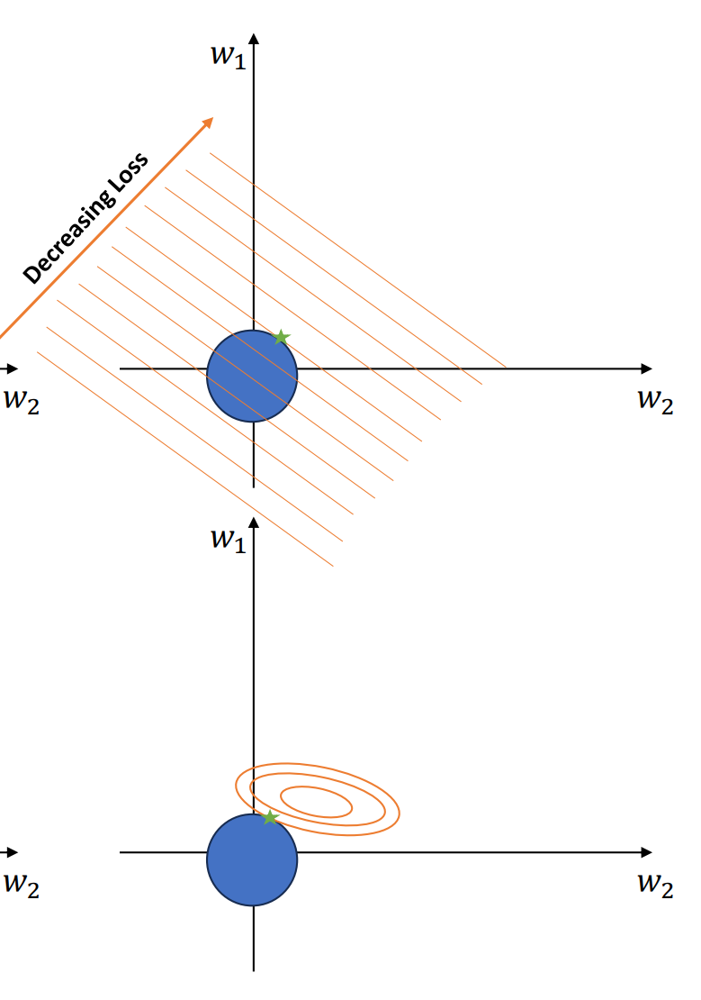
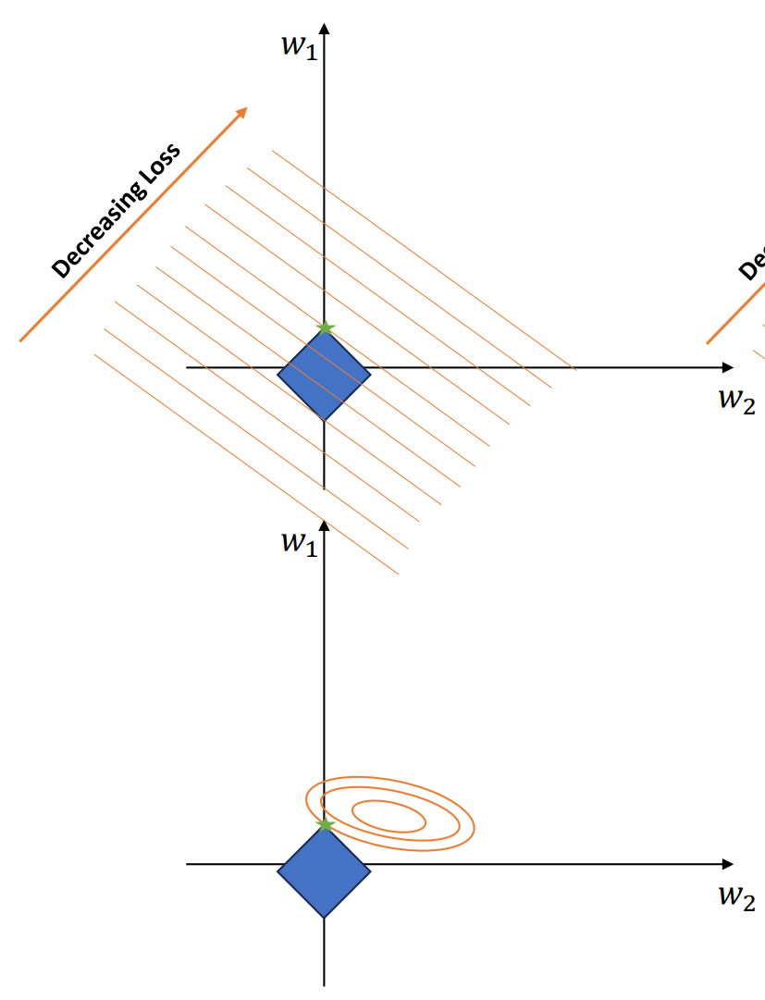

[Back to Main](../main.md)

# 6. Linear Regression
### Concept) Steps of Learning
- Desc.)
  1. Make modeling assumptions.
  2. Pick an objective.
  3. Learn a model that minimizes the objective.
- e.g.) Error/Loss Minimization
  1. Pick a hypothesis class $`\mathcal{F}`$ that contains models $`h`$ parameterized by some set of parameters $`w`$.
  2. Pick a loss function $`\ell(\hat{y}, y) = \ell(h(\mathbf{x}), y)`$ that measures how bad the prediction $`\hat{y} = h(\mathbf{x})`$ makes are.
  3. Use gradient descent to minimize the average loss across a training dataset $`\mathcal{D} = \{(\mathbf{x}_1,y_1), \cdots, (\mathbf{x}_n,y_n)\}`$
     - i.e.) $`\displaystyle \min_{h\in\mathcal{F}} \hat{R}(h) = \frac{1}{n}\sum_{i=1}^n \ell(h(\mathbf{x_i}), y_i)`$
- e.g.) Probabilistic Inference
  1. Pick a probability distribution for $`p(y\vert x)`$.
     - e.g.) Bernoulli distribution with parameter $`\theta`$.
  2. Parameterize the distribution with a hypothesis class $`\mathcal{F}`$ with parameters $`\theta`$ to formalize $`p(y\vert x,\theta)`$.
     - e.g.) Using the sigmoid function, $`p(y=1\vert x,h) = \sigma(h(x)) = \sigma(\mathbf{w^\top x}+b)`$
  3. Use gradient descent to maximize the conditional likelihood over the data set $`\mathcal{D}`$.
     - e.g.) $`\displaystyle \max_{h\in\mathcal{F}}\hat{R}(h) = \max_{h\in\mathcal{F}}\prod_i p(y_i\vert x_i,f)`$

 

### Concept) Linear Regression
- Idea)
  - Modeling assumption
    - Consider the hypothesis class of linear models:
      - $`\mathcal{F} :=\left\{ \mathbf{x} \rightarrow \mathbf{w^\top x}+b \vert \mathbf{w}\in\mathbb{R}^d, b\in\mathbb{R} \right\}`$
    - Also, we will ignore the bias $`b`$.
      - [We covered that we can modify the model](03.md#remark-1-drop-the-bias-term) by $`\mathbf{w}\in\mathbb{R}^{d+1}`$ and use $`\mathbf{w^\top x}`$ instead.
- Settings)
  - Input Space : $`\mathcal{X} = \mathbb{R}^d`$ are real-valued feature vectors
  - Label Space : $`\mathcal{Y} = \mathbb{R}`$ are real-valued labels.
  - Hypothesis Class : $`\mathcal{F} := \{ x \mapsto w^\top; x + b \vert w\in\mathbb{R}^d, b\in\mathbb{R} \}`$
  - Loss Function : $`\ell(f(x), y) = (f(x)-y)^2`$ : squared loss (or $`\ell_2`$-loss)
- Risk)
  - $`\displaystyle \hat{R}(\mathbf{w}) = \frac{1}{n}\sum_{i=1}^n (\mathbf{w^\top x_i}-y_i)^2`$
    - Matrix Notation)
      - Let $`\mathbf{X} = \begin{bmatrix} \mathbf{x}_1 \\ \mathbf{x}_2 \\ \vdots \\ \mathbf{x}_n  \end{bmatrix} \in \mathbb{R}^{n\times d}`$
      - Then   
        $`\mathbf{Xw-y} = \begin{bmatrix} \mathbf{w}^\top\mathbf{x}_1 - \mathbf{y} \\ \mathbf{w}^\top\mathbf{x}_2 - \mathbf{y} \\ \vdots \\ \mathbf{w}^\top\mathbf{x}_n - \mathbf{y}  \end{bmatrix}`$
      - Thus,   
        $`\hat{R}(\mathbf{w}) = (\mathbf{Xw-y})^\top(\mathbf{Xw-y})`$
        - For computation, we can use $`\hat{R}(\mathbf{w}) = (\mathbf{Xw-y})`$.pow(2).sum()
- Minimization)
  - $`\displaystyle\arg\min_\mathbf{w} \hat{R}(\mathbf{w})`$
    - Consider that our loss function is convex.
    - Thus, $`\nabla_w \hat{R}(\mathbf{w}) = 0`$ will be the global minimum.
      - i.e.)   
        $`\begin{aligned}
            \nabla_w \hat{R}(\mathbf{w}) &= \nabla_w \left(\frac{1}{n}\sum_{i=1}^n (\mathbf{w^\top x_i}-y_i)^2\right) \\
            &= \frac{1}{n}\sum_{i=1}^n \nabla_w\left((\mathbf{w^\top x_i}-y_i)^2\right) \\
            &= \frac{1}{n}\sum_{i=1}^n 2(\mathbf{w^\top x_i}-y_i) \mathbf{x_i} =0
        \end{aligned}`$   
        $`\begin{aligned}
            \Leftrightarrow & \sum_{i=1}^n (\mathbf{w^\top x_i})\mathbf{x_i} = \sum_{i=1}^n  y_i \mathbf{x_i} \\
            \Rightarrow& \left(\sum_{i=1}^n \mathbf{x_i} \mathbf{x_i}^\top\right) \mathbf{w} = \sum_{i=1}^n  y_i \mathbf{x_i} & \because \text{See } (1) \text{ below.} \\
            \Leftrightarrow & \mathbf{(XX^\top) w} = \mathbf{X^\top y} \\
            \Rightarrow & \mathbf{w} = \mathbf{(XX^\top)^{-1} X^\top y}
        \end{aligned}`$   
        - cf.) (1)   
          $`\begin{aligned}
            (\mathbf{w^\top x})\mathbf{x} &= (w_1x_1+\cdots+w_dx_d)\begin{bmatrix} x_1\\x_2\\\vdots\\x_d \end{bmatrix} \\
            &= \begin{bmatrix} w_1{x_1}^2+w_2x_1x_2+\cdots w_dx_1x_d \\ w_1{x_1}{x_2}+w_2{x_2}^2+\cdots w_dx_2x_d\\\vdots\\ w_1{x_1}{x_d}+w_2{x_2}{x_d}+\cdots w_d{x_d}^2 \end{bmatrix} \\
            &= \begin{bmatrix} x_1\\x_2\\\vdots\\x_d \end{bmatrix} \begin{bmatrix} x_1&x_2&\cdots&x_d \end{bmatrix} \begin{bmatrix} w_1\\w_2\\\vdots\\ w_d \end{bmatrix} \\
            &= \mathbf{(x^\top x) w}
          \end{aligned}`$

 

### Concept) Overfitting
- Recall that our linear regression model derived the optimal model by $`\mathbf{w}_* = \mathbf{(XX^\top)^{-1} X^\top y}`$.
- Then $`\mathbf{Xw}_* = \mathbf{X(XX^\top)^{-1} X^\top y}`$.
- Suppose $`\mathbf{X}`$ is invertible (non-singular).
- Then $`\mathbf{Xw}_* = \mathbf{XX^{-1}(X^\top)^{-1} X^\top y = y}`$.
  - i.e.) The value of $`\mathbf{y}`$ is determined by $`\mathbf{Xw}_*`$, independent of $`y_i`$.

 

### Concept) Regularization
- Desc.)
  - Regularization is a way to augment an optimization problem like the one found in linear regression to make the learned model **less** powerful. 
  - To do this, we artificially constrain the solutions $`\mathbf{w}_∗`$ that we find using a regularization term $`t(\mathbf{w})`$. 
  - A loose intuition is that $`t(\mathbf{w})`$ measures the “complexity” of a particular solution $`\mathbf{w}`$.
- Notations)
  1. $`\displaystyle \mathbf{w}_* = \arg\min_\mathbf{w} \hat{R}(\mathbf{w}) + \lambda t(\mathbf{w})`$
     - Desc.)
       - Intuitively, minimizing this essentially means we care about **minimizing the complexity** of our solution $`\mathbf{w}`$, and not just the loss.
       - The regularization parameter $`\lambda`$ controls how much we care about the loss versus the complexity.
  2. $`\displaystyle \mathbf{w}_* = \arg\min_\mathbf{w}\hat{R}(\mathbf{w})`$ s.t. $`t(\mathbf{w}) \le B`$
     - Desc.)
       - We want to minimize the loss only, but we are saying that the solution $`\mathbf{w}`$ has a maximum complexity $`t(\mathbf{w})`$.
- Relations between 1 and 2)
  - $`\forall \lambda, \exists B`$ so that the optimal solution $`\mathbf{w}_*`$ to the left optimization problem is the optimal solution to the right.
  - In general, converting between these two forms is not easy: it’s not always easy to determine what B should be for a particular λ and vice versa without just running the optimization.
  - As a result of the above two considerations, we almost always deal exclusively with the left formulation. 
    - This is because unconstrained optimization is easier than constrained optimization. 
    - The right formulation, however, can lead to better intuition (see below).

 

#### Concept) L2 Regularization
- Def.)
  - $`\displaystyle t(\mathbf{w}) = \Vert \mathbf{w} \Vert_2^2 = \sum_{i=1}^d w_i^2`$
- Desc.)
  - It encourages us to use all features roughly evenly.
    |Image|
    |:-|
    ||

#### Concept) L1 Regularization
- Def.)
  - $`\displaystyle t(\mathbf{w}) = \Vert \mathbf{w} \Vert_1 = \sum_{i=1}^d \vert w_i \vert `$
- Desc.)
  - Feature Selection : Encouraging us to not use some features at all
    |Image|
    |:-|
    ||

#### Concept) Elastic Net
- Def.)
  - $`\displaystyle t(\mathbf{w}) = \lambda_1 \Vert \mathbf{w} \Vert_2^2 + \lambda_2 \Vert \mathbf{w} \Vert_1`$

 

### Concept) Ridge Regression
- Def.)
  - $`\displaystyle \mathcal{L}(\mathbf{w}) = \frac{1}{n}\sum_{i=1}^n (\mathbf{w}^\top \mathbf{x}_i - y_i)^2 + \lambda\Vert\mathbf{w}\Vert_2^2`$
    - i.e.) Linear Regression with [L2 Regularizer](#concept-l2-regularization).
- Sol.)   
  $`\begin{aligned}
    \frac{\partial \mathcal{L}(\mathbf{w})}{\partial \mathbf{w}} = 0 
    & \Leftrightarrow \frac{2}{n}(\mathbf{w}^\top\mathbf{x}_i - y_i)\mathbf{x}_i + 2\lambda\mathbf{w} = 0 \\
    &\Rightarrow \mathbf{X^\top y} - \mathbf{X^\top Xw} = \lambda n \mathbf{w} \\
    &\Rightarrow (\mathbf{X^\top X} + \lambda n I)\mathbf{w} = \mathbf{Xy} \\
    &\Rightarrow \mathbf{w}_* = (X^\top X + \lambda n I)^{-1}\mathbf{X^\top y}
  \end{aligned}`$
  - cf.)
    - Recall that $`\mathbf{w} = \mathbf{(XX^\top)^{-1} X^\top y}`$ for the [linear regression](#concept-linear-regression).

 

### Concept) Lasso
- Def.)
  - $`\displaystyle \mathcal{L}(\mathbf{w}) = \frac{1}{n}\sum_{i=1}^n (\mathbf{w}^\top \mathbf{x}_i - y_i)^2 + \lambda\Vert\mathbf{w}\Vert_1`$
    - i.e.) Linear Regression with [L1 Regularizer](#concept-l1-regularization).
- Prop.)
  - No closed form solution for this.
  - Instead, [gradient descent](04.md#4-gradient-descent), LARS

 

[Back to Main](../main.md)