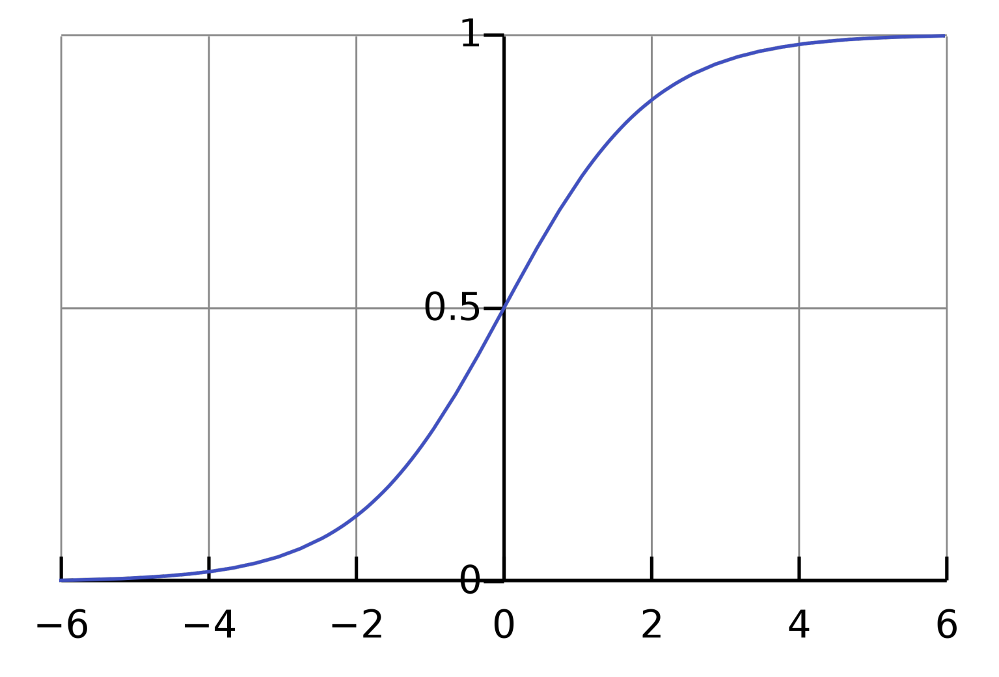

[Back to Main](../main.md)

# 7. Logistic Regression
### Ideation)
- Consider a binary classification setting.
  - i.e.) Label $`y\in\{+1, -1\}`$
- There can be two approaches to deal with it.
  1. Taking the sign.
     - Recall the [perceptron](03.md#3-perceptron) model.
       - $`h(\mathbf{x}) = \text{sign}(\mathbf{w^\top x})=\begin{cases}
        +1 & \text{if } \mathbf{w^\top x} \gt 0 \\ -1 & \text{otherwise}
       \end{cases}`$
  2. Model the probability.
     - Have $`h(\mathbf{x})`$ output an estimate of the probability that $`\mathbf{x}`$ has label $`+1`$.
       - i.e.) $`\eta(\mathbf{x}) := \text{Pr}[y=+1 \vert \mathbf{x}]`$
     - How?)
       - Use [squashing function](#concept-squashing-function) $`\sigma(\cdot)`$ below.

#### Concept) Squashing Function
- Def.)
  - A function that takes a real number as input and maps it to a value between 0 and 1.
    - i.e.) $`\sigma : \mathbb{R}\rightarrow[0,1]`$
- Usage)
  - In our logistic regression, we will give $`\mathbf{w^\top x}`$ as input and its output should be the probability that $`y=+1`$ given $`\mathbf{x}`$.
- e.g.)
  - Sigmoid Function : $`\displaystyle \sigma(v) = \frac{1}{1+\exp(-v)}`$
    |Graph|
    |:-|
    ||

 

### Model) Logistic Regression
- Settings)
  - $`\mathcal{X} \subseteq \mathbb{R}^d`$ : the feature space
  - $`\mathcal{Y} = \{+1, -1\}`$ : Binary Label
- Loss Function)   
  $`\ell(h(\mathbf{x}), y) = \begin{cases} -\log h(\mathbf{x}) & \text{if } y = +1 \\ -\log (1-h(\mathbf{x})) & \text{if } y=-1  \end{cases}`$ where $`\displaystyle h(\mathbf{x}) = \frac{1}{1+\exp(-\mathbf{w^\top x})}`$
  - Prop.)
    - $`h(\mathbf{x})`$ vs $`\ell(h(\mathbf{x}), y)`$
      - Case 1) $`y=+1`$
        - $`\mathbf{w^\top x} \rightarrow \infty \Rightarrow h(\mathbf{x}) \rightarrow 1 \Rightarrow \ell(h(\mathbf{x}), y) \rightarrow 0`$
          - Small loss.
            - Why?) $`h(\mathbf{x}) = \text{Pr}[y=+1 | \mathbf{x}] \rightarrow 1`$
        - $`\mathbf{w^\top x} \rightarrow -\infty \Rightarrow h(\mathbf{x}) \rightarrow 0 \Rightarrow \ell(h(\mathbf{x}), y) \rightarrow \infty`$
          - Huge loss.
            - Why?) $`h(\mathbf{x}) = \text{Pr}[y=+1 | \mathbf{x}] \rightarrow 0`$
      - Case 2) $`y=-1`$
        - $`\mathbf{w^\top x} \rightarrow \infty \Rightarrow h(\mathbf{x}) \rightarrow 1 \Rightarrow \ell(h(\mathbf{x}), y) \rightarrow \infty`$
          - Huge loss.
            - Why?) $`1-h(\mathbf{x}) = \text{Pr}[y=-1 | \mathbf{x}] \rightarrow 0`$
        - $`\mathbf{w^\top x} \rightarrow -\infty \Rightarrow h(\mathbf{x}) \rightarrow 0 \Rightarrow \ell(h(\mathbf{x}), y) \rightarrow 0`$
          - Small loss.
            - Why?) $`1-h(\mathbf{x}) = \text{Pr}[y=-1 | \mathbf{x}] \rightarrow 1`$
- More Compact Loss Function)   
  - $`\ell(h(\mathbf{x}), y) = \log (1+\exp(-y \mathbf{w^\top x}))`$
    - Derivation)
      - Recall that    
        $`\ell(h(\mathbf{x}), y) = \begin{cases} -\log h(\mathbf{x}) & \text{if } y = +1 \\ -\log (1-h(\mathbf{x})) & \text{if } y=-1  \end{cases}`$ where $`\displaystyle h(\mathbf{x}) = \frac{1}{1+\exp(-\mathbf{w^\top x})}`$
        1. $`y=+1`$    
          $`\begin{aligned}
              \ell(h(\mathbf{x}), y) &=  -\log h(\mathbf{x}) \\
              &= -\log \left(\frac{1}{1+\exp(-\mathbf{w^\top x})}\right) \\
              &= \log \left( 1+\exp(-\mathbf{w^\top x}) \right) \\
              &= \log \left( 1+\exp(-y\mathbf{w^\top x}) \right) & \because y=+1\\
          \end{aligned}`$
        2. $`y=-1`$    
          $`\begin{aligned}
              \ell(h(\mathbf{x}), y) &=  -\log (1-h(\mathbf{x})) \\
              &= -\log \left(1- \frac{1}{1+\exp(-\mathbf{w^\top x})}\right) \\
              &= -\log \left(\frac{\exp(-\mathbf{w^\top x})}{1+\exp(-\mathbf{w^\top x})}\right) \\
              &= \log \left(\frac{1+\exp(-\mathbf{w^\top x})}{\exp(-\mathbf{w^\top x})}\right) \\
              &= \log \left(1+\frac{1}{\exp(-\mathbf{w^\top x})}\right) \\
              &= \log \left(1+\exp(\mathbf{w^\top x})\right) \\
              &= \log \left(1+\exp(-y\mathbf{w^\top x})\right) & \because y=-1 \\
          \end{aligned}`$
      - Thus, $`\ell(h(\mathbf{x}), y) = \log (1+\exp(-y \mathbf{w^\top x})), \forall y\in\{+1,-1\}`$
- Empirical Risk)
  - Let $`\mathcal{D} = \{(\mathbf{x}_1, y_1), (\mathbf{x}_2, y_2), \cdots, (\mathbf{x}_n, y_n)\}`$ be the given training set.
  - Then the empirical risk will be
    - $`\displaystyle \hat{R}(\mathbf{w}) = \frac{1}{n}\sum_{i=1}^n \log (1+\exp(-y\mathbf{w^\top x}))`$
- Optimization)
  - Not like the [linear regression](06.md#6-linear-regression), it does not have a closed form solution.
  - Instead, we can use [gradient descent](04.md#4-gradient-descent)

[Back to Main](../main.md)