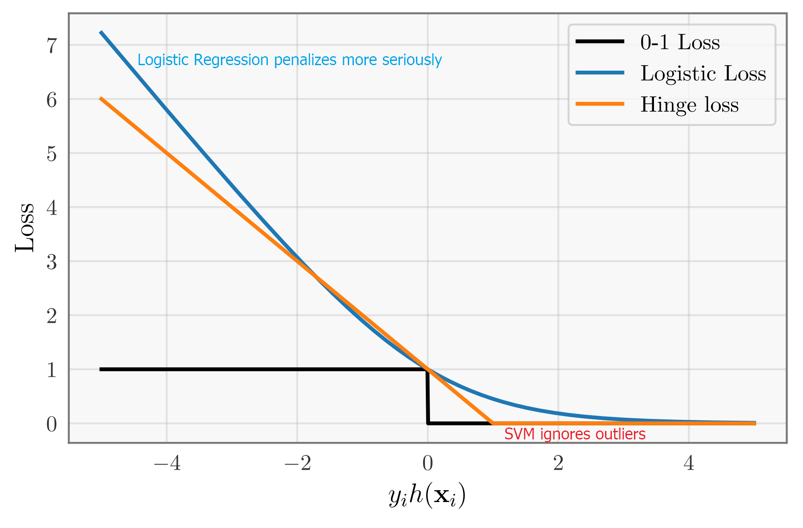

[Back to Main](../main.md)

# 8. Support Vector Machine (SVM)
### Concept) Margin
- Def.)
  - $`\gamma(\mathbf{w}, \mathcal{D})`$ : the margin of a hyperplane $`\mathbf{w}`$ and dataset $`\mathcal{D}`$ is the smallest distance between any point in $`\mathcal{D}`$ and the hyperplane.
    - cf.) [Recall from the perceptron](03.md#analysis-do-perceptron-converges) 
- Props.)
  - (1) $`\forall \mathbf{x}, \exists \mathbf{x}_p`$ s.t. $`\mathbf{x}_p`$ is the perpendicular projection from the hyperplane $`\mathbf{w}`$ to $`\mathbf{x}`$.
  - (2) For $`\mathbf{d = x-x}_p, \exists \alpha\in\mathbb{R} \text{ s.t. } \mathbf{d} = \alpha\mathbf{w}`$.
  - (3) Since $`\mathbf{x}_p`$ is on the hyperplane, $`\mathbf{w^\top x}_p = 0`$.
- Deriving Margin)   
    $`\begin{aligned}
        &\mathbf{w^\top x}_p = 0 & \because \text{ Prop. (3)} \\
        \Rightarrow&\mathbf{w^\top}(\mathbf{x-d}) = 0 & \because \mathbf{d = x-x}_p \\
        \Rightarrow&\mathbf{w^\top}(\mathbf{x}-\alpha\mathbf{w}) = 0 & \because \mathbf{d} = \alpha\mathbf{w} \\
        \Rightarrow&\alpha = \frac{\mathbf{w^\top x}}{\mathbf{w^\top w}} \\
        \Rightarrow&\mathbf{d} = \frac{\mathbf{w^\top x}}{\mathbf{w^\top w}}\mathbf{w}&\because \mathbf{d} = \alpha\mathbf{w} \\
        \Rightarrow&\sqrt{\mathbf{d}^\top \mathbf{d}} = \sqrt{\left(\frac{\mathbf{w^\top x}}{\mathbf{w^\top w}}\mathbf{w}\right)^\top \left(\frac{\mathbf{w^\top x}}{\mathbf{w^\top w}}\mathbf{w}\right)} \\&= \sqrt{\frac{\left(\mathbf{w^\top x}\right)^2}{\left(\mathbf{w^\top w}\right)^2}\left(\mathbf{w^\top w}\right)} \\
        &=\sqrt{\frac{\left(\mathbf{w^\top x}\right)^2}{\mathbf{w^\top w}}} =\frac{\vert \mathbf{w^\top x}\vert}{\sqrt{\mathbf{w^\top w}}} \\
    \end{aligned}`$.
    - Thus, the distance from the hyperplane $`\mathbf{w}`$ to a point $`\mathbf{x}`$ can be denoted as
      - $`\displaystyle \sqrt{\mathbf{d}^\top \mathbf{d}} = \frac{\vert \mathbf{w^\top x}\vert}{\sqrt{\mathbf{w^\top w}}}`$
    - Using the distance concept, we can denote the margin as:   
      $`\displaystyle \gamma(\mathbf{w}, \mathcal{D}) = \min_i \frac{\vert \mathbf{w^\top x}_i\vert}{\sqrt{\mathbf{w^\top w}}}`$

  

### Concept) Hard Margin Support Vector Machine
- Objective)
  - Derive the largest margin [separating hyperplane](03.md#remark-4-separability).   
    |Keyword|Desc.|
    |:-:|:-|
    |Largest Margin|   - The hyperplane with the largest margin can better separate the plane.|
    |Separating Hyperplane|- Our goal is to find a classifier.   - If largest margin is the only condition, then it may find a hyperplane far from the datapoints, regardless of separation performance.|
- Model)
  - $`h(\mathbf{x}) = \mathbf{w}_*^\top \mathbf{x}$
    - where $`\displaystyle \mathbf{w}_* = \min_\mathbf{w} \mathbf{w}^\top \mathbf{w}`$
      - s.t. $`y_i \mathbf{w}^\top \mathbf{x}_i \ge 1`$
- Derivation)
  - Let's start with the largest margin.
    - $`\displaystyle \mathbf{w}_* = \max_\mathbf{w} \gamma(\mathbf{w}, \mathcal{D})`$
  - Since it should be a separating hyperplane we add a condition.
    - $`\displaystyle \mathbf{w}_* = \max_\mathbf{w} \gamma(\mathbf{w}, \mathcal{D})`$
      - s.t. $`\underbrace{y_i}_{\text{observation }} \underbrace{\mathbf{w}^\top \mathbf{x}_i}_{\text{prediction}} \gt 0`$
        - i.e.) The condition is true iff. the observation and the prediction has the same sign.
  - But our current optimization problem is too complicated to apply the [gradient descent](04.md#4-gradient-descent).    
    $`\begin{aligned}
        \mathbf{w}_* &= \max_\mathbf{w} \gamma(\mathbf{w}, \mathcal{D}) \\
        &= \max_\mathbf{w} \left(\min_i \frac{\vert \mathbf{w^\top x}_i\vert}{\sqrt{\mathbf{w^\top w}}}\right) \text{ s.t. } y_i \mathbf{w}^\top \mathbf{x}_i
    \end{aligned}`$
  - Thus, we will simplify the model.
    - Given $`\mathbf{w}_*`$, we can find $`c`$ s.t. $`\displaystyle \min_i \vert (c\mathbf{w}_*^\top)\mathbf{x}_i\vert = 1`$
      - Why?)
        - $`(\mathbf{x}_i, \mathbf{y}_i)\in\mathcal{D}`$ are given.
    - Then for $`\displaystyle c\ne0, \min_i \vert (c\mathbf{w}_*^\top)\mathbf{x}_i\vert = 1 \Leftrightarrow \min_i \vert \mathbf{w}_*^\top\mathbf{x}_i\vert = 1`$.
      - Why?)
        - Consider the fact that the scalar multiplication does not change the hyperplane.
          - i.e.) $`\mathbf{w}^\top\mathbf{x} = 0 \Leftrightarrow c\mathbf{w}^\top\mathbf{x} = 0, c\ne0`$
    - Thus, we will add a new constraint of $`\min_i \vert \mathbf{w}_*^\top\mathbf{x}_i\vert = 1`$.
    - Then,    
        $`\begin{aligned}
            \mathbf{w}_* &= \max_\mathbf{w} \left(\min_i \frac{\vert \mathbf{w^\top x}_i\vert}{\sqrt{\mathbf{w^\top w}}}\right) & \text{ s.t. } \begin{cases} y_i \mathbf{w}^\top \mathbf{x}_i \gt 0 \\ \min_i \vert \mathbf{w}_*^\top\mathbf{x}_i\vert = 1 \end{cases} \\
            &= \max_\mathbf{w} \frac{1}{\sqrt{\mathbf{w^\top w}}} \left(\min_i \vert \mathbf{w^\top x}_i\vert\right) \\
            &= \min_\mathbf{w} \mathbf{w^\top w} & \text{ s.t. } \begin{cases} y_i \mathbf{w}^\top \mathbf{x}_i \gt 0 \\ \min_i \vert \mathbf{w}_*^\top\mathbf{x}_i\vert = 1 \end{cases}
        \end{aligned}`$
  - We will simplify even more by incorporating the two constraints.
    - i.e.) $`\displaystyle \begin{cases} y_i \mathbf{w}^\top \mathbf{x}_i \gt 0 \\ \min_i \vert \mathbf{w}_*^\top\mathbf{x}_i\vert = 1 \end{cases} \Leftrightarrow y_i \mathbf{w}^\top \mathbf{x}_i \ge 1`$
    - pf.)
      - $`\displaystyle \begin{cases} y_i \mathbf{w}^\top \mathbf{x}_i \gt 0 \\ \min_i \vert \mathbf{w}_*^\top\mathbf{x}_i\vert = 1 \end{cases} \Rightarrow y_i \mathbf{w}^\top \mathbf{x}_i \ge 1`$
        - Since $`y_i\in\{+1, -1\}`$ and $`y_i \mathbf{w}^\top \mathbf{x}_i \gt 0`$
          - $`y_i \mathbf{w}^\top \mathbf{x}_i = \vert \mathbf{w}_*^\top\mathbf{x}_i\vert`$.
        - Then $`\min_i \vert \mathbf{w}_*^\top\mathbf{x}_i\vert = 1 \Leftrightarrow \vert \mathbf{w}_*^\top\mathbf{x}_i\vert = y_i \mathbf{w}^\top \mathbf{x}_i \ge 1`$
      - $`\displaystyle \begin{cases} y_i \mathbf{w}^\top \mathbf{x}_i \gt 0 \\ \min_i \vert \mathbf{w}_*^\top\mathbf{x}_i\vert = 1 \end{cases} \Leftarrow y_i \mathbf{w}^\top \mathbf{x}_i \ge 1`$
        - Trivially, $`y_i \mathbf{w}^\top \mathbf{x}_i \ge 1 \Rightarrow y_i \mathbf{w}^\top \mathbf{x}_i \gt 0`$
        - Now, we want to show by contradiction that 
          - $`y_i \mathbf{w}^\top \mathbf{x}_i \ge 1 \Rightarrow \min_i \vert \mathbf{w}_*^\top\mathbf{x}_i\vert = 1`$
        - Suppose we solved the problem by
          - $`\displaystyle \mathbf{w}_* = \min_{\mathbf{w}} \mathbf{w}^\top \mathbf{w} \text{ s.t. } y_i\mathbf{w}^\top\mathbf{x}_i \ge 1, \forall i`$
            - but $`\mathbf{w}_*`$ does not satisfies $`\min_i \vert \mathbf{w}_*^\top\mathbf{x}_i\vert = 1`$.
        - Then $`\exists c = \min_i \vert \mathbf{w}_*^\top\mathbf{x}_i\vert \gt 1`$.
        - Put $`\displaystyle \mathbf{w}_{**} = \frac{\mathbf{w}_*}{c}`$
        - We argue that $`w_{**}`$ is at least a **feasible solution** to the above optimization problem.
          - pf.)    
            $`\begin{aligned}
                y_i\mathbf{w}_{**}^\top\mathbf{x}_i 
                &= y_i\left(\frac{\mathbf{w}_*}{c}\right)^\top\mathbf{x}_i \\
                &= \frac{1}{c}y_i \mathbf{w}_*^\top\mathbf{x}_i \\
                &= \frac{1}{c} \vert \mathbf{w}_*^\top\mathbf{x}_i \vert \\
            \end{aligned}`$
            - Recall that $`c = \min_i \vert \mathbf{w}_*^\top\mathbf{x}_i\vert`$.
            - Thus,   
              $`\begin{aligned}
                  \min_i \frac{1}{c} \vert \mathbf{w}_*^\top\mathbf{x}_i\vert = \frac{1}{c} c = 1
              \end{aligned}`$
              - i.e.) $`\min_i y_i\mathbf{w}_{**}^\top\mathbf{x}_i = \min_i \frac{1}{c} \vert \mathbf{w}_*^\top\mathbf{x}_i\vert = 1 \ge 1`$
            - Hence, $`w_{**}`$ is a **feasible solution**.
        - Recall that the objective of our value was to maximize $`\mathbf{w}^\top\mathbf{w}`$.
        - If $`\mathbf{w}_{**}`$ is a **feasible solution**, 
          - then   
            $`\begin{aligned}
                \mathbf{w}_{**}^\top\mathbf{w}_{**} 
                &= \left(\frac{\mathbf{w}_*}{c}\right)^\top\left(\frac{\mathbf{w}_*}{c}\right) \\ 
                &= \frac{1}{c^2}\mathbf{w}_{*}^\top\mathbf{w}_{*}  \\
                &\lt \mathbf{w}_{*}^\top\mathbf{w}_{*} & \because c \gt 1 \\
                & \cdots \otimes.
            \end{aligned}`$
            - $`\mathbf{w}_{*}`$ better optimizes than $`\mathbf{w}_{**}`$.
- Analysis)
  - It's a quadratic problem : $`\mathbf{w}^\top\mathbf{w}`$.
    - Thus, solvable!
    - However, the constraint of $`\displaystyle \min_i \vert (c\mathbf{w}_*^\top)\mathbf{x}_i\vert = 1`$ is too complicated.
  - It works if data is linearly separable.
    - i.e.) There is no feasible solution to optimize the problem.
      - Recall that $`y_i \mathbf{w}^\top \mathbf{x}_i \gt 0`$ was the starting point of our analysis.

  

### Concept) Soft Margin Support Vector Machine
- Idea)
  - Recall that the [hard margin SVM](#concept-hard-margin-support-vector-machine) had the following limits:
    - The constraint is still too complicated.
    - There is no feasible solution for NOT linearly separable data.
  - How can we simplify and also soften the constraint simultaneously?
    - Use [slack variables](#concept-slack-variable)

#### Concept) Slack Variable
- Def.)
  - Explicitly allow the violation on the constraint, but make the optimizer pay a penalty for it.
- Application to our SVM)
  - Recall that we are looking for $`\mathbf{w}`$ that satisfies $`y_i \mathbf{w}^\top \mathbf{x}_i \gt 0, \forall i`$.
  - Using the **slack variables** $`\xi_i`$, we will allow some cases that $`y_i \mathbf{w}^\top \mathbf{x}_i \lt 0, \exists i`$.
    - How?)
      - $`y_i \mathbf{w}^\top \mathbf{x}_i \ge 1 - \xi_i`$.
        - where $`\xi_i \ge 0`$
    - Recall that the initial constraint was $`y_i \mathbf{w}^\top \mathbf{x}_i \ge 1`$.
    - By subtracting the (RHS) by $`\xi_i`$, we loosened our constraint a bit.
  - But we should also penalize this violation by adding $`\xi_i`$ to our loss function, with a constant $`C`$ as follows:
    - $`\displaystyle \mathbf{w}_* = \min_{\mathbf{w}, \xi} \mathbf{w}^\top \mathbf{w} + C \sum_i \xi_i`$
      - s.t. $`\begin{cases} y_i \mathbf{w}^\top \mathbf{x}_i \ge 1 - \xi_i \\ \xi_i \ge 0 \end{cases}`$.

#### Model) Soft Margin Support Vector Machine
- Model)
  - $`\displaystyle \mathbf{w}_* = \min_{\mathbf{w}} \sum_i \max\{0, 1-y_i\mathbf{w}^\top\mathbf{x}_i\} + \lambda \Vert \mathbf{w} \Vert_2^2`$
- Derivation)
  - In the [slack variable](#concept-slack-variable), we derived the following optimization problem.
    - $`\displaystyle \mathbf{w}_* = \min_{\mathbf{w}, \xi} \mathbf{w}^\top \mathbf{w} + C \sum_i \xi_i`$
      - s.t. $`\begin{cases} y_i \mathbf{w}^\top \mathbf{x}_i \ge 1 - \xi_i \\ \xi_i \ge 0 \end{cases}`$.
  - Then the two constraints above can be rewritten as $`\begin{cases} \xi_i \ge 1 - y_i \mathbf{w}^\top \mathbf{x}_i & \cdots (1) \\ \xi_i \ge 0 & \cdots (2) \end{cases}`$.
    - Consider the following two cases at the optimum.
      - Case 1) $`y_i \mathbf{w}^\top \mathbf{x}_i \ge 1`$ : Correct prediction!
        - Then $`1-y_i \mathbf{w}^\top \mathbf{x}_i \le 0`$
          - (1) penalty becomes the incentive!
        - Thus, $`\xi_i = 0`$ is enough.
      - Case 2) $`y_i \mathbf{w}^\top \mathbf{x}_i \lt 1`$ : Wrong prediction!
        - Then $`1-y_i \mathbf{w}^\top \mathbf{x}_i \gt 0`$
          - (1) should be penalized!
        - Thus, we should penalize by $`\xi_i = 1 - y_i \mathbf{w}^\top \mathbf{x}_i`$
    - Thus, we can rewrite the penalty as
      - $`\xi_i = \max\{0, 1 - y_i \mathbf{w}^\top \mathbf{x}_i\}`$
  - There the optimization problem can be rewritten as
    - $`\displaystyle \mathbf{w}_* = \min_{\mathbf{w}} \mathbf{w}^\top \mathbf{w} + C \sum_i \max\{0, 1 - y_i \mathbf{w}^\top \mathbf{x}_i\}`$
  - Also, consider the followings.
    - $`\mathbf{w}^\top \mathbf{w} = \Vert \mathbf{w} \Vert_2^2`$
    - Since $`C`$ is a hyperparameter, we can instead use $`\lambda = \frac{1}{C}`$.
  - Then the optimization can be rewritten as   
    $`\begin{aligned}
      \mathbf{w}_* &= \min_{\mathbf{w}} \mathbf{w}^\top \mathbf{w} + C \sum_i \max\{0, 1 - y_i \mathbf{w}^\top \mathbf{x}_i\} \\
      &= \min_{\mathbf{w}} \frac{1}{C} \Vert \mathbf{w} \Vert_2^2 + \sum_i \max\{0, 1-y_i\mathbf{w}^\top\mathbf{x}_i\} \\
      &= \min_{\mathbf{w}} \sum_i \max\{0, 1-y_i\mathbf{w}^\top\mathbf{x}_i\} + \lambda \Vert \mathbf{w} \Vert_2^2 \\
    \end{aligned}`$
- Analysis)
  - The soft margin SVM is uses [hinge loss](#concept-hinge-loss) and [L2 regularizer](06.md#concept-l2-regularization).
    - In the empirical risk point of view...
      - $`\displaystyle \hat{R}(\mathbf{w}) = \sum_i \underbrace{\max\{0, 1-y_i\mathbf{w}^\top\mathbf{x}_i\}}_{\text{hinge loss}} + \underbrace{\lambda \Vert \mathbf{w} \Vert_2^2}_{\text{L2 Regularizer}}`$
  - Comparison with the [Logistic Loss](07.md#model-logistic-regression).
    - Look at the diagram at [hinge loss](#concept-hinge-loss) below.
    - [Logistic Loss](07.md#model-logistic-regression) penalizes almost every data points even the ones $`y_i h(\mathbf{x}_i) \gg 0`$.
    - [Hinge Loss](07.md#model-logistic-regression) penalizes some data points $`y_i h(\mathbf{x}_i) \in [0,1]`$ even though they are correct classifications: $`y_i h(\mathbf{x}_i) \gt 0`$.
    - This makes the difference between the logistics regression and the SVM.
      - Logistics regression's hyperplane whenever a single data point's value changes.
      - SVMs hyperplane ignore the outlier values change.

 

#### Concept) Hinge Loss
- Def.)
  - $`\ell_{\text{hinge}}(h(\mathbf{x}), y) = \max(0, 1-y_i h(\mathbf{x}_i))`$
- Graphical Desc.)
  ||
  |:-|
  |  - |

  

[Back to Main](../main.md)