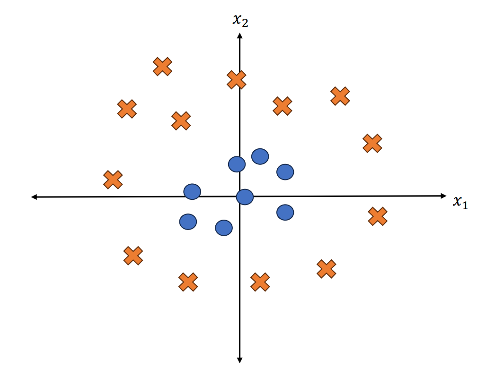
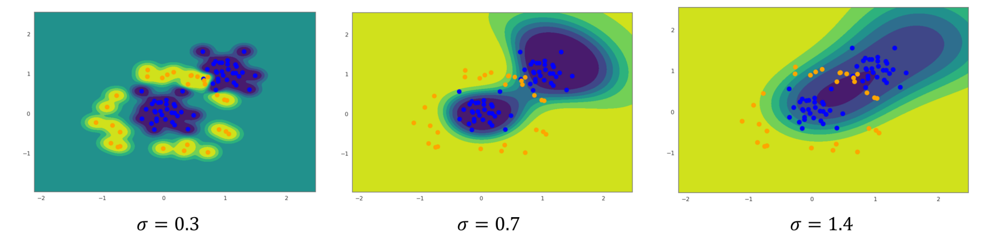

[Back to Main](../main.md)

# 9. Kernels Part 1 & 2
### Concept) Feature Map
- Def.)
  - $`\phi(\mathbf{x}) : \mathbb{R}^d \rightarrow \mathbb{R}^D`$ where $`D\gt d`$
- Props.)
  - In the previous linear model cases, we saw that models with many features better explain the model.
    - We will use this property to learning.
      - i.e.) Increase the number of features using the feature map.
- Application)
  - Suppose
    - $`\mathbf{x} = \begin{bmatrix} x_1 \\ x_2 \end{bmatrix}, \mathbf{w} = \begin{bmatrix} w_1 \\ w_2 \end{bmatrix} \in\mathbb{R}^2`$
  - We can set a linear model as follows:
    - $`h(\mathbf{x}) = \mathbf{w^\top x}`$
  - However, this cannot properly classify the following data.
    ||
    |:-|
    ||
  - If we use $`\phi(\mathbf{x}) = \begin{bmatrix} x_1 \\ x_2 \\ x_1^2+x_2^2 \end{bmatrix}`$ and change our model into
    - $`h(\phi(\mathbf{x})) = \mathbf{w}^\top \phi(\mathbf{x}), \mathbf{w}\in\mathbb{R}^3`$
  - $`\mathbf{w}^* = \begin{bmatrix} 0 \\ 0 \\ 1 \end{bmatrix}`$ can perfectly classify the model.
  - Here, $`h(\phi(\mathbf{x}))`$ is a linear model, but is a nonlinear model for $`\mathbf{x}`$.

 

#### Concept) Degree p Polynomial Feature Map
- Prop.)
  - For $`\mathbf{x}\in\mathbb{R}^d`$, the degree $`p`$ polynomial feature map $`\phi(\mathbf{x})`$ has $`\begin{pmatrix} p+d \\ d \end{pmatrix}`$ elements.
    - Why?)
      - Consider the following counting problem.
      - Let $`x_1^{a_1} x_2^{a_2} \cdots x_d^{a_d}`$ be an element in $`\phi(\mathbf{x})`$.
      - Then we can count the possible cases with the stars and bars problem:   
        - $`a_1 + a_2 + \cdots + a_d \le p`$
      - Using a slack variable $`0 \le A \le p`$, we can rewrite the problem as  
        - $`\underbrace{a_1 + a_2 + \cdots + a_d + A}_{d+1\text{ features}} = p`$
      - Thus, the number of cases can be counted as
        - $`\begin{pmatrix} p+(d+1)-1 \\ (d+1)-1 \end{pmatrix} = \begin{pmatrix} p+d \\ d \end{pmatrix}`$
- e.g.) Degree 2 Polynomial Feature Map for 2 features.
  - Let $`\mathbf{x} = \begin{bmatrix} x_1 \\ x_2 \end{bmatrix}`$. Then $`\phi(\mathbf{x}) = \begin{bmatrix} 1 \\ x_1 \\ x_2 \\ x_1x_2 \\ x_1^2 \\ x_2^2  \end{bmatrix}`$. 
  - Thus, $`\dim(\phi(\mathbf{x})) = 6 = \begin{pmatrix} 2+2 \\ 2 \end{pmatrix}`$
- Application)
  - Using the Degree p Polynomial Feature Map has pros and cons.
    - Pros
      - $`\begin{pmatrix} p+d \\ d \end{pmatrix}`$ number of features are enough to perfectly train for the data.
    - Cons
      - Since there are too many features, its even hard to write them on a computer.
        - Sol.) Use [kernel trick](#concept-kernel-trick)!

  

### Theorem) Representor Theorem
- Theorem)
  - Let $`\mathbf{x_1, \cdots x}_n`$ be a set of training examples equipped with labels $`y_1,\cdots y_n`$.
  - Then, any linear model $`\mathbf{w}^*`$ trained on this data can be written as a linear combination of the training examples:
    - $`\displaystyle \mathbf{w}^* = \sum_i \alpha_i \mathbf{x}_i`$
  - And, this is true regardless of the space that learning is done in.
    - e.g.) 
      - A linear model trained in the feature map space $`\phi(\mathbf{x})`$ can still be represented as:
        - $`\displaystyle \mathbf{w}^* = \sum_i \alpha_i \phi(\mathbf{x}_i)`$
- Informal Pf.)
  - Let $`\mathbf{w}`$ is the optimal w.r.t. the [ridge regression](06.md#concept-ridge-regression) with [L2 regularizer](06.md#concept-l2-regularization):   
    $`\begin{aligned}
      R(\mathbf{w}) &= \min_{\mathbf{w}} \sum_{i=1}^n (\mathbf{w}^\top \mathbf{x}_i - y_i)^2 + \lambda\Vert \mathbf{w}\Vert_2^2 \\
      &= \min_{\mathbf{w}}  \Vert\mathbf{Xw-y}\Vert_2^2 + \lambda \mathbf{w}^\top \mathbf{w}
    \end{aligned}`$
  - Suppose not, i.e., $`\mathbf{w}`$ cannot be written as $`\displaystyle \mathbf{w}^* = \sum_i \alpha_i \mathbf{x}_i`$.
  - Then, $`\exists \mathbf{w}', \mathbf{v}`$ s.t.
    - $`\mathbf{w} = \mathbf{w}' + \mathbf{v}`$
    - $`\displaystyle \mathbf{w}' = \sum_i \alpha_i \mathbf{x}_i`$
    - $`\displaystyle \sum_i \alpha_i \mathbf{v}_i = 0`$
      - i.e.) Additional component $`\mathbf{v}`$ is orthogonal to each $`\mathbf{x}_i`$.
  - In that case   
    $`\begin{aligned}
      \mathbf{w}^\top \mathbf{x} &= (\mathbf{w}' + \mathbf{v})^\top \mathbf{x} \\
      &= \mathbf{w}'^\top \mathbf{x} + \mathbf{v}^\top \mathbf{x} \\
      &= \mathbf{w}'^\top \mathbf{x} & \because \mathbf{v}^\top \mathbf{x}= 0
    \end{aligned}`$
  - Thus, $`\Vert\mathbf{Xw-y}\Vert_2^2 = \Vert\mathbf{Xu-y}\Vert_2^2`$
  - Also, $`\Vert \mathbf{w}\Vert^2 = \Vert \mathbf{w}'\Vert^2 + \Vert \mathbf{v}\Vert^2 \Rightarrow \Vert \mathbf{w}'\Vert^2 \lt \Vert \mathbf{w}\Vert^2 \cdots \otimes`$
    - Why?)
      - Consider that our problem contained [L2 regularizer](06.md#concept-l2-regularization).
      - If $`\mathbf{w}`$ is optimal, $`\Vert \mathbf{w}\Vert^2 \le \Vert \mathbf{w}'\Vert, \forall \mathbf{w}'`$
   
 

### Concept) Kernel Trick
- Desc.)
  - Recall that even writing feature map $`\phi(\mathbf{x})`$ took a lot of resource.
  - Using the inner product between two feature map, we can drastically reduce the computational complexity.
    - In general, for a degree $`p`$ polynomial feature expansion, up to constants in some features we can write the inner product of the implied feature expansion as:
      - $`k_{\text{poly}}(\mathbf{x,z}) = (1+\mathbf{x^\top z})^p`$
        - where $`\mathbf{z}`$ is a test point.
    - e.g.) $`p=2`$
      - Let 
        - $`\mathbf{x,z}\in\mathbb{R}^d`$ : the features
        - $`\phi(\mathbf{x}),\phi(\mathbf{z})`$ : the feature maps
          - $`\phi(\mathbf{x}) = \begin{bmatrix} 1 & x_1 & \cdots & x_d & x_1x_2 & \cdots & x_{d-1}x_d & x_1^2 & \cdots & x_d^2 \end{bmatrix}^\top`$
          - $`\phi(\mathbf{z}) = \begin{bmatrix} 1 & z_1 & \cdots & z_d & z_1z_2 & \cdots & z_{d-1}z_d & z_1^2 & \cdots & z_d^2 \end{bmatrix}^\top`$
      - Then   
        $`\begin{aligned}
          \phi(\mathbf{x})^\top\phi(\mathbf{z}) 
          &= 1 + (x_1z_1 + \cdots + x_dz_d ) + (x_1x_2z_1z_2 + \cdots + x_{d-1}x_dz_{d-1}z_d) + (x_1^2z_1^2 + \cdots + x_d^2z_d^2) \\
          &= 1 + \sum_i x_iz_i + \sum_i \sum_j x_i x_j z_i z_j \\
          &= 1 + \sum_i x_iz_i + \left(\sum_i x_i z_i\right) \left(\sum_j x_j z_j\right) \\
          &= 1 + \mathbf{x}^\top\mathbf{z} + (\mathbf{x}^\top\mathbf{z})^2
        \end{aligned}`$
    - Then, just by getting $`\underbrace{\mathbf{x^\top z}}_{O(d)}`$, we can compute $`\underbrace{\phi(\mathbf{x})^\top\phi(\mathbf{z})}_{O\left(\begin{pmatrix} p+d \\ d \end{pmatrix}\right)}`$.
- Derivation)
  - Now, consider the model $`\displaystyle \mathbf{w^\top z}`$.
    - where $`\mathbf{z}`$ is a test point.
  - By the [representor theorem](#theorem-representor-theorem) we have
    - $`\displaystyle \mathbf{w^\top z} = \sum_i \alpha_i \mathbf{x}_i^\top \mathbf{z}`$.
  - Again, by the [representor theorem](#theorem-representor-theorem) we have   
    - $`\displaystyle \mathbf{w^\top z} \rightarrow \sum_i \alpha_i \phi(\mathbf{x}_i)^\top \phi(\mathbf{z}) = \sum_i \alpha_i k(\mathbf{x}_i, \mathbf{z})`$
      - i.e.) We are learning $`\alpha\in\mathbb{R}^n`$ instead of $`\mathbf{w}\in\mathbb{R}^d`$
      - Why?) Learning $`\alpha`$ has the same outcome as learning $`\mathbf{w}'\in\mathbb{R}^D`$ with only $`O(d)`$ time.
- e.g.)
  - Recall the [ridge regression](06.md#concept-ridge-regression) with [L2 regularizer](06.md#concept-l2-regularization):    
    $`\begin{aligned}
      \min_{\mathbf{w}} \sum_{i=1}^n (\mathbf{w}^\top \mathbf{x}_i - y_i)^2 + \lambda\Vert \mathbf{w}\Vert_2^2 
      &= \min_{\mathbf{\alpha}} \sum_{i=1}^n \left(\left(\sum_j \alpha_j\mathbf{x}_j \right)^\top \mathbf{x}_i - y_i\right)^2 + \lambda\left(\sum_i \alpha_i\mathbf{x}_i \right)^\top\left(\sum_j \alpha_j\mathbf{x}_j \right) \\
      &= \min_{\mathbf{\alpha}} \sum_{i=1}^n \left(\sum_j \alpha_j\mathbf{x}_j^\top\mathbf{x}_i - y_i\right)^2 + \lambda\sum_i\sum_j  \alpha_i\alpha_j\mathbf{x}_i^\top \mathbf{x}_j \\
      &= \min_{\mathbf{\alpha}} \sum_{i=1}^n \left(\sum_j \alpha_j\phi(\mathbf{x}_j)^\top\phi(\mathbf{x}_i) - y_i\right)^2 + \lambda\sum_i\sum_j  \alpha_i\alpha_j\phi(\mathbf{x}_i)^\top\phi(\mathbf{x}_j) \\
      &= \min_{\mathbf{\alpha}} \sum_{i=1}^n \left(\sum_j \alpha_j k(\mathbf{x}_j, \mathbf{x}_i) - y_i\right)^2 + \lambda\sum_i\sum_j  \alpha_i\alpha_j k(\mathbf{x}_i, \mathbf{x}_j) \\
    \end{aligned}`$
  - Matrix Version)
    - We can rewrite $`\displaystyle \mathbf{w} = \sum_i \alpha_i\mathbf{x}_i = \mathbf{X}^\top\alpha`$
    - Then the optimization problem goes:    
      $`\begin{aligned}
        \min_\alpha\Vert\mathbf{Xw-y}\Vert_2^2 + \lambda\mathbf{w^\top w}
        &= \min_\alpha\Vert\mathbf{X}(\mathbf{X}^\top\alpha)-\mathbf{y}\Vert_2^2 + \lambda(\mathbf{X}^\top\alpha)^\top (\mathbf{X}^\top\alpha) \\
        &= \min_\alpha\Vert\mathbf{X}\mathbf{X}^\top\alpha-\mathbf{y}\Vert_2^2 + \lambda \alpha^\top\mathbf{X}\mathbf{X}^\top\alpha \\
      \end{aligned}`$
    - Consider that $`[\mathbf{X}\mathbf{X}^\top]_{ij} = \mathbf{x_i}^\top\mathbf{x_j}`$.
    - This time, using the kernel matrix $`\mathbf{K}`$ where $`[\mathbf{K}]_{ij} = k(\mathbf{x_i}, \mathbf{x_j}) = \phi(\mathbf{x}_j)^\top\phi(\mathbf{x}_i)`$, the optimization problem can be rewritten as
      - $`\min_\alpha\Vert\mathbf{X}\mathbf{X}^\top\alpha-\mathbf{y}\Vert_2^2 + \lambda \alpha^\top\mathbf{X}\mathbf{X}^\top\alpha = \min_\alpha\Vert\mathbf{K}\alpha-\mathbf{y}\Vert_2^2 + \lambda \alpha^\top\mathbf{K}\alpha`$
    - Then, the solution goes   
      $`\begin{aligned}
        & \frac{\partial}{\partial \alpha} \left(\Vert\mathbf{K}\alpha-\mathbf{y}\Vert_2^2 + \lambda \alpha^\top\mathbf{K}\alpha\right) = 0 \\
        \Rightarrow&  \frac{\partial}{\partial \alpha} \left((\mathbf{K}\alpha-\mathbf{y})^\top(\mathbf{K}\alpha-\mathbf{y}) + \lambda \alpha^\top\mathbf{K}\alpha\right) = 0 \\
        \Rightarrow&  \frac{\partial}{\partial \alpha} \left(\alpha^\top\mathbf{K}^\top\mathbf{K}\alpha-\mathbf{y}^\top\mathbf{K}\alpha - \alpha^\top\mathbf{K}^\top\mathbf{y} + \mathbf{y}^\top\mathbf{y} + \lambda \alpha^\top\mathbf{K}\alpha\right) = 0 \\
        \Rightarrow&  \frac{\partial}{\partial \alpha} \left(\alpha^\top\mathbf{K}^2\alpha-2\mathbf{y}^\top\mathbf{K}\alpha + \mathbf{y}^\top\mathbf{y} + \lambda \alpha^\top\mathbf{K}\alpha\right) = 0 & \because \mathbf{K}\text{ is symmetric.} \\
        \Rightarrow&  2\mathbf{K}^2\alpha-2\mathbf{y}^\top\mathbf{K} + 2\lambda \mathbf{K}\alpha = 0 \\
        \Rightarrow&  (\mathbf{K}^2 + \lambda \mathbf{K})\alpha = \mathbf{y}^\top\mathbf{K} \\
        \Rightarrow&  \mathbf{K}(\mathbf{K} + \lambda I)\alpha = \mathbf{K}\mathbf{y}  & \because \mathbf{K}\text{ is symmetric.} \\
        \Rightarrow&  \alpha = (\mathbf{K} + \lambda I)^{-1}\mathbf{y} \\
      \end{aligned}`$

  

### E.g.) The Radial Basis Function (RBF) Kernel (Gaussian Kernel)
- Def.)
  - $`\displaystyle k_{\text{RBF}}(\mathbf{x}, \mathbf{x}') = \exp\left(-\frac{\Vert \mathbf{x} - \mathbf{x}'\Vert_2^2}{2\sigma^2}\right)`$
    - where $`\sigma`$ is a hyperparameter
- Prop.)
  - $`\Vert \mathbf{x} - \mathbf{x}'\Vert_2^2`$ is the squared distance between $`\mathbf{x}`$ and $`\mathbf{x}'`$.
    - $`\Vert \mathbf{x} - \mathbf{x}'\Vert_2^2 \rightarrow 0 \Rightarrow k_{\text{RBF}}(\mathbf{x}, \mathbf{x}') \rightarrow 1`$
    - $`\Vert \mathbf{x} - \mathbf{x}'\Vert_2^2 \rightarrow \infty \Rightarrow k_{\text{RBF}}(\mathbf{x}, \mathbf{x}') \rightarrow 0`$
- Application)
  - A classification model using the **RBF kernel**.
    - Settings)
      - $`\mathbf{x}_1, \mathbf{x}_2, \cdots, \mathbf{x}_n`$ : training points
      - $`\mathbf{z}`$ : a test point
      - $`y_i\in\{-1,+1\}, i\in\{1,2,\cdots,n\}`$ : the classification problem
    - Model)
      - $`\displaystyle h(\mathbf{z}) = \sum_{i=1}^n \alpha_i k_{\text{RBF}}(\mathbf{x}_i, \mathbf{z})`$
        - $`\alpha\in\mathbb{R}^n`$ is the vector of parameters that we want to learn.
    - Result)
      - $`\begin{cases}  k_{\text{RBF}}(\mathbf{x}_i, \mathbf{z}) \rightarrow 1 & \text{if } \mathbf{x}_i \text{ and } \mathbf{z} \text{ are close.} \\ k_{\text{RBF}}(\mathbf{x}_i, \mathbf{z}) \rightarrow 0 & \text{otherwise.} \end{cases}, \forall i`$
        - Working as an weight on $`\alpha_i`$
          - i.e.) Closer $`\mathbf{x}_i`$ is to $`\mathbf{z}`$, more weight on the coefficient $`\alpha_i`$
      - $`\begin{cases} \alpha_i \lt 0 & \text{if } y_i \lt 0 \\ \alpha_i \gt 0 & \text{otherwise } \end{cases}`$
    - Interpretation)
      - Then, when you make predictions from $`\mathbf{z}`$, the prediction will be the sum of a bunch of alphas influenced by how close $`\mathbf{z}`$ is to each training points $`(\mathbf{x}_i, y_i)`$.
    - Analysis)
      - The influence of $`\sigma`$.
        ||
        |:-|
        |$`\sigma`$ lets us scale all of the distances.   - When $`\sigma`$ is smaller, $`\displaystyle \frac{\Vert \mathbf{x} - \mathbf{x}'\Vert_2^2}{2\sigma^2} \text{ goes bigger} \Rightarrow \exp\left(-\frac{\Vert \mathbf{x} - \mathbf{x}'\Vert_2^2}{2\sigma^2}\right) \text{ goes to zero faster.}`$   -- Thus, $`\mathbf{z} \text{ has to be closer to } \mathbf{x}_i \text{ for } \alpha_i \text{ to influence the prediction.}`$   - When $`\alpha`$ is larger, more $`\alpha_i`$ values influence the prediction.|
        | - $`\sigma`$ gets smaller $`\Rightarrow`$ The model becomes similar to [KNN](02.md#concept-k-nearest-neighbors-k-nn).   - $`\sigma`$ gets bigger $`\Rightarrow`$ The model gets smoother, being influenced by more data.|

 

### Tech.) Kernel Constructions
- Kernels that we already have.
  - Linear Kernel : $`k_{\text{lin}}(\mathbf{x}, \mathbf{x}') = \mathbf{x}^\top \mathbf{x}'`$
  - [Polynomial Kernel](#concept-kernel-trick) : $`k_{\text{poly}}(\mathbf{x}, \mathbf{x}') = (1+\mathbf{x}^\top\mathbf{x}')^p`$
  - [RBF Kernel](#eg-the-radial-basis-function-rbf-kernel-gaussian-kernel) : $`\displaystyle k_{\text{RBF}}(\mathbf{x}, \mathbf{x}') = \exp\left(-\frac{\Vert \mathbf{x} - \mathbf{x}'\Vert_2^2}{2\sigma^2}\right)`$
- Two properties that verify whether some combination of existing kernel is a kernel.
  - (1) A function $`k(\mathbf{x}, \mathbf{x}')`$ is a kernel iff. $`\exists\phi`$ s.t. $`k(\mathbf{x}, \mathbf{x}') = \phi(\mathbf{x})^\top\phi(\mathbf{x}')`$.
    - Recall that we initially defined a kernel as an inner product in some feature space $`\phi(\cdot)`$.
    - However, the converse is also true, i.e., any kernel must have a corresponding feature map.
  - (2) A function $`k(\mathbf{x}, \mathbf{x}')`$ is a kernel iff. $`\forall (\mathbf{x}_1, \cdots, \mathbf{x}_n)`$, the matrix $`\mathbf{K}`$ s.t. $`\mathbf{K}_{ij} = k(\mathbf{x}_i, \mathbf{x}_j)`$ is a positive semi definite matrix.
    - Equivalent propositions.
      1. $`\mathbf{K}`$ is positive definite iff. $`\mathbf{v^\top K v} \ge 0, \forall \mathbf{v}\ne 0`$.
      2. $`\mathbf{K}`$ is positive definite iff. all eigenvalues are greater than or equal to 0.
- Given the two kernels, the combination of them can be a kernel.
  - How to prove)
    - Using (1)
      - Suppose 
        - $`k_1(\mathbf{x},\mathbf{z}) = \phi_1(\mathbf{x})^\top\phi_1(\mathbf{z})`$
        - $`k_2(\mathbf{x},\mathbf{z}) = \phi_2(\mathbf{x})^\top\phi_2(\mathbf{z})`$
      - Put $`\phi_3 = \begin{bmatrix} \phi_1 & \phi_2 \end{bmatrix}`$.
      - Then,    
        $`\begin{aligned}
          k_3(\mathbf{x},\mathbf{z}) &= \begin{bmatrix} \phi_1(\mathbf{x}) & \phi_2(\mathbf{x}) \end{bmatrix} \begin{bmatrix} \phi_1(\mathbf{z}) & \phi_2(\mathbf{z}) \end{bmatrix}^\top \\
          &= \phi_1(\mathbf{x})^\top\phi_1(\mathbf{z}) + \phi_2(\mathbf{x})^\top\phi_2(\mathbf{z}) \\
          &= k_1(\mathbf{x}, \mathbf{z}) + k_2(\mathbf{x}, \mathbf{z})
        \end{aligned}`$
    - Using (2)
      - Suppose
        - $`\mathbf{K}_1 \text{ s.t. } \begin{cases} {\mathbf{K}_1}_{ij} = k_1(\mathbf{x}_i, \mathbf{z}_i) \\ \mathbf{v^\top K_1 v}\ge 0, \mathbf{v}\ne 0 \end{cases}`$
        - $`\mathbf{K}_2 \text{ s.t. } \begin{cases} {\mathbf{K}_2}_{ij} = k_2(\mathbf{x}_i, \mathbf{z}_i) \\ \mathbf{v^\top K_2 v}\ge 0, \mathbf{v}\ne 0 \end{cases}`$
      - Put $`\mathbf{K}_3 = \mathbf{K}_1 + \mathbf{K}_2`$.
      - Then   
        $`\begin{aligned}
          \mathbf{v^\top K_3 v} &= \mathbf{v^\top (K_1 + K_2) v} \\
          &= \mathbf{v^\top K_1 v} + \mathbf{v^\top K_2 v} \\
          &\ge 0, \forall \mathbf{v}\ne 0.
        \end{aligned}`$

  

### Concept) Kernelized Support Vector Machine
- Desc.)
  - Applying [kernel](#concept-kernel-trick) to [SVM](08.md#8-support-vector-machine-svm).
  - Two ways to do this
    - (1 Not covered!) Compute the dual optimization problem.
    - (2) Directly plugging in $`\displaystyle \mathbf{w} \rightarrow \sum_{i=1}^n \alpha_i \phi(\mathbf{x})`$
- Model)
  - $`\displaystyle \alpha^* = \arg\min_{\alpha}\mathcal{L}(\alpha) = \sum_{i=1}^n \max\{0, 1-y_i\mathbf{k}_i^\top\alpha\} + \alpha^\top \mathbf{K}\alpha`$
  - Use $`\displaystyle h(\mathbf{z}) = \sum_{i=1}^n \alpha_i^* k(\mathbf{x}_i, \mathbf{z})`$ to classify $`\mathbf{z}`$.
- Derivation)
  - The original SVM loss goes
    - $`\displaystyle \mathcal{L}(\mathbf{w}) = \sum_{i=1}^n\max\{0, 1-y_i\mathbf{w}^\top\mathbf{x}_i\} + \Vert\mathbf{w}\Vert_2^2`$.
  - By the kernel trick, $`\displaystyle \exists \alpha\in\mathbb{R}^n \text{ s.t. } \mathbf{w}^\top\mathbf{x} = \sum_{j=1}^n \alpha_j \phi(\mathbf{x}_j)\phi(\mathbf{x})`$.
  - Thus the loss can be rewritten as   
    $`\begin{aligned}
      \mathcal{L}(\alpha) &= \sum_{i=1}^n\max\left\{0, 1-y_i\left(\sum_{j=1}^n \alpha_j \phi(\mathbf{x}_j)\right)^\top\phi(\mathbf{x}_i)\right\} + \left(\sum_{i=1}^n \alpha_i \phi(\mathbf{x}_i)\right)^\top\left(\sum_{j=1}^n \alpha_j \phi(\mathbf{x}_j)\right) \\
      &= \sum_{i=1}^n\max\left\{0, 1-y_i\sum_{j=1}^n \alpha_j \phi(\mathbf{x}_j)^\top\phi(\mathbf{x}_i)\right\} + \sum_{i=1}^n \sum_{j=1}^n \alpha_i \alpha_j \phi(\mathbf{x}_i)^\top \phi(\mathbf{x}_j) \\
      &= \sum_{i=1}^n\max\left\{0, 1-y_i\sum_{j=1}^n \alpha_j k(\mathbf{x}_i, \mathbf{x}_j)\right\} + \sum_{i=1}^n \sum_{j=1}^n \alpha_i \alpha_j k(\mathbf{x}_i, \mathbf{x}_j) & \exists k(\mathbf{x}_i, \mathbf{x}_j) = \phi(\mathbf{x}_i)^\top \phi(\mathbf{x}_j) \\
      &= \sum_{i=1}^n\max\left\{0, 1-y_i\mathbf{k}_i^\top\alpha \right\} + \alpha^\top\mathbf{K}\alpha \\
    \end{aligned}`$
    - where
      - $`\mathbf{k}_i = \begin{bmatrix} k(\mathbf{x}_i, \mathbf{x}_1) \\ k(\mathbf{x}_i, \mathbf{x}_2) \\ \vdots \\ k(\mathbf{x}_i, \mathbf{x}_n) \\ \end{bmatrix}`$
      - $`\mathbf{K}\in\mathbb{R}^{n\times n} \text{ s.t. } \mathbf{K}_{ij} = k(\mathbf{x}_i, \mathbf{x}_j) = \phi(\mathbf{x}_i)^\top \phi(\mathbf{x}_j)`$
  - Hence, $`\displaystyle \alpha^* = \min_{\alpha} \sum_{i=1}^n\max\left\{0, 1-y_i\mathbf{k}_i^\top\alpha \right\} + \alpha^\top\mathbf{K}\alpha`$

  

[Back to Main](../main.md)