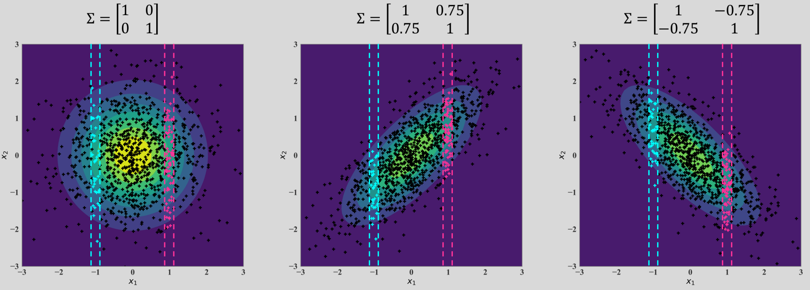
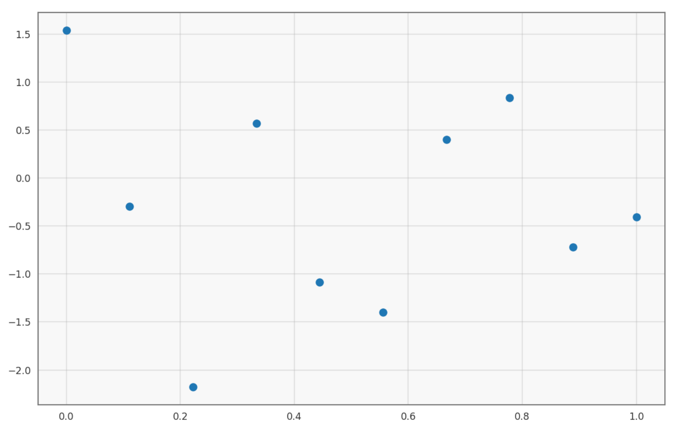
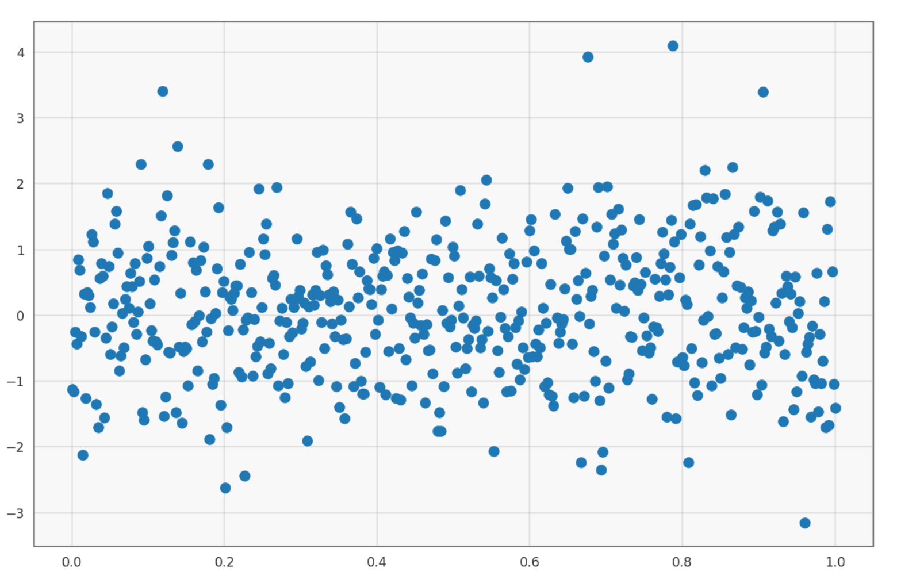
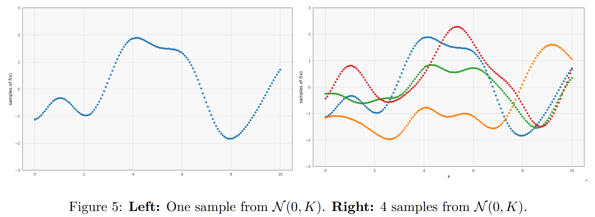
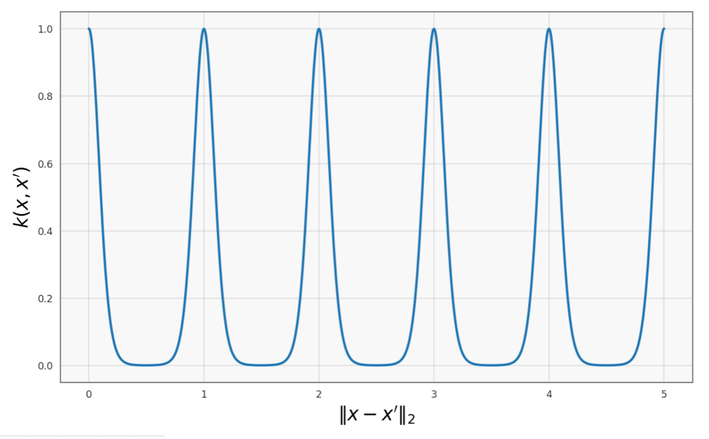
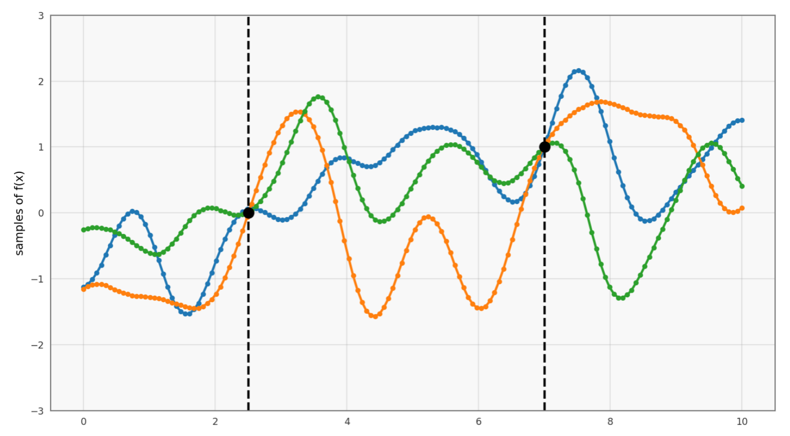
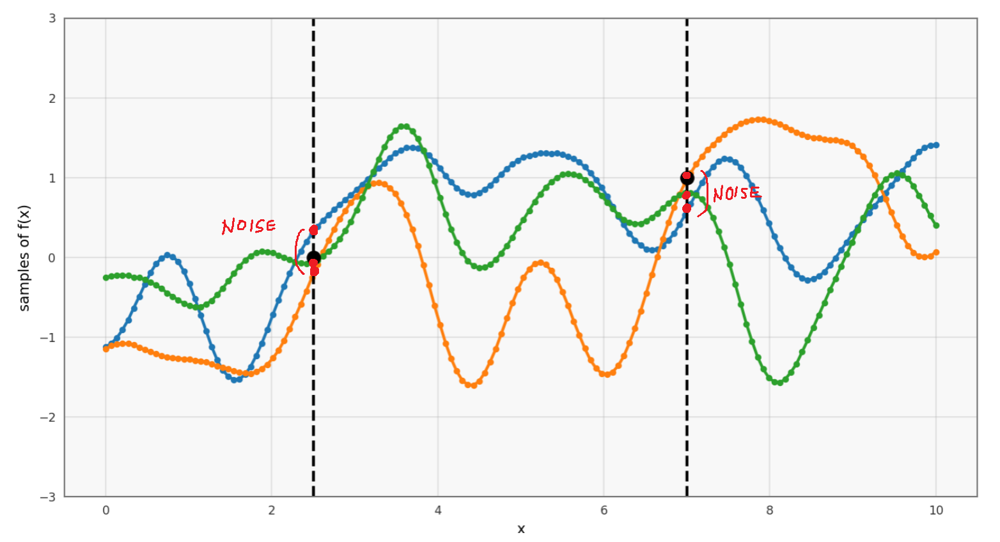

[Back to Main](../main.md)

# 11. Gaussian Process
### Concept) Multivariate Gaussian Distribution
- Def.)
  - $`\mathbf{y} = \begin{bmatrix} y_1\\ \vdots \\ y_n \end{bmatrix} \sim \mathcal{N}\left(\mu = \begin{bmatrix} \mu_1\\ \vdots \\ \mu_n \end{bmatrix}, \Sigma = \begin{bmatrix} \sigma_{11}^2 & \cdots & \sigma_{1n} \\ \vdots & \ddots & \vdots \\ \sigma_{n1} & \cdots & \sigma_{nn}^2 \end{bmatrix}\right)`$
    - where
      - $`\mu_i`$ : the mean of $`y_i`$
      - $`\sigma_{ii}^2`$ : the variance of $`y_i`$
      - $`\sigma_{ij}`$ : the covariance of $`y_i`$ and $`y_j`$
- Prop.)
  ||
  |:-|
  ||

 

### Concept) Correlation
- Def.)
  - $`\displaystyle \text{Corr}(y_i, y_j) = \frac{\text{Cov}(y_i, y_j)}{\sqrt{\text{Var}(y_i)\text{Var}(y_j)}} = \frac{\sigma_{ij}}{\sqrt{\sigma_{ii}^2 \sigma_{jj}^2}}`$

  

## Tech) Using Multivariate Gaussians to Model the Lable of Data
#### 1. IID Case
- Assumption)
  - $`\mathcal{D} = \{(x_1, y_1), \cdots, (x_n, y_n)\}`$ : data set
    - where $`\mathbf{y} = \begin{bmatrix} y_1\\ \vdots \\ y_n \end{bmatrix} \sim \mathcal{N}(0, I)`$
      - i.e.) i.i.d : $`\forall i,j, i\ne j, \sigma_{ij} = 0`$
- Plotting the samples
  |10 samples|500 samples|
  |:-|:-|
  |||
  - Interpretation)
    - No smoothness.
      - Why?) Each $`x_i`$ are completely uncorrelated.

#### 2. Using RBF as the Covariance Matrix
- Assumption)
  - $`\mathcal{D} = \{(x_1, y_1), \cdots, (x_n, y_n)\}`$ : data set
    - where 
      - $`\mathbf{y} = \begin{bmatrix} y_1\\ \vdots \\ y_n \end{bmatrix} \sim \mathcal{N}(0, \mathbf{K})`$
      - $`\mathbf{K}_{ij} = k(\mathbf{x}_i, \mathbf{x}_j) = \exp\left(-\frac{\Vert \mathbf{x}_i-\mathbf{x}_j \Vert}{2\sigma^2}\right)`$ : [RBF Kernel](09.md#eg-the-radial-basis-function-rbf-kernel-gaussian-kernel) with the kernel matrix
    - Why using $`\mathbf{K}`$ as $`\Sigma`$?)
      - $`\mathbf{K}`$ have many same properties as covariance matrix $`\Sigma`$ in [multivariate Gaussian distribution](#concept-multivariate-gaussian-distribution).
- Plotting the samples
  ||
  |:-|
  ||
  - Interpretation)
    - If $`\mathbf{x}_i`$ and $`\mathbf{x}_j`$ are close together (small $`k(\mathbf{x}_i, \mathbf{x}_j)`$), the labels $`y_i`$ and $`y_j`$ will be highly correlated.

 

### Concept) Periodic Kernel
- Def.)
  - $`k_{\text{periodic}}(\mathbf{x}_i, \mathbf{x}_j) = \exp\left(-\frac{2\sin^2(\pi\Vert\mathbf{x}_i-\mathbf{x}_j\Vert / p)}{\ell^2}\right)`$
    - where
      - $`p`$ : the period of the periodic pattern (distance between repetitions of the function)
      - $`\ell`$ : the length scale parameter ($`\sigma^2`$ in this class)
- Graphical Desc.)
  ||
  |:-:|
  ||
- Application)
  - Suppose we use $`k_{\text{periodic}}`$ to build a kernel matrix $`\mathbf{K}`$.
  - And we use it to denote the covariance between the labels.
    - $`\mathbf{y} \sim \mathcal{N}(0, \mathbf{K})`$
      - where $`\mathbf{K}_{ij} = k_{\text{periodic}}(\mathbf{x}_i, \mathbf{x}_j)`$
  - Then, we may denote the periodic correlation.

  

### Concept) Gaussian Process Regression
- Model)
  - Let
    - $`\begin{bmatrix} \mathbf{y}_x \\ \mathbf{y}_z \end{bmatrix} \sim \mathcal{N} \left(0, \begin{bmatrix} \mathbf{K}_{xx} + \sigma_n^2 I & \mathbf{K}_{xz} \\ \mathbf{K}_{xz}^\top & \mathbf{K}_{zz} \end{bmatrix}\right)`$
      - where
        - $`\mathbf{y}_x`$ : the labels of the training data points
          - Additionally, we assume $`\mathbf{y}_x+\epsilon`$
            - where $`\epsilon \sim \mathcal{N}(0, \sigma_n^2 I)`$ : the noise
        - $`\mathbf{y}_z`$ : the labels of the test data points
        - $`\mathbf{K}_{xx}`$ : the kernel matrix for just the training data points
          - Since we assumed $`\mathbf{y}_x+\epsilon`$, the covariance will be calculated as
            - $`\mathbf{K}_{xx} + \sigma_n^2 I`$
              - Why?)
                - For $`X\sim\mathcal{N}(\mu_X, \sigma_X^2)`$, $`Y\sim\mathcal{N}(\mu_Y, \sigma_Y^2)`$
                - $`X+Y\sim(\mu_X + \mu_Y, \sigma_X^2 + \sigma_Y^2)`$
        - $`\mathbf{K}_{zz}`$ : the kernel matrix for just the test data points
        - $`\mathbf{K}_{xz}`$ : the kernel matrix between the training and the test data points
  - Our goal is to derive the probability distribution over the labels of test points, given the training labels.
    - i.e.) $`p(\mathbf{y}_z \vert \mathbf{y}_x)`$
  - We have the closed for solution for the $`p(\mathbf{y}_z \vert \mathbf{y}_x)`$ as:
    - $`p(\mathbf{y}_z \vert \mathbf{y}_x) = \mathcal{N}(\mathbf{K}_{xz} (\mathbf{K}_{xx} + \sigma_n^2 I)^{-1} \mathbf{y}_x,\; \mathbf{K}_{zz}-\mathbf{K}_{xz}^\top (\mathbf{K}_{xx} + \sigma_n^2 I)^{-1}\mathbf{K}_{xz})`$
- e.g.)
  |Two Training Point Case|Noise Added to the Training Points|
  |:-|:-|
  |||

  

[Back to Main](../main.md)