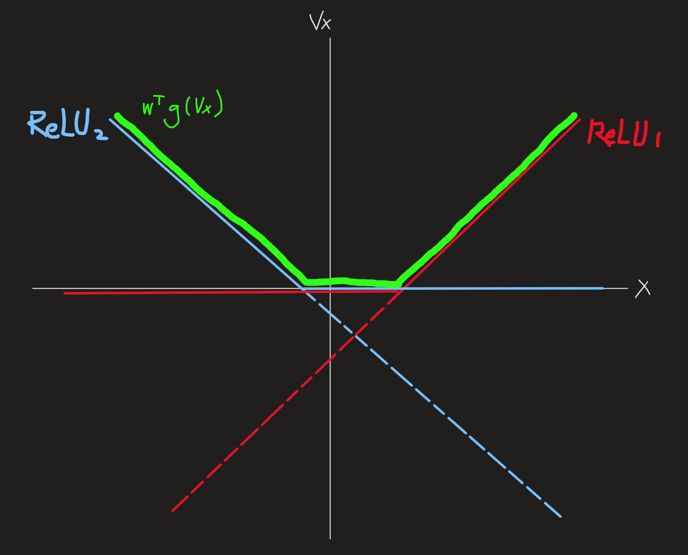
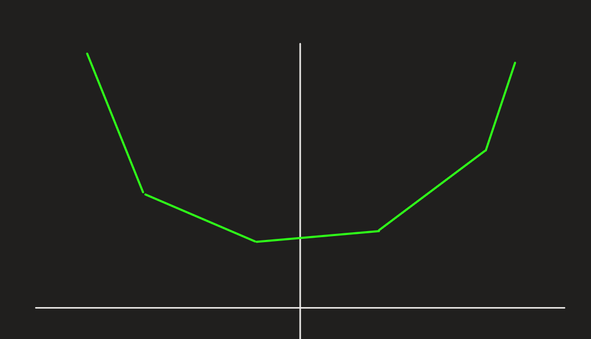
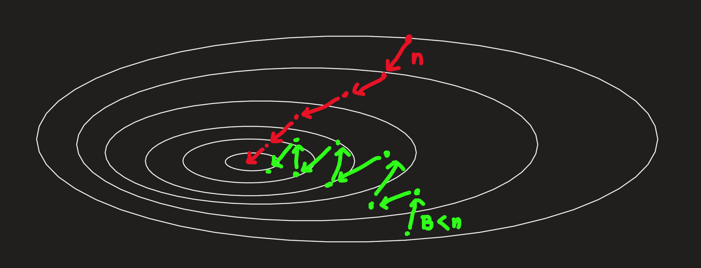

[Back to Main](../main.md)

# 12. Neural Networks
### Concept) Learning the Feature Map
- Ideation)
  - Recall that [kernel tricks](09.md#concept-kernel-trick) utilize the [feature maps](09.md#concept-feature-map) $`\phi(\mathbf{x})`$ that was powerful for explaining the complex dataset.
  - However, they had [limits](09.md#prop-limits-of-kernel-trick).
  - Then, instead of using kernel tricks to utilize feature maps, why don't we directly learn the feature maps?
- Settings)
  - Let
    - $`(\mathbf{x}_1, y_1), \cdots, (\mathbf{x}_n, y_n)`$ : training sets.
      - where $`\mathbf{x}_i \in \mathbb{R}^d`$
    - $`\phi(\mathbf{x}) \in \mathbb{R}^D`$ : the feature map
      - where $`D\gt d`$.
    - $`h(\mathbf{z}) = \mathbf{w^\top}\phi(\mathbf{z})`$ : the predictor using the feature map.
- Model)
  - Put $`\mathbf{V}\in\mathbf{R}^{D\times d}`$ s.t. $`\phi(\mathbf{x}) = \mathbf{Vx}`$.
  - Then, the predictor goes $`h(\mathbf{z}) = \mathbf{w^\top Vx}`$.
  - By learning $`\mathbf{w}\in\mathbb{R}^d`$ and $`\mathbf{V}\in\mathbb{R}^{D\times d}`$, we can optimize the model.
    - where learning $`\mathbf{V}`$ is learning the optimal feature map.
- Limit)
  - Consider that $`\mathbf{w^\top}\mathbf{(Vx)} = \mathbf{(w^\top V)}\mathbf{x}`$.
  - Since $`\mathbf{w^\top V} \in \mathbb{R}^D`$, the model is just the linear model.
    - Sol.) [Neural Network](#concept-neural-networks) : Adding non linearity to the model using the activation functions.

 

### Concept) Activation Function
- Desc.)
  - A function that outputs non linear result from the linear input.
- Notation)
  - Activation Function is a scalar function.
  - If the input is vector, it means the element-wise operation.
    - e.g.)
      - $`g(\mathbf{Vz}) = \begin{bmatrix} g(\mathbf{V}_{11}\mathbf{z}_1 + \cdots + \mathbf{V}_{1d}\mathbf{z}_d) \\ g(\mathbf{V}_{21}\mathbf{z}_1 + \cdots + \mathbf{V}_{2d}\mathbf{z}_d) \\ \vdots \\ g(\mathbf{V}_{D1}\mathbf{z}_1 + \cdots + \mathbf{V}_{Dd}\mathbf{z}_d) \end{bmatrix}`$
- Types)
  - ReLU (Rectified Linear Unit) : $`g(s) = \max(0, s)`$
    - Best!
    - By adding multiple ReLUs and using multiple layers, we can mimic the high dimensional functions.
      |||
      |:-|:-|
      |   $`\mathbf{w}=\begin{bmatrix} 1\\1 \end{bmatrix}, \mathbf{Vx}=\begin{bmatrix}\mathbf{v}_1\\\mathbf{v}_2\end{bmatrix}\begin{bmatrix}\mathbf{x_1}\end{bmatrix}`$   Thus, $`\begin{cases} \text{ReLU}_1 = \max{(0, \mathbf{v}_1\mathbf{x_1})} \\ \text{ReLU}_2 = \max{(0, \mathbf{v}_2\mathbf{x_1})} \end{cases}`$   $`\begin{aligned} \therefore  h(\mathbf{x}) &= w^\top g(\mathbf{Vx}) \\ &= \max{(0, \mathbf{v}_1\mathbf{x_1})} + \max{(0, \mathbf{v}_2\mathbf{x_1})} \end{aligned}`$ ||
  - Sigmoid : $`\displaystyle g(s) = \frac{1}{1+\exp(-s)}`$
  - Hyperbolic Tangent : $`g(s) = \tanh(s)`$

 

### Concept) Neural Networks
- Model)
  - $`h(\mathbf{z}) = \mathbf{w}^\top \phi(\mathbf{z}) = \mathbf{w}^\top g(\mathbf{Vz})`$
    - where $`g(\cdot)`$ is an [activation function](#concept-activation-function).
- Derivation)
  - Start from the [linear model learning feature map](#concept-learning-the-feature-map) : $`h(\mathbf{z}) = \mathbf{w^\top Vz}`$.
  - Add non linearity using the [activation function](#concept-activation-function) : $`h(\mathbf{z}) = \mathbf{w^\top} g(\mathbf{Vz})`$
    - where $`g`$ is an activation function

#### Concept) Layers
- Desc.)
  - Consider a neural network : $`h(\mathbf{z}) = \mathbf{w^\top} g(\mathbf{Vz})`$.
  - Put $`\mathbf{a} = g(\mathbf{Vz})`$.
  - Then, the mapping $`\mathbf{z} \rightarrow \mathbf{a}`$ via $`g(\mathbf{Vz})`$ is often called the first **hidden layer**.
  - Also, the vector produced by this layer $`\mathbf{a}`$ is often called the **hidden representation** or the **representation after layer 1**.

 

### Tech) Training Neural Networks
#### E.g.) Classification Problem
- Loss Function : Logistic Loss with Neural Network
  - $`\displaystyle R(\mathbf{w, V}) = \sum_{i=1}^n \log(1+\exp(-y_i\mathbf{w}^\top \underbrace{g(\mathbf{Vx}_i)}_{\text{hidden layer}}))`$
- Optimization : Gradient Descent   
  $`\begin{cases}
    \displaystyle \mathbf{w}_t \leftarrow \mathbf{w}_{t-1} - \eta \nabla_{\mathbf{w}} R(\mathbf{w}_{t-1}, \mathbf{V}_{t-1}) \\
    \displaystyle \mathbf{V}_t \leftarrow \mathbf{V}_{t-1} - \eta \nabla_{\mathbf{V`}} R(\mathbf{w}_{t-1}, \mathbf{V}_{t-1}) \\
  \end{cases}`$

#### E.g.) Regression Problem
- Loss Function : Quadratic Loss with Neural Network
  - $`\displaystyle R(\mathbf{w, V}) = \sum_{i=1}^n (\mathbf{w}^\top \underbrace{g(\mathbf{Vx}_i)}_{\text{hidden layer}} - y_i)^2`$
- Optimization : Gradient Descent   
  $`\begin{cases}
    \displaystyle \mathbf{w}_t \leftarrow \mathbf{w}_{t-1} - \eta \nabla_{\mathbf{w}} R(\mathbf{w}_{t-1}, \mathbf{V}_{t-1}) \\
    \displaystyle \mathbf{V}_t \leftarrow \mathbf{V}_{t-1} - \eta \nabla_{\mathbf{V`}} R(\mathbf{w}_{t-1}, \mathbf{V}_{t-1}) \\
  \end{cases}`$

### Tech) L2 Regularization for Neural Network
- Recall that $`\mathbf{w}\in\mathbb{R}^D, \mathbf{V}\in\mathbb{R}^{D\times d}`$
- Thus, we can denote the [L2 Regularizer](06.md#concept-l2-regularization) for $`\mathbf{w}`$ and $`\mathbf{V}`$ as
  - $`\displaystyle \sum_{i=1}^D \mathbf{w}_i^2 + \sum_{i=1}^D\sum_{j=1}^d \mathbf{V}_{ij}`$

  

### Concept) Neural Networks with Multiple Hidden Layers
- Desc.)
  - Stacking more layers
- How?)
  - Let
    - $`\mathbf{x}\in\mathbb{R}^d`$.
  - Then we generated the first hidden layer $`\mathbf{a}_1\in\mathbb{R}^{D_1}`$ with the matrix $`\mathbf{V}_1\in\mathbb{R}^{D_1\times d}`$ as
    - $`\mathbf{a}_1 = g(\mathbf{V}_1 \mathbf{x})`$.
  - Again, using a matrix $`\mathbf{V}_2\in\mathbb{R}^{D_2\times D_1}`$, we can generate a second layer $`\mathbf{a}_2\in\mathbb{R}^{D_2}`$ as
    - $`\mathbf{a}_2 = g(\mathbf{V_2} \; \underbrace{g(\mathbf{V}_1 \mathbf{x})}_{\text{first layer}})`$
  - This can be repeated as   
    $`\begin{aligned}
      \mathbf{a}_1 &= g(\mathbf{V}_1 \mathbf{x}) \\
      \mathbf{a}_2 &= g(\mathbf{V}_2 \mathbf{a}_1) \\
      \mathbf{a}_3 &= g(\mathbf{V}_3 \mathbf{a}_2) \\
      &\vdots \\
      \mathbf{a}_k &= g(\mathbf{V}_k \mathbf{a}_{k-1}) \\
    \end{aligned}`$
    - And we can make the prediction with the model
      - $`h(\mathbf{a}_k) = \mathbf{w}^\top \mathbf{a_k}`$
        - where
          - $`\mathbf{w}^\top, \mathbf{a}_k \in \mathbb{R}^{D_k}`$

  

### Concept) Stochastic Gradient Descent (SGD)
- Ideation)
  - Modern neural networks have gigantic numbers of parameters and layers.
  - Thus, as we gather more and more data, the computational cost becomes extremely expensive.
  - Our optimization algorithm, the [gradient descent](04.md#concept-gradient-descent), goes over all $`n`$ data every time.
    - Recall that $`\displaystyle R(\mathbf{w}) = \sum_{i=1}^n \ell(h(\mathbf{x}_i), y_i)`$ where $`n`$ is the number of data.
    - Then the gradient descent goes   
      $`\begin{aligned}
        \mathbf{w}_t &= \mathbf{w}_{t-1} - \eta \nabla_\mathbf{w} R(\mathbf{w}_{t-1}) \\
        &= \mathbf{w}_{t-1} - \eta \nabla_\mathbf{w} \sum_{i=1}^n \ell(h(\mathbf{x}_i), y_i) \\
        &= \mathbf{w}_{t-1} - \eta \sum_{i=1}^n \nabla_\mathbf{w} \ell(h(\mathbf{x}_i), y_i) & \because \nabla(f+g) = \nabla f + \nabla g \\
      \end{aligned}`$
      - i.e.) We should calculate $`\nabla_\mathbf{w}\ell`$ $`n`$ times.
  - Instead, partition $`n`$ data into $`B_t`$s
- Model)
  - $`\displaystyle \mathbf{w}_t  = \mathbf{w}_{t-1} - \eta\frac{1}{\vert B_t \vert} \sum_{i\in B_t} \nabla_\mathbf{w} \ell(h(\mathbf{x}_i), y_i)`$
- Props.)
  - It may not converge as good as the normal gradient descent.
  - However, if $`n`$ is too big, it's the only choice.
- Desc.)
  ||
  |:-|
  ||

  

[Back to Main](../main.md)