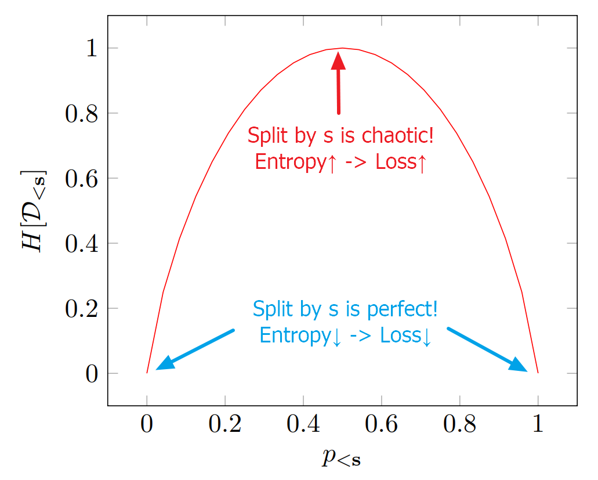
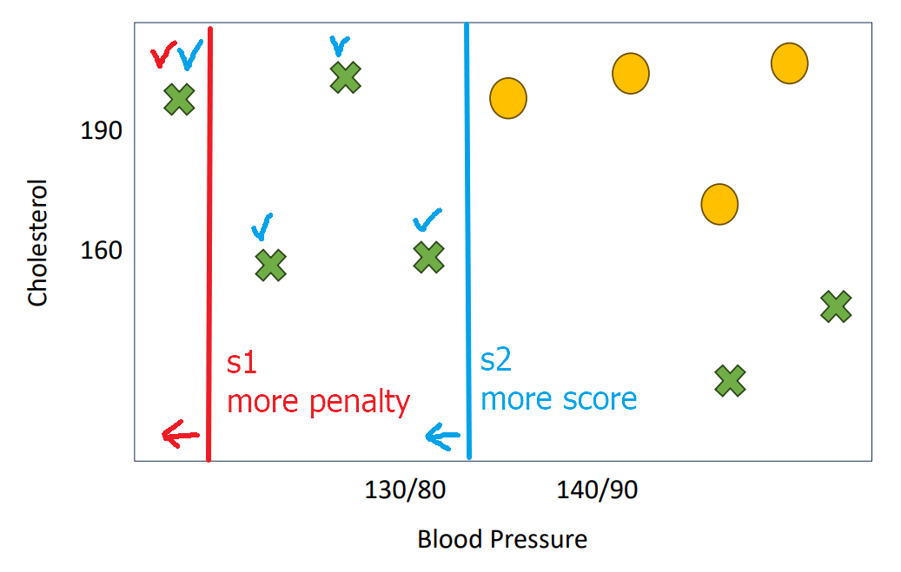

[Back to Main](../main.md)

# 13. Decision Trees
### E.g.) A decision tree predicting heart disease risk based on cholesterol and blood pressure.
|Decision Tree|Decision Boundary|
|:-|:-|
|||

 

### Concept) Split
- Desc.)
  - Literally splitting the data into two new datasets by a condition.
    - Ones that are satisfying the condition
    - Others
- Concepts)
  - Leaf Node
    - a node that does not split the data any further
  - Purity
    - Whether a leaf node contains data of only one label.
    - Or it is impossible to split the data any further.
- Props.)
  - There are $`n-1`$ possible splits for the $`n`$ dataset.
  - Splits between two data points are treated equal.
    - Still, the one with the higher margin is more robust to the noise.
      |e.g.)|
      |:-|
      ||
      |- Dashed and solid purple lines are the same splits.   - Dashed one has the higher margin.|
- How to Split?)
  1. For feature $`j`$, sort data points $`\mathbf{x}_1, \cdots, \mathbf{x}_n`$ in increasing value of that feature.
     - Then, $`\mathbf{x}_{1,j} \le \mathbf{x}_{2,j} \le \cdots \le \mathbf{x}_{3,j}`$
  2. The set of splits will be $`\displaystyle \frac{\mathbf{x}_{i,j} + \mathbf{x}_{i+1,j}}{2}, (i=1,2,\cdots, n-1)`$
     - Thus, we consider $`O(nd)`$ splits in total.
       - where $`j\in[1,d], i\in[1,n-1]`$
- Choosing between splits)
  - Recall that we had $`n-1`$ splits for every feature.
  - Among them, pick one with the lowest loss.

 

### Concept) Decision Tree Loss Function
- Settings)
  - $`\mathcal{D} = \{(\mathbf{x}_1, y_1), \cdots, (\mathbf{x}_n, y_n)\}`$
  - $`\mathbf{s} = (j,v)`$ : a split 
    - where
      - $`j\in[1,\cdots,d]`$ : the feature index
      - $`v`$ is the value for feature $`j`$ that determines the split threshold.
  - $`\mathcal{D}_{\lt \mathbf{s}}`$ : the set of training examples whose $`j`$-th feature value is less than $`v`$.
  - $`\mathcal{D}_{\gt \mathbf{s}}`$ : the set of training examples whose $`j`$-th feature value is less than $`v`$.
    - cf.) We can ignore the equality.
      - Even if there are multiple values having the same value, we can consider them tied and ignore.
  - $`p_{\lt \mathbf{s}}`$ : the fraction of points in $`\mathcal{D}_{\lt \mathbf{s}}`$ with label $`+1`$.
  - $`p_{\gt \mathbf{s}}`$ : the fraction of points in $`\mathcal{D}_{\gt \mathbf{s}}`$ with label $`+1`$.

#### Entropy Loss Function)
- Model)
  - $`\displaystyle H[\mathbf{s}] = \frac{\vert \mathcal{D}_{\lt \mathbf{s}} \vert}{\vert \mathcal{D} \vert} H[\mathcal{D}_{\lt \mathbf{s}}] + \frac{\vert \mathcal{D}_{\gt \mathbf{s}} \vert}{\vert \mathcal{D} \vert} H[\mathcal{D}_{\gt \mathbf{s}}]`$
    - where
      - $`H[\mathcal{D}_{\lt \mathbf{s}}] = -p_{\lt s} \log p_{\lt s} -(1-p_{\lt s}) \log (1-p_{\lt s})`$ : the entropy of the labels in $`\mathcal{D}_{\lt \mathbf{s}}`$
      - $`H[\mathcal{D}_{\gt \mathbf{s}}] = -p_{\gt s} \log p_{\gt s} -(1-p_{\gt s}) \log (1-p_{\gt s})`$ : the entropy of the labels in $`\mathcal{D}_{\gt \mathbf{s}}`$
        ||
        |:-|
        |   - Purity : $`\begin{cases} p_{\lt s} = 0 \Leftrightarrow \text{All labels are } -1 \\ p_{\lt s} = 1 \Leftrightarrow \text{All labels are } +1 \end{cases}`$|
      - $`\displaystyle \frac{\vert \mathcal{D}_{\lt \mathbf{s}} \vert}{\vert \mathcal{D} \vert}`$ : the normalizing factor.
        - Why needed?)
          |To penalize splits as below|
          |:-|
          |   - In terms of purity, the redline split result is absolutely pure. However, it is not a valid split.   - By giving more score to a split $`\mathbf{s}`$ that splits more data (i.e. greater $`\vert D_{\lt \mathbf{s}} \vert`$), we may not choose less explaining split as above.|
- Optimization)
  - $`\displaystyle \mathbf{s}^* = \arg \min_{\mathbf{s}\in\mathcal{S}} H[\mathbf{s}]`$
    - where $`\mathcal{S}`$ is the set of all possible splits.

#### Gini Index Loss Function)
- Model)
  - $`\displaystyle G[\mathbf{s}] = \frac{\vert \mathcal{D}_{\lt \mathbf{s}} \vert}{\vert \mathcal{D} \vert} G[\mathcal{D}_{\lt \mathbf{s}}] + \frac{\vert \mathcal{D}_{\gt \mathbf{s}} \vert}{\vert \mathcal{D} \vert} G[\mathcal{D}_{\gt \mathbf{s}}]`$
    - where $`G[\mathcal{D}_{\lt \mathbf{s}}] = p_{\lt \mathbf{s}}(1-p_{\lt \mathbf{s}})`$ : the Gini Index
      ||
      |:-|
      ||
- Prop.)
  - $`\displaystyle \max_{\mathbf{s}\in\mathcal{S}}\{G[\mathcal{D}_{\lt \mathbf{s}}]\} = 0.5\times0.5 = 0.25`$
  - Again the weighted average with the normalizing factor of $`\frac{\vert \mathcal{D}_{\lt \mathbf{s}} \vert}{\vert \mathcal{D} \vert}`$

 

### Concept) Training Regression Trees
- How?)
  - Consider all possible splits $`\mathcal{S}`$ and choose one that minimizes some loss function $`\ell(\mathbf{s}), \mathbf{s}\in\mathcal{S}`$.
- Loss Function)
  - One option can be the squared loss.
    - $`\displaystyle \ell_{\text{sq}}[\mathbf{s}] = \frac{\vert \mathcal{D}_{\lt \mathbf{s}} \vert}{\vert \mathcal{D} \vert} \ell_{\text{sq}}[\mathcal{D}_{\lt \mathbf{s}}] + \frac{\vert \mathcal{D}_{\gt \mathbf{s}} \vert}{\vert \mathcal{D} \vert} \ell_{\text{sq}}[\mathcal{D}_{\gt \mathbf{s}}]`$
      - where 
        - $`\displaystyle \ell_{\text{sq}}[\mathcal{D}_{\lt \mathbf{s}}] = \sum_{y\in\mathcal{D}_{\lt \mathbf{s}}} (y-\overline{y_{\lt \mathbf{s}}})`$ : the squared loss of partition $`\mathcal{D}_{\lt \mathbf{s}}`$
        - $`\overline{y_{\lt \mathbf{s}}}`$ : the average label in $`\mathcal{D}_{\lt \mathbf{s}}`$.
          - i.e.) Not like the classification problem where we could choose the label, we will calculate the average of the labels and use it as the representing value of this partition.

 

### Concept) Regularization for Decision Trees
- Why needed?)
  - Decision tree processes will always achieve zero training error : Full Depth Tree
    - Why?) It will split until no split is possible $`\Leftrightarrow`$ Overfitting!
  - Moreover, consider that the splitting happens in exponential times : $`2\rightarrow4\rightarrow8\rightarrow16\rightarrow\cdots`$.
    - Thus, the border between underfitting and overfitting may be real sharp!
      - i.e.) Underfitted model suddenly gets overfitted.
- How to?)
  - Bagging
    - Will be covered in the random forests method.
  - Depth limiting
    - Stop recursing after a fixed depth.

  

[Back to Main](../main.md)