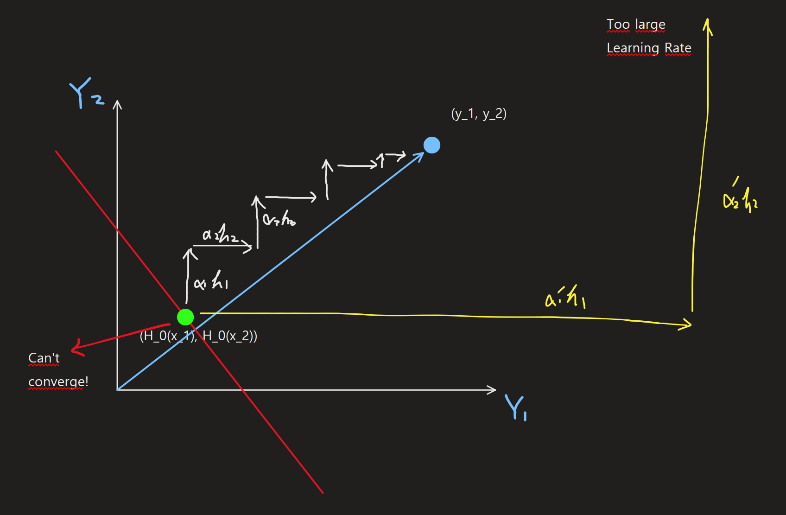
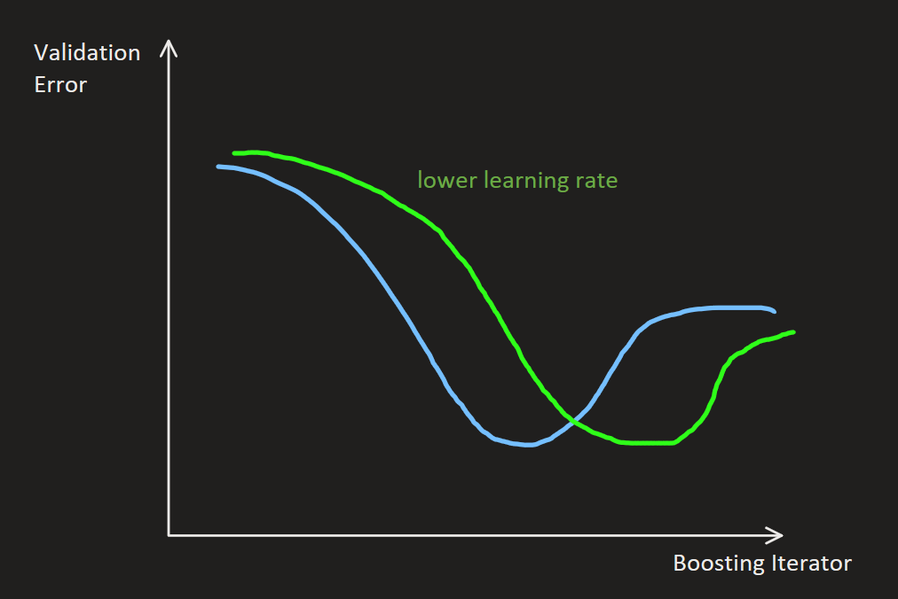

[Back to Main](../main.md)

# 15. Boosting
### Concept) Weak Learner
- Desc.)
  - A model with large bias and high training error
- e.g.)
  - Decision Stump
    - Def.)
      - Depth 1 [Decision Tree](13.md#13-decision-trees).
    - e.g.)
      - $`h(\mathbf{x}) = \begin{cases} +1 & [\mathbf{x}_1] \lt 5 \\ -1 & [\mathbf{x}_1] \ge 5 \end{cases}`$
        - i.e.) Split on the first feature $`[\mathbf{x}_1]`$ with the value of 5.
- Why needed for Boosting?)
  - The intuition of the [Boosting](#concept-general-boosting-algorithm) is to create an ensemble model with weak learners.
  - By adding **weak learners** that learn information that was not learned by the previous ensemble, the boosting algorithm improves its performance.
    - cf.) It's the opposite of [Bagging](14.md#concept-bagging-bootstrap-aggregating).
      - Why?) Bagging's motive was to prevent the overfit of a powerful model such as [Decision Tree](13.md#13-decision-trees) by averaging out the noise that cause the overfitting. 
- Requirement to be used in Boosting)
  - Classification Settings)
    - It is possible for $`h(\mathbf{x})`$ to achieve greater than 50% training accuracy.
  - Regression Settings)
    - $`\exists \alpha_t`$ s.t. $`H_{t-1}(\mathbf{x})`$ improves by $`H_{t-1}(\mathbf{x}) + \alpha_t h_t(\mathbf{x})`$
      - where $`H_{t-1}(\mathbf{x})`$ is the ensemble of $`h(\mathbf{x})`$s at $`t`$. 

 

### Concept) General Boosting Algorithm
- Settings)
  - Let
    - $`\mathcal{D} = \{(\mathbf{x}_1, y_1), \cdots, (\mathbf{x}_n, y_n)\}`$ : the labeled dataset
    - $`h_t(\mathbf{x})`$ : a new [weak learner](#concept-weak-learner) at $`t`$.
    - $`\displaystyle H_t(\mathbf{x}) = \sum_{i=1}^t \alpha_i h_i(\mathbf{x})`$ : an ensemble of weak learners until $`t`$.
      - where $`\alpha_i`$ is the learning rate at the time $`i`$
- Update Rule : Boosting
  - $`\displaystyle H_t(\mathbf{x}) = H_{t-1}(\mathbf{x}) + \alpha_t h_{t}(\mathbf{x})`$
    - i.e.) Add new weak learner to the existing ensemble!
    - Graphical Intuition
      ||
      |:-|
      ||
- Solution)
  - $`\displaystyle h_{t+1}^* \approx \arg\min_{h_{t+1}\in\mathcal{H}} \sum_{i=1}^n \frac{\partial \ell}{\partial H_t(\mathbf{x}_i)} h_{t+1}(\mathbf{x}_i)`$ 
    - Or find an algorithm s.t. $`\mathcal{A}_\ell(\mathcal{D}, H_t) = h_{t+1}^*`$
- Derivation)
  - Questions)
    - Among many candidates for $`h_{t}(\mathbf{x})`$, which one should we pick?
      - Find $`h_{t}(\mathbf{x})`$ that minimizes the loss at $`t`$.
    - Then what is loss?
      - Recall that our dataset is labeled.
      - Thus, we can calculate the loss of an ensemble at $`t`$ as
        - $`\displaystyle \ell(H_t) = \frac{1}{n}\sum_{i=1}^n \ell(H_t(\mathbf{x}_i), y_i)`$
  - Optimization)
    - $`\displaystyle h_{t+1} = \arg\min_{h_{t+1}\in\mathcal{H}} \ell (H_t + \alpha_{t+1} h_{t+1})`$.
      - cf.) $`y_i`$ term is dropped in the notation but remains in the loss!
    - We now have to solve the following problem iteratively.
      - $`\displaystyle \left.\frac{\partial \ell}{\partial h_{t+1}}(\mathbf{x}_i) = 0\right\vert_{i=1,\cdots, n}`$
    - Recalled that the [Gradient Descent](04.md#4-gradient-descent) used [the Taylor Approximation](04.md#concept-taylor-approximation) to form a loss function.
      - $`F(w+v) \approx F(w) + \nabla F(w)^\top v`$
    - Applying [the Taylor Approximation](04.md#concept-taylor-approximation) to this loss around $`H_t`$, we get
      - $`\ell (H_t + \alpha_{t+1} h_{t+1}) \approx \ell(H_t) + \langle \nabla_{H_t}\ell(H_t), \alpha_{t+1} h_{t+1} \rangle`$
        - where $`\langle \cdot, \cdot \rangle`$ is the inner product.
    - Consider that $`\nabla_{H_t}\ell(H_t) = \begin{bmatrix} \frac{\partial \ell}{\partial H_t(\mathbf{x}_1)} & \cdots & \frac{\partial \ell}{\partial H_t(\mathbf{x}_n)} \end{bmatrix}^\top`$
      - Thus,    
        $`\begin{aligned}
          \langle \nabla_{H_t}\ell(H_t), \alpha_{t+1} h_{t+1} \rangle 
          &= \begin{bmatrix} \frac{\partial \ell}{\partial H_t(\mathbf{x}_1)} & \cdots & \frac{\partial \ell}{\partial H_t(\mathbf{x}_n)} \end{bmatrix}^\top \cdot \begin{bmatrix} \alpha_{t+1}  h_{t+1}(\mathbf{x}_1) & \cdots & \alpha_{t+1}  h_{t+1}(\mathbf{x}_n) \end{bmatrix} \\
          &= \sum_{i=1}^n \left(\frac{\partial \ell}{\partial H_t(\mathbf{x}_i)}\right) \alpha_{t+1} h_{t+1}(\mathbf{x}_i) \\
        \end{aligned}`$.
    - Also, consider that $`\frac{\partial \ell(H_t)}{\partial h_{t+1}} = 0`$.
      - i.e.) Current ensemble at $`t`$ $`H_t`$ is independent on the new weak learner $`h_{t+1}`$.
    - Therefore, the optimization problem can be rewritten as   
      $`\begin{aligned}
          h_{t+1}^* &\approx \arg\min_{h_{t+1}\in\mathcal{H}} \langle \nabla_{H_t}\ell(H_t), \alpha_{t+1} h_{t+1} \rangle \\
          &= \arg\min_{h_{t+1}\in\mathcal{H}} \sum_{i=1}^n \frac{\partial \ell}{\partial H_t(\mathbf{x}_i)} h_{t+1}(\mathbf{x}_i) & \because\text{Dropping } \alpha_{t+1} \text{ does not affect the opt'n problem.}
      \end{aligned}`$
      - i.e) Find an algorithm $`\mathcal{A}_\ell(\mathcal{D}, H_t) = h_{t+1}^*`$
- Prop.)
  - However, we cannot derive the general solution for the above optimization problem.
  - Two approaches to solve this problem.
    1. Train $`h_t`$ on the errors that $`H_{t-1}`$ is making.
       - Implementation : [Gradient Boosted Regression Trees (GBRT)](#concept-gradient-boosted-regression-trees-gbrt)
    2. Re-weight training examples by the error
       - Implementation : [AdaBoost](#concept-adaboost)

  

### Concept) Gradient Boosted Regression Trees (GBRT)
- Ideation)
  - Train $`h_t`$ on the errors that $`H_{t-1}`$ is making.
    - i.e.) $`\displaystyle \ell(H_t) = \frac{1}{n}\sum_{i=1}^n \ell(H_t(\mathbf{x}_i), y_i)`$
- Model)
  - $`\mathcal{A}_{\ell_\text{sq}} (\mathcal{D}, H_t) = \mathcal{A}_{\text{Regression-Tree}} (\{(\mathbf{x}_1, r_1), (\mathbf{x}_2, r_2), \cdots, (\mathbf{x}_n, r_n)\})`$
    - where $`r_{it} = H_t(\mathbf{x}_i) - y_i`$ : the residual of the $`i`$-th data at $`t`$.
- Derivation)
  - Recall from the [General Boosting Algorithm](#concept-general-boosting-algorithm) that the loss of an ensemble at $`t`$ was $`\displaystyle \ell(H_t) = \frac{1}{n}\sum_{i=1}^n \ell(H_t(\mathbf{x}_i), y_i)`$.
  - Applying the squared loss, we may get the loss as
    - $`\displaystyle \ell_{\text{sq}}(H) = \frac{1}{2}\sum_{i=1}^n (h_{t+1}(\mathbf{x}_i) - y_i)^2 \Rightarrow \frac{\partial \ell_{\text{sq}}}{\partial H_t(\mathbf{x}_i)} = \underbrace{H_t(\mathbf{x}_i) - y_i}_{r_i = \text{residual}}`$.
  - Plugging this back into the [General Boosting Algorithm](#concept-general-boosting-algorithm)'s solution, we have   
    $`\begin{aligned}
        h_{t+1}^* &\approx \arg\min_{h_{t+1}\in\mathcal{H}} \sum_{i=1}^n \frac{\partial \ell}{\partial H_t(\mathbf{x}_i)} h_{t+1}(\mathbf{x}_i) \\
        &= \arg\min_{h_{t+1}\in\mathcal{H}} \sum_{i=1}^n r_{i} h_{t+1}(\mathbf{x}_i) & \text{where } r_{i} = h_{t+1}(\mathbf{x}_i) - y_i
    \end{aligned}`$
  - Still, not easy to solve, so we will apply some algebraic manipulations.
    1. Multiply the objective function by 2.   
       $`\begin{aligned}
        h_{t+1}^* &\approx \arg\min_{h_{t+1}\in\mathcal{H}} \sum_{i=1}^n r_{i} h_{t+1}(\mathbf{x}_i) \\
        &= \arg\min_{h_{t+1}\in\mathcal{H}} 2\sum_{i=1}^n r_{i} h_{t+1}(\mathbf{x}_i)
       \end{aligned}`$
       - This does not affect the optimization problem.
    2. Assume that $`\displaystyle\sum_{i=1}^n h_{t+1}(\mathbf{x}_i)^2`$ is constant.
       - Desc.)
         - In general, it cannot be true.
         - However, recall that in our model, we update by $`\displaystyle H_{t+1}(\mathbf{x}) = H_{t}(\mathbf{x}) + \alpha_{t+1} h_{t+1}(\mathbf{x})`$.
         - Thus, we can adjust $`\alpha_{t+1}`$ to satisfy $`\displaystyle\sum_{i=1}^n h_{t+1}(\mathbf{x}_i)^2 = C (\exists C\in\mathbb{R})`$
       - Why doing this?)
         - If $`\displaystyle\sum_{i=1}^n h_{t+1}(\mathbf{x}_i)^2`$ is a constant, adding this to the objective function problem does not affect the solution.
         - And this term will be used to simplify our optimization problem.
    3. Add $`\displaystyle \sum_{i=1}^n r_i^2 = \sum_{i=1}^n (H_t(\mathbf{x}_i)-y_i)^2`$ to the objective function.
       - Since $`r_i^2`$ does not depend on $`h_{t+1}`$, it does not affect the optimization problem.
  - Then, the optimization problem goes   
    $`\begin{aligned}
        h_{t+1}^* &\approx \arg\min_{h_{t+1}\in\mathcal{H}} \sum_{i=1}^n r_{i} h_{t+1}(\mathbf{x}_i) \\
        &= \arg\min_{h_{t+1}\in\mathcal{H}} \left( \sum_{i=1}^n r_i^2 + 2\sum_{i=1}^n r_{i} h_{t+1}(\mathbf{x}_i) + \sum_{i=1}^n h_{t+1}(\mathbf{x}_i)^2 \right) \\
        &= \arg\min_{h_{t+1}\in\mathcal{H}} \left( r_i + h_{t+1}(\mathbf{x}_i) \right)^2 \\
        &= \arg\min_{h_{t+1}\in\mathcal{H}} \left( h_{t+1}(\mathbf{x}_i) + (H_t(\mathbf{x}_i) - y_i) \right)^2 \\
        &= \arg\min_{h_{t+1}\in\mathcal{H}} \left( h_{t+1}(\mathbf{x}_i) - \underbrace{(y_i - H_t(\mathbf{x}_i))}_{\text{Assume this to be a label}} \right)^2 \\
    \end{aligned}`$
    - We know how to solve this problem!
      - Find a weak learner that minimizes the squared loss between the predictions $`h_{t+1}(\mathbf{x}_i)`$ and the negative residual $`(y_i - H_t(\mathbf{x}_i))`$.
      - We can do this by passing the value $`y_i - H_t(\mathbf{x}_i)`$ instead of the label $`y_i`$.
        - i.e.) $`\mathcal{A}_{\ell_\text{sq}} (\mathcal{D}, H_t) = \mathcal{A}_{\text{Regression-Tree}} (\{(\mathbf{x}_1, r_1), (\mathbf{x}_2, r_2), \cdots, (\mathbf{x}_n, r_n)\})`$
- Prop.)
  - Loss for the boosting $`\ell(H_t + \alpha_{t+1}h_{t+1})`$ is **different** from the loss of getting the next optimal weak learner $`\left( h_{t+1}(\mathbf{x}_i) - (y_i - H_t(\mathbf{x}_i)) \right)^2`$.
    - Both of them turned out to be the squared loss.
    - We forced $`\ell(H_t + \alpha_{t+1}h_{t+1})`$ to be a squared loss of $`\ell_{\text{sq}}(H) = \frac{1}{2}\sum_{i=1}^n (h_{t+1}(\mathbf{x}_i) - y_i)^2`$ to make the problem solvable.
    - Then, from that setting, we derived the rule for determining the optimal weak learner at $`t+1`$ as $`h_{t+1}^* = \arg\min_{h_{t+1}\in\mathcal{H}} \left( h_{t+1}(\mathbf{x}_i) - (y_i - H_t(\mathbf{x}_i)) \right)^2`$, which coincidentally turned out to be in the squared loss form.
    - But that doesn't mean that the Loss for the boosting is identical to the loss of getting the next optimal weak learner.
  - How does this work?)
    - As we train, the residual converges to 0.
    - Residual close to 0 means that the feature cannot explain the residual anymore.
  - Since we used the [weak learner](#concept-weak-learner), overfitting is impossible for this model.
  - If the learning rate $`\alpha_t`$ is small the training becomes slow.   
    ||
    |:-:|
    ||

  

#### Concept) Exponential Loss
- Def.)
  - $`\displaystyle\ell_{\exp}(H) = \sum_{i=1}^n \exp(-y_i h_{t+1}(\mathbf{x}_i))`$
- Prop.)
  - Very sensitive to wrong outliers!
    - Gives exponentially huge loss on wrong outliers!
    - Gives exponentially small loss on right predictions.

 

### Concept) AdaBoost
- Settings)
  - Classification problem of $`y_i \in \{+1, -1\}`$
  - Use [exponential loss](#concept-exponential-loss) for the errors that $`H_t`$ is making.
    - $`\ell(H_{t+1}) = \exp(-y_i H_{t+1}(\mathbf{x}_i))`$
- Model)
  - $`\displaystyle h_{t+1}^*  = \arg\min_{h_{t+1}\in\mathcal{H}}  \sum_{i : h_{t+1}(\mathbf{x}_i) \ne y_i} w_i`$
    - where
      - $`\displaystyle w_i = \frac{1}{Z} \exp(-y_i H_t(\mathbf{x}_i))`$
      - $`\displaystyle Z = \sum_{i=1}^n \exp(-y_i H_t(\mathbf{x}_i))`$
- Derivation)
  - Using the optimization problem from the [general boosting](#concept-general-boosting-algorithm), we have   
    $`\begin{aligned}
      h_{t+1}^* &= \arg\min_{h_{t+1}\in\mathcal{H}} \ell(H_{t+1}) \\
      &\approx \arg\min_{h_{t+1}\in\mathcal{H}} \left\langle \nabla_{H_t}\ell(H_t), \alpha_{t+1}h_{t+1} \right\rangle & (\text{Taylor Approximation})
    \end{aligned}`$
  - Using the [exponential loss](#concept-exponential-loss) we have
    - $`\displaystyle \nabla_{H_t}\ell(H_t) = \begin{bmatrix}
      -y_1 \exp(-y_1 H_{t+1}(\mathbf{x}_1)) & \cdots & -y_n \exp(-y_n H_{t+1}(\mathbf{x}_n))
    \end{bmatrix}^\top`$.
  - Thus,   
    $`\begin{aligned}
      h_{t+1}^* &\approx \arg\min_{h_{t+1}\in\mathcal{H}} \left\langle \nabla_{H_t}\ell(H_t), \alpha_{t+1}h_{t+1} \right\rangle \\
      &= \arg\min_{h_{t+1}\in\mathcal{H}} \begin{bmatrix}
      -y_1 \exp(-y_1 H_{t+1}(\mathbf{x}_1)) & \cdots & -y_n \exp(-y_n H_{t+1}(\mathbf{x}_n))
    \end{bmatrix} \begin{bmatrix} \alpha_{t+1}h_{t+1}(\mathbf{x}_1) \\ \vdots \\ \alpha_{t+1}h_{t+1}(\mathbf{x}_n) \end{bmatrix} \\
    &= \arg\min_{h_{t+1}\in\mathcal{H}}  \sum_{i=1}^n -y_i \exp(-y_i H_{t+1}(\mathbf{x}_i)) \cdot\alpha_{t+1}h_{t+1}(\mathbf{x}_i) \\
    &= \arg\min_{h_{t+1}\in\mathcal{H}}  \sum_{i=1}^n -y_i \exp(-y_i H_{t+1}(\mathbf{x}_i)) h_{t+1}(\mathbf{x}_i) \quad (\because \text{Dropping } \alpha_{t+1} \text{ doesn't affect the opt'n.})
    \end{aligned}`$ 
  - Put 
    - $`\displaystyle Z = \sum_{i=1}^n \exp(-y_i H_t(\mathbf{x}_i))`$
    - $`\displaystyle w_i = \frac{1}{Z} \exp(-y_i H_t(\mathbf{x}_i))`$
  - Then the optimization continues as   
    $`\begin{aligned}
      h_{t+1}^* &\approx \arg\min_{h_{t+1}\in\mathcal{H}}  \sum_{i=1}^n -y_i \exp(-y_i H_{t+1}(\mathbf{x}_i)) h_{t+1}(\mathbf{x}_i)\\
      &= \arg\min_{h_{t+1}\in\mathcal{H}} Z \sum_{i=1}^n -y_iw_ih_{t+1}(\mathbf{x}_i) \\
      &= \arg\min_{h_{t+1}\in\mathcal{H}} - \sum_{i=1}^n w_iy_ih_{t+1}(\mathbf{x}_i)
    \end{aligned}`$ 
  - Recall that this was a classification problem. Thus,   
    $`y_i h_{t+1}(\mathbf{x}_i) = \begin{cases}
      +1 & h_{t+1}(\mathbf{x}_i) = y_i \\
      -1 & h_{t+1}(\mathbf{x}_i) \ne y_i \\
    \end{cases}`$
  - Hence, the optimization can be rewritten as   
    $`\begin{aligned}
      h_{t+1}^* &\approx \arg\min_{h_{t+1}\in\mathcal{H}} - \sum_{i=1}^n w_iy_ih_{t+1}(\mathbf{x}_i) \\
      &= \arg\min_{h_{t+1}\in\mathcal{H}} - \left( -\sum_{i : h_{t+1}(\mathbf{x}_i) \ne y_i} w_i + \sum_{i : h_{t+1}(\mathbf{x}_i) = y_i} w_i \right) \\ 
      &= \arg\min_{h_{t+1}\in\mathcal{H}} \sum_{i : h_{t+1}(\mathbf{x}_i) \ne y_i} w_i - \sum_{i : h_{t+1}(\mathbf{x}_i) = y_i} w_i \\ 
      &= \arg\min_{h_{t+1}\in\mathcal{H}} \sum_{i : h_{t+1}(\mathbf{x}_i) \ne y_i} w_i - \left(1-\sum_{i : h_{t+1}(\mathbf{x}_i) \ne y_i} w_i\right) \quad \left(\because 1 = \sum_i w_i = \sum_{i : h_{t+1}(\mathbf{x}_i) \ne y_i} w_i + \sum_{i : h_{t+1}(\mathbf{x}_i) = y_i} w_i \right) \\
      &= \arg\min_{h_{t+1}\in\mathcal{H}} \sum_{i : h_{t+1}(\mathbf{x}_i) \ne y_i} 2w_i -1 \\
      &= \arg\min_{h_{t+1}\in\mathcal{H}} \sum_{i : h_{t+1}(\mathbf{x}_i) \ne y_i} w_i \quad (\because \text{Multiplying and adding constant does not affect the opt'n}.) \\
      &= \arg\min_{h_{t+1}\in\mathcal{H}} \epsilon_t
    \end{aligned}`$ 
  - Here, $`\displaystyle \sum_{i : h_{t+1}(\mathbf{x}_i) \ne y_i} w_i`$ is the weighed classification error.
- Implementation)
  - We should implement $`\displaystyle h_{t+1}^*  = \arg\min_{h_{t+1}\in\mathcal{H}}  \sum_{i : h_{t+1}(\mathbf{x}_i) \ne y_i} w_i`$
  - How?)
    - Use [Categorical Distribution (Multinomial Distribution)](#concept-categorical-distribution-multinomial-distribution) to get the dataset $`D_\mathbf{w}`$.
    - Perform [weak learner](#concept-weak-learner) on $`D_\mathbf{w}`$
- Algorithm)
  - Initialize $`H_1 = 0`$.
    - i.e.) Classify every example to zero
  - `for` $`i=1,2,\cdots,T`$
    - $`w_i = \frac{1}{Z} \exp(-y_i H_t(\mathbf{x}_i))`$.
    - $`h_{t+1} = \text{Weak\_Learner}(\mathcal{D}, \mathbf{w})`$
    - Update $`H_{t+1} \leftarrow H_t + \alpha^* h_{t+1}`$
      - cf.) Refer to [this]() for how to get $`\alpha^*`$

 

#### Concept) Categorical Distribution (Multinomial Distribution)
- Setting)
  - $`\mathcal{D} = \{(x_1, y_1), \cdots, (x_n, y_n)\}`$ : the original dataset
- Model)
  - Set $`\mathbf{w} \in \mathbb{R}^n`$
    - where $`w_i`$ is the probability that $`(x_i, y_i)`$ is picked.
  - Draw a new $`n`$-sized dataset $`\mathcal{D}_\mathbf{w}`$ with replacement applying the weight vector $`\mathbf{w}`$ as a probability.
  - Then $`\mathcal{D}_\mathbf{w} = \{(\hat{x_1}, \hat{y_1}), \cdots, (\hat{x_n}, \hat{y_n})\}`$.
    - Here, $`(\hat{x_i}, \hat{y_i})\sim\text{Categorical}(\mathbf{w})`$
      - i.e.) Following the Categorical (Multinomial) Distribution.

 

#### Tech.) How to get optimal learning rate α*
- Desc.)
  - We can find $`\alpha`$ that minimizes the loss as below:   
    $`\begin{aligned}
      \alpha^* &= \arg\min_\alpha \ell(H_t + \alpha h_{t+1}) \\
      &= \arg\min_\alpha \sum_{i=1}^n \exp(-y_i [H_t(\mathbf{x}_i) + \alpha h_{t+1}(\mathbf{x}_i)]) \quad \text{(Using exponential loss.)} \\
    \end{aligned}`$
  - Optimization)
    - $`\displaystyle \frac{\partial }{\partial \alpha} \left(\sum_{i=1}^n \exp(-y_i [H_t(\mathbf{x}_i) + \alpha h_{t+1}(\mathbf{x}_i)])\right) = 0`$.  
      - LHS)   
        $`\begin{aligned}
          &\sum_{i=1}^n \exp(-y_i [H_t(\mathbf{x}_i) + \alpha h_{t+1}(\mathbf{x}_i)])\cdot  (-y_i h_{t+1}(\mathbf{x}_i)) \\
          =&\sum_{i=1}^n \exp(-y_iH_t(\mathbf{x}_i) -\alpha y_i h_{t+1}(\mathbf{x}_i))\cdot  (-y_i h_{t+1}(\mathbf{x}_i)) \\
          =& \sum_{i : h_{t+1}(\mathbf{x}_i) \ne y_i} \exp(-y_iH_t(\mathbf{x}_i) + \alpha ) - \sum_{i : h_{t+1}(\mathbf{x}_i) = y_i} \exp(-y_iH_t(\mathbf{x}_i) - \alpha ) & \left(\because y_ih_{t+1}(\mathbf{x}_i)=\begin{cases}1 & \text{if }\mathbf{x}_i=y_i\\-1 & \text{if }\mathbf{x}_i\ne y_i\\\end{cases}\right)
        \end{aligned}`$
      - Thus,   
        $`\begin{aligned}
          &\sum_{i : h_{t+1}(\mathbf{x}_i) \ne y_i} \exp(-y_iH_t(\mathbf{x}_i) + \alpha ) - \sum_{i : h_{t+1}(\mathbf{x}_i) = y_i} \exp(-y_iH_t(\mathbf{x}_i) - \alpha ) = 0 \\
          \Leftrightarrow& \sum_{i : h_{t+1}(\mathbf{x}_i) \ne y_i} \exp(-y_iH_t(\mathbf{x}_i) ) \cdot\exp(\alpha) - \sum_{i : h_{t+1}(\mathbf{x}_i) = y_i} \exp(-y_iH_t(\mathbf{x}_i)) \cdot\exp(-\alpha) = 0 \\
          \Leftrightarrow& \exp(\alpha)\left(\sum_{i : h_{t+1}(\mathbf{x}_i) \ne y_i} \exp(-y_iH_t(\mathbf{x}_i) )\right)  = \exp(-\alpha)\left(\sum_{i : h_{t+1}(\mathbf{x}_i) = y_i} \exp(-y_iH_t(\mathbf{x}_i))\right) \\
          \Rightarrow& \exp(2\alpha) = \frac{\displaystyle\sum_{i : h_{t+1}(\mathbf{x}_i) = y_i} \exp(-y_iH_t(\mathbf{x}_i))}{\displaystyle\sum_{i : h_{t+1}(\mathbf{x}_i) \ne y_i} \exp(-y_iH_t(\mathbf{x}_i) )} = \frac{\displaystyle \frac{1}{Z}\sum_{i : h_{t+1}(\mathbf{x}_i) = y_i} \exp(-y_iH_t(\mathbf{x}_i))}{\displaystyle \frac{1}{Z}\sum_{i : h_{t+1}(\mathbf{x}_i) \ne y_i} \exp(-y_iH_t(\mathbf{x}_i) )} = \frac{1-\epsilon_t}{\epsilon_t} \\
          \Rightarrow& \alpha^* = 0.5\ln\left(\frac{1-\epsilon_t}{\epsilon_t}\right)
        \end{aligned}`$ 

  

[Back to Main](../main.md)