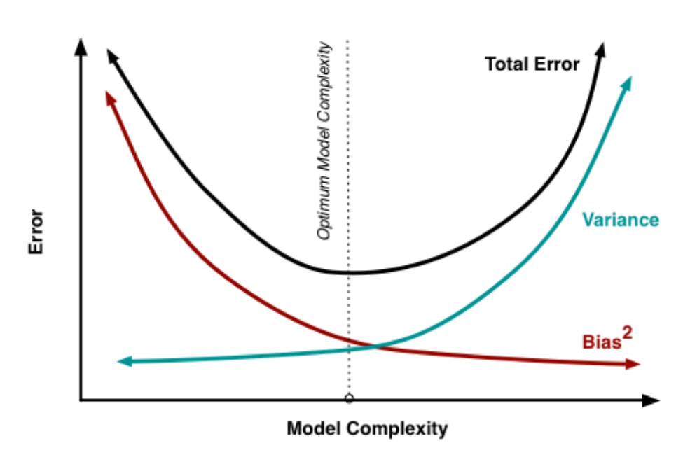
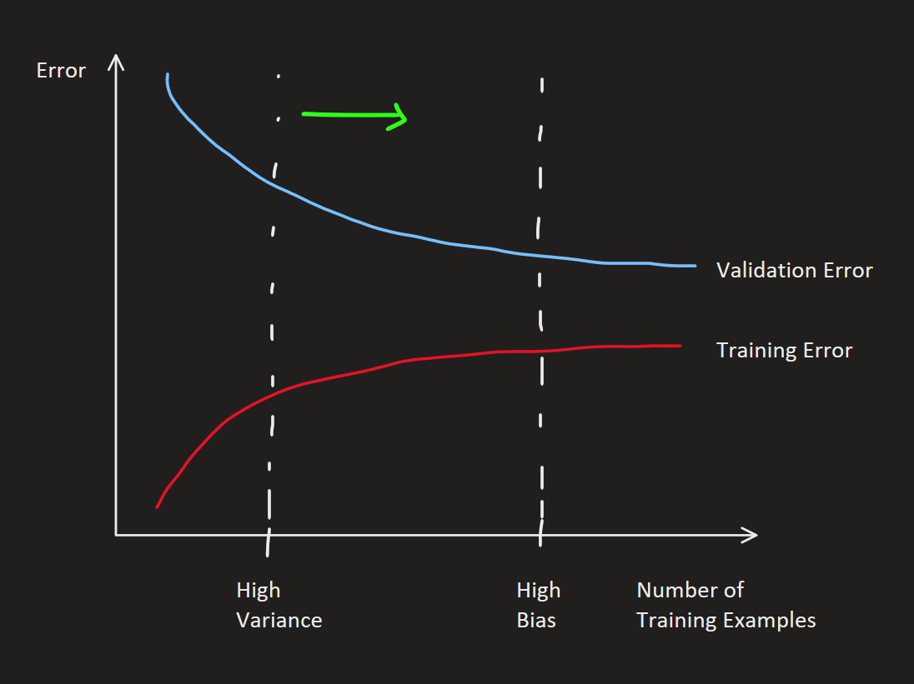
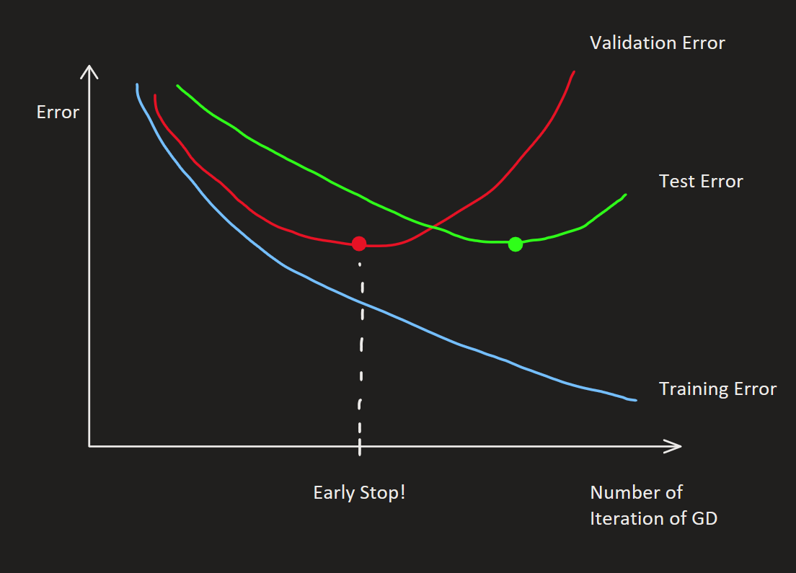
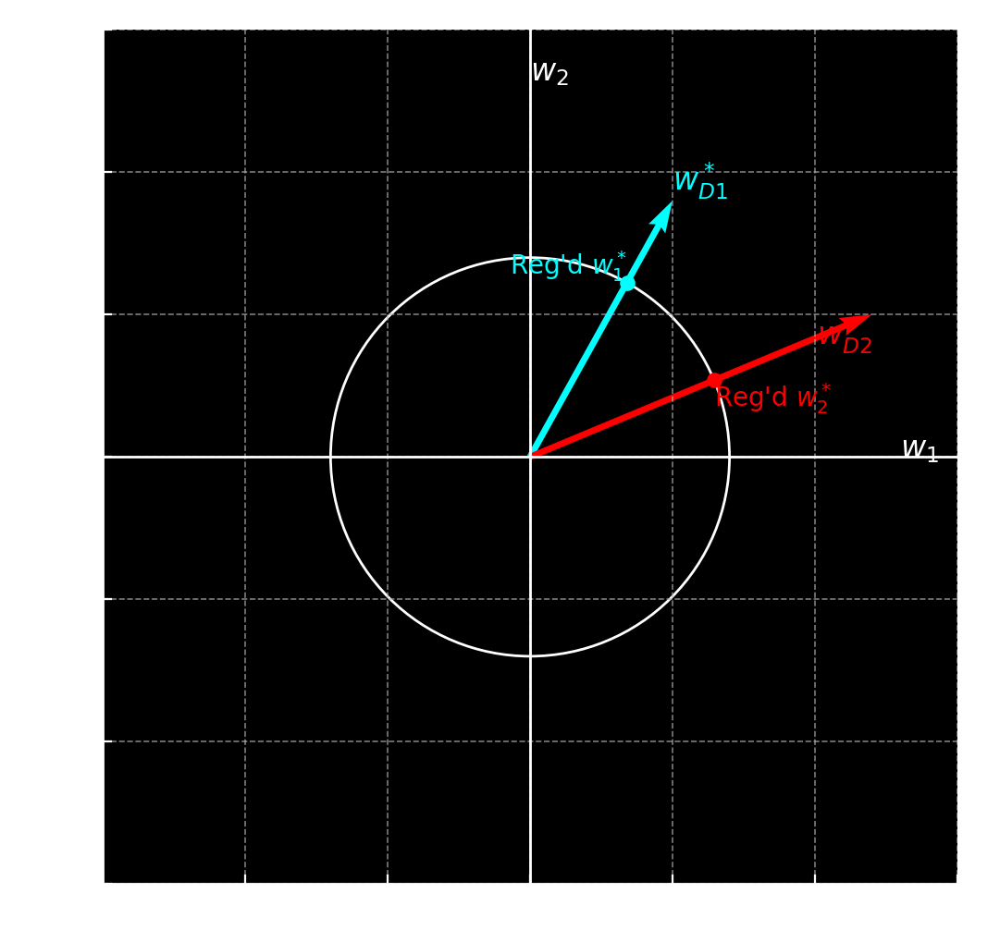

[Back to Main](../main.md)

# 17. Bias, Variance, and Model Performance
- Objective)
  - Understand the error of a machine learning algorithm in general.
  - Break down the generalization error into components that we can understand.
  - From these components we will derive rules of thumb that will let you decide whether to use a more or less complex model without having to actually train all of them.

 

### Concept) Bias-Variance Decomposition
- Conclusion)
  - $`\underbrace{\mathbb{E}_{\mathbf{x}, y, \mathcal{D}} \left[ (h_{\mathcal{D}} - y)^2 \right]}_{\text{error of ML model avg'd over test/training data}} = \underbrace{\mathbb{E}_{\mathbf{x}, \mathcal{D}} \left[ (h_{\mathcal{D}} -\overline{h}(\mathbf{x}))^2 \right]}_{\text{Variance}} + \underbrace{\mathbb{E}_{\mathbf{x}, y} \left[ (\overline{h}(\mathbf{x}) -\overline{y}(\mathbf{x}))^2 \right]}_{\text{Bias}^2} + \underbrace{\mathbb{E}_{\mathbf{x}, y} \left[ (\overline{y}(\mathbf{x}) - y)^2 \right]}_{\text{Noise}}`$
- Settings)
  - $`(\mathbf{x}, y)\sim P(\mathbf{x}, y)`$ : labeled instance $`(\mathbf{x}, y)`$ drawn from the distribution $`P`$.
    - where $`\mathbf{x}\in\mathbb{R}^d, y\in\mathbb{R}`$
  - $`\mathcal{D} = \{(\mathbf{x}_1, y_1), \cdots, (\mathbf{x}_n, y_n)\} \stackrel{\text{i.i.d.}}{\sim} P^n`$ : $`n`$ training examples i.i.d. drawn from $`P`$.
  - $`h_{\mathcal{D}} : \mathbb{R}^d \rightarrow \mathbb{R}`$ : a model trained with $`\mathcal{D}`$
    - where
      - $`h_{\mathcal{D}} \leftarrow \mathcal{A}(\mathcal{D})`$ with algorithm $`\mathcal{A}`$
    - And the target of $`h`$ is to predict as $`h_{\mathcal{D}}(\mathbf{x})\approx y`$
  - $`\displaystyle \overline{y}(\mathbf{x}) = \mathbb{E}_{y\vert \mathbf{x}}[y] = \int_y yp(y\vert \mathbf{x})dy`$ : the optimal regressor.
    - cf.) Recall that $`P(\mathbf{x}, y) = p(y\vert \mathbf{x}) p(\mathbf{x})`$
  - $`\mathbb{E}_{(\mathbf{x}, y)\sim P} \left[ (h_{\mathcal{D}}(\mathbf{x}) - y)^2 \right]`$ : the expected error of a regressor $`h_{\mathcal{D}}`$
    - Prop.)
      - This measures how well a particular model $`h_{\mathcal{D}}`$ does, **averaged over all possible data points** drawn from $`P(\mathbf{x}, y)`$.
      - It analyzes the **expected generalization error** of a specific model $`h_{\mathcal{D}}`$ returned from a machine learning algorithm $`\mathcal{A}`$.
  - $`\overline{h}(\mathbf{x}) = \mathbb{E}_{\mathcal{D}\sim P^n} [h_{\mathcal{D}}(\mathbf{x})]`$ : the expected regressor of an algorithm $`\mathcal{A}`$
    - Prop.)
      - The model that first trained on $`\mathcal{D}`$ (the every possible dataset), and then takes the weighted average of all of these model's predictions.
      - The goal is to analyze the properties of $`\mathcal{A}`$ directly.
      - This captures the “average behavior” of the entire machine learning algorithm $`\mathcal{A}`$
        - if we treat the dataset $`\mathcal{D}`$ as a random variable where we don’t know what dataset we’re going to be faced with in advance.
- Derivation)
  - Start with the average performance of an algorithm $`\mathcal{A}`$ on data drawn from a distribution $`P(\mathbf{x}, y)`$.
  - This performance can be measured with the error as below:
    - $`\mathbb{E}_{(\mathbf{x}, y)\sim P} \left[ \mathbb{E}_{\mathcal{D}\sim P^n} [(h_{\mathcal{D}} - y)^2] \right] \stackrel{\text{notation}}{=} \mathbb{E}_{\mathbf{x}, y, \mathcal{D}} \left[ (h_{\mathcal{D}} - y)^2 \right]`$
      - Meaning)
        - $`h_{\mathcal{D}}`$ is returned by a machine learning algorithm $`\mathcal{A}`$ trained with the dataset $`\mathcal{D}`$.
        - Then it is averaged over all possible datasets $`\mathbb{E}_{\mathcal{D}\sim P^n} [(h_{\mathcal{D}} - y)^2]`$.
        - And, again, averaged over all possible test points $`\mathbb{E}_{(\mathbf{x}, y)\sim P} [\cdot]`$.
  - Then the error can be decomposed as   
    $`\begin{aligned}
        \mathbb{E}_{\mathbf{x}, y, \mathcal{D}} \left[ (h_{\mathcal{D}} - y)^2 \right]
        &= \mathbb{E}_{\mathbf{x}, y, \mathcal{D}} \left[ (h_{\mathcal{D}} -\overline{h}(\mathbf{x}) + \overline{h}(\mathbf{x}) - y)^2 \right] \\
        &= \mathbb{E}_{\mathbf{x}, y, \mathcal{D}} \left[ (h_{\mathcal{D}} -\overline{h}(\mathbf{x}))^2 + (\overline{h}(\mathbf{x}) - y)^2 + 2(h_{\mathcal{D}} -\overline{h}(\mathbf{x}))(\overline{h}(\mathbf{x}) - y) \right] \\
    \end{aligned}`$
  - Consider that 
    - $`h_{\mathcal{D}} -\overline{h}(\mathbf{x})`$ is independent on $`y\Rightarrow`$ Drop $`y`$ from the expectation. 
    - $`\overline{h}(\mathbf{x}) - y`$  is independent on $`\mathcal{D}\Rightarrow`$ Drop $`\mathcal{D}`$ from the expectation.
    - $`h(\mathcal{D})`$ is the only element dependent on $`\mathcal{D}`$ in $`(h_{\mathcal{D}} -\overline{h}(\mathbf{x}))(\overline{h}(\mathbf{x}) - y)`$. 
  - Using this we can drop the whole term by...   
    $`\begin{aligned}
        \cdots         
        &= \underbrace{\mathbb{E}_{\mathbf{x}, \mathcal{D}} \left[ (h_{\mathcal{D}} -\overline{h}(\mathbf{x}))^2 \right]}_{\text{indep. on } y} + \underbrace{\mathbb{E}_{\mathbf{x}, y} \left[ (\overline{h}(\mathbf{x}) - y)^2 \right]}_{\text{indep. on }\mathcal{D}} + \mathbb{E}_{\mathbf{x}, y, \mathcal{D}} \left[ 2 (\underbrace{h_{\mathcal{D}}}_{\text{dep. on }\mathcal{D}} -\overline{h}(\mathbf{x}))(\overline{h}(\mathbf{x}) - y) \right]\\
        &= \mathbb{E}_{\mathbf{x}, \mathcal{D}} \left[ (h_{\mathcal{D}} -\overline{h}(\mathbf{x}))^2 \right] + \mathbb{E}_{\mathbf{x}, y} \left[ (\overline{h}(\mathbf{x}) - y)^2 \right] + \mathbb{E}_{\mathbf{x}, y} \left[ 2 ( \mathbb{E}_{\mathcal{D}}[h_{\mathcal{D}}] -\overline{h}(\mathbf{x}))(\overline{h}(\mathbf{x}) - y) \right]\\
        &= \mathbb{E}_{\mathbf{x}, \mathcal{D}} \left[ (h_{\mathcal{D}} -\overline{h}(\mathbf{x}))^2 \right] + \mathbb{E}_{\mathbf{x}, y} \left[ (\overline{h}(\mathbf{x}) - y)^2 \right] + \mathbb{E}_{\mathbf{x}, y} \left[ 2 (\underbrace{\overline{h}(\mathbf{x}) -\overline{h}(\mathbf{x})}_{=0})(\overline{h}(\mathbf{x}) - y) \right]\\
        &= \mathbb{E}_{\mathbf{x}, \mathcal{D}} \left[ (h_{\mathcal{D}} -\overline{h}(\mathbf{x}))^2 \right] + \mathbb{E}_{\mathbf{x}, y} \left[ (\overline{h}(\mathbf{x}) - y)^2 \right]\\
    \end{aligned}`$
  - Using the similar technique we can simplify more by...   
    $`\begin{aligned}
        \cdots
        &= \mathbb{E}_{\mathbf{x}, \mathcal{D}} \left[ (h_{\mathcal{D}} -\overline{h}(\mathbf{x}))^2 \right] + \mathbb{E}_{\mathbf{x}, y} \left[ (\overline{h}(\mathbf{x}) -\overline{y}(\mathbf{x}) +\overline{y}(\mathbf{x}) - y)^2 \right]\\
        &= \mathbb{E}_{\mathbf{x}, \mathcal{D}} \left[ (h_{\mathcal{D}} -\overline{h}(\mathbf{x}))^2 \right] + \mathbb{E}_{\mathbf{x}, y} \left[ (\overline{h}(\mathbf{x}) -\overline{y}(\mathbf{x}))^2 + (\overline{y}(\mathbf{x}) - y)^2 + 2(\overline{h}(\mathbf{x}) -\overline{y}(\mathbf{x}))(\overline{y}(\mathbf{x}) - y) \right]\\
        &= \mathbb{E}_{\mathbf{x}, \mathcal{D}} \left[ (h_{\mathcal{D}} -\overline{h}(\mathbf{x}))^2 \right] + \mathbb{E}_{\mathbf{x}, y} \left[ (\overline{h}(\mathbf{x}) -\overline{y}(\mathbf{x}))^2 \right] + \mathbb{E}_{\mathbf{x}, y} \left[ (\overline{y}(\mathbf{x}) - y)^2 \right] + \mathbb{E}_{\mathbf{x}, y} \left[2(\overline{h}(\mathbf{x}) -\overline{y}(\mathbf{x}))(\overline{y}(\mathbf{x}) - y)\right]\\
    \end{aligned}`$
  - In the final term, the label's noise can be canceled out by taking the expectation on $`p(y\vert \mathbf{x})`$ as    
    $`\begin{aligned}
        \cdots
        &= \mathbb{E}_{\mathbf{x}, \mathcal{D}} \left[ (h_{\mathcal{D}} -\overline{h}(\mathbf{x}))^2 \right] + \mathbb{E}_{\mathbf{x}, y} \left[ (\overline{h}(\mathbf{x}) -\overline{y}(\mathbf{x}))^2 \right] + \mathbb{E}_{\mathbf{x}, y} \left[ (\overline{y}(\mathbf{x}) - y)^2 \right] + \mathbb{E}_{\mathbf{x}} \left[2(\overline{h}(\mathbf{x}) -\overline{y}(\mathbf{x}))(\overline{y}(\mathbf{x}) - \underbrace{\mathbb{E}_{y\vert \mathbf{x}}[y]}_{\text{dep. on }y})\right]\\
        &= \mathbb{E}_{\mathbf{x}, \mathcal{D}} \left[ (h_{\mathcal{D}} -\overline{h}(\mathbf{x}))^2 \right] + \mathbb{E}_{\mathbf{x}, y} \left[ (\overline{h}(\mathbf{x}) -\overline{y}(\mathbf{x}))^2 \right] + \mathbb{E}_{\mathbf{x}, y} \left[ (\overline{y}(\mathbf{x}) - y)^2 \right] + \mathbb{E}_{\mathbf{x}} \left[2(\overline{h}(\mathbf{x}) -\overline{y}(\mathbf{x}))(\underbrace{\overline{y}(\mathbf{x}) - \overline{y}(\mathbf{x})}_{=0})\right]\\
        &= \underbrace{\mathbb{E}_{\mathbf{x}, \mathcal{D}} \left[ (h_{\mathcal{D}} -\overline{h}(\mathbf{x}))^2 \right]}_{\text{Variance}} + \underbrace{\mathbb{E}_{\mathbf{x}, y} \left[ (\overline{h}(\mathbf{x}) -\overline{y}(\mathbf{x}))^2 \right]}_{\text{Bias}^2} + \underbrace{\mathbb{E}_{\mathbf{x}, y} \left[ (\overline{y}(\mathbf{x}) - y)^2 \right]}_{\text{Noise}}\\
    \end{aligned}`$

### Concept) Variance
- Desc.)
  - It captures how much a model $`h_{\mathcal{D}}`$ can vary if it’s trained on different datasets.
  - Thus, an algorithm $`\mathcal{A}`$ with...
    - **low variance** is one that is likely to return a model **similar** to $`\overline{h}`$ **regardless of the specific dataset** $`\mathcal{D}`$.
    - **high variance** is one that is likely to return a model very specific to the dataset $`\mathcal{D}`$.
  - (Increasing variance) = (Increasing model complexity)
    - Why?)
      - A more complex model may exactly fit a specific dataset $`\mathcal{D}`$, the model will look very different from dataset to dataset.
- In the decomposition : $`\mathbb{E}_{\mathbf{x}, \mathcal{D}} \left[ (h_{\mathcal{D}} -\overline{h}(\mathbf{x}))^2 \right]`$
  - i.e.) the difference between
    - $`h_{\mathcal{D}}`$ : the output of the algorithm $`\mathcal{A}`$ trained on a single training dataset $`\mathcal{D}`$
    - $`\overline{h}(\mathbf{x})`$ : the weighted average of $`h_{\mathcal{D}}`$ on all possible datasets $`\mathcal{D}\sim P^n`$

 

### Concept) Bias
- Desc.)
  - It measures the **inherent** error in your model even if you had access to the average model $`\overline{h}`$ averaged over all possible datasets.
  - Thus, in the setting of...
    - **high bias**, even with an infinite amount of data and access to the expected regressor $`\overline{h}`$ averaged over all possible datasets, $`\overline{h}(\mathbf{x}) \ne \overline{y}(\mathbf{x})`$.
    - **low bias**, if you have enough data that you might achieve a model near $`\overline{h}`$, then $`\overline{h}(\mathbf{x}) \approx \overline{y}(\mathbf{x})`$.
  - (Increasing bias) = (Decreasing model complexity)
    - Why?)
      - Even with an infinite amount of data, it may be hard to achieve good generalization error with a linear model.
- In the decomposition : $`\mathbb{E}_{\mathbf{x}, y} \left[ (\overline{h}(\mathbf{x}) -\overline{y}(\mathbf{x}))^2 \right]`$
  - i.e.) the difference between
    - $`\overline{h}(\mathbf{x})`$ : the weighted average of $`h_{\mathcal{D}}`$ on all possible datasets $`\mathcal{D}\sim P^n`$
    - $`\overline{y}(\mathbf{x})`$ : the optimal regression model

 

### Concept) Noise
- Desc.)
  - It is the error you would be left with even if you had access to the true, optimal regressor $`\overline{y}(\mathbf{x})`$.
  - We can reduce noise by adding more features.
  - However, the noise is notably independent of $`\mathcal{A}`$.
    - Why?)
      - Even if you choose $`\mathcal{A}`$ s.t. $`\overline{h}(\mathbf{x}) \approx \overline{y}(\mathbf{x})`$, noise will still occur.
- In the decomposition : $`\mathbb{E}_{\mathbf{x}, y} \left[ (\overline{y}(\mathbf{x}) - y)^2 \right]`$
  - i.e.) the difference between
    - $`\overline{y}(\mathbf{x})`$ : the prediction made by the optimal regression model
    - $`y`$ : the actual label with noise.

 

### Analysis) Model with Various Bias and Variance

|||
|:-:|:-:|
|||

 

### Tech.) Partitioning the Dataset
- Partitions)
  - Training Set
  - Validation Set
  - Test Set

#### Tech.) K-fold Cross Validation
- How?)
  - Shuffle the data.
  - Partition the data into K-fold.
  - One as the validation set and rest (K-1) folds as training dataset.
  - Repeat this K times.
- Extreme Case)
  - Leave out Cross Validation
    - Use one data point as the validation set.
    - Repeat Cross validation by the number of dataset.

 

### Tech.) Diagnosing High Variance (Overfit) and Reducing It
- Symptom)
  - $`(\text{Validation Error}) \gg (\text{Training Error})`$
- Meaning)
  - The performance of the model differs a lot by the dataset.
  - Overfit!
- Solution)
  - Add more training data, making the model less sensitive to $`\mathcal{D}`$.
    |e.g.||
    |:-|:-|
    |- e.g.) If there is only one data point, it will definitely overfit. - More data means more generalization.|  - Add more training data to remedy overfit.| 
  - Reduce model complexity. 
  - Bagging
  - Early Stopping
    ||
    |:-|
    || 
  - Feature Selection
    - Select only the features with high explainability.
    - e.g.) The features that are frequently chosen that the top of the [random forest](14.md#14-random-forest).
      - i.e.) low entropy!
  - Increase regularization
    |e.g.|Graphical Desc.|
    |:-|:-|
    |- [L1](06.md#concept-l1-regularization), [L2](06.md#concept-l2-regularization) for linear models   - $`\sigma`$ for [RBF Kernel](09.md#eg-the-radial-basis-function-rbf-kernel-gaussian-kernel) - Number of hidden units and layers for [neural networks](12.md#12-neural-networks) - Limit depth for [decision trees](13.md#13-decision-trees).|  - Regularization(Circle) prevents the overfit to certain dataset.|   

 

### Tech.) Diagnosing High Bias (Underfit) and Reducing It
- Symptom)
  - $`(\text{Validation Error}) \approx (\text{Training Error})`$ and both are high.
- Meaning)
  - Error is dominated by the discrepancy between the average regressor $`\left(\overline{h}(\mathbf{x})\right)`$ and the optimal regressor $`\left(\overline{y}(\mathbf{x})\right)`$.
  - This is not dominated by the variation across different dataset.
    - Thus, the level of error will be high on both the training and the test set.
  - Underfit!
- Solution)
  - Add more features if possible, making any class of model potentially more powerful.
  - Increase the model complexity.
  - Decrease regularization.
  - Boosting

 

### Tech.) Combatting Noise
- Symptom)
  - Tried hard with overfit and underfit but still no improvement on the performance of the model.
    - If this is the matter of noise, this issue is not dependent on model.
      - Recall that noise is $`(\overline{y}(\mathbf{x}) - y)^2`$, and the regressor was $`h`$.
- Solution)
  - Add more feature.
  - Decrease the noise in data by getting a more precise observation method on the data.

  

[Back to Main](../main.md)