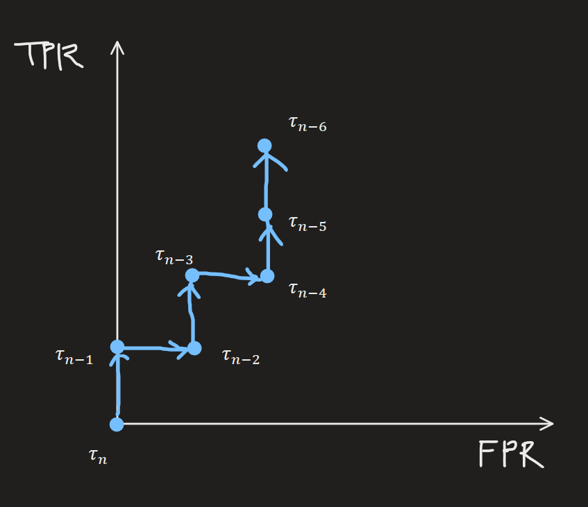
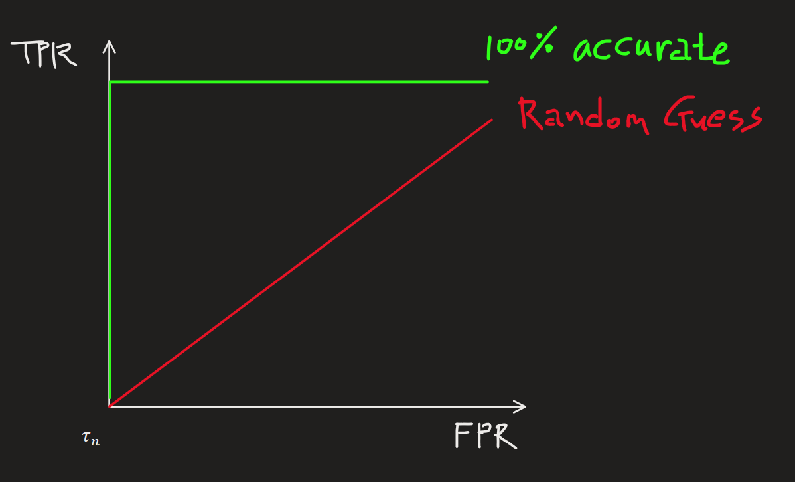
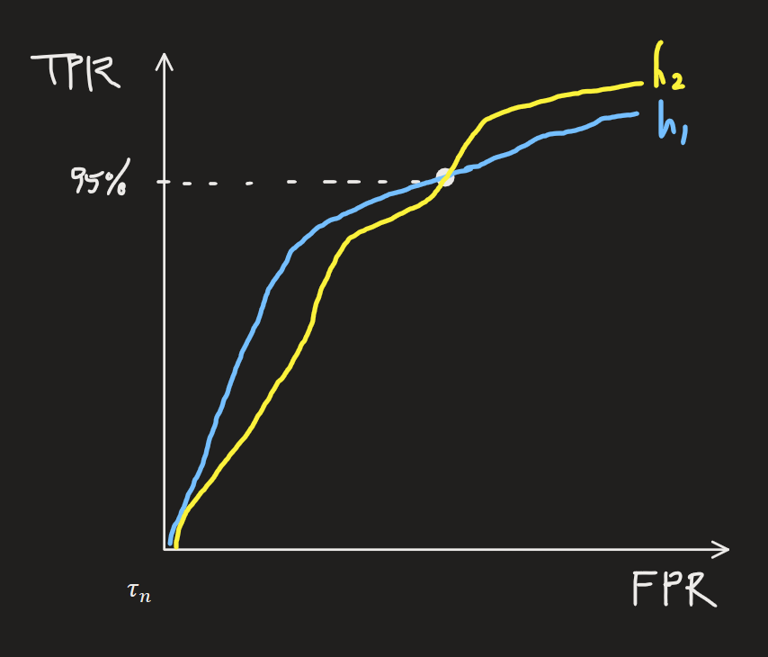

[Back to Main](../main.md)

# 19. Performance Measures
### Settings)
- Binary Label
  - Training Examples : $`S = \{(x_1, y_1), \cdots, (x_m, y_m)\}`$
    - where
      - $`x_i`$ : the instance
      - $`y_i \in \{\pm1\}`$ : the binary labels.
  - Learning Targets)
    - [Classification Model](#target-model-binary-classification)
    - [Class Probability Estimation (CPE) model](#target-model-binary-class-probability-estimation-cpe)
    - [Ranking or scoring model](#target-model-binary-rankingscoring)
  - Test Samples)
    - $`\{(x_1', y_1'), \cdots, (x_n', y_n')\}`$

 

## Target Model) Binary Classification
#### Setting)
- Model)
  - $`h:\mathcal{X}\rightarrow \{\pm1\}`$

 

### Concept) 0-1 Loss
- Rule)
  - Assign penalty of 1 if the predicted label $`\hat{y}`$ differs from the true label $`y`$.
    ||$`\hat{y} = -1`$|$`\hat{y} = +1`$|
    |:-:|:-:|:-:|
    |$`y = -1`$|0|1|
    |$`y = +1`$|1|0|
- Measure)   
  - Binary Classification Problem   
    $`\displaystyle \text{er}_{\text{test}}^{0-1}[h] = \frac{1}{n}\sum_{i=1}^n \mathbf{1}(h(x_i') \ne y_i')`$
  - **Class Probability Estimation** (CPE)   
    - The problem setting)   
      $`h(x) = \text{sign}\left(\hat{\eta}(x) - 0.5\right) = \begin{cases}
        +1 & \text{if }\hat{\eta}(x) \gt 0.5 \\ -1 & \text{otherwise}
      \end{cases}`$
- Usages)
  - Naive Bayesian classifier
  - Logistic Regression
  - SVM
  - Neural Networks
  - Nearest Neighbors
  - Decision Trees
  - Boosting Algorithm

  

### Concept) Cost-Sensitive Loss(Asymmetric Classification Cost)
- Rule)
  - Assign different penalty for false positive and the false negative.
  - Put $`c\in[0,1]`$ s.t.
    ||$`\hat{y} = -1`$|$`\hat{y} = +1`$|
    |:-:|:-:|:-:|
    |$`y = -1`$|0|$`c`$|
    |$`y = +1`$|$`1-c`$|0|
- Measures)   
  - Binary Classification Problem   
    $`\displaystyle \text{er}_{\text{test}}^{c}[h] = \frac{1}{n}\sum_{i=1}^n \left( c\cdot \underbrace{\mathbf{1}(h(x_i')=+1 \wedge y_i'=-1)}_{\text{False Positive}} + (1-c)\cdot \underbrace{\mathbf{1}(h(x_i')=-1 \wedge y_i'=+1)}_{\text{False Negative}} \right)`$
  - [Class Probability Estimation (CPE)](#binary-class-probability-estimation)   
    - The problem setting)   
      $`h(x) = \text{sign}\left(\hat{\eta}(x) - c\right) = \begin{cases}
        +1 & \text{if }\hat{\eta}(x) \gt c \\ -1 & \text{otherwise}
      \end{cases}`$
    - How to train in practice)
      - Split the training sample into two parts.
      - Learn a CPE model $`\hat{\eta}`$ from one part.
      - Use the second part to find a threshold $`c`$ that gives the best [Am/GM](#concept-arithmetic-mean-am--geometric-mean-gm-of-tpr-and-tnr), or [F1](#concept-f1-measure) performance.
  - Weighted Surrogate Loss Minimization
    - Recall that [logistic regression](07.md#7-logistic-regression) and [SVM](08.md#8-support-vector-machine-svm) minimized surrogate loss over the training examples, which were [logistic loss](07.md#model-logistic-regression) and [hinge loss](08.md#concept-hinge-loss) respectively.
    - In these cases, replace the usual loss minimization problem of   
      $`\displaystyle\min_f \frac{1}{m}\sum_{i=1}^m \ell(y_i, f(x_i)) `$ with     
      $`\displaystyle\min_f \frac{1}{m}\sum_{i=1}^m\left( c\cdot \ell(y_i, f(x_i)) \cdot \mathbf{1}(y_i = -1) + (1-c) \ell(y_i, f(x_i))\cdot \mathbf{1}(y_i = +1) \right)`$
    - This has the effect of weighing the losses on positive and negative examples differently during training.
    - Finally, after obtaining $`f:\mathcal{X}\rightarrow\mathbb{R}`$ through the above minimization, the final classifier is obtained by thresholding $`f`$ at 0 as usual: $`h(x) = \text{sign}(f(x))`$.

  

### Concept) Confusion Matrix of a Binary Classifier (Contingency Table)
- The Table)
  ||$`h(x) = -1`$|$`h(x) = +1`$|
  |:-:|:-:|:-:|
  |$`y = -1`$|True Negative(TN)|False Positive (TP)|
  |$`y = +1`$|False Negative (FN)|True Positive (FP)|

  

### Concept) Complex Performance Measures
- Why needed?)
  - Accuracy is not always the perfect performance measure.
    - Consider the case of a rare disease.
    - In this case, the false positive would be predicting a person without the disease to have one.
    - On the other hand, the false negative would be predicting a person with the disease to not have one.
    - It is obvious that the **false negative** way more costly than the **false positive**.

#### Concept) True Positive Rate (TPR)
- Def.)
  - $`\displaystyle \text{TPR}[h] = \frac{\text{TP}}{\text{TP} + \textbf{FN}} = \frac{\sum_{i=1}^n \mathbb{1}(y_i'=+1, h(x_i')=+1)}{\sum_{i=1}^n \mathbb{1}(y_i'=+1)}`$
- Similar Term)
  - Sensitivity
    - Why?) If $`h`$ has high TPR, it means $`h`$ is very sensitive to $`y=+1`$.

 

#### Concept) True Negative Rate (TNR)
- Def.)
  - $`\displaystyle \text{TNR}[h] = \frac{\text{TN}}{\text{TN} + \textbf{FP}} = \frac{\sum_{i=1}^n \mathbb{1}(y_i'=-1, h(x_i')=-1)}{\sum_{i=1}^n \mathbb{1}(y_i'=-1)}`$
- Similar Term)
  - Specificity
    - Why?) High TNR means $`h`$ detects the specific situation of $`y=-1`$ very well.

 

#### Concept) Arithmetic Mean (AM) / Geometric Mean (GM) of TPR and TNR
- Arithmetic Mean (AM) of [TPR](#concept-true-positive-rate-tpr) and [TNR](#concept-true-negative-rate-tnr)
  - Def.) $`\displaystyle\text{AM}[h] = \frac{1}{2}\left( \text{TPR}[h] + \text{TNR}[h] \right)`$
- Geometric Mean (GM) of [TPR](#concept-true-positive-rate-tpr) and [TNR](#concept-true-negative-rate-tnr)
  - Def.) $`\displaystyle\text{AM}[h] = \sqrt{\text{TPR}[h] \cdot \text{TNR}[h]}`$
- Props.)
  - Higher value of both AM and GM means better performace.

 

#### Concept) Recall and Precision
- Context)
  - Consider a data retrieval or detection problem.
  - Here, the goal is to successfully retrieve or detect members of one class.
- Def.)
  - Recall
    - $`\text{Recall}[h] = \text{TPR}[h]`$
      - Identical to [TPR](#concept-true-positive-rate-tpr)
  - Precision
    - $`\displaystyle\text{Precision}[h] = \frac{\sum_{i=1}^n \mathbf{1}(y_i'=+1, h(x_i')=+1)}{\sum_{i=1}^n \mathbf{1}(h(x_i')=+1)}`$

 

#### Concept) F1-Measure
- Def.)
  - $`\displaystyle F_1 = \frac{2\cdot \text{Recall}[h] \cdot \text{Precision}[h]}{\text{Recall}[h] + \text{Precision}[h]}`$
    - i.e.) the harmonic mean of recall and precision

 

  

## Target Model) Binary Class Probability Estimation (CPE)
#### Setting)
- Model)
  - $`\hat{\eta}:\mathcal{X}\rightarrow [0,1]`$
      - To predict the probability of a new instance having label $`+1`$.

 

### Concept) Logarithmic Loss (Cross-Entropy Loss)
- Def.)
  - For
    - $`y\in\{\pm 1\}`$ : the true label
    - $`p\in[0,1]`$ : the predicted probability   
  - the log loss is   
    $`\begin{aligned}
      \ell_{\log}(y, p) &= -\mathbf{1}(y=+1) \cdot \ln(p) - \mathbf{1}(y=-1) \cdot \ln(1-p) \\
      &= \begin{cases} -\ln(p) & \text{if } y=+1 \\ -\ln(1-p) & \text{if } y=-1 \\  \end{cases}
    \end{aligned}`$
- Evaluating the performance)
  - Given 
    - $`\{(x_1', y_1'), \cdots, (x_n', y_n')\}`$ : the test sample
    - $`\hat{\eta}(x)`$ : the target CPE model
  - the error can be calculated by   
    $`\displaystyle \text{er}_{\text{text}}^{\log}\left[\hat{\eta}\right] = \frac{1}{n} \sum_{i=1}^n \left( -\mathbf{1}(y_i' = +1) \cdot \ln(\hat{\eta}(x_i')) -\mathbf{1}(y_i' = -1) \cdot \ln(1-\hat{\eta}(x_i')) \right)`$
- Usage)
  - Naive Bayes classifier
  - Logistic Regression

  

## Target Model) Binary Ranking/Scoring
#### Settings)
- Model) 
  - $`f:\mathcal{X}\rightarrow\mathbb{R}`$.
     - This assigns higher scores to **positive instance** than to **negative** ones.

 

### Concept) Receiver Operating Characteristic (ROC) Curve
- Settings)
  - Consider the [binary classification](#target-model-binary-classification) model with the threshold $`t`$.
  - One can achieve a family of classifiers $`\{h_t\}_t`$ obtained by applying different thresholds $`t`$ to scoring the model $`f`$
    - where $`f:\mathcal{X}\rightarrow\mathbb{R}`$ s.t. $`h_t(x) = \text{sign}(f(x) - t)`$
  - Here, by varying the threshold $`t`$, one can achieve different tradeoffs between [TPR](#concept-true-positive-rate-tpr) and [TNR](#concept-true-negative-rate-tnr).
- Def.)
  - Receiver Operating Characteristic (ROC) Curve plots the [TPR](#concept-true-positive-rate-tpr) and the false positive rate (FPR)
    - where   
      $`\begin{aligned}
        \text{FPR} 
        &= \frac{\text{FP}}{\text{FP}+\text{TN}} = \frac{\sum_{i=1}^n \mathbb{1}(y_i'=-1, h(x_i')=+1)}{\sum_{i=1}^n \mathbb{1}(y_i'=-1)} \\
        &= 1-\frac{\sum_{i=1}^n \mathbb{1}(y_i'=-1, h(x_i')=-1)}{\sum_{i=1}^n \mathbb{1}(y_i'=-1)} \\
        &= 1-\text{TNR} \\
      \end{aligned}`$
- How to Draw ROC)
  - Suppose we have
    - $`f(x)`$ : the model we want to measure the performance
    - $`\{(x_1', y_1'), \cdots, (x_n', y_n')\}`$ : the test data
    - $`\tau_0, \tau_1, \cdots, \tau_T`$ : the $`T`$ thresholds
    - $`h_{\tau_j}(x_i) = \text{sign}(f(x_i)- \tau_j)`$
  - Sort the array of $`f(x_i)`$s.
  - We will deploy the threshold $`\tau_t`$ between $`f(x_i)`$s and plot the [TPR](#concept-true-positive-rate-tpr) and the (FPR) for each $`\tau_t`$.
    ||
    |:-:|
    ||
  - Then for each $`h_{\tau_t}`$ with the threshold $`\tau_t`$ we will predict
    - $`-1`$ if $`f(x_i)`$ is on the LHS of $`\tau_t \quad (\because f(x_i) \lt \tau_t \Rightarrow \text{sign}(f(x_i)- \tau_t) =-1)`$
    - $`+1`$ if $`f(x_i)`$ is on the RHS of $`\tau_t \quad (\because f(x_i) \gt \tau_t \Rightarrow \text{sign}(f(x_i)- \tau_t) =+1)`$
      - e.g.)
        |Threshold|$h$ predicts $`-1`$|$h$ predicts $`+1`$|
        |:-:|:-:|:-:|
        |$`\tau_0`$|-|$`x_1', \cdots, x_n'`$|
        |$`\tau_1`$|$`x_1'`$|$`x_2', \cdots, x_n'`$|
        |$`\tau_2`$|$`x_1', x_2'`$|$`x_3', \cdots, x_n'`$|
        |$`\vdots`$|$`\vdots`$|$`\vdots`$|
        |$`\tau_{n-2}`$|$`x_1', \cdots, x_{n-2}'`$|$`x_{n-1}', x_n'`$|
        |$`\tau_{n-1}`$|$`x_1', \cdots, x_{n-1}'`$|$`x_n'`$|
        |$`\tau_{n}`$|$`x_1', \cdots, x_{n}'`$|-|
  - Now compare the prediction with the actual label : $`h_{\tau_j}(x_i') \text{ vs } y_i`$.
  - Plot the TPR and FPR of each $`\tau_j`$.
    - We may start from $`\tau_n`$ because it predicts no $`+1`$, i.e. $`\text{TPR}=\text{FPR} = 0`$.
      - Thus, $`\tau_n`$ will be at the bottom left of the graph.
    - For each $`\tau_j`$ and its new comparison $`h_{\tau_{j}}(x_{j+1}')`$ vs $`y_{j+1}'`$
      - Increase $`\text{TPR}`$ if $`h_{\tau_{j}}(x_{j+1}') = y_{j+1}'`$ : the true positive
      - Increase $`\text{FPR}`$ if $`h_{\tau_{j}}(x_{j+1}') \ne y_{j+1}'`$ : the false positive
        ||
        |:-:|
        ||
- Analysis)
  |Benchmarks|Performance Measure Depending on the context|
  |:-|:-|
  |||
  |- Greenline is the 100% accurate model (upper bound)  - Redline is a random guess (lower bound)|- Until the 95% TPR cross over point, $`h_1`$ shows low FPR for the same TPR compared to $`h_2`$. This means that $`h_1`$ is generally better off making less False Positive predictions. If the cost of False Positive is expensive $`h_1`$ can be a better model.   - However, after the 95% cross over point, $`h_2`$ captures TPR better than $`h_1`$. In case that the False Positive is more costly, such as rare disease detection, $`h_2`$ could be a better model.|

 

#### Concept) Area Under ROC (AUROC)

 

### Concept) Precision-Recall Curves

  

[Back to Main](../main.md)