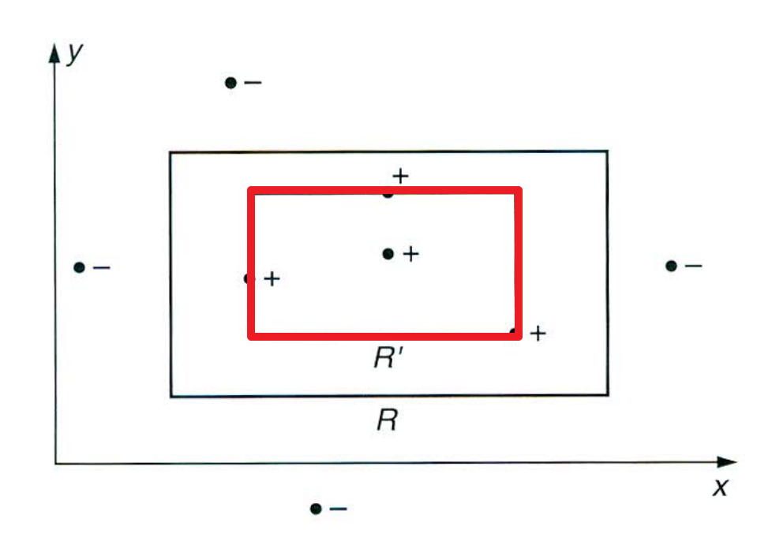
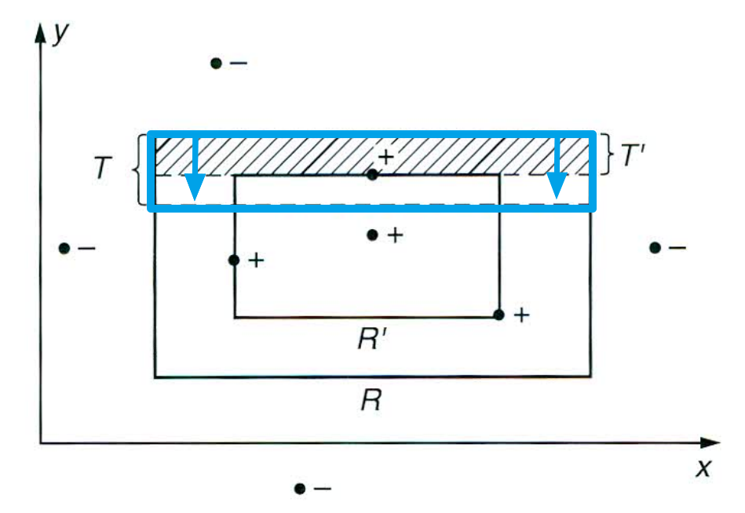

[Back to Main](../../main.md)

# 1.1 A Rectangle Learning Game
#### Objective)
- Learn an unknown axis-aligned rectangle $`R`$.
  - $`R \subset \mathbb{R}^2`$
  - $`R`$'s sides are parallel with the coordinate axes.

#### Learning Process)
  - The player receives information about $`R`$ only through the following process:
    - A random point $`p`$ is chosen in the plane according to some fixed probability distribution $`\mathcal{D}`$.
    - $`p`$ is given with a label indicating whether $`p`$ is contained in $`R`$ or not.
  - The player picks a hypothesis rectangle $`R'`$ with minimum examples.
    - How to measure the performance of $`R'`$)
      - Calculate the error of $`R'`$.
        - i.e.) the probability that a randomly chosen point from $`\mathcal{D}`$ falls in the region $`R\Delta R \equiv (R-R')\cup(R'-R)'`$.

#### Efficient Strategy for the Player)
- Request a "sufficiently large" number $`m`$ of examples.
- Then, choose the hypothesis $`R'`$ which gives the tightest fit to the positive examples.
  - i.e.) the one with the smallest area that includes all of the positive examples and none of the negative examples.
    - If no positive example is drawn, $`R'=\emptyset`$.
  - e.g.)
    ||
    |:-:|
    ||

### Analysis) Setting Bounds
- Assertion)
  - For 
    - any target rectangle $`R`$ 
    - any distribution $`\mathcal{D}`$
    - any small value $`\epsilon \gt 0`$
    - any small value $`\delta \le \frac{1}{2}`$
  - fo a suitably chosen value of the sample size $`m`$,
    - we can assert
      - with the probability of $`1-\delta`$
      - the tightest-fit rectangle has error at most $`\epsilon`$ w.r.t. $`R`$ and $`\mathcal{D}`$
- Derivation)
  - Consider that $`\forall R' \subseteq R`$.
  - Then $`R\Delta R' = R-R'`$, which is the error region.
  - Since $`R`$ and $`R'`$ are the rectangles, we can express $`R-R'`$ as the union of four rectangular strips.
  - Put $`T'`$ the top most one.
    - cf.) Note that there are some overlaps between the strips on each corner.
  - Suppose, the weight under $`\mathcal{D}`$ of each strip is at most $`\frac{\epsilon}{4}`$.
    - i.e.) the probability w.r.t. $`D`$ of falling in a strip.
  - Then, we can conclude that the error of $`R'`$ is at most $`4\times\frac{\epsilon}{4} = \epsilon`$.
  - Define $`T \subseteq R`$ to be a rectangular strip, which encloses exactly weight $`\frac{\epsilon}{4}`$ under $`\mathcal{D}`$.
    ||
    |:-:|
    ||
    - i.e.) $`T'`$ sweep the top edge of $`R`$ downward until we swept out weight $`\frac{\epsilon}{4}`$
    - cf.) $`T'`$ can include $`T`$
      - iff. $`\nexists p\in T`$ appears in the sample $`S`$.
        - Why?) If a point is in 

[Back to Main](../../main.md)