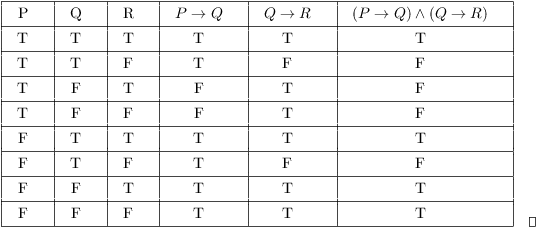

- [Back to Main](../main.md)

# 11. Basic Logic
### Concept) Proposition
- Def.)
  - A proposition is a statement that is either true or false.
    - e.g.) Philadelphia is the capital of Pennsylvania.
    - cf.) Things that do not have a true-false answer are NOT propositions.
        - e.g.) What is today’s weather going to be like
- Prop.)
  - A statement with no [free variable](12.md#bou) is a proposition.

 

### Concept) Boolean Operators
|Operator|Symbol|
|:-:|:-:|
|Conjunction|$`\wedge`$|
|Disjunction|$`\vee`$|
|Exclusive (XOR)|$`\oplus`$|
|NOT|$`\neg`$|

 

#### E.g.) English Expression vs Boolean Expression
- Consider an English expression s.t.
  - "Dinner is eaten in our house at 7pm or at 8pm"
- We can break this down into
  $`\begin{cases}
    p & \textrm{: I eat dinner at 7 pm.} \\
    q & \textrm{: I eat dinner at 8 pm.} \\
  \end{cases}`$.
- Then the expression "or" implies $`p \vee q`$.
- However, $`p, q`$ are mutually exclusive.
- Thus, $`p \oplus q`$ is the precise boolean expression for the original expression.

 

### Concept) The Order of Operations for Boolean Algebra
1. $`\neg`$
2. $`\wedge`$
3. $`\vee`$

 

### Concept) Truth Table

 

### Concept) De-Morgan
- $`\neg(p \vee q) = \neg p \wedge \neg q`$
- $`\neg(p \wedge q) = \neg p \vee \neg q`$

 

### Concept) Conditional Statements
- Terms.)
  - For $`p \rightarrow q`$
    - $`p`$ is called the hypothesis.
    - $`q`$ is called the conclusion.
- Truth Table
  |Hypothesis $`p`$|Conclusion $`q`$|Conditional Statement $`p \rightarrow q`$|
  |:-:|:-:|:-:|
  |T|T|T|
  |T|F|F|
  |F|T|T|
  |F|F|T|
- Equivalent Expression)
  - $`p \rightarrow q \Leftrightarrow \neg p \vee q`$
    - Check the truth table for the pf.
- Related Statements)
  - Contrapositive : $`\neg q \rightarrow \neg p`$
  - Converse : $`q \rightarrow p`$
  - Inverse : $`\neg p \rightarrow \neg q`$

 

### Concept) Predicate
- Def.)
  - A logical statement that is a function of variable(s).
- Props.)
  - A predicate always has an underlying domain associated with it. 
  - Variables are only allowed to take values from within the domain.
- Multiple Variable Cases)
  - e.g.)
    - $`B(x,y)`$ : $`x`$ beats $`y`$ in a tournament
    - $`D(x,y)`$ : $`x`$ drinks $`y`$ 
      - where 
        - $`x`$ is from the set of professors
        - $`y`$ is from the set of beers

 

### Concept) Universal Quantifier
- Notation) $`\forall`$
- Def.)
  - A predicate that is true regardless of the value taken from the domain can be represented with $`\forall`$.
    - e.g.) $`\displaystyle \forall x \in \mathbb{R}^+, \frac{1}{1+x} \lt 1`$
    - cf.)
      - How to prove that a universally quantified statement is true?
        - Show that it is true regardless of the value of any variables that are present in the statememt.
          - e.g.)   
            $`\begin{aligned}
              & \textrm{Consider that } x \in \mathbb{R}^+ \Rightarrow x+1 \in \mathbb{R}^+. \\
              & \textrm{Thus, } \frac{x}{x+1} \in \mathbb{R}^+. \\
              & \therefore \frac{1}{1+x} = 1 - \frac{x}{1+x} \lt 1, \forall x \in \mathbb{R}^+. \\
            \end{aligned}`$
      - How to prove that a universally quantified statement is false?
        - Show one counter example.

### Concept) Existential Quantifier
- Notation) $`\exists`$
- Def.)
  - If there is at least one value in the domain that causes the predicate to evaluate to true, that is expressed using an existential quantifier $`\exists`$.
    - cf.)
      - How to prove that a existentially quantified statement is true?
        - Show one single value that is true.
      - How to prove that a existentially quantified statement is false?
        - Prove that no value in the domain will make the statement true.
          - e.g.)
            - $`\exists x \in \mathbb{R}^+, x+1 \lt x`$ is false.
              - pf.) $`x+1 \lt x \Rightarrow 1 \lt 0 \cdots \otimes`$
- e.g.)
  - Writing English statement with quantifiers.
    - "Every CIT592 student has taken the midterm."
      - Put $`\begin{cases}
          P(x) & \textrm{: } x \textrm{ is a student in 592.} \\
          Q(x) & \textrm{: } x \textrm{ has taken the midterm.} \\
      \end{cases}`$
      - Then, $`\forall x P(x) \rightarrow Q(x)`$

 

### Tech.) Negating the Quantified Statements
- $`\neg \forall x P(x) \equiv \exists x \neg P(x)`$
- $`\neg \exists x P(x) \equiv \forall x \neg P(x)`$

  

- [Back to Main](../main.md)