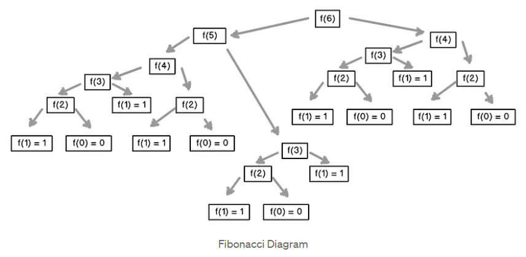

- [Back to Main](../main.md)

# 18. Miscellaneous Topics in Recursion
### Concept) Big-Omega (Ω)
-  Def.)
   - A function $`f(n)`$ is said to be $`\Omega(g(n))`$ 
     - iff. $`\exists n_0, M \textrm{ such that } M|f(n)| \ge |g(n)|, n\ge n_0`$

### Concept) Big-Theta (Θ)
-  Def.)
   - A function $`f(n)`$ is said to be $`\Theta(g(n))`$ 
     - if $`f=O(g)`$ and $`f=\Omega(g)`$

 

### Concept) Algorithm for Solving Recurrence Relations
- How?)
  1. Convert the recurrence to a characteristic equation 
     - which can be done by claiming $`x^n`$ to be the solution for the recurrence and working towards an equation.
  2. Find roots of the equation.
  3. A theorem (proven in the zybook) shows how any linear combination of the roots will be a valid solution for the recurrence.
  4. To get the values for the coefficients, use the base cases.

 

#### E.g) Fibonacci
- Def.)   
  $`f(n) = \begin{cases}
    1 & \textrm{if n=0} \vee \textrm{n=1} \\
    f(n-2)+f(n-1) & \textrm{otherwise}
  \end{cases}`$
- Getting the closed form solution.
  - Denote $`f`$ with $`x`$ as follows:   
    $`\begin{aligned}
      f(n) = f(n-1) + f(n-2) &\rightarrow x^n = x^{n-1} + x^{n-2} \\
      &\Rightarrow x^n - x^{n-1} - x^{n-2} = 0 \\
      &\Rightarrow x^2 - x - 1 = 0 \\
    \end{aligned}`$
  - Thus, the roots of the equation can be derived as:
    - $`x = \displaystyle\frac{1+\sqrt{5}}{2} \textrm{ or } \displaystyle\frac{1-\sqrt{5}}{2}`$
  - Then, by a theorem, any linear combination of the roots will satisfy the recurrence relation of $`f(n) = f(n-1) + f(n-2)`$.
    - i.e.) $`\displaystyle\exists c,s\in\mathbb{R} \textrm{ such that } f(n) = c\left(\frac{1+\sqrt{5}}{2}\right)^n + s\left(\frac{1-\sqrt{5}}{2}\right)^n`$
  - Recall our base case of $`\begin{cases} f(0) = 1 \\ f(1) = 1 \\ \end{cases}`$.
    - Thus,   
      $`\begin{cases}
        \displaystyle f(0) = c + s = 1 \\
        \displaystyle f(1) = c\left(\frac{1+\sqrt{5}}{2}\right) + s\left(\frac{1-\sqrt{5}}{2}\right) = 1 \\
      \end{cases}`$
    - Let's solve the system of equations.   
      $`\begin{aligned}
        s = 1-c &\Rightarrow c\left(\frac{1+\sqrt{5}}{2}\right) + (1-c)\left(\frac{1-\sqrt{5}}{2}\right) = 1 \\
        &\Rightarrow c\sqrt{5} = 1- \frac{1-\sqrt{5}}{2} = \frac{1+\sqrt{5}}{2} \\
        &\Rightarrow c = \frac{1+\sqrt{5}}{2\sqrt{5}} \\
        &\Rightarrow s = 1-c = 1-\frac{1+\sqrt{5}}{2\sqrt{5}} = \frac{-1+\sqrt{5}}{2\sqrt{5}} \\
      \end{aligned}`$
    - Plugging $`c,s`$ back in to our closed form we get   
      $`\begin{aligned}
        f(n) &= \left(\frac{1+\sqrt{5}}{2\sqrt{5}}\right)\left(\frac{1+\sqrt{5}}{2}\right)^n + \left(\frac{-1+\sqrt{5}}{2\sqrt{5}}\right)\left(\frac{1-\sqrt{5}}{2}\right)^n \\
        &= \frac{1}{\sqrt{5}}\left(\frac{1+\sqrt{5}}{2}\right)^{n+1} - \frac{1}{\sqrt{5}}\left(\frac{1-\sqrt{5}}{2}\right)^{n+1}
      \end{aligned}`$

  

### Concept) Recursion Tree
- e.g.)   
  

 

### Concept) Master Theorem
- Theorem)
  - Let
    - $`a, b \in \mathbb{R}^+ \textrm{ with } a\ge1, b\gt1`$
    - $`T(n) \begin{cases}
      aT(n/b) + f(n) & \textrm{if } n\gt1 \\
      d & \textrm{if } n=1 \\
    \end{cases}`$ 
  - Then we have
    - If $`f(n) = \Theta(n^c) \textrm{ where } \log_b a\lt c`$, then $`T(n) = \Theta(n^c) = \Theta(f(n))`$
    - If $`f(n) = \Theta(n^c) \textrm{ where } \log_b a= c`$, then $`T(n) = \Theta(n^c \log n) = \Theta(f(n) \log n)`$
    - If $`f(n) = \Theta(n^c) \textrm{ where } \log_b a\gt c`$, then $`T(n) = \Theta(n^{\log_b a})`$

  

- [Back to Main](../main.md)