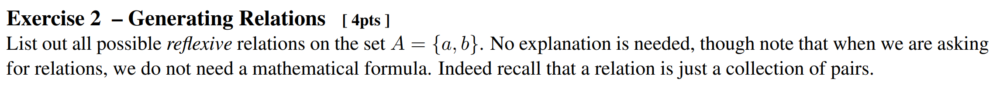

#### Q1.

  
Sol.

  

  
  $`\{\{a,a\}, \{b,b\}\}`$    
  $`\{\{a,a\}, \{b,b\}, \{a,b\}\}`$    
  $`\{\{a,a\}, \{b,b\}, \{b,a\}\}`$    
  $`\{\{a,a\}, \{b,b\}, \{a,b\}, \{b,a\}\}`$    
  
  

#### Q2.

  
Sol.

  

  
  $`2^9 - \begin{pmatrix} 9\\0 \end{pmatrix} - \begin{pmatrix} 9\\1 \end{pmatrix}`$   
  For each fruit, we can include or exclude : $`2^9`$,.
  
  

#### Q3.
 

  
Sol.

  

  
  $`0`$.    
  Grading said "There is no possible 1-1 functions. For 1-1 you need the co-domain to be at least as big as the domain."
  
  

#### Q4.

  
Sol.

  

  

  Let $U$ be the set of all possible 6-8 digit passwords and assume that $`\overline{U} = \emptyset`$, i.e., we won't consider the passwords that don't have 6-8 digits.   
  And let $`A,B \subseteq U`$ s.t. $`A`$ is the set of possible 6-8 digit passwords that contain at least one digit, and $B$ is the set of possible 6-8 digit passwords that contain at least one upper case character.   
  Under these definitions, our target is to calculate $`\vert A\cap B \vert`$.   
  However, calculating $`\vert A\cap B \vert`$ directly is not easy. Instead, we will calculate its complement first and then use this complement to calculate our target value.   
  By the De Morgan's Law, $`\overline{A\cap B} = \overline{A}\cup\overline{B}`$.   
  Also, we have $`\vert A\cap B \vert = \vert U  \vert - \vert \overline{A\cap B} \vert`$ and $`\vert \overline{A}\cup\overline{B} \vert = \vert \overline{A} \vert + \vert\overline{B} \vert - \vert \overline{A}\cap\overline{B}\vert`$  
  Considering that we have 10 digits, 26 lower case, and 26 upper case characters, we can get the cardinalities as follows:   
  $`\begin{aligned}
    \vert U \vert &= (10+26+26)^6 + (10+26+26)^7 + (10+26+26)^8   \\
    &= 62^6(1+62+62^2) = 62^6 \times 3907   \\
    \vert \overline{A} \vert &= (26+26)^6 + (26+26)^7 + (26+26)^8   \\
    &= 52^6(1+52+52^2) = 52^6 \times 2757   \\
    \vert \overline{B} \vert &= (10+26)^6 + (10+26)^7 + (10+26)^8   \\
    &= 36^6(1+36+36^2) = 36^6 \times 1333   \\
    \vert \overline{A}\cap\overline{B}\vert &= 26^6 + 26^7 + 26^8   \\
    &= 26^6(1+26+26^2) = 26^6 \times 703
  \end{aligned}`$   
  Thus, we can get   
  $`\begin{aligned}
      \vert \overline{A}\cup\overline{B} \vert &= \vert \overline{A} \vert + \vert\overline{B} \vert - \vert \overline{A}\cap\overline{B}\vert   \\
      &= 52^6 \times 2757 + 36^6 \times 1333 - 26^6 \times 703
  \end{aligned}`$   
  Therefore,    
  $`\begin{aligned}
      \vert A\cap B \vert &= \vert U  \vert - \vert \overline{A\cap B} \vert  = \vert U  \vert - \vert \overline{A}\cup\overline{B}\vert   \\
      &= 62^6 \times 3907 - (52^6 \times 2757 + 36^6 \times 1333 - 26^6 \times 703)   \\
      &= 62^6 \times 3907 - 52^6 \times 2757 - 36^6 \times 1333 + 26^6 \times 703   \\
  \end{aligned}`$
  
  

