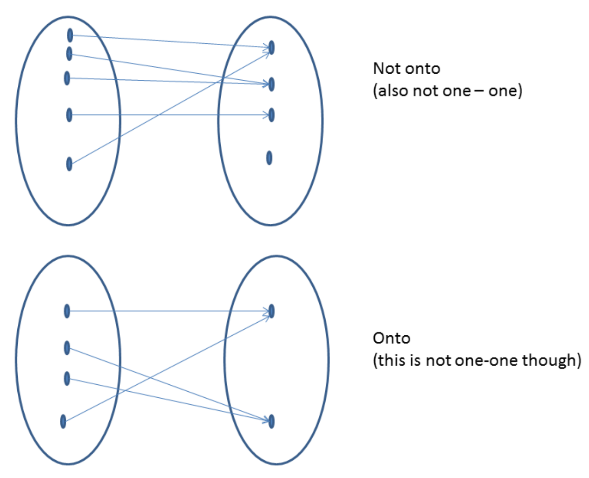

- [Back to Main](../main.md)

# 3. Functions

### Concept) Relation
- Def.)
  - Let $`A, B`$ sets.
  - Then a **relation** between $`A`$ and $`B`$ is s subset of $`A\times B`$.
- e.g.)
  - Suppose
    - $`A = \{1,2,3\}`$
    - $`B = \{4,5,6\}`$
    - $`R`$ : the relation consist of tuples
      - $`\{(a,b) | a\in A, b\in B, b = a+3 \}`$
  - Then the relation $`R = \{(1,4), (2,5), (3,6)\}`$.
    - $`aRb`$
- Properties) For a relation $`R`$
  |Property|Condition|
  |:------:|:--------|
  |Reflexive|$`\forall a\in A, aRa`$|
  |Symmetric|$`aRb \Leftrightarrow bRa, a\in A, b\in B`$|
  |Transitive|$`aRb \wedge bRc \Rightarrow aRc`$|
  |Equivalent|$`R`$ is an **equivalence relation** iff. it is reflexive, symmetric, and transitive|
  |Anti-Symmetric|$`\begin{cases} aRb \wedge bRa & \textrm{if } a=b \\ (a \textrm{ not related to } b) \vee (b \textrm{ not related to } a) & \textrm{otherwise.} \end{cases}`$|
  - e.g.)
    - For $`A = \{1,2,4\}`$, define $`R`$ to be the $`\le`$ relation.
      - Reflexive (O) : $`a \le a`$
      - Symmetric (X) : $`1 \le 2 \nRightarrow 2 \le 1`$
      - Transitive (O) : $`a \le b, b\le c \Rightarrow a\le c`$
      - Anti-Symmetric (O) : $`a\le b \wedge b\le a \Rightarrow a=b`$
    - For $`U = \{\textrm{All the states in the US}\}`$, $`u,v\in U`$ are related if they are adjacent.
      - Reflexive ($`\Delta`$)
      - Symmetric (O) 
      - Transitive (X)
      - Anti-Symmetric (X)
    - Set $`\{1\}`$ and the relation $`\{(1,1)\}`$.
      - Symmetric (O) 
      - Anti-Symmetric (O)

  

### Concept) Function
- Def.) $`f:X\rightarrow Y`$
  - A function $`f`$ from a set $`X`$ to a set $`Y`$ is a [relation](#concept-relation) from the domain $`X`$ to the co-domain (target) $`Y`$ that satisfies two properties.
    1. Every element of $`X`$ is related to some element in $`Y`$.
       - $`\exists y\in Y, y = f(x), \forall x\in X`$
    2. No element of $`X`$ is related to more than one element in $`Y`$.
       - $`\nexists x\in X, f(x)=y_1 \wedge f(x) = y_2 \textrm{ where } y_1, y_2 \in Y, y_1\ne y_2, `$
- Props.)
  - Range : the set of all values of $`f`$ taken together.
  - A function definition is incomplete unless the **domain** of the function is specified.
    - If **co-domain** is not specified, it is just considered to be the range of all possible values that the function takes.
  - Every function is a relation.
    - $`R = \{(x,f(x)) \textrm{ where } x\in A\}`$
  - Some relations are functions.
    - Counter example) $`R = \{(1,1), (1,3)\}`$

  

### Concept) Ceiling Function
- Def.) $`y = \lceil x \rceil`$
  - The smallest integer $`y`$ such that $`y\ge x`$

 

### Concept) Floor Function
- Def.) $`y = \lfloor x \rfloor`$
  - The largest integer $`y`$ such that $`y\le x`$
- Prop.)
  - The floor function defined on $`\mathbb{R}`$ is not [one-one](#concept-one-one).
    - Counter ex.) $`\lfloor 3.5 \rfloor = \lfloor \pi \rfloor = 3`$.
  - The floor function defined on $`\mathbb{Z}`$ is [one-one](#concept-one-one).

  

### Concept) One-One
- Def.)
  - $`x \ne y \Leftrightarrow f(x) \ne f(y)`$.
    - Equivalently, $`f(x) = f(y) \nLeftrightarrow x=y`$

 

### Concept) Onto
- Def.)
  - A function is said to be onto if the entire co-domain is **covered**.
    - i.e.) For $`f:X\rightarrow Y`$
      - $`\forall y \in Y, \exists x\in X \textrm{ such that } f(x)=y`$
- e.g.)
  - The function $`f:\mathbb{Z}\rightarrow\mathbb{Z}`$ defined as $`f(x) = x^2`$ is not onto.
    - Counter ex.) 
      - $`y = 2`$
      - $`\nexists x\in \mathbb{Z}, f(x) \in \mathbb{Z}^- \subset \mathbb{Z}`$

 

### Concept) Bijection
- Def.)
  - A function that is both [one-one](#concept-one-one) and [onto](#concept-onto).
- Application)
  - Binary $`\leftrightarrow`$ Decimal
  - Encoding / Decoding

  

- [Back to Main](../main.md)