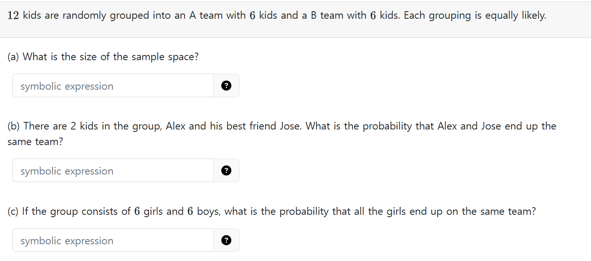

## HW4 Online 1)

  
Sol.

  

  
1. $`\displaystyle \begin{pmatrix} 12 \\ 6 \end{pmatrix}`$
2. $`\displaystyle \frac{\begin{pmatrix} 10 \\ 4 \end{pmatrix}\begin{pmatrix} 6 \\ 6 \end{pmatrix}\cdot2}{\begin{pmatrix} 12 \\ 6 \end{pmatrix}}`$
3. $`\displaystyle \frac{2}{\begin{pmatrix} 12 \\ 6 \end{pmatrix}}`$
  
  

 

## HW4 Online 2)

  
Sol.

  

  
  $`\displaystyle \frac{({}_{21}C_{4}-{}_{12}C_{4}-4{}_{11}C_{4}) + 9000 - ({}_{20}C_{3}-{}_{11}C_{3}-3{}_{10}C_{3})}{90000}`$

  
  

 

## HW4 Ex1)

  
Sol.

  

  
  $`\frac{13\cdot(2\cdot {}_{39}C_4 - 13\cdot {}_{26}C_2)}{{}_{52}C_5}`$    
  
  

 

## HW4 Ex8)

  
Sol.

  

  
  1. $`n\cdot\left(\frac{n-1}{n}\right)^k`$
  2. $`1000\cdot\left(\frac{999}{1000}\right)^{1000}`$
  3. $`\lim_{n\rightarrow\infty} n\cdot\left(\frac{n-1}{n}\right)^n \approx \frac{n}{e}`$
  4. Even when $`k=n`$, some slots are expected to remain empty because keys are placed independently and uniformly at random across slots. This randomness leads to the phenomenon where, due to the probability distribution, not every slot gets filled, even when the number of keys equals the number of slots.      
    This is related to the concept of collisions and load factor $`(\frac{k}{n})`$ in hash tables. A load factor of 1  does not guarantee all slots are filled due to collisions. In practice, a hash table's efficiency is often maintained by keeping the load factor below 1 to reduce the chance of collisions, which can impact performance in searching and inserting elements.
  
  

 

## Recitation6 p26)

  
Sol.

  

  
  $`\displaystyle\sum_{i=0}^{5} \begin{pmatrix} 11-i\\i \end{pmatrix}`$
  
  

 

## Recitation7 Q1)

  
Sol.

  

  
- Let
  - $`A`$ : bag1 is from '94 and bag2 is from '96
  - $`B`$ : bag1 is from '96 and bag2 is from '94
  - $`Y`$ : yellow is from bag1 and green is from bag2.
- Then our goal is to get $`P(Y\vert A)`$.
- Using the bayes rule we can get   
  $`\begin{aligned}
    P(A\vert Y) &= \frac{P(Y\vert A)\cdot P(A)}{P(Y)}= \frac{P(Y\vert A)\cdot P(A)}{P(Y\vert A)\cdot P(A) + P(Y\vert B)\cdot P(B)} \\
    &= \frac{(0.2\cdot0.2)\cdot0.5}{(0.2\cdot0.2)\cdot0.5 + (0.14\cdot0.1)\cdot0.5}
  \end{aligned}`$
  
  

 

## Recitation7 Q2)

  
Sol.

  

  
  $`\displaystyle \left(\frac{{}_{4}C_{1} \cdot {}_{16}C_{1}}{{}_{52}C_{2}}\right)\cdot 20 + \left(1-\frac{{}_{4}C_{1} \cdot {}_{16}C_{1}}{{}_{52}C_{2}}\right)\cdot(-10)`$
  
  

 

## Recitation7 Q3)

  
Sol.

  

  
  $`\displaystyle \mathbb{E}[G] = 1\cdot {}_{3}C_{1}\cdot\left(\frac{1}{6}\right)\left(\frac{5}{6}\right)^2 + 2\cdot {}_{3}C_{2}\cdot\left(\frac{1}{6}\right)^2\left(\frac{5}{6}\right) + 3\cdot {}_{3}C_{3}\cdot\left(\frac{1}{6}\right)^3 = 0.5`$   
  Thus, 0.5 is breakeven.
  
  

 

## Recitation7 Q5)

  
Sol.

  

  
  A. $`\displaystyle k\cdot \left(1-\frac{1}{k}\right)^n`$    
  B. $`\begin{aligned}
    \mathbb{E}[\text{(number of collision)}] &= n - \mathbb{E}[\text{(number of non-empty bins)}] \\
    &= n - \left( k - k\cdot \left(1-\frac{1}{k}\right)^n \right)
  \end{aligned}`$
  
  

 

## Recitation9 Q1)

  
Sol.

  

  
  A. True.      
  B. False. We can always find $`y`$ that makes this predicate false.
  
  

 

## Recitation9 Q4)

  
Sol.

  

  
  Suppose not, i.e., $`\exists y\in \mathbb{Q}, \; y^3+y+1 = 0`$.   
  Then $`\exists p,q \in\mathbb{Z}`$ s.t. coprime and $`y = \frac{p}{q}`$.   
  Thus, $`y^3+y+1 = \left(\frac{p}{q}\right)^3 + \left(\frac{p}{q}\right) + 1 = \frac{p^3+pq^2+q^3}{q^3} = 0`$.   
  Hence, $`p^3+pq^2+q^3=0`$.   
  Consider that every integer is either even or odd.   
  Suppose $`\exists k\in\mathbb{Z}`$ s.t. $`p = 2k`$.   
  Then $`p^3+pq^2+q^3=8k^3+2kq^2+q^3=0`$. Since $8k^3, 2kq^2, 0`$ are even, $`q^3`$ should be even as well. In this case, it contradicts the assumption that $`p`$ and $`q`$ are coprime.   
  Suppose $`\exists k\in\mathbb{Z}`$ s.t. $`p = 2k+1`$.    
  Then $`p^3+pq^2+q^3=(2k+1)^3 + (2k+1)q^2 + q^3 = (8k^3+12k^2+6k+1)+(2kq^2+q^2)+q^3=0`$.   
  Thus, $`2(4k^3+6k^2+3k+kq^2) = -(1+q^2+q^3)`$.   
  Hence, $`q^2+q^3 = q^2(1+q)`$ should be odd. However, the product of any consecutive integer is always even. $`\cdots\otimes`$
  

  

 

## Recitation10 Q3)

  
Sol.

  

  
  If a point is added, (k-2) diagonals are added. One existing line becomes a diagonal.
  

  

 

## HW4 Ex6)
Express the following English statements and its negation in logical form.
1. No cars are both cheap and reliable.

  
Sol.

  

  
1. $`\forall x\in\text{Car}(\neg (\text{Cheap}(x) \wedge \text{Reliable}(x)))`$
   - Neg: $`\exists x\in\text{Car}(\text{Cheap}(x) \wedge \text{Reliable}(x))`$
  
  

 

## Lec. Nov. 19) Induction (Fundamental Theorem of Arithmetics)
Prove that $`n\ge 2`$ is either a prime number or a product of primes.

  
Sol.

  

  
- Base Case) $`n=2`$. Since $`2`$ is prime the theorem holds.
- Suppose the theorem hold for $`n=1,2,\cdots, k`$.
- Now consider $`k+1`$.
  - Consider the case that $`k+1`$ is prime. Then the theorem holds.
  - Consider otherwise.
    - Then $`a \in [2,k]`$, a prime number s.t. $`a\vert (k+1)`$.
    - Thus, $`\exists b\in [2,k]`$ s.t. $`k+1 = ab`$.
    - Since, $`b\in [2,k]`$, $`b`$ is also a prime or the product of primes.
    - Therefore, $`k+1`$ is the product of primes.
- QED.
  
  

 

## Rec 11) Q2

  
Sol.

  

  
- Suppose we divide a number with 9. 
- Then there can be 9 remainders from 0 to 8. 
- Since we have 10 numbers, by the Pigeon Hole Principle, there will be at least two integers sharing same remainders.
- The difference between those two will be divisible by 9.
  
  

 

## Rec 11) Q5

  
Sol.

  

  
- Base Cases)
  - $`n= 1 = c_0`$
  - $`n=2 = c_1\cdot2^1`$
- Suppose integers until $`k`$ has binary expressions.
- Now let's consider $`k+1`$.
  - If $`k`$ is even, we can simply add $`c_0`$.
  - If $`k`$ is odd, then $`k+1`$ must be even. 
    - Thus, we can find $`x=(k+1)/2`$. 
    - By moving one digits to the left, we can get $`k+1`$'s binary expression.
  
  

 

## HW6 Online 7)

- Solve this on Prairie Learn.

 

## HW6 Q2)

  
Sol.

  

  
Use property that $`\forall k\ge 2`$, $`k`$ is either prime or composite.
  
  

 

## Rec 12) Q6

  
Sol.

  

  
  $`n(n-1)`$ ways of choosing ordered pair of two vertices.   
  Each pair can have or not have the edge between them.   
  Therefore, $`2^{n(n-1)}`$
  
  

 