## HW.
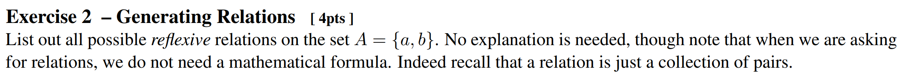

  
Sol.

  

  
  $`\{\{a,a\}, \{b,b\}\}`$    
  $`\{\{a,a\}, \{b,b\}, \{a,b\}\}`$    
  $`\{\{a,a\}, \{b,b\}, \{b,a\}\}`$    
  $`\{\{a,a\}, \{b,b\}, \{a,b\}, \{b,a\}\}`$    
  
  

## HW.
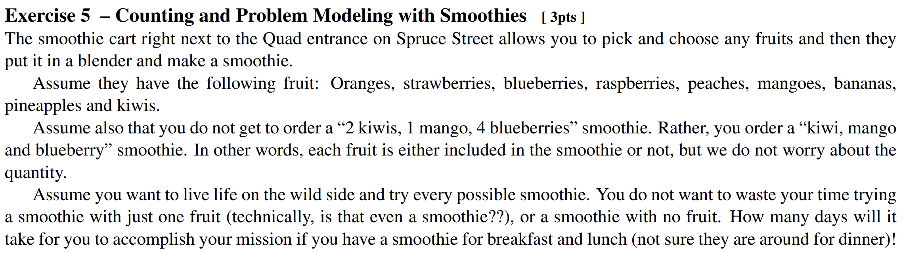

  
Sol.

  

  
  $`2^9 - \begin{pmatrix} 9\\0 \end{pmatrix} - \begin{pmatrix} 9\\1 \end{pmatrix}`$   
  For each fruit, we can include or exclude : $`2^9`$,.
  
  

## HW.
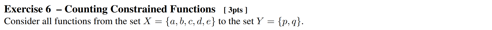 
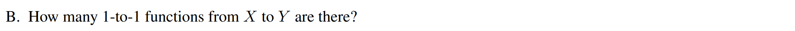

  
Sol.

  

  
  $`0`$.    
  Grading said "There is no possible 1-1 functions. For 1-1 you need the co-domain to be at least as big as the domain."
  
  

## HW.
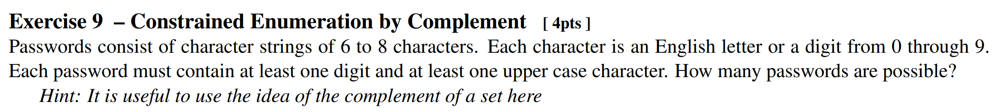

  
Sol.

  

  

  Let $U$ be the set of all possible 6-8 digit passwords and assume that $`\overline{U} = \emptyset`$, i.e., we won't consider the passwords that don't have 6-8 digits.   
  And let $`A,B \subseteq U`$ s.t. $`A`$ is the set of possible 6-8 digit passwords that contain at least one digit, and $B$ is the set of possible 6-8 digit passwords that contain at least one upper case character.   
  Under these definitions, our target is to calculate $`\vert A\cap B \vert`$.   
  However, calculating $`\vert A\cap B \vert`$ directly is not easy. Instead, we will calculate its complement first and then use this complement to calculate our target value.   
  By the De Morgan's Law, $`\overline{A\cap B} = \overline{A}\cup\overline{B}`$.   
  Also, we have $`\vert A\cap B \vert = \vert U  \vert - \vert \overline{A\cap B} \vert`$ and $`\vert \overline{A}\cup\overline{B} \vert = \vert \overline{A} \vert + \vert\overline{B} \vert - \vert \overline{A}\cap\overline{B}\vert`$  
  Considering that we have 10 digits, 26 lower case, and 26 upper case characters, we can get the cardinalities as follows:   
  $`\begin{aligned}
    \vert U \vert &= (10+26+26)^6 + (10+26+26)^7 + (10+26+26)^8   \\
    &= 62^6(1+62+62^2) = 62^6 \times 3907   \\
    \vert \overline{A} \vert &= (26+26)^6 + (26+26)^7 + (26+26)^8   \\
    &= 52^6(1+52+52^2) = 52^6 \times 2757   \\
    \vert \overline{B} \vert &= (10+26)^6 + (10+26)^7 + (10+26)^8   \\
    &= 36^6(1+36+36^2) = 36^6 \times 1333   \\
    \vert \overline{A}\cap\overline{B}\vert &= 26^6 + 26^7 + 26^8   \\
    &= 26^6(1+26+26^2) = 26^6 \times 703
  \end{aligned}`$   
  Thus, we can get   
  $`\begin{aligned}
      \vert \overline{A}\cup\overline{B} \vert &= \vert \overline{A} \vert + \vert\overline{B} \vert - \vert \overline{A}\cap\overline{B}\vert   \\
      &= 52^6 \times 2757 + 36^6 \times 1333 - 26^6 \times 703
  \end{aligned}`$   
  Therefore,    
  $`\begin{aligned}
      \vert A\cap B \vert &= \vert U  \vert - \vert \overline{A\cap B} \vert  = \vert U  \vert - \vert \overline{A}\cup\overline{B}\vert   \\
      &= 62^6 \times 3907 - (52^6 \times 2757 + 36^6 \times 1333 - 26^6 \times 703)   \\
      &= 62^6 \times 3907 - 52^6 \times 2757 - 36^6 \times 1333 + 26^6 \times 703   \\
  \end{aligned}`$
  
  

## Rec02 p17)

For $`a,b\in\mathbb{R}`$, the relation ship is $`a^2 = b^2`$. Is it reflexive, symmetric, transitive, and anti-symmetric?

  
Sol.

  

  
  reflexive : Yes   
  symmetric : Yes   
  transitive : Yes   
  anti-symmetric : No. (1,-1)

  

## Rec02 p20)

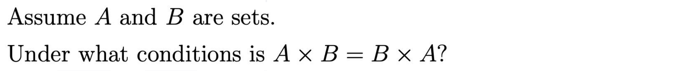

  
Sol.

  

  
  $`(A=B) \vee (A=\emptyset) \vee (B=\emptyset)`$

  

## Rec02 p24)

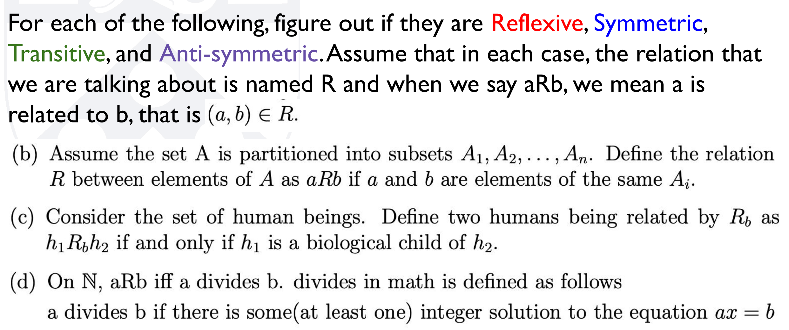

  
Sol.

  

  
  1. 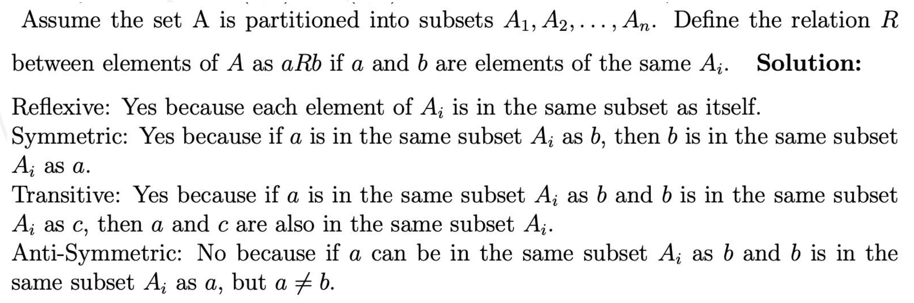
  2. 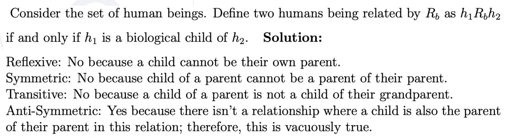
  3. 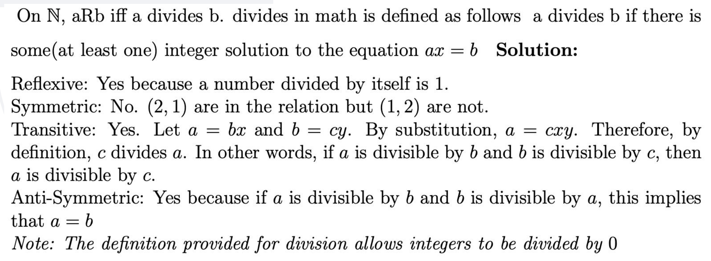

  

## Rec02 p28)

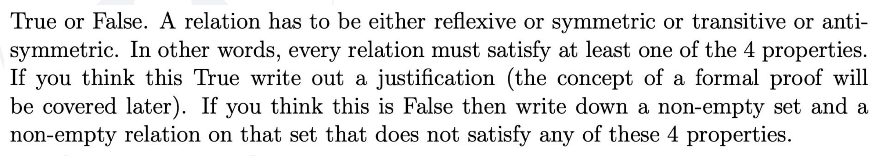

  
Sol.

  

  
  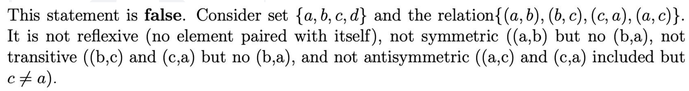

  

## Rec04 Handout Ex 2)

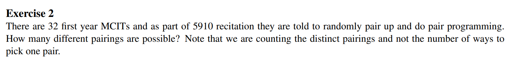

  
Sol.

  

  
  $`\displaystyle \frac{1}{16!} \prod_{i=0}^{15}\begin{pmatrix} 32-2i\\2 \end{pmatrix}`$

  

## Rec04 Handout Ex 5)

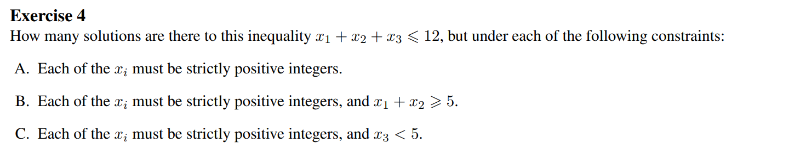

  
Sol.

  

  
  A. $`\begin{pmatrix} 12 \\ 9 \end{pmatrix}`$    
  Put $`x_i' \ge 0`$ s.t. $`x_i' = x_i-1`$.   
  Then the problem goes $`x_1'+x_2'+x_3' \le 9`$.   
  Using the slack variable $`z`$ ,the problem goes $`x_1'+x_2'+x_3'+z = 9`$.   
  Thus, the total number of count is $`\begin{pmatrix} 9+4-1 \\ 9 \end{pmatrix} = \begin{pmatrix} 12 \\ 9 \end{pmatrix}`$.    
      
  B. $`4\cdot\begin{pmatrix} 8\\6 \end{pmatrix}+\begin{pmatrix} 8\\5 \end{pmatrix}`$   
  Start from $`x_1'+x_2'+x_3' \le 9`$.    
  Divide the cases by the value of $`x_1'`$.   
  i) $`x_1' = 0`$; Then $`x_2'\ge3`$. Put $`y_3 = x_2'-3`$. Then the problem goes $`y_2+x_3' \le 6 \Rightarrow y_2+x_3'+z = 6`$. Thus, the count is $`\begin{pmatrix} 6+3-1\\6 \end{pmatrix}=\begin{pmatrix} 8\\6 \end{pmatrix}`$   
  ii) $`x_1' = 1`$; Then $`x_2'\ge2`$. Put $`y_3 = x_2'-2`$. Then the problem goes $`y_2+x_3' \le 6 \Rightarrow y_2+x_3'+z = 6`$. Thus, the count is $`\begin{pmatrix} 6+3-1\\6 \end{pmatrix}=\begin{pmatrix} 8\\6 \end{pmatrix}`$   
  Same count occurs for $`x_1' = 2`$ and $`x_1' = 3`$.   
     
  Finally, consider the case that $`\Leftrightarrow x_1\ge5`$. In this case, by putting $`y_1 = x_1-5`$, the problem goes $`y_1+x_2'+x_3'\le5 \Rightarrow y_1+x_2'+x_3'+z=5`$. And the total count is $`\begin{pmatrix} 5+4-1\\5 \end{pmatrix} = \begin{pmatrix} 8\\5 \end{pmatrix}`$.   
     
  Therefore, $`4\cdot\begin{pmatrix} 8\\6 \end{pmatrix}+\begin{pmatrix} 8\\5 \end{pmatrix}`$   
     
  C. $`\begin{pmatrix} 12 \\ 9 \end{pmatrix} - \begin{pmatrix} 8\\5 \end{pmatrix}`$    
  Consider the case that $`x_3\ge 5`$.    
  Putting $`x_1'=x_1-1, x_2'=x_2-1, y_3=x_3-5`$, the problem goes $`x_1'+x_2'+y_3\le 5 \Rightarrow x_1'+x_2'+y_3+z= 5`$.   
  In this case, the count goes $`\begin{pmatrix} 5+4-1\\5 \end{pmatrix}=\begin{pmatrix} 8\\5 \end{pmatrix}`$.    
  Using the compliment, the answer goes $`\begin{pmatrix} 12 \\ 9 \end{pmatrix} - \begin{pmatrix} 8\\5 \end{pmatrix}`$.

  

## Rec04 Handout Ex 6)

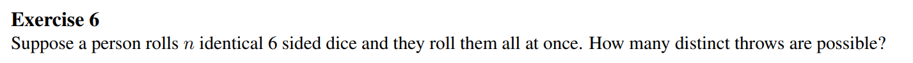

  
Sol.

  

  
  $`\displaystyle \frac{(6+(n-1))!}{6!(n-1)!}`$

  

## Rec04 Handout Ex 7)

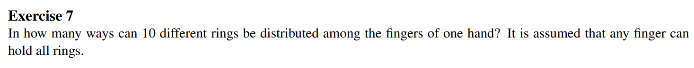

  
Sol.

  

  
  $`\displaystyle \frac{(10+(5-1))!}{(5-1)!} = \frac{14!}{4!}`$

  

## Rec04 Handout Ex 8)

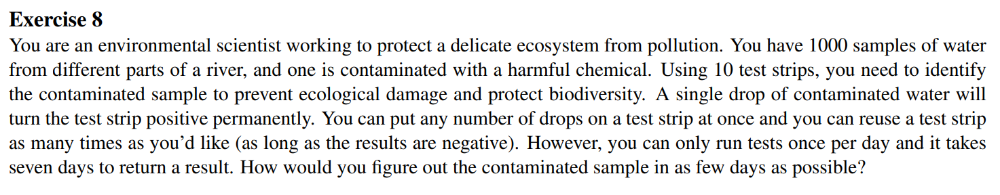

  
Sol.

  

  
  7 days.   
  We can denote 1000 within $`2^{10}=1024`$.   
  Assign binary IDs starting from 0 to 999 in binary numbers to 1000 samples.   
  For each sample, check its binary ID, and drop it on the i-th test strip if i-th digit of the binary ID is 1.   
  Then after, 7 days by checking the sequence of 10 test samples that are contaminated, we can get the binary ID of the target sample, which uniquely distinguishes the contaminated sample.

  

## Sample Exam Ex3)

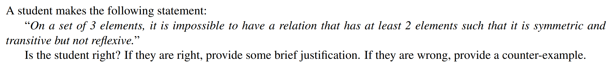

  
Sol.

  

  
  True.   
  Suppose $a,b$ are symmetric and transitive but not reflexive.    
  By the symmetry, $`(a,b), (b,a) \in R`$.    
  Then by the transitivity, $`(a,a),(b,b) \in R \Leftrightarrow \text{Reflexivity.} \cdots \otimes`$

  

