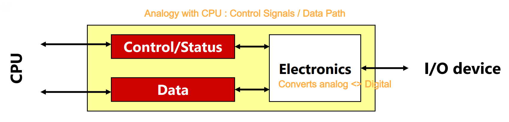
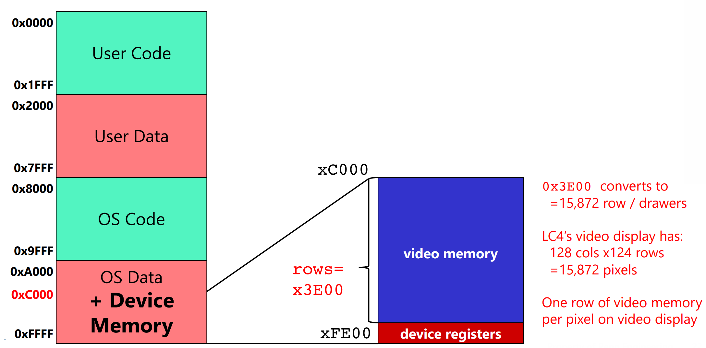
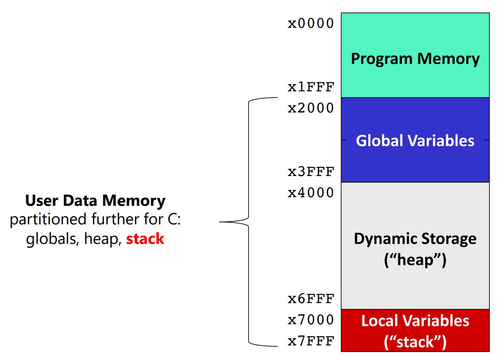
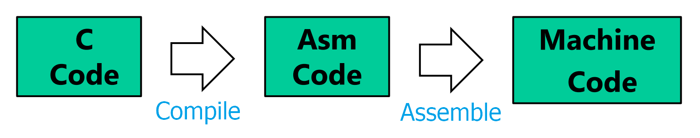

# IO and OS

<details>
  <summary>Draw IO Controller Diagram</summary>
  <p>
  
  
  
  </p>
</details><br>

<details>
  <summary>What is Memory-Mapped IO</summary>
  <p>
  
  Assign a memory address to each device register <br>
  
  </p>
</details><br>

<details>
  <summary>Implement GETC/PUTC using following constants
  <br>
  <code>OS_KBSR_ADDR .UCONST xFE00</code> : ‘alias’ for keyboard status reg <br>
  <code>OS_KBDR_ADDR .UCONST xFE02</code> : ‘alias’ for keyboard data reg <br>
  <code>OS_ADSR_ADDR .UCONST xFE04</code> : ‘alias’ for ASCII display status reg <br>
  <code>OS_ADDR_ADDR .UCONST xFE06</code> : ‘alias’ for ASCII display data reg <br>
  
  </summary>
  <p>
  
```assy
OS_KBSR_ADDR .UCONST xFE00    ; ‘alias’ for keyboard status reg
OS_KBDR_ADDR .UCONST xFE02    ; ‘alias’ for keyboard data reg
OS_ADSR_ADDR .UCONST xFE04    ; ‘alias’ for ASCII display status reg
OS_ADDR_ADDR .UCONST xFE06    ; ‘alias’ for ASCII display data reg

.CODE
;; Keyboard Read Code
GETC
  LC R0, OS_KBSR_ADDR
  LDR R0, R0, #0
  BRnz GETC
  LC R0, OS_KBDR_ADDR
  LDR R0, R0, #0          ; Read Keyboard input and write on R0.

;; ASCII Display Write Code
PUTC
  LC R1, OS_ADSR_ADDR
  LDR R1, R1, #0
  BRnz PUTC
  LC R1, OS_ADDR_ADDR
  STR R0, R1, #0          ; Write R0 to ASCII Display(R1)
```
  
  </p>
</details><br>

<details>
  <summary>Explain Video Display Data Registers <br>
  - Why range xC000~xFE0C? <br>
  - What does each address denote?<br>
  
  </summary>
  <p>
  
  $`128\times 124`$ addresses, each denoting pixels. MSB not used and 5 digits for each RGB.
  
  </p>
</details><br>

<details>
  <summary>Explain <code>TRAP/RTI</code> and their difference with <code>JSR/JMP</code></summary>
  <p>
  
  [Answer](../notes/m08.md#concept-trap--rti-instruction)
  
  </p>
</details><br>

<details>
  <summary>Explain TRAP Vector Table.</summary>
  <p>
  
  [Answer](../notes/m08.md#concept-trap-vector-table)   
  - The first 256 lines of OS Program Memory.
    ```assy
    .OS
    .CODE
    .ADDR x8000
        JMP TRAP_GETC       ; x00
        JMP TRAP_PUTC       ; x01
        JMP TRAP_DRAW_H_LINE; x02
        ...
        JMP TRAP_TURNOFF_CPU; xFF
    ```
  
  </p>
</details><br>

<details>
  <summary>Write an assembly code that backs up R0~R7 value at the memory address x4200~x4207.</summary>
  <p>
  
```assy
TEMPS .UCONST x4200   ; Label the temporary storage as TEMP and assign x4200.
LC R7, TEMPS          ; Load the address of TEMPS into R7
STR R0, R7, #0        ; Store R0 in TEMPS[0]
STR R1, R7, #1        ; Store R1 in TEMPS[1]
STR R2, R7, #2        ; Store R2 in TEMPS[2]
STR R3, R7, #3        ; Store R3 in TEMPS[3]
STR R4, R7, #4        ; Store R4 in TEMPS[4]
STR R5, R7, #5        ; Store R5 in TEMPS[5]
STR R6, R7, #6        ; Store R6 in TEMPS[6]
```
  
  </p>
</details><br>

<details>
  <summary>Explain Synchronization, Polling, and Interrupt</summary>
  <p>
  
  [Answer](../notes/m08.md#concept-synchronization)   

  </p>
</details><br>


# C Language and Stack Memory

<details>
  <summary>Explain three partitions in User Data Memory</summary>
  <p>
  
  
  
  </p>
</details><br>

<details>
  <summary>Explain stack frame and frame pointer.</summary>
  <p>
  
  [Answer](../notes/m09.md#concept-stack-frame)   
  
  </p>
</details><br>

<details>
  <summary>Write prologue/body/epilogue assemblies in the following format.<br>
  
```assy
MAIN
  ; Prologue
  ;; Fill in this part!
  ;; Skip allocating local variables

  ; Body
  ;; Skip running main algorithms.
  ;; Fill in this part!

  ; Epilogue
  ;; Fill in this part!
```
  
  </summary>
  <p>
  

- Answer
  ```assy
  MAIN
    ; Prologue
    ADD R6, R6, #-3   ; Increase stack for RV, RA, and FP
    STR R7, R6, #-1   ; Store R7(return address given by the caller with JSR) at dmem[R6-1]
    STR R5, R6, #0    ; Store previous R5 at dmem[R6]
    ADD R5, R6, #0    ; Update FP.
    ;; Skip allocating local variables

    ; Body
    ;; Skip running main algorithms.
    ;; Put return value at R7.
    ;; e.g.) CONST R7, #0

    ; Epilogue
    ADD R6, R5, #0    ; Pop stack by moving R6 to FP.
    ADD R6, R6, #3    ; Pop FP, RA, RV
    STR R7, R6, #-1   ; Store Main's return value at R7 at RV.
    LDR R5, R6, #-3   ; Load previous FP at R5.
    LDR R7, R6, #-2   ; Load RA at R7.
    RET               ; PC = R7
  ```
  
  </p>
</details><br>

<details>
  <summary>Explain compiling, assembling, and linking.</summary>
  <p>
  
  <br>
  
  - Compiling : High Level Program (.c) -> Assembly (.asm)
  - Assembling : Assembly (.asm) -> Machine code (.o, .obj)
  - Linking : Machine code (.o, .obj) -> Executable.
  
  </p>
</details><br>

<details>
  <summary>Explain symbol table.</summary>
  <p>
  
  [Answer](../notes/m09.md#concept-symbol-table)   
  
  </p>
</details><br>

<details>
  <summary>Draw Stack for the Following Problem
  
```c
int pow(int a, int p){
  int c;
  for (c=1; p > 0; p--){
    c = c * a;
  }
  return c;
}

int main(){
  int a = 2;
  int b = 3;
  int c = 0;
  c = pow(a, b);
}
```

- Assumptions)
  - `main()` is located at x0004.
  - `pow()` is located at x0061.
  - Initial FP is x0000.  
  
  </summary>
  <p>
  
|Address|Value|Desc.|
|:-:|:-:|:-|
|x7FF3|#1->#2->#4->#8|c|
|x7FF4|x7FFC|pow's FP|
|x7FF5|x0062|pow's RA|
|x7FF6|#8|pow's RV|
|x7FF7|#2|a|
|x7FF8|#3->#2->#1->#0|p|
|x7FF9|#0->#8|c|
|x7FFA|#3|b|
|x7FFB|#2|a|
|x7FFC|x0000|main's FP|
|x7FFD|x0005|main's RA|
|x7FFE|0|main's RV|
|x7FFF||Argument to main|
  
  </p>
</details><br>


## C Variables, Pointers, and Arrays

<details>
  <summary>Explain implicit/explicit typecasting.</summary>
  <p>
  
  [Answer](../notes/m10.md#concept-type-casting)   
  
  </p>
</details><br>

<details>
  <summary>Write User Defined Type <code>struct</code> and <code>typedef struct</code> syntaxes.</summary>
  <p>
  
  [Answer](../notes/m10.md#concept-user-defined-type)   
  
  </p>
</details><br>

<details>
  <summary>What is Null Pointer, Void Pointer, and Segmentation Fault?</summary>
  <p>
  
  [Null Pointer & Segmentation Fault](../notes/m10.md#concept-null-pointer)     
  [Void Pointer](../notes/m10.md#concept-void-pointer)     
  
  </p>
</details><br>

<details>
  <summary>What the difference between <code>CONST</code> and <code>#DEFINE</code>?</summary>
  <p>
  
  [Answer](../notes/m10.md#concept-constants)     
  
  </p>
</details><br>

<details>
  <summary>What the difference between the following constant pointers?<br>
  
  - `const int* x`
  - `int const* x`
  - `int* const x`
  - `const int* const x`
  
  </summary>
  <p>
    
  - `const int* x` : Cannot change `*x` (the value where the pointer is pointing at).
  - `int const* x` : Cannot change `*x` (the value where the pointer is pointing at).
  - `int* const x` : Cannot change `z` (the address that the pointer holds).
  - `const int* const x` : Cannot change both.
  
  </p>
</details><br>

<details>
  <summary>Explain the difference between automatic, static, extern, and register variable.</summary>
  <p>
    
  [Answer](../notes/m10.md#concept-storage-classes-for-variables-in-c)  
  
  </p>
</details><br>

## C-Files (Basic IO)

<details>
  <summary>Explain 6 file operations in C.</summary>
  <p>
    
  [Answer](../notes/m12.md#concept-file-operations-in-c)  
  
  </p>
</details><br>

<details>
  <summary>Write a C code that copies text from read.txt to write.txt using fputc and fgetc.</summary>
  <p>
    
```c
#include <stdio.h>
#include <stdlib.h>

int main(){
        FILE* read_file = fopen("read.txt", "r");
        if (read_file == NULL){
                perror("Read file open error.\n");
                return 1;
        }

        FILE* write_file = fopen("write.txt", "w");
        if (write_file == NULL){
                perror("Write file open error.\n");
                return 1;
        }
        char curr;

        while (1){
                curr = fgetc(read_file);
                fputc(curr, write_file);
                if (curr == EOF) break;
        }

        fclose(read_file);
        fclose(write_file);
        return 0;
}
```
  
  </p>
</details><br>

<details>
  <summary>Write a C code that parse and prints .obj file using fread().</summary>
  <p>
    
```c
#include <stdio.h>
#include <stdlib.h>

int main(){
        FILE* obj_file = fopen("test.obj", "rb");
        if (obj_file == NULL){
                perror("obj_file not opened.\n");
                return 1;
        }

        unsigned short int curr;

        while (fread(&curr, sizeof(unsigned short int), 1, obj_file) == 1){
                 curr = curr << 8 | curr >> 8;
                 printf("%04x\n", curr);
        }

        fclose(obj_file);

}
```
  
  </p>
</details><br>


