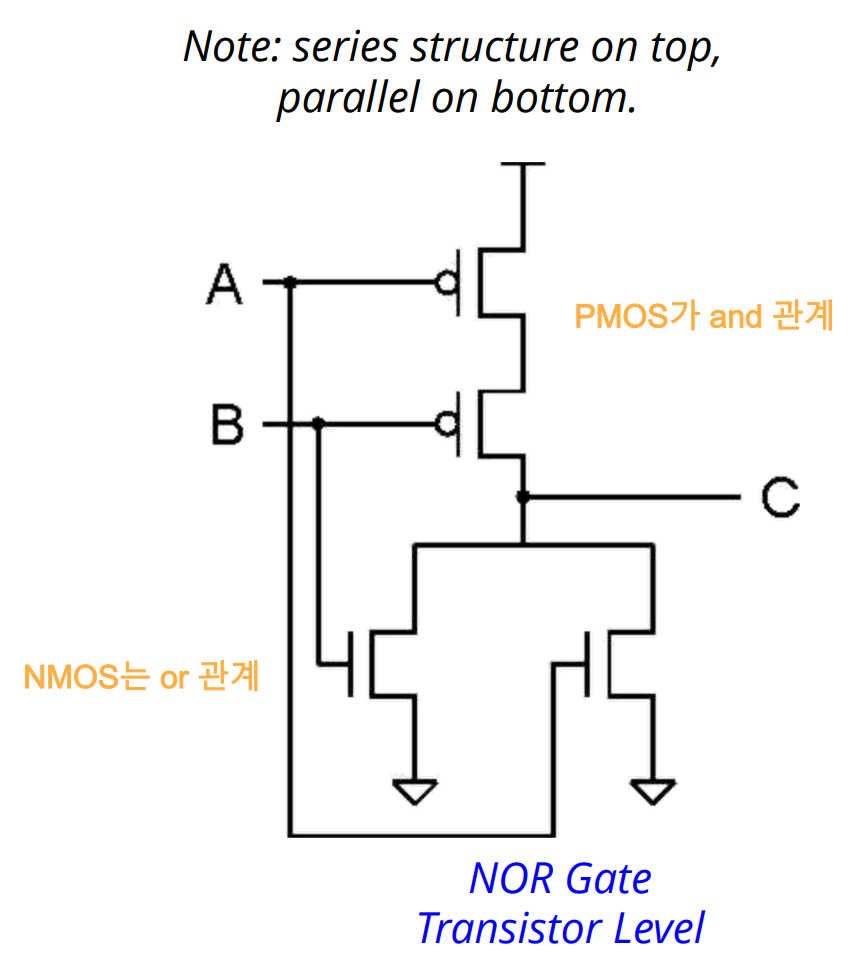
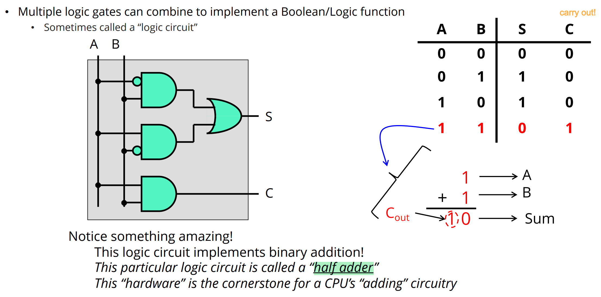
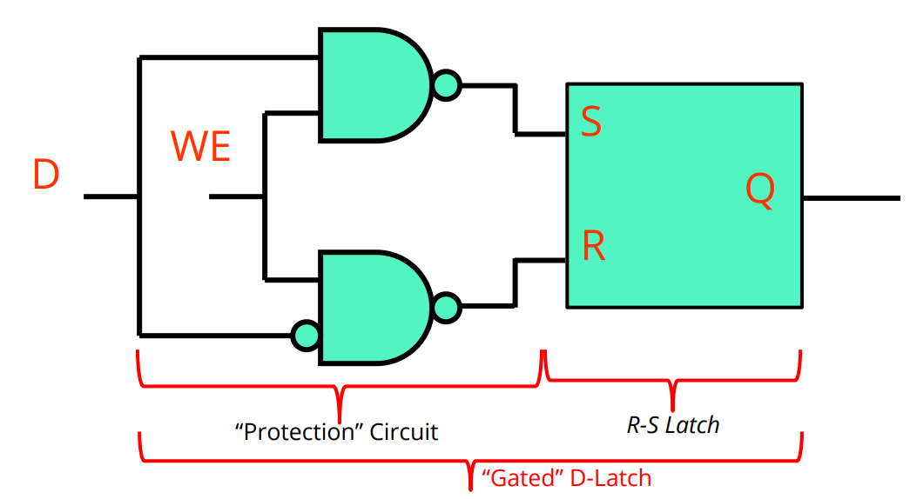

## Binary & Hexadecimal

  
Calculate addition between 2C binary #s: 11 + 01010101

  

  
  $`\begin{aligned}
    11111111& \\
    01010101& \\
    \_\_\_\_\_\_\_ \\
    01010100& = 84
  \end{aligned}`$
  
  

  
Describe what conditions indicate overflow has occurred when two 2's complement numbers are added. 

  

  
  Both operands are positive and the result is negative or vice versa.
  
  

 

## Floating Point
- [Reference](../notes/m01.md#concept-floating-point)

  
How many digits?

  

  
  32-bit
  
  

  
Components?

  

  
  
  
  

  
Convert the decimal -55 23/64 to Floating Point

  

  
  - 1 10000100 10111010111000000000000
  
  

  
Convert the floating point # 1 10000011 00010000000000000000000 to decimal

  

  
  - $`-17`$
  
  

  
Convert the floating point # 0 11111111 00000000000000000000000 to decimal

  

  
  - +infinity
    |Exponent|Mantisa|Value|
    |:-:|:-:|:-:|
    |255|0|infinity|
    |255|~0|NaN|
  
  

  
Maximum/Minimum value of exponent

  

  
  - $`-126 \le e \le 127`$
    - Why?)
      - Recall $`\text{Exp}`$ is an 8-digit unsigned binary number.
        - Thus, $`0 \le \text{Exp} \le 2^8-1 = 255`$.
      - Also, $`00000000`$ and $`11111111`$ are special cases that should be excluded.
        - Hence $`1 \le \text{Exp} \le 2^8-2 = 254`$.
      - Putting $`e = \text{Exp}-127`$
        - $`-126 \le e \le 2^8-2 - (2^7-1) = 2^7-1 = 127`$
  
  

  
Let xF0 be the hexadecimal representations of 2's complement binary numbers. Convert it to decimal numbers.

  

  
  - $`\mathbf{x}F0 = 1111 0000 = -128 +64 +32 +16 = -16`$
  
  

 

## Transistors and Combinational Logic

  
Draw transistor level Inverter, NAND, NOR gate

  

  
  |||
  |:-|:-|
  |||
  
  

  
Draw transistor level mux and decoder

  

  
   
    
  
  

  
Draw logic gate level half adder and add/subtractor

  

  
   
    
  
  

 

## Sequential Logic to Memory

  
Difference between Combinational and Sequential Logic

  

  |Logic Type|Desc.|
  |:-:|:-|
  |[Combinational Logic](m03.md#3-transistors-and-combinational-logic)|- Always gives the same output for a given set of inputs   - Stateless|
  |Sequential Logic|- Its output depends on its inputs & its last output!   - Forms the basis for “state” or “memory” for a computer|
  
  

  
Draw logic gate level R/S Latch, D-Latch, D-Flip-Flop

  

  
   
    
  
  

  
What is the clock period in nano second of a clock with 2.5GHz clock frequency?

  

  
  $`(2.5\times{10}^9)^{-1} = \frac{1}{2.5\times{10}^9} = \frac{4}{10}\text{ns} = 0.4\text{ns}.`$
  
  

  
Explain the Memory Hierarchy

  

  
    
  
  

 

## Making a Basic CPU

  
Draw Von Neumann Model

  

  
    
  
  

  
Explain the Von Neumann Loop

  

- Von Neumann Loop)
  1. Fetch instruction at PC
  1. Decode instruction (Convert to Control Signals!)
  1. Execute instruction
  1. Update PC
  
  

  
Explain the Memory Hierarchy

  

  
    
  
  

  
What is the word length?

  

  
  The size of the quantities normally processed by the ALU is often referred to 
  as the word length of the computer, and each element is referred to as a word.
  
  

 

## ISA

  
 ISA vs Microarchitecture 

  

  
  - ISA
    - the specification of the interface between programs and hardwares
  - Microarchitecture
    - a more detailed implementation of the ISA
  
  

  
 3 components specified in ISA 

  

  
  1. The set of instructions
     1. the type of operation
     2. what data is needed
  2. Data types : acceptable representation for operands
  3. Addressing Modes : the mechanism that the computer can use to figure out where the operands are located at.
  
  

  
 2 components of an instruction 

  

  
  1. Opcode : what the instruction do
  2. Operand : the target of the instruction
  
  

