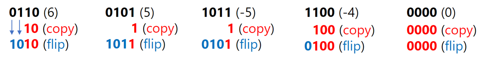
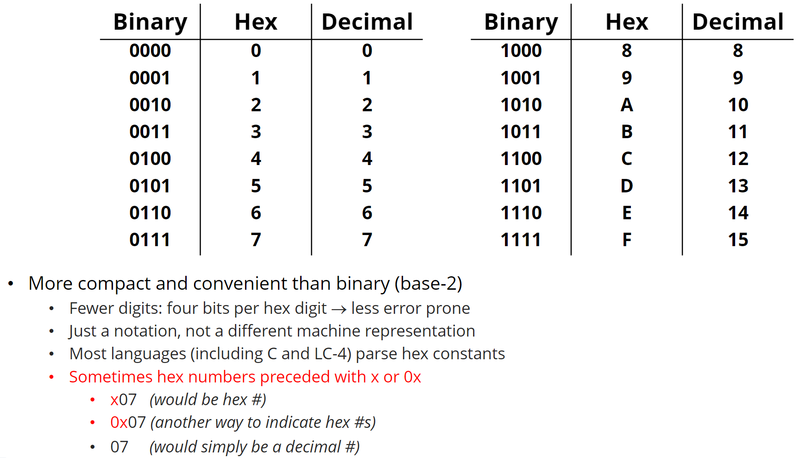
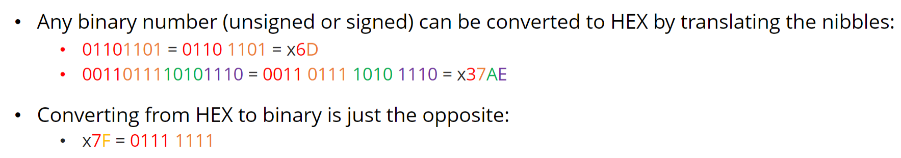
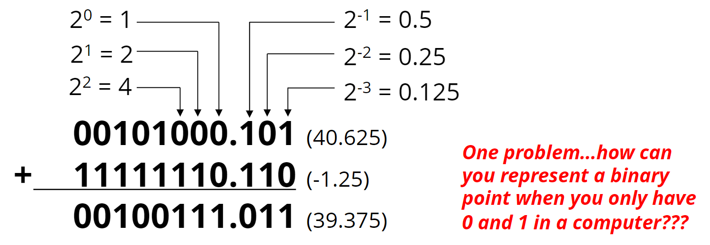
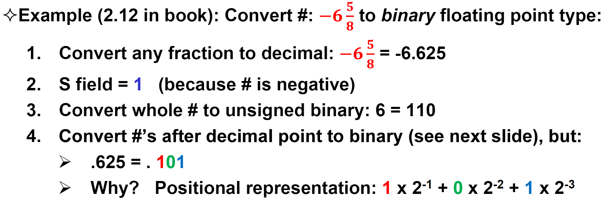
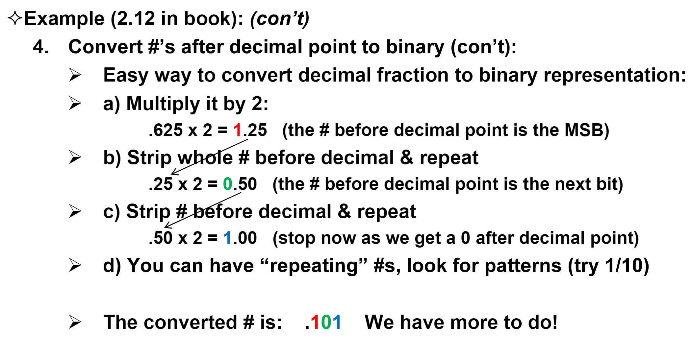
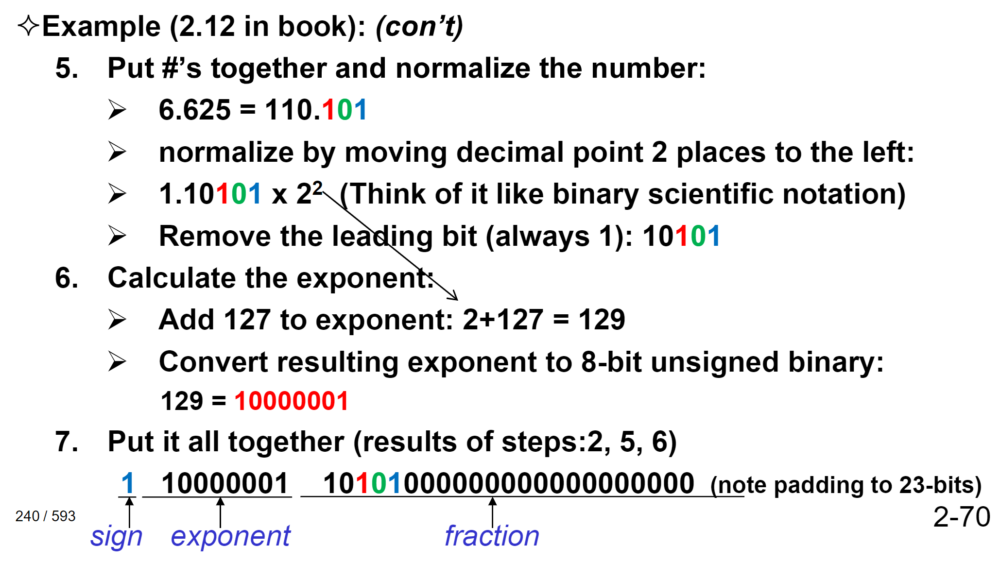
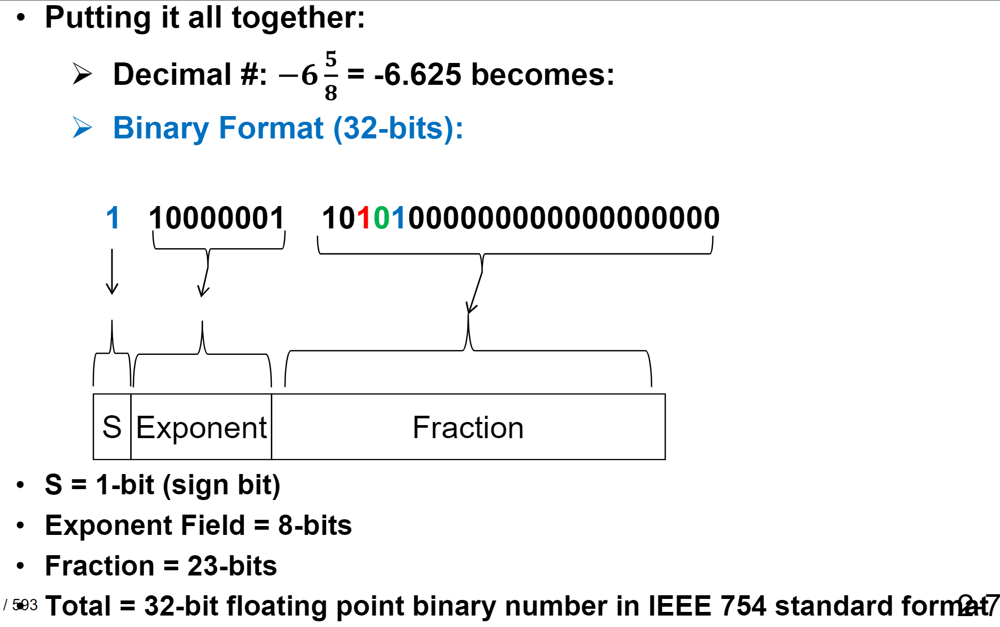

[Back to Main](../main.md)

# Module 01-02 Bits and Bytes

### Concept) Binary Multiplication

 

### Concept) Finite Width and Overflow

- e.g.)
  - Addition
    - The sum of two $`n`$-bit numbers can have $`(n+1)`$-bits.
  - Multiplication
    - The product of two $`n`$-bit numbers can have $`(2n)`$-bits

 

### Concept) Bit, Nibble, Byte
- 1 nibble = 4 bits
- 1 byte = 8 bits

 

### Concept) How to represent negative integers in binary
#### 1) Sign-magnitude

#### 2) 1's Complement

#### 3) 2's Complement

- Concept) Overflow in 2's Complement
  - If you add two positive numbers and get a negative result
  - If you add two negative numbers and get a positive result
    - e.g.)   
      

 

### Tech) Converting Binaries into 2's Complements
1. Tech 1
   - How?)
     - Flip all digits.
     - Add 1.
2. Tech 2
   - How?)
     - Copy bits from right to left up to and including the first 1.
     - Flip remaining bits
   - e.g.)   
     
3. Tech 3
   - How?)
     - Given a 2's Complement number X, to negate it
   - e.g.)   
     

 

### Concept) Sign Extension

### Concept) Encoding : ASCII and Unicode

 

### Concept) Hexadecimal Notation

- Tech.) Converting (Binary) <-> (Hexadecimal)   
   

 

### Tech.) Representing Fractions in Binary
- There are two ways to do it.
  1. [Fixed-Point](#concept-fixed-point)
  2. [Floating-Point](#concept-floating-point)

#### Concept) Fixed-Point
- How?)
  - Use a **binary point** just like the decimal point (소숫점) in the decimal system.   
    
- Problem)
  - Representing the **binary point**!
    - Thus, we use floating point.

#### Concept) Floating-Point
- How?)
  - Use the scientific notation of representing numbers.
    - Sign, Fraction, and Exponent   
      
      - Bias in exponent : To represent negative integers without [2's complements](#3-2s-complement).
- e.g.)   
  
- Prop.)
  - Floating point numbers are inherently approximate.
    - Why?)
      - Representing a rational number in binary system incurs roundoff errors.

#### E.g.) Converting Fractional Decimal to Binary
   
   
   
   

[Back to Main](../main.md)