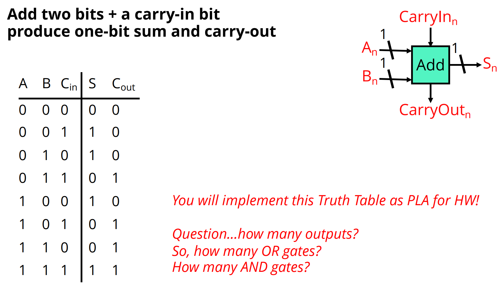
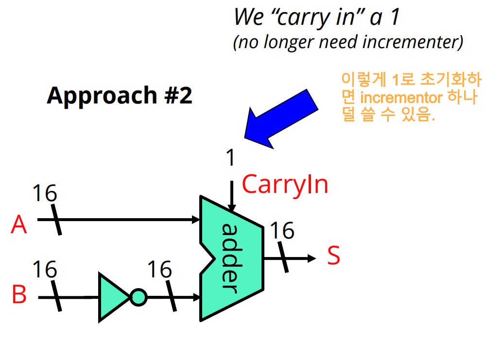

[Back to Main](../main.md)

# 3. Transistors and Combinational Logic
### Concept) Transistor
- Desc.)
  - An electrical device that acts as an electrical switch.
  - Three electrical contact (terminal)
    - Gate
    - Drain
    - Source

### Concept) MOSFET
- Term)
  - **M**etal
  - **O**xide
  - **S**emiconductor
  - **F**ield
  - **E**ffect
  - [**T**ransistor](#concept-transistor)
- Desc.)
  - **Gate** controls flow of the current between **Drain** and **Source**
- Types)
  - [nMOS](#concept-nmos)
    |Charged/Grounded|On/Off|
    |:-:|:-:|
    |Charged|On|
    |Grounded|Off|
  - [pMOS](#concept-pmos)
    |Charged/Grounded|On/Off|
    |:-:|:-:|
    |Charged|Off|
    |Grounded|On|
  - [cMOS]()

 

#### Concept) nMOS
- How it works)
    |Situation|Description|
    |:-|:-|
    |When nMOS Gate has charge.| - The current flows!  |
    |When nMOS Gate is grounded.| - The current doesn't flow! |

#### Concept) pMOS
- Desc.)   
  - Turns on when grounded.
  - Turns off when charged!   
- Architecture
  ||
  |:-:|
  ||

#### Concept) cMOS
- Desc.)
  - [nMOS](#concept-nmos) and [pMOS](#concept-pmos) in complement.
- Why needed?)
  - [nMOS](#concept-nmos) and [pMOS](#concept-pmos) works instantaneously when they are charged.
  - However, when stop charging them, the reaction is not instantaneous.
  - Thus, using single [nMOS](#concept-nmos) or [pMOS](#concept-pmos) can be problematic if we repeatedly charge and discharge them.
  - Instead, if we charge their gates simultaneously, their opposite way of reaction can overcome the problem.
- Architecture)   
  ||
  |:-:|
  ||
  - PUN / PDN   
    ||
    |:-:|
    ||

#### Concept) Electrical Symbols
  |[nMOS](#concept-nmos) and [pMOS](#concept-pmos)  |
  |:-|
  ||
  |High Voltage / Low Voltage|    
  ||

  

### Concept) Logic Gates
- Basic Types of Logic Gates   
  

|Types|Transistor Level|Logic Symbol|Truth Table|
|:-:|:-|:-|:-|
|Inverter Gate||||
|NAND Gate||||
|NOR Gate||||

 

### Concept) Multiple N-Input Gates

 

### Concept) Gate Delays
- With any logic circuit there will be a short delay between the time you change one of the inputs and the time the output settles to its final value.
- This time is referred to as the gate delay.
- Longer the path, more delay!   
  

#### Notations) Virtual Short Hands for...
|Type|Description|
|:-:|:-|
|Multi-Bit Gates||
|Inverting Signals||

 

### Tech) Logic Gates to Truth Table and Boolean Function

 

### Concept.) PLA (Programmable Logic Array)
- Desc.)
  - Simple way to implement any truth table
  - PLA does NOT give the most efficient solution.
- Implementation)   
  

 

### Concept) Boolean Algebra

  

### Concept) Incrementor
- Desc.)
  - Given input A, output A+1.
- When used?)
  - e.g.) Getting 2C number.
    - Flip bits and **add 1**.
- Implementations)
  - [One-Bit Incrementor]()
  - [N-Bit Incrementor]()

 

#### Concept) One-Bit Incrementor

 

#### Concept) N-Bit Incrementor

- Carry in 1 to the LSB.   
  

 

### Concept) Half Adder

- Limit)
  - Half adder can add 1 to the input and return the result.
  - However, it cannot add two arbitrary numbers.
    - i.e.) One operand is fixed as 1.   
      
      - Sol.) Add another input!   
        
        - i.e.) [One-Bit Adder (Full Adder)](#concept-one-bit-adder-full-adder)

 

### Concept) One-Bit Adder (Full Adder)

- Prop.)
  - Also known as a ripple carry adder.
  - Too slow.
    - Why?) Latency proportional to $`n`$
    - Other adders work in $`\log(n)`$
    - Theoretically, huge PLA works in a constant time.

 

### Concept) Subtractor
- Idea)
  - $`A - B = A + (-B)`$
  - We can easily convert $`B`$ into $`-B`$ using 2C.
- Implementations)
  |No.|Desc.|Props.|
  |:-:|:-|:-|
  |1||- Additional [incrementor](#concept-incrementor) used.|
  |2||- One incrementor saved architecture.|

 

### Concept) Mux (Multiplexer)

|Multi-bit Mux|  
|:-| 
||
- Application)
  - Adder/Subtractor
    - A machine that can choose whether to add or subtract.   
      

[Back to Main](../main.md)