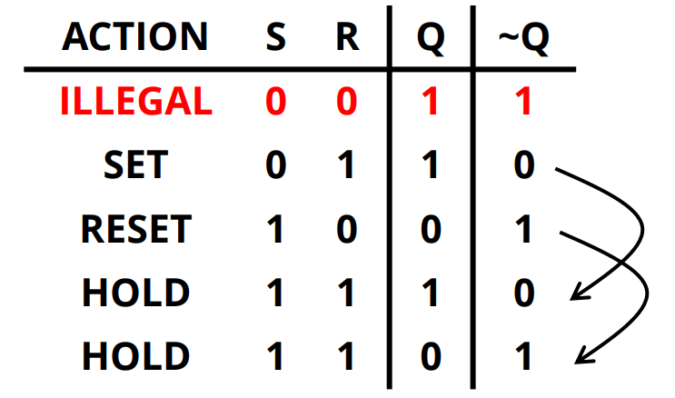
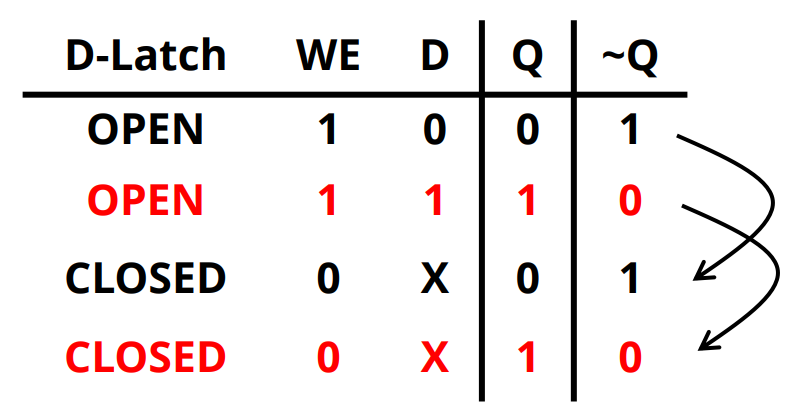
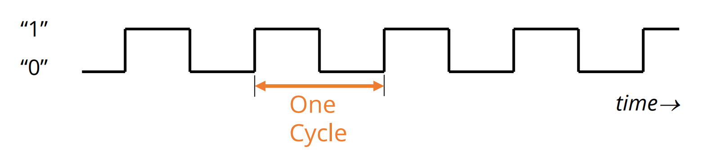
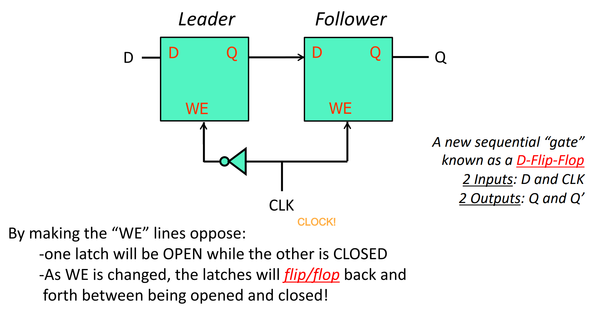
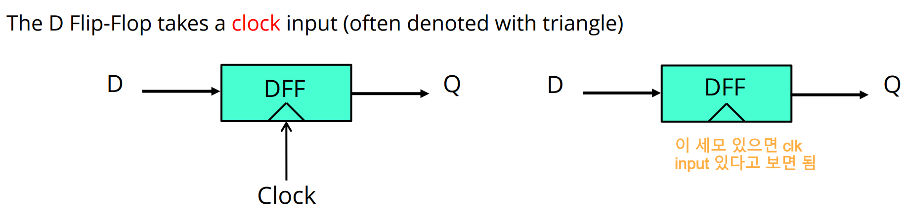
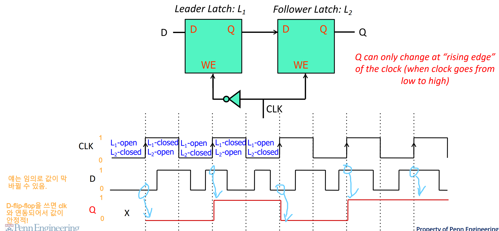

[Back to Main](../main.md)

# 4. Sequential Logic to Memory
### Concept) Combinational Logic vs Sequential Logic
|Logic Type|Desc.|
|:-:|:-|
|Combinational Logic|- Always gives the same output for a given set of inputs   - Stateless|
|Sequential Logic|- Its output depends on its inputs & its last output!   - Forms the basis for “state” or “memory” for a computer|

## 4.1 Sequential Logic
- Three Basic Sequential Logic Gates
  - [R-S Latch](#concept-r-s-latch)
  - [D-Latch](#concept-d-latch)
  - [D-Flip-Flop](#concept-d-flip-flop)

### Concept) R-S Latch
- Desc.)
  ||
  |:-|
  ||
- Props.)
  - A **bi-stable** circuit 
    - i.e.) it can happily exist in either of two stable states.
    - You can push the latch from one state to another by **setting** or **resetting** it with the S-R signals
    - The logic levels are maintained because of the feedback paths from outputs to inputs.
  - Truth Table
    ||
    |:-:|
    ||

 

### Concept) D-Latch
|Desc.||
|:-:|:-|
|Architecture||
|Truth Table||
|Terms|- Opened : Q follows D   - Closed : Q holds old value of Q   - Why D-Latch?) Because it holds **Data**|

 

#### Concept) Clock
- Desc.)
  - A clock controls when stored values are “updated."
    |Oscillating global signal with fixed period|
    |:-|
    ||
- Related Concept)
  - Clock Frequency : The number of cycles per second
  - Clock Period : the duration of one clock cycle
    - The Inverse Relationship)
      - $`(\text{Clock Frequency}) = (\text{Clock Period})^{-1}`$
        - e.g.)
          - Clock Frequency = 2.5GHz
          - The Corresponding Period = 1/(2.5GHz) seconds $`\approx`$ 0.4 nanoseconds

 

### Concept) D-Flip-Flop
|Desc.||
|:-:|:-|
|Architecture||
|Clock Notation||
- Prop.)
  - The Flip-Flop only accepts new data when [CLK](#concept-clock) transitions from 0 to 1.   
    
    - Why do it?) 
      - Lengthens window of opportunity to read from flipflop 
      - Shortens the window of opportunity to write

 

[Back to Main](../main.md)