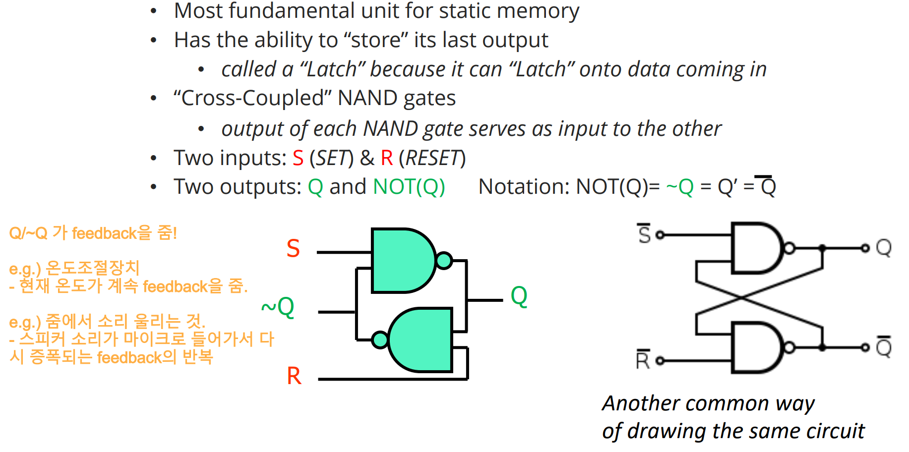

[Back to Main](../main.md)

# 4. Sequential Logic to Memory
### Concept) Combinational Logic vs Sequential Logic
|Logic Type|Desc.|
|:-:|:-|
|[Combinational Logic](m03.md#3-transistors-and-combinational-logic)|- Always gives the same output for a given set of inputs   - Stateless|
|Sequential Logic|- Its output depends on its inputs & its last output!   - Forms the basis for “state” or “memory” for a computer|

### Concept) Basic Storage Elements
- Types covered
  - [R-S Latch](#concept-r-s-latch)
  - [D-Latch](#concept-d-latch)
  - [D-Flip-Flop](#concept-d-flip-flop)

### Concept) R-S Latch
- Desc.)
  ||
  |:-|
  ||  
- Props.)
  - A **bi-stable** circuit 
    - i.e.) it can happily exist in either of two stable states.
    - You can push the latch from one state to another by **setting** or **resetting** it with the S-R signals
    - The logic levels are maintained because of the feedback paths from outputs to inputs.
  - Truth Table
    ||
    |:-:|
    ||
    |- HOLD is also called as quiescent or quite state.|

 

### Concept) D-Latch
|Desc.||
|:-:|:-|
|Architecture||
|Truth Table||
|Terms|- Opened : Q follows D   - Closed : Q holds old value of Q   - Why D-Latch?) Because it holds **Data**|

 

#### Concept) Clock
- Desc.)
  - A clock controls when stored values are “updated."
    |Oscillating global signal with fixed period|
    |:-|
    ||
- Related Concept)
  - Clock Frequency : The number of cycles per second
  - Clock Period : the duration of one clock cycle
    - The Inverse Relationship)
      - $`(\text{Clock Frequency}) = (\text{Clock Period})^{-1}`$
        - e.g.)
          - Clock Frequency = 2.5GHz
          - The Corresponding Period = 1/(2.5GHz) seconds $`\approx`$ 0.4 nanoseconds
            - cf.) $`10^{-9} = \text{nano}`$

 

### Concept) D-Flip-Flop
|Desc.||
|:-:|:-|
|Architecture||
|Clock Notation||
- Prop.)
  - The Flip-Flop only accepts new data when [CLK](#concept-clock) transitions from 0 to 1.   
    
    - Why do it?) 
      - Lengthens window of opportunity to read from flipflop 
      - Shortens the window of opportunity to write
- Cf.)
  - Negative DFF
    - CLK : 1->0 Update!

 

### Concept) Register
- Def.)
  - A structure that stores a number of bits, taken together as a unit. 
    - i.e.) a collection of [Sequential Logic Circuits](#41-sequential-logic-circuit) controlled by a common **WE (write enable)**
- Notation)
  - Field : $`Q[l:r]`$
    - A subunit of $`n`$-bit output $`Q`$ starting from the $`l`$-leftmost digit to the $`r`$-leftmost digit.
      - e.g.)
        - Consider a 16-bit pattern $`0011101100011110`$.
          - i.e.) $`Q[15]=0, Q[14]=0, Q[13]=1, Q[12]=1, \cdots, Q[1]=1, Q[0]=0`$.
        - Then $`Q[15:12] = 0011`$
- Types
  |Type|Desc.|
  |:-:|:-|
  |D-Latch Based Register||
  |D-Flip-Flop Based Register|   - At the beginning of each [clock period](#concept-clock), the output data is synchronized with the input data.   - **WE** will be added in **RAM**|

 

### Concept) Memory
- Terms)
  |Term|Desc.|
  |:-:|:-|
  |Address|- The address of the location that the data is located at.   - Denoted by binary numbers. (e.g. 2-bit : 00, 01, 10, 11)|
  |Address Space|- number of locations : $`k = 2^n`$|
  |Addressability|- the number of bits per location (e.g. byte-addressable = 8-bits)   - Each row is called word line|
  |||
  |Data|- $`\text{D}_\text{out}`$ : Contents of selected locations during read  - $`\text{D}_\text{in}`$ : Value to be stored during write|
  |WE|- $`\text{WE} = \begin{cases} 0 & \text{read} \\ 0 & \text{write} \end{cases}`$|
  - e.g.) 
    |$`2^n`$ by $`m`$-bit Memory|
    |:-:|
    ||

#### E.g.) Single Port 4 by 3-bit Memory
- Architecture)
  - Read Operation   
    
  - Write Operation
    - Two Additional Devices)
      - A [decoder](m03.md#concept-decoder) is used to find the exact [register](#concept-register) to write the input data.   
        
        - Why?)
          - The input to the decoder is given by $`n`$-bit input.
          - We have to decode this $`n`$-bit information to find the target register.
      - WE is implemented using a [mux](m03.md#concept-mux-multiplexer) with WE as the control signal.   
        
        - Why?) 
          - Recall that in the [D-Flip-Flop register](#concept-register), the output data is synchronized to the input data at the beginning of every [clock period](#clock). 
          - If we add [mux](m03.md#concept-mux-multiplexer) before the [D-Flip-Flop register](#concept-register) and assign WE as the control signal, we can control whether to output the input at the beginning of each [clock period](#clock) or not, i.e., ignoring the [clock](#concept-clock) if needed!
  - Incorporated Version   
    
- Limit)
  - It allows only a single read and a single write.
    - Sol.) [Multiport Memory](#concept-multiport-memory)

 

### Concept) Multiport Memory
#### e.g.) Independent Read / Write
||
|:-|
||
|- Two inputs for Address : $`\text{A}_\text{read}, \text{A}_\text{write}`$   - Thus, we can specify which register to read and write independently.|

 

#### e.g.) Independent 2 Read / 1 Write 
||
|:-|
||
|- Three inputs for Address : $`\text{A}_\text{read 1}, \text{A}_\text{read 2}, \text{A}_\text{write}`$   - Two inputs for Output : $`\text{D}_\text{read 1}, \text{D}_\text{read 2}`$   - Thus, we can specify two registers for the read operation and one register for the write operation.|

## 4.1 Sequential Logic Circuit
- Desc.)
  - A digital logic structures that can both process information (i.e., make decisions) and store information.
  - Unlike combinational logic circuits, it contains [storage elements](#concept-basic-storage-elements) that allow it to keep track of prior history information.
- Architecture   
  

 

### Concept) Finite State Machine
- Def.)
  - A machine that has a finite number of states.
- Prop.)
  - In general a Finite State Machine consists of 3 parts:
    - An n-bit [register](#concept-register) which stores the state of the machine
      - [Sequential Logic Block](#concept-combinational-logic-vs-sequential-logic)
    - A **block of logic** that computes the next state as a function of the current state and the inputs, if any
      - [Combinational Logic Block](#concept-combinational-logic-vs-sequential-logic)
    - A block of logic which computes the output based on the current state
      - [Combinational Logic Block](#concept-combinational-logic-vs-sequential-logic)
- Desc.)
  ||
  |:-|
  ||
- State Diagram
  - States in Circle
  - 

#### E.g.) Counter
- Desc.)
  - A [finite state machine](#concept-finite-state-machine) that [increments](m03.md#concept-incrementor) its value by one at each [clock period](#concept-clock).
- Architecture
  |3-bit input/output|
  |:-|
  |   - This one does not have Input.  - But think of it as an initializer.|

 

[Back to Main](../main.md)