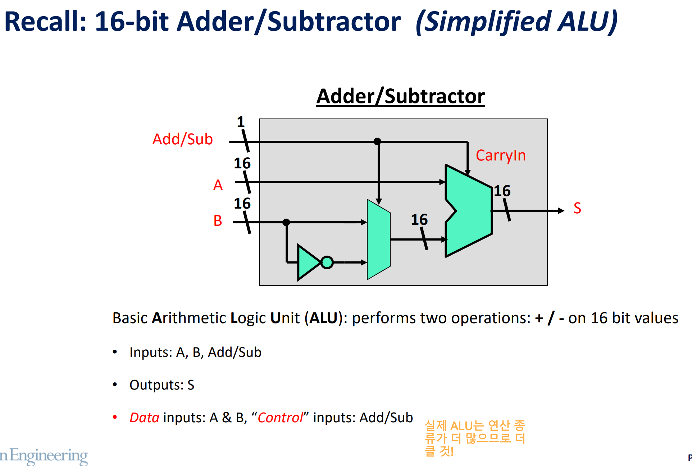
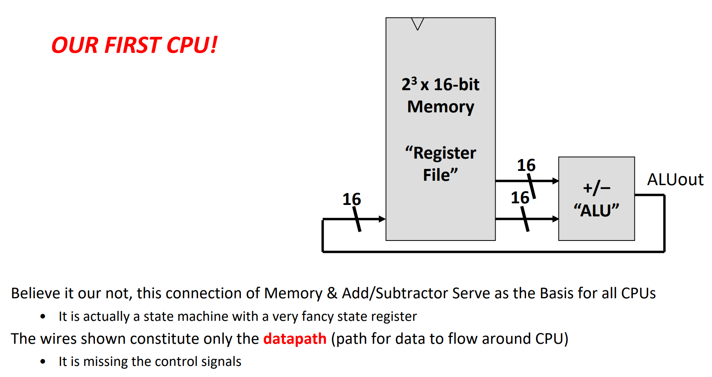
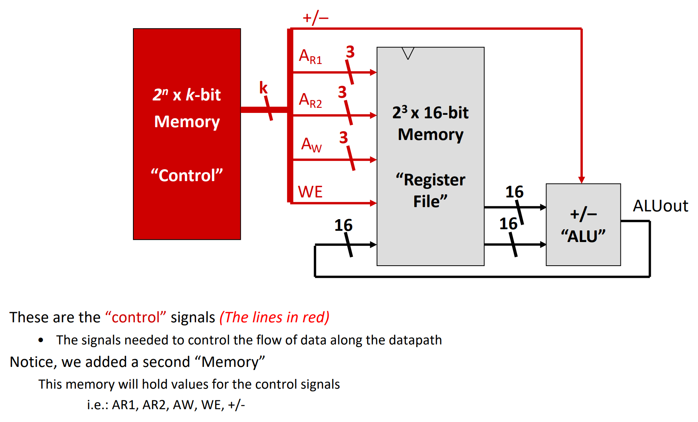
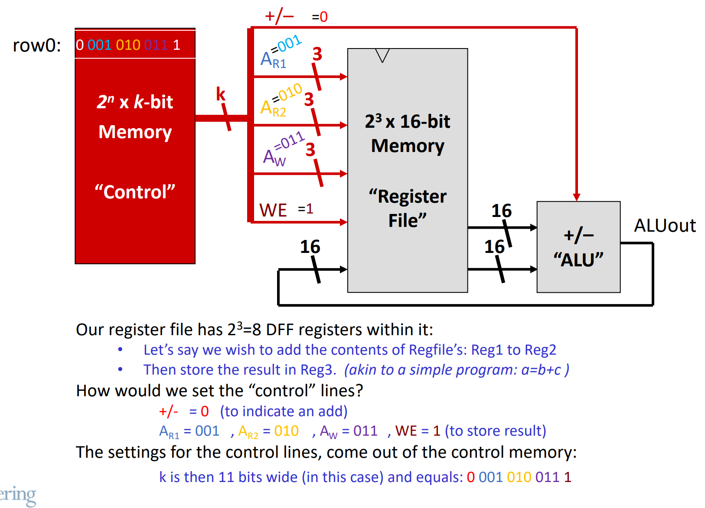
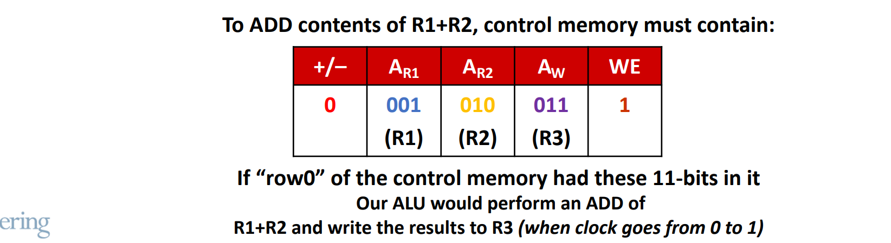
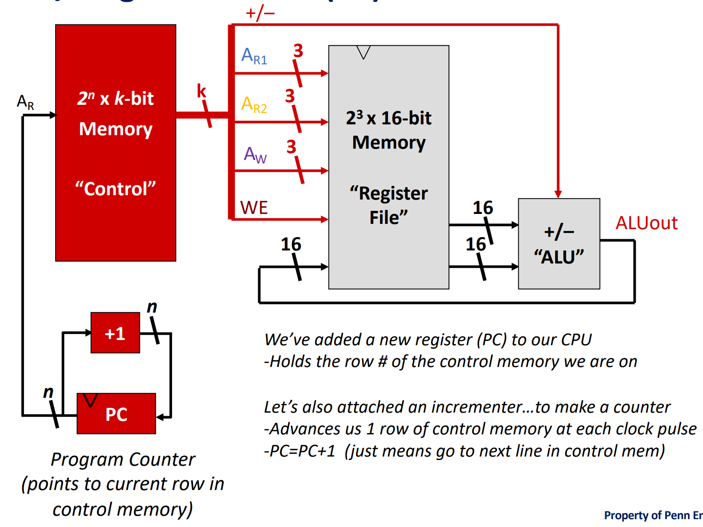

[Back to Main](../main.md)

# 5. Making a Basic CPU
### Concept) Four Components of CPU
1. [ALU](#concept-alu-arithmetic-logic-unit)
2. Register File : Memory for Data
3. Control Memory : Memory for Instructions
4. Program Counter

 

### Concept) ALU (Arithmetic Logic Unit)
- Desc.)
  - A unit that performs arithmetic operations
    - e.g.) Addition, Subtraction, Multiplication, Division, etc.
- Simplified Version   
  
  - Recall the Adder/Subtractor as the application of [MUX](m03.md#concept-mux-multiplexer).

### Concept) Wires in CPU
1. [Datapath](#concept-datapath)
2. [Control Signals](#concept-control-signals)

#### Concept) Datapath
- Desc.)
  - Wires/Pathways that allow you to move information (data) around the CPU
- e.g.) with ALU and Register Files   
  

#### Concept) Control Signals
- Desc.)
  - Signals that setup the pathways so data can flow through CPU
  - Diagram with ALU, Register Files, and Control   
    

 

#### E.g.) Adding Two Numbers
- Machine Code : 0 001 010 011 1
  |Code|Meaning|
  |:-:|:-|
  |0|Add|
  |001|First Operand : 001-th address of the Register file|
  |010|Second Operand : 010-th address of the Register file|
  |011|Write Output at : 011-th address of the Register file|
  |1|Write Enabled!|

     
     

 

### Concept) Program Counter
- Desc.)
  - Holds “state” of control memory
  - Essentially tells us what row of control memory to lookup
- Diagram) Simple Processor with **Program Counter**   
  

[Back to Main](../main.md)