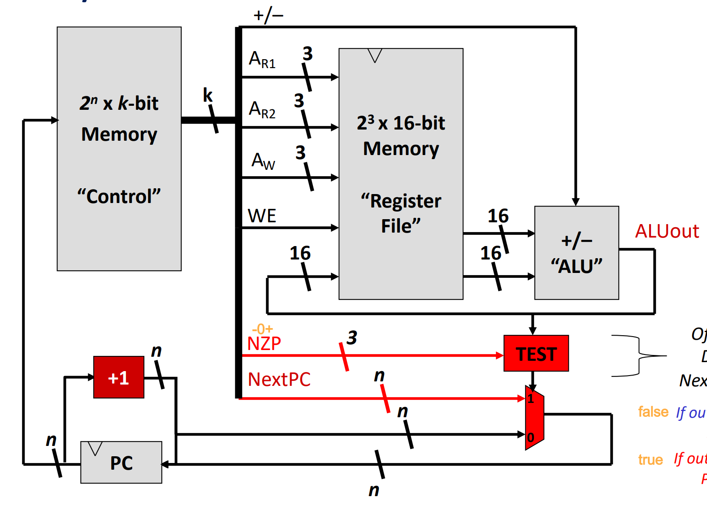
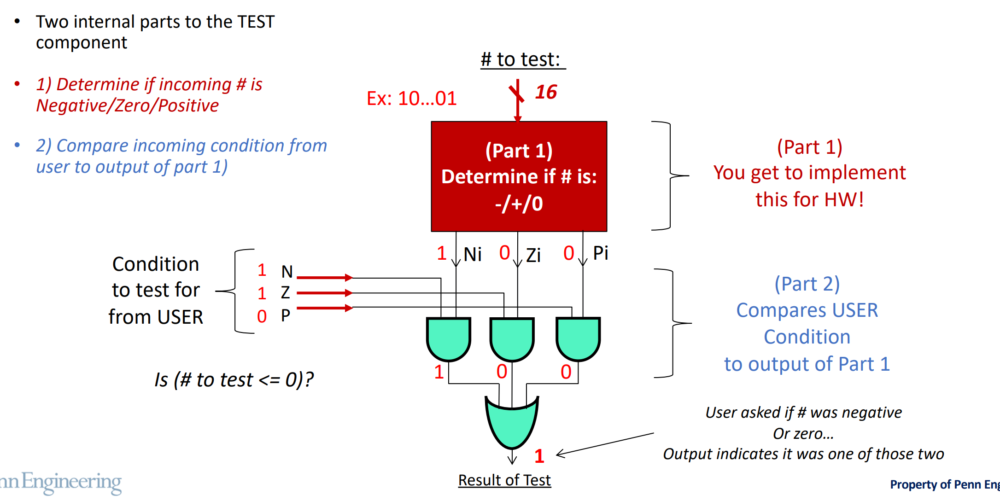
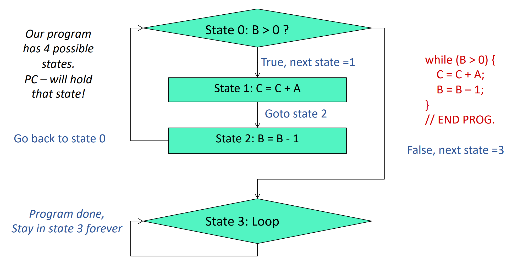
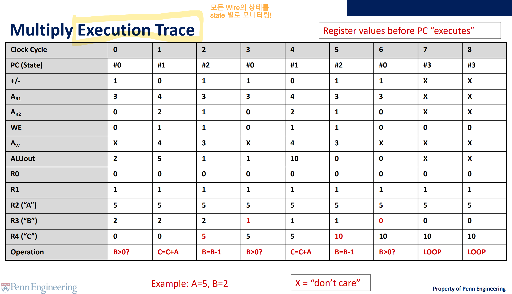

[Back to Main](../main.md)

# 5. Making a Basic CPU
### Concept) CPU
- Four Components
  1. [ALU](#concept-alu-arithmetic-logic-unit)
  2. Register File : Memory for Data
  3. Control Memory : Memory for Instructions
  4. Program Counter
- Complete Architecture)   
  

<br>

### Concept) ALU (Arithmetic Logic Unit)
- Desc.)
  - A unit that performs arithmetic operations
    - e.g.) Addition, Subtraction, Multiplication, Division, etc.
- Simplified Version   
  
  - Recall the Adder/Subtractor as the application of [MUX](m03.md#concept-mux-multiplexer).

### Concept) Wires in CPU
1. [Datapath](#concept-datapath)
2. [Control Signals](#concept-control-signals)

#### Concept) Datapath
- Desc.)
  - Wires/Pathways that allow you to move information (data) around the CPU
- e.g.) with ALU and Register Files   
  


#### Concept) Memory for Data
- Components)
  - Memory Address Register (MAR)
    - It stores the addresses of the location that data are stored.
  - Memory Data Register (MDR)
    - It stores the actual data.


#### Concept) Control Signals
- Desc.)
  - Signals that setup the pathways so data can flow through CPU
  - Diagram with ALU, Register Files, and Control   
    

<br>

#### E.g.) Adding Two Numbers
- Machine Code : 0 001 010 011 1
  |Code|Meaning|
  |:-:|:-|
  |0|Add|
  |001|First Operand : 001-th address of the Register file|
  |010|Second Operand : 010-th address of the Register file|
  |011|Write Output at : 011-th address of the Register file|
  |1|Write Enabled!|

     
     


<br>

### Concept) Program Counter
- Desc.)
  - Holds “state” of control memory
  - Essentially tells us what row of control memory to lookup
- Diagram) Simple Processor with **Program Counter**   
  

<br>


### Concept) Comparison Operation for Program Counter
- Goal)
  - The machine code from the [Control signal](#concept-control-signals) provides...
    - a condition 
    - an arbitrary [Program Counter](#concept-program-counter) value,
  - If the condition is... 
    - True, then assign [Program Counter](#concept-program-counter) with the given value.
    - False, then follow the original incrementing logic of the [Program Counter](#concept-program-counter).
- How it works?)
  - The machine code from the [Control signal](#concept-control-signals) has 
    - Two operands to apply the comparison operation.
    - the NZP value 
    - the Next[PC](#concept-program-counter) value.
  - Subtraction between the operands are done by [ALU](#concept-alu-arithmetic-logic-unit).
    - This output is inputted to the [TEST Circuit](#concept-test-circuit)
  - [TEST Circuit](#concept-test-circuit) uses the subtracted value from the [ALU](#concept-alu-arithmetic-logic-unit) and the NZP value from the [Control signal](#concept-control-signals).
    - And determine whether the given NZP corresponds with the result of the subtraction.
    - It returns 1 if true and 0 if false.
  - The [mux](m03.md#concept-mux-multiplexer) gets the output from the [TEST Circuit](#concept-test-circuit) and choose
    - NextPC value from the [Control signal](#concept-control-signals) if the input is 1
    - PC+1  if the input is 0.

<br>

#### Concept) TEST Circuit
- What it does?)
  - Get a value and investigate whether the value is **N**egative, **Z**ero, or **P**ositive.
- Architecture)
  - Inputs)
    - Target value from the [ALU](#concept-alu-arithmetic-logic-unit)
      - Suppose we are comparing two values $`a`$ and $`b`$.
      - Then the [ALU](#concept-alu-arithmetic-logic-unit) performs $`a-b`$.
      - This output is inputted to the TEST Circuit as $`x`$ below.
    - NZP from the [Control Signals](#concept-control-signals)
      |NZP|Corresponding Sign|
      |:-:|:-:|
      |000|Forcing the result to 0, $`\forall x`$|
      |001|Positive : $`x \gt 0`$|
      |010|Zero : $`x = 0`$|
      |011|Zero or Positive : $`x \ge 0`$|
      |100|Negative : $`x \lt 0`$|
      |101|-|
      |110|Negative or Zero : $`x \le 0`$|
      |111|Forcing the result to 1, $`\forall x`$|
      - AKA Compound Condition
        - e.g.) Zero or Negative
  - Diagram)
    ||
    |:-:|
    ||
  - Output)
    - 1 if input value corresponds with the NZP.
    - 0 otherwise.


#### E.g.) Multiplication Implemented with While Loop
- Situation)
  - Consider that our CPU can support only the addition and the subtraction.
  - We want to implement multiplication with some algorithm.
  - Let's derive the control signals for this.
- Code)
  ```
  C = 0;
  while (B > 0) {
    C = C + A;
    B = B - 1;
  }
  ```
- State Diagram)
  ||
  |:-:|
  ||
- Execution Trace)
  ||
  |:-:|
  ||


[Back to Main](../main.md)