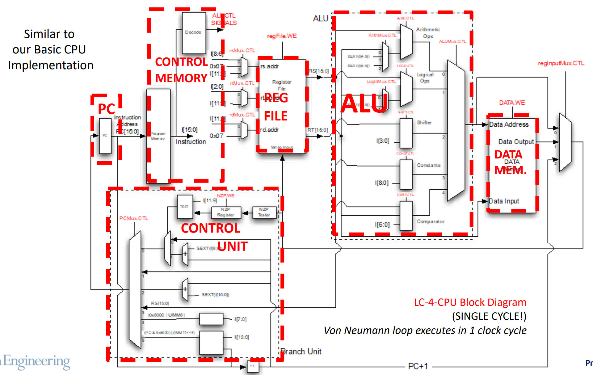

[Back to Main](../main.md)

# 6. ISA - HW/SW Bridge
### Concept) LC-4 (Little Computer version 4)
- Architecture
  ||
  |:-|
  ||
  |- Von Neumann Loop)   -- Fetch instruction at PC   -- Decode instruction (Convert to Control Signals!)   -- Execute instruction   -- Update PC|

 

### Concept) Instruction Set Architecture (ISA)
- Desc.)
  - Programmer-visible components and operations
  - It contains everything needed to create a program for CPU.
  - It serves as a contract between programmer and CPU designer.
    - Different implementations of same ISA are "binary compatible"
  - It is backward compatible
    - i.e.) The ones worked for previous version of ISA also works for the future versions.

 

## 6.1 Basic Components
### Concept) Memory
- Props.)
  ||Our LC-4|Real ISAs|
  |:-:|:-|:-|
  |Address Space|- $`2^{16}`$ locations|- $`2^{64}`$ locations|
  |Addressability|- $`16`$-bits   - Data type can be 16-bit 2C int, ASCII chars, RGB pixels.   - Floating point not supported.|- $`8`$-bits   - But can read/write data in different size chunks (1,2,4,8 bytes)|
- Partitions)
  - Program Memory : Stores instructions
  - Data Memory : Stores data for the long term

 

### Concept) Registers
#### Register File
- 8 registers of 16-bits wide each
  - Mnemonic Naming : R0, R1, R2, ..., R7
  - Binary Reference : 000, 001, 002, ..., 111
  - Hexadecimal Reference : x00, x01, x02, ..., x07

#### Program Counter
- 16-bits
  - Why?) 
    - Recall that the Program Memory had $`2^{16}`$ locations.
- Hexadecimal Notation
  - i.e.) x0000 ~ xFFFF

#### Processor Status-Word Register (PSR)
- NZP result of each cycle is stored here.
- 16-bit PSR
- This includes NZP condition codes.
- Not directly accessible, but used by instructions.

 

### Concept) Instruction Set
- Types)
  - Total of 29 instructions in 7 instruction categories:
    1. Arithmetic Instructions (ADD/SUB/MUL/DIV/MOD)
    2. Logical Instructions (BITWISE AND, OR, ETC)
    3. Shift Instructions
    4. Comparison Instructions
       - Do comparison and store the NZP result on [PSR](#processor-status-word-register-psr), not on the Register File.
    5. Load/Store Instructions
    6. Loading Constants
    7. Program Control
       - Branches
         - Just check the NZP digits on PSR
       - Jumps
         - Simple Jumps : JMP, JMPR
         - Jump Subroutine : JSR, JSRR
       - TRAP/RTI – Operating System Calls
- Format)
  - Fixed length of 16-bit instruction : $`I[15:0]`$
    - Optcode : $`I[15:12]`$
      - It specifies datapath control signals.
  - cf.) SEXT (Sign Extension)
    - Padding previously the most significant bit

 

### Concept) Branch Unit
- Desc.)
  - Responsibilities)
    - Control the next value of Program Counter
  - Components)
    1. NZP Tester
       - Input : Output from ALU
       - Output : NZP in 3-bits value (e.g. N=100)
    2. NZP Register
       - Stores the output of NZP Tester.
       - Least Significant 3-bits in [PSR](#processor-status-word-register-psr)
         - i.e.) PSR[2:0]
    3. Test
       - Inputs
         - I[11:9] : User inquiry
           - e.g.) $`\text{Is it } N\vert Z?\Leftrightarrow 110`$
         - Value stored in NZP Register
       - Output
         - Return 1 if I[11:9] == NZP Register value.
         - Return 0 otherwise.

 

[Back to Main](../main.md)