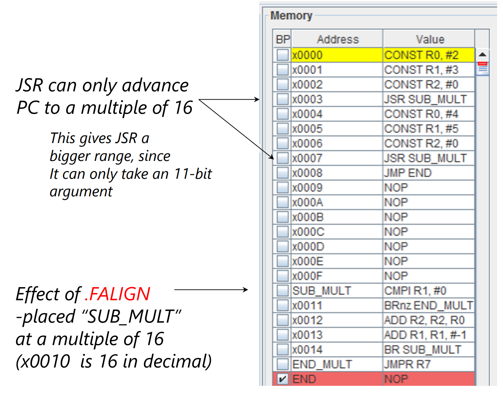
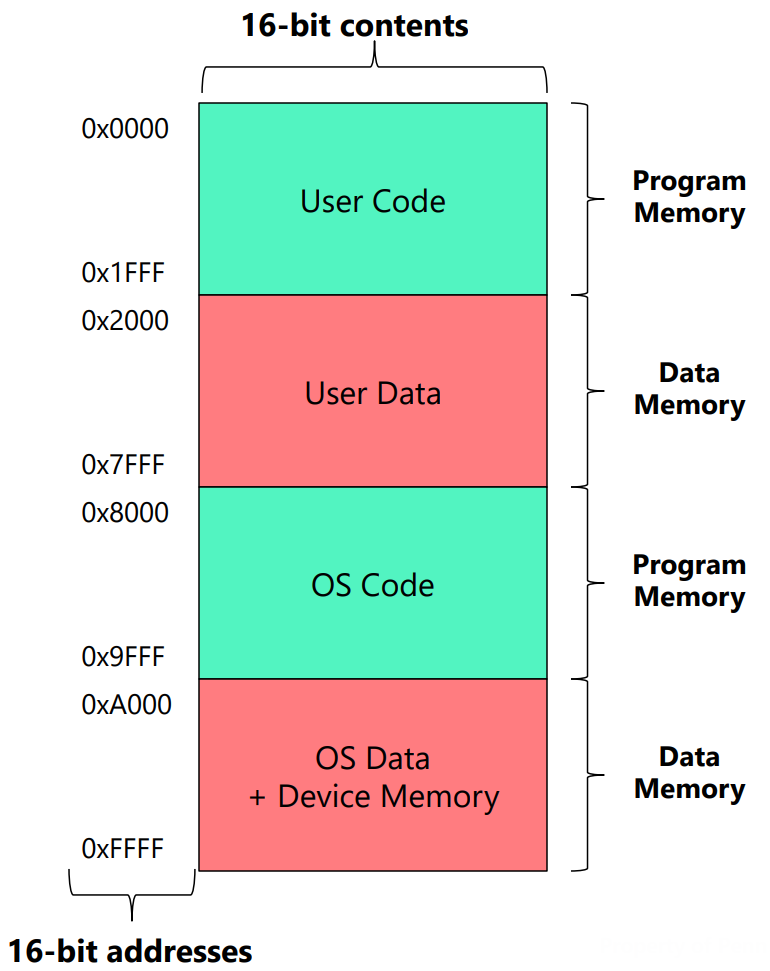
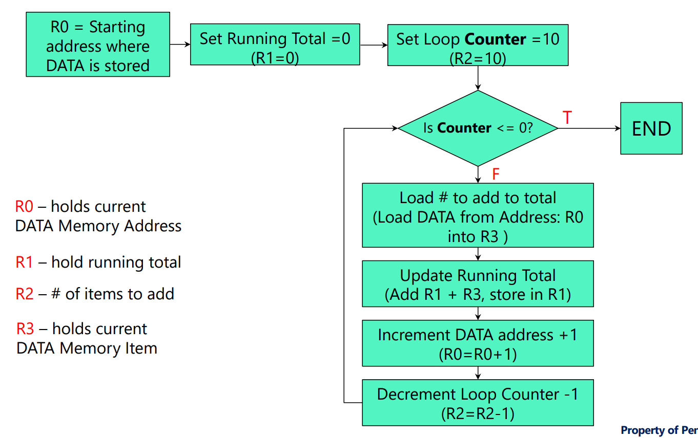

[Back to Main](../main.md)

# 7. Programming with LC-4 Assembly Language
### Concept) Machine Language
- Desc.)
  - Bit patterns that are directly executable by computer
  - Assembled into files called objects, binaries, executables
  - `.obj` format

<br>

### Concept) Assembly Language
- Desc.)
  - Instructions as mnemonic ASCII strings
  - Can't run byt human readable
  - `.asm` format

<br>

### Concept) Assembler
- Desc.)
  - It produces object file (`.obj`) from assembly file (`.asm`).
- Directives)
  - `.FALIGN` : Aligns a subroutine to the multiple of 16.   
    - [e.g](#concept-subroutine)

<br>

### Concept) Subroutine
- Desc.)
  - A subroutine is similar to a “function” in a high level language
  - Procedure)
    1. Give the subroutine a unique name using a LABEL.
    2. Ensure subroutine is loaded at memory address that is multiple of 16.
       - How) Our first directive: `.FALIGN`
       - Why doing this?)
         - Our goal is to scatter out the subroutines throughout the addresses of the Data Memory.
         - By loading subroutines at memory address that is multiple of 16, each subroutine is guaranteed with at least 15 lines below them.
         - If they are not used, they are wasted (for now).
       - Why multiple of 16?)
         - ISA Part)
           - First, consider the ISA that enables **jumping** instructions.
             - Among 16-bits in the machine code, 4 are used for the opcode and 1 is used separate each instructions in each category.
               |Instruction|Machine Code|
               |:-:|:-:|
               |`JMP`  |11001~|
               |`JMPR` |11000~|
               |`JSR`  |01001~|
               |`JSRR` |01000~|
           - Thus, 16-5=11 is the maximum number of digits that `JMP` and `JSR` can get as an input.
             - i.e.) `IMM11`
         - Data Memory Address Space Part)
           - Now, consider that our data memory is the 16-bits [address space](m04.md#concept-memory) Data Memory.
           - We defined that, the MSB of each address is used to [partition the ownership of the data memory into the User and the OS](#concept-partitioning-data-memory).
           - Thus, for the 16-bit address, we should allocate one digit, the MSB, for the [partitioning](#concept-partitioning-data-memory).
           - Also, recall that `JMP` and `JSR` brought `IMM11` as an user input for the address.
           - Thus, we should allocate these 11-digits in the address as well.
           - Hence, we have only 4 digits left in the address 
             - Why?) $`16-1(\text{MSB})-11(\text{IMM11}) = 4`$
           - Using the left-shift operation (IMM11 << 4), we can allocate each program counter as below:   
             $`\underbrace{\_}_{\text{User/Os}} \; \underbrace{\_\;\_\;\_\;\_\;\_\;\_\;\_\;\_\;\_\;\_\;\_}_{\text{IMM11 from JSR/JMP}} \; \underbrace{\_\;\_\;\_\;\_}_{\text{remaining 4 digits!}}`$
           - These remaining least significant 4 digits corresponds to $`2^4=16`$ addresses.
           - Therefore, in order to scatter subroutines as much as possible, the system allocates at least 16 lines to each subroutines.
           - And, this is implemented by securing the addresses of subroutines to be the multiple of 16.
    3. Pass it arguments by using the register file: R0-R6. (Not R7!)
    4. Call the subroutine using ISA instruction: `JSR`
       |Mnemonic|Semantics|
       |:-|:-|
       |`JSR IMM11 <LABEL>`|`R7 = PC+1`<br>`PC = (PC & 0x8000) \| (IMM11 << 4)` : Making `IMM11` a multiple of 16|
       - Desc.)
         - cf.) The MSB of PC determines whether it's a PGM (0) or the OS (1). 
           - To secure this the operation utilizes `PC & 0X8000`.
    5. Return data using the register file: R0-R6
    6. Return from the subroutine using ISA pseudo-instruction: `RET`
       |Mnemonic|Semantics|
       |:-|:-|
       |`RET`|`JMPR R7`|
  - For each subroutines, the register file may hold
    - arguments
    - return values
- Syntax)
  - `.FALIGN` : Aligns a subroutine to the multiple of 16.   
    

<br><br>

### Concept) Partitioning Data Memory
- Desc.)
  - Previously, we assumed that the program memory and the data memory are separate.
  - However, in the real-word architecture, they all reside in the data memory, partitioned into separate parts.
- Architecture)
  ||
  |:-|
  ||  
  - The MSB of the address partitions addresses into the User and the OS.
    - MSB = 0 : 0x0000 ~ 0x7FFF : User
    - MSB = 1 : 0x8000 ~ 0xFFFF : OS
  - Each partition is again partitioned into Program Memory and the Data Memory.
    - User
      - User Code : 0x0000 ~ 0x1FFF
      - User Data : 0x8000 ~ 0x7FFF
    - OS
      - User Code : 0x8000 ~ 0x9FFF
      - User Data : 0xA000 ~ 0xFFFF

<br>

<br>

#### Concept) Pointer
- Desc.)
  - A variable that contains the address of a memory location
- e.g.)
  - Check [the `LDR` operation example](#tech-working-with-data-memory) below.

<br>

### Tech) Working with Data Memory
- Ideation)
  - Recall that the **register file** has only 8 addresses : R0 ~ R7
    - Why?)
      - More address $`\Rightarrow`$ More decoder $`\Rightarrow`$ Slower speed.
      - Let [data memory](#concept-partitioning-data-memory) to do the storing job with slower speed.
  - Thus, the **register file** should collaborate with the [data memory](#concept-partitioning-data-memory) to perform operations that requires more than 8 memory slots.
    - How?)
      - Load register instruction using the `LDR` instruction.
      - Store the value in the data memory using the `STR` instruction.

#### Basic Mechanism)
- Load address of the **data memory** on the **register**.
  - Use `CONST` and `HICONST` for manual loading.
    - e.g.) Loading x4000 to R0
      ```Assembly
      CONST R0, x00   ; Low 8-bits with 0000 0000.
      HICONST R0, x40 ; High 8-bits with 0100 0000
      ```
- Load the data from the **data memory** on the **register**.
  - Use `LDR`.
    - e.g.) With the [pointer](#concept-pointer) at x4000 load the data at x4000 to R3
      ```Assembly
      LDR R3, R0, #0  ; offset 0
      ```
    - e.g.) With the [pointer](#concept-pointer) at x4000 load the data at x4001 to R3
      ```Assembly
      LDR R3, R0, #1  ; offset 1
      ```
    - e.g.) With the [pointer](#concept-pointer) at x4000 load the data at x4002 to R3
      ```Assembly
      LDR R3, R0, #2  ; offset 2
      ```

<br>

#### Using Assembly Directives)
- Directives used)
  |Directive|Meaning|
  |:-:|:-|
  |`.DATA`|Next values are in [Data Memory](#concept-partitioning-data-memory)|
  |`.ADDR`|Set current address to the specified value|
  |`.FILL IMM16`|Set value at the current address to the specified 16-bit value|
  |`.CODE`|Next values are in the [Program Memory](#concept-partitioning-data-memory)|
- Pseudo Code
  - `LEA Rd, <LABEL>` : Load starting address of a subroutine (`<LABEL>`) to `Rd`.
- E.g.) Add up 10 numbers
  - Pseudo Code
    ```
    A = 0;
    B = 10;

    while (B > 0){
      A = A + B;
      B = B - 1;
    }

    return B
    ```
  - Flow Chart   
    
  - Assembly Code
    ```Assembly
    .DATA             ; Lines below are Data Memory
    .ADDR x4000       ; Starting point of the data memory.

    global_array      ; Label the address x4000 as global_array
      .FILL #1        ; x4000 = 1
      .FILL #2        ; x4000 = 2
      .FILL #3        ; x4000 = 3
      .FILL #4        ; x4000 = 4
      .FILL #5        ; x4000 = 5
      .FILL #6        ; x4000 = 6
      .FILL #7        ; x4000 = 7
      .FILL #8        ; x4000 = 8
      .FILL #9        ; x4000 = 9
      .FILL #10       ; x4000 = 10
    
    .CODE             ; Lines below are Program Memory
    .ADDR x0000       ; Starting point of the program memory.

    INIT
      LEA R0, global_array  ; Load the starting address of the data to R0.
      CONST R1, #0          ; Initialize A = 0
      CONST R2, #10         ; Initialize B = 10

    FOR_LOOP
      CMPI R2, #0           ; Set NZP (B-0)
      BRnz END              ; Test NZP (if zero or negative? goto END)
      LDR R3, R0, #0        ; Load the data at the address R0 to R3
      ADD R1, R1, R2        ; A = A + B
      ADD R0, R0, #1        ; Increment the address R0.
      ADD R2, R2, #-1       ; Decrement the counter R2.
      JUMP FOR_LOOP         ; Jump to the starting point of the FOR_LOOP
    END
    ```


<br><br>

[Back to Main](../main.md)