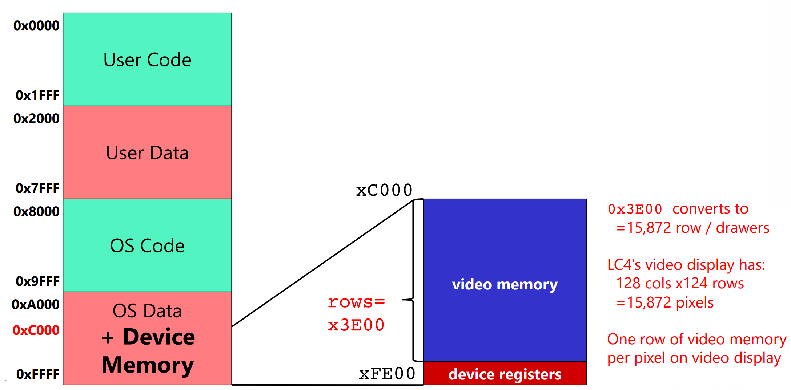

[Back to Main](../main.md)

# 8. IO and OS
### Concept) IO Controller
- Desc.)
  - It acts as a translator between digital (CPU) and Analog (Device)   
    
    - Components)
      - Control/Status : One or two register(s) working as a flag
      - Data : More than one register.
- How it works)
  - Input Devices)
    - CPU checks **status register** if input is available.
    - Then it reads input from **data register**.
  - Output Devices)
    - CPU checks **status register** if output device is available.
    - Then it writes output to **data register**.
- Implementation)
  - Two options)
    1. Creating new "I/O instructions" for ISA.
       - How?)
         - Designate opcode(s) for I/O
         - Register and operation encoded in instruction
       - For early computers, since I/O devices were fixed, it worked this way.
    2. [Memory-Mapped I/O](#concept-memory-mapped-io)

<br>

### Concept) Memory-Mapped I/O
- Desc.)
  - Assign a memory address to each device register
    |||
    |:-|:-|
    ||e.g.)<br> Keyboard status register (`KBSR`): xFE00 <br> - `KBSR[15]` is 1 if keyboard has new character <br> Keyboard data register (`KBDR`): xFE02 <br> - `KBDR[7:0]` is last character input on keyboard <br> ASCII display status register (`ADSR`): xFE04 <br> - `ADSR[15]` is 1 if console ready to display next character <br> ASCII display data register (`ADDR`): xFE06 <br> - `ADDR[7:0]` is written to console|
  - Use conventional loads (`LDR`) and stores (`STR`)
  - Hardware intercepts loads/stores to these address
  - No actual memory access performed
- e.g.)
  - Pressing 'A' on keyboard
    - Procedure)
      1. User presses ‘A’ key on keyboard
      2. Electronics box converts ‘A’ to ASCII: 0100 0001
         - places this data into data register
      3. Electronics box sets MSB of [status register](#concept-io-controller) to ‘1’
      4. Programmer checks status register
         - by reading address 0xFE00
      5. If MSB = 1, programmer reads [data register](#concept-io-controller)
         - by reading address 0xFE02
      6. Electronics box reset [status register](#concept-io-controller) after read.
    - Code)
      ```Assembly
      ; code will read 1 character from the keyboard, store it in R0
      OS_KBSR_ADDR .UCONST xFE00 ; ‘alias’ for keyboard status reg
      OS_KBDR_ADDR .UCONST xFE02 ; ‘alias’ for keyboard data reg

      .CODE
      GETC ; a LABEL for now (perhaps subroutine someday)
        LC R0, OS_KBSR_ADDR ; R0 = address of keyboard status reg
        LDR R0, R0, #0      ; R0 = value of keyboard status reg
        BRzp GETC           ; if R0[15]=1, data is waiting!
                            ; else, loop and check again...

      ;; reaching here, means data is waiting in keyboard data reg
        LC R0, OS_KBDR_ADDR ; R0 = address of keyboard data reg
        LDR R0, R0, #0      ; R0 = value of keyboard data reg
      ```
      - Directives)
        |Directive|Desc.|
        |:-:|:-|
        |`.UNCONST`|- Associate UIMM16 (Unsigned 16-bit Int) with preceding label <br> - Not like `.FILL`, it does not show up in data memory.|
        |`.LC`|- Load constant value at label rather than address of label <br> - cf.) `LEA` reads address of the label.|
  - Read from Keyboard and print to screen
    - Code
      ```Assembly
      OS_KBSR_ADDR .UCONST xFE00    ; ‘alias’ for keyboard status reg
      OS_KBDR_ADDR .UCONST xFE02    ; ‘alias’ for keyboard data reg
      OS_ADSR_ADDR .UCONST xFE04    ; ‘alias’ for ASCII display status reg
      OS_ADDR_ADDR .UCONST xFE06    ; ‘alias’ for ASCII display data reg

      .CODE
      ;; Keyboard Read Code
      GETC
        LC R0, OS_KBSR_ADDR
        LDR R0, R0, #0
        BRnz GETC
        LC R0, OS_KBDR_ADDR
        LDR R0, R0, #0          ; Read Keyboard input and write on R0.
      
      ;; ASCII Display Write Code
      PUTC
        LC R1, OS_ADSR_ADDR
        LDR R1, R1, #0
        BRnz PUTC
        LC R1, OS_ADDR_ADDR
        STR R0, R1, #0          ; Write R0 to ASCII Display(R1)
      ```

<br>

### Concept) Timer
- Components)
  - Timer Interval Register (TIR)
    - Memory Address : xFE0A
    - Functionality : Set desired time in TIR in milliseconds. 
  - Timer Status Register (TSR)
    - Memory Address : xFE08
    - Functionality : `TSR[15]` is 1 if timer has “gone off”, sets itself to 0 after read
- How it works)
  - Just like a timer...
  - Time set on TIR in the millisecond unit.
  - When the time set on TIR passes, `TSR[15]` is updated to 1.
  - When the result is read, `TSR[15]` is reset to 0.

<br>

### Concept) Video
- Components)
  - Video Display Control Register (VDCR)
    - Memory Address : xFE0C
  - Video Display Data Registers
    - Memory Address : xC000 ~ xFE0C
      - Each address denotes a pixel.
        - Each pixel has 16-bit addressability.
          - MSB not used.
          - 5-bits for Red, Green and Blue
      - xFE0C - xC000 = $`128 \times 124`$ = 15,872 pixels.
        - How to address pixels
          ```Assembly
          .ADDR xC000                    ; The left-upper most pixel address.
          OS_VIDEO_MEM .BLKW x3E00       ; x3E00 rows total.
          OS_VIDEO_NUM_COLS .UCONST #128 ;
          OS_VIDEO_NUM_ROWS .UCONST #124 ;

          ; video_memory[y][x]
          LEA R0, xC000
          TBD...
          ```


<br><br>

[Back to Main](../main.md)