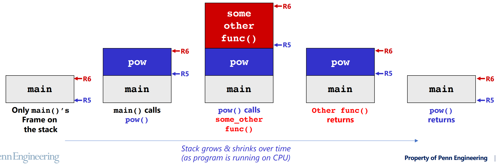
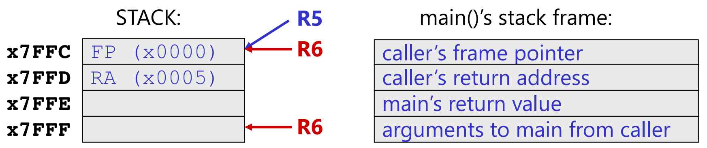
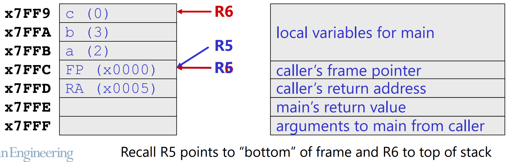
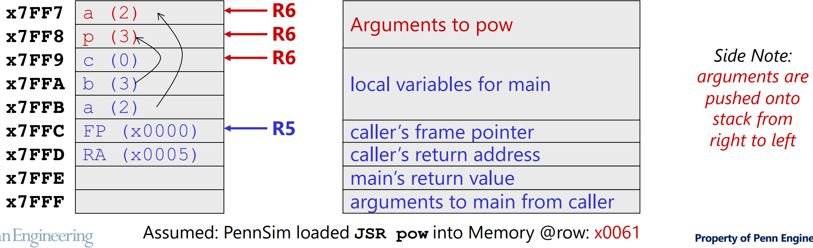
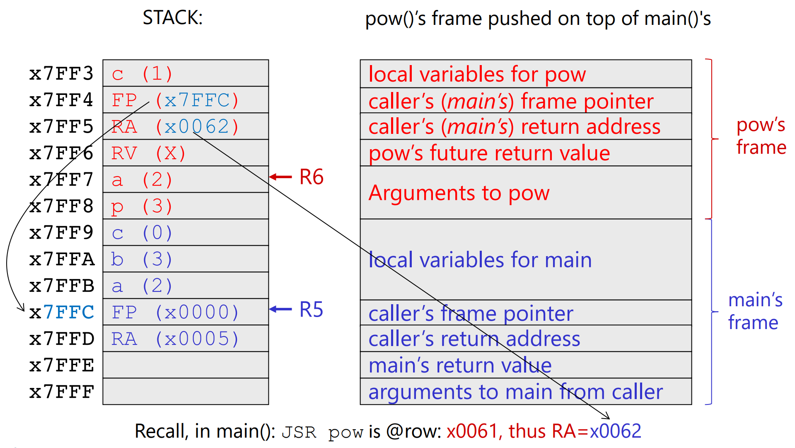
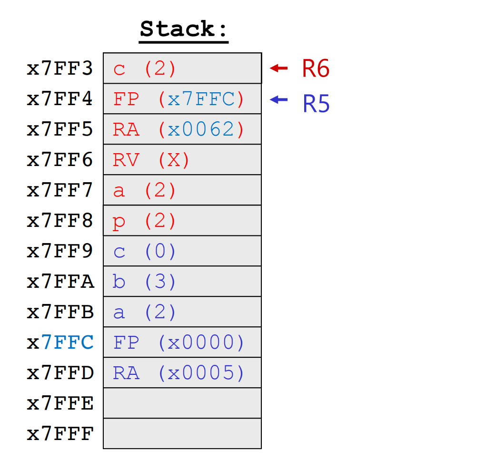
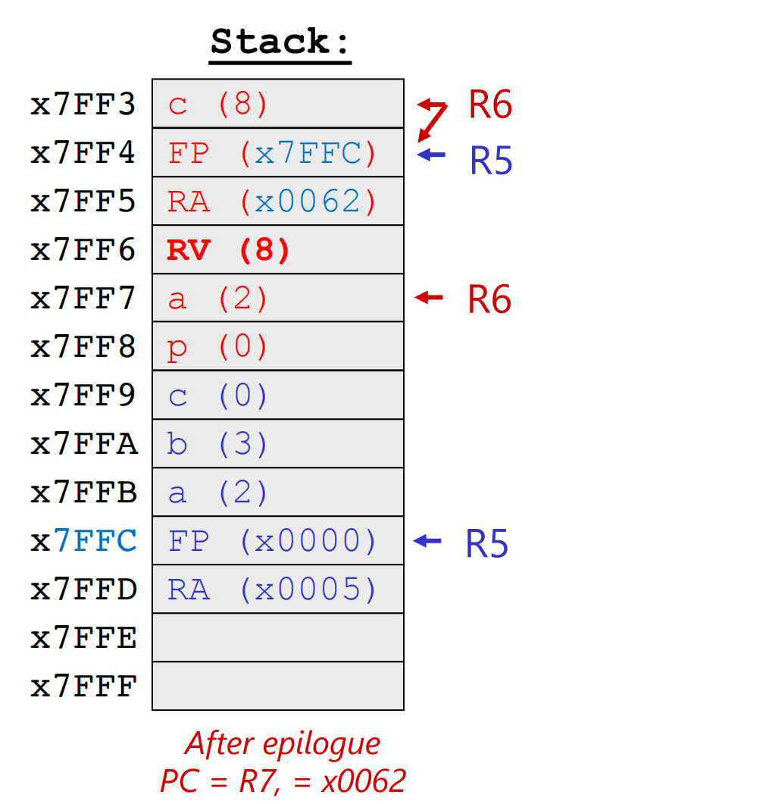
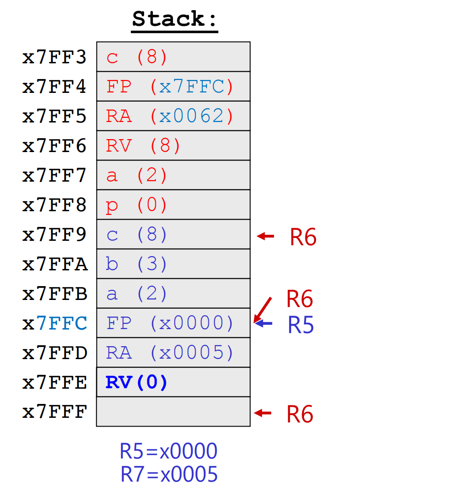
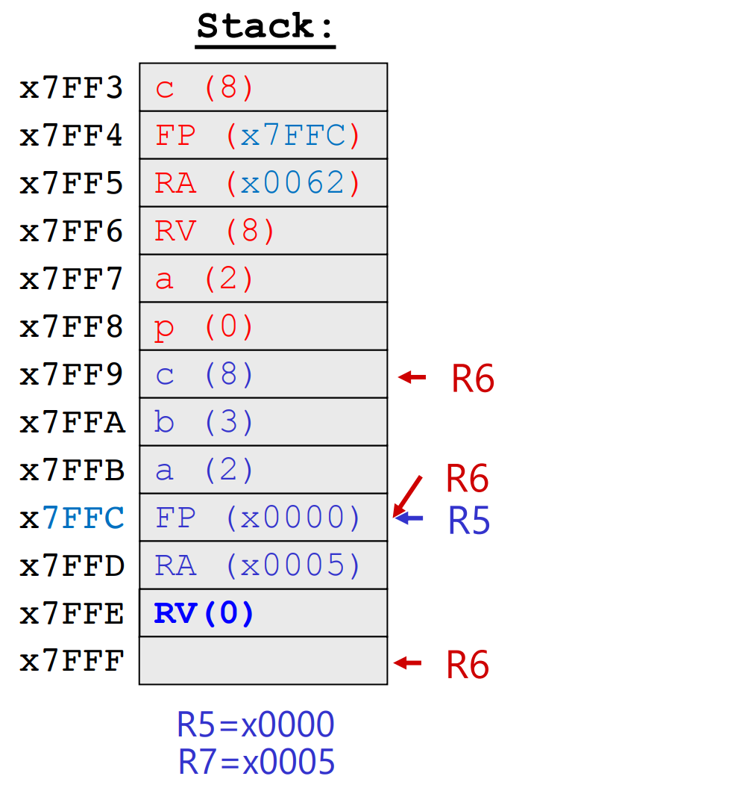

[Back to Main](../main.md)

# Introduction to C & The Stack
### Concept) C Language
- Props.)
  - Comparatively higher language compared to assembly and Machine language.
  - Imperative
    - Assignment statements that explicitly change memory values 
      - Syntax : `c = a+ b`
      - e.g.) C, C++, Java
    - cf.) Declarative Statements
      - It focuses on what the program should accomplish without specifying how to do it.
      - e.g.) SQL
  - Procedural
    - All code statements are contained in functions.
    - Functions can be bundled into libraries.
    - Functions are implemented using a [stack]().
  - File Oriented
    - Concept) File
      - A simple abstraction for permanent storage and I/O
    - C treats everything as files, including I/O.
  - Portability
    - The same C code can be [compiled](#concept-compilation) for different ISAs.
    - But not like Java, the [compiled](#concept-compilation) files are not compatible to other environments.

<br>

### Concept) Stack
- Desc.)
  - C uses a stack to store data.
    - Functions (like main) build a simple stack in data memory as they run.
  - Stack is at the bottom part of the [User Data Memory](m07.md#concept-partitioning-data-memory).
    ||
    |:-|
    ||

<br>

### Concept) Stack Frame
- Def.)
  - A logical grouping of data on the [stack](#concept-stack) that belongs to a single [function](#concept-c-language)
- Components)
  - Basic Three Components)
    - Local Variables
    - Return Value
    - Arguments
  - Full Description)
    |Address|Contents|Desc.|Rule|
    |:-:|:-:|:-|:-:|
    |(Stacking Up)|Temporaries, Arguments to callees|Temporary data and Arguments to other functions|R6|
    |↑|**Local Variables**|||
    |**FP**|Caller's [Frame Pointer](#concept-frame-pointer) (FP)||R5|
    |FP+1|Return Address (RA)|where to return after function completes||
    |FP+2|**Return Value** (RV)|||
    |↓|**Arguments**|||
    - Rule)
      - `R6` will be used to point to the top of the frame (stack).
        - Addresses of the followings will be computed based on `R6`.
          - local variables
          - temporaries
          - arguments to callees.
      - `R5` will be used to point where we saved the calling function's frame pointer.
        - Addresses of the followings will be computed based on `R5`.
          - Return Address
          - Return Value
          - Arguments (by the caller)

<br>

### Concept) Frame Pointer
- Def.)
  - A register that holds a starting address for the frame.
- Prop.)
  - Suppose `A`, `B` are functions and `A` calls `B`.
    ```C
    int B(){
        return 0;
    }

    int A(){
        B();
        return 0;
    }
    ```
  - Then `B` stores `A`'s frame pointer in its [stack frame](#concept-stack-frame).
  - `A` stores arguments to `B` in its [stack frame](#concept-stack-frame).

<br>

### Concept) Compilation
- Desc.)
  - The process of translating human-readable source code written in a high-level programming language into assembly code.   
  
  - cf.) Some compilers like gcc perform compilation and assembling all at once!
- Props.)
  - Output Assembly File)
    - The output assembly file that the compiler generates has a format
      ```Assembly
          ; Load the Frame Pointer value that the complier assigned
          CONST R5, xFC       
          HICONST R5, x7F     ; R5 = x7FFC
          JSR main            ; Jump to the main subroutine

      main
          ; PROLOG : Store values like PC+1 and local variables on the stack.

          ; BODY : Load the stored values and do the operations

          ; EPILOGUE : Set up the return value and restore PC+1 to go back.

          RET
      ```
  - Compiler creates a [symbol table](#concept-symbol-table) as it parses the [.C](#concept-c-language) file

<br>

#### Concept) Symbol Table
- Desc.)
  - A table that the compiler creates to record where items are placed on the stack for a function
  - Instead of recording exact addresses for variables, it uses an offset.
    - Based on the [frame pointer](#concept-frame-pointer)!
- e.g.)
  ||
  |:-|
  ||

<br>

#### Concept) Push and Pop
- Desc.)
  - When a function is called by another, the called function will **push** its frame onto the stack.
    - Arguments to function are pushed by the caller.
    - Everything else is pushed by the function itself.
  - When a function returns, it **pops** its frame off the stack.
- e.g.) [Compiling C into Assembly 2](#eg-compiling-c-into-assembly-2)

<br><br>

### E.g.) Compiling C into Assembly 1
- C program)
  ```c
  int main(){
    /* Declare and initialize variables before program. 
       Following a,b, and c are local variables! */
    int a = 20;
    int b = 10;
    int c = 0;

    /* Multiply numbers. */
    c = a*b;
    
    /* Return from main. */
    return 0;   // Value 0 means success. Otherwise OS needs to check!
  }
  ```
  - Desc.)
    - The function `main()` is hard-coded in the OS.
    - All C programs must start in the function `main()`.
- The Assembly Output)
  ```Assembly
      ; Load the Frame Pointer value that the complier assigned
      CONST R5, xFC       
      HICONST R5, x7F     ; R5 = x7FFC <- The Frame Pointer!
      JSR main            ; Jump to the main subroutine
  
  main
      ; PROLOG : Store values like PC+1 and local variables on the stack.
      STR R7, R5, #1        ; Store R7 (PC+1) in stack at (x7FFC+1)
      CONST R7, #20         ; a = 20
      STR R7, R5, #-1       ;   then store a in stack at (x7FFC-1)
      CONST R7, #10         ; b = 10
      STR R7, R5, #-2       ;   then store b in stack at (x7FFC-2)
      CONST R7, #0          ; c = 0
      STR R7, R5, #-3       ;   then store c in stack at (x7FFC-3)
  
      ; BODY : Load the stored values and do the operations
      LDR R7, R5, #-1       ; Load a at (x7FFC-1) into R7
      LDR R0, R5, #-2       ; Load b at (x7FFC-2) into R0
      MUL R7, R7, R0        ; c = a*b
      STR R7, R5, #-3       ; Store the result of (c = a*b) at (x7FFC-3)
  
      ; EPILOGUE : Set up the return value and restore PC+1 to go back.
      CONST R7, #0          ; Setup the return value of 0 which is hard coded as "return 0"
      STR R7, R5, #0        ; Store the return value at the frame pointer address (x7FFC)
      LDR R7, R5, #1        ; Restore the initial R7 value at (x7FFC+1)
  
      RET                   ; return!
  ```

<br><br>

### E.g.) Compiling C into Assembly 2
- C Program
  ```c
  int pow(int a, int p){
    int c;
    for (c=1; p > 0; p--){
      c = c * a;
    }
    return c;
  }

  int main(){
    int a = 2;
    int b = 3;
    int c = 0;
    c = pow(a, b);
  }
  ```
  - Procedure of this program   
    
- The Assembly)
  - Assumptions)
    - `main()` is a subroutine.
      - Thus, it should be called using `JSR`.
      - Let's assume that to be `x0005`.
    - Status before calling `main()`
      - Registers)
        - `R6=x7FFF` : top of the stack (actually the bottom)
        - `R5=x0000` : the frame pointer of the program(OS) that calls `main()`
      - PC)
        - The `JSR main` line is located at PC=`x0004`.
        - When `JSR main` is called, `R7` is updated with PC+1=`x0005`.
        - Thus, when the `RET` instruction in `main` is called, the PC will be restored into `x0005`.
    - `pow()` is also a subroutine.
      - Suppose `JSR pow` is loaded into memory at row `x0061`.
        - i.e. the address of the instruction calling the subroutine `pow`.
  - Assembly Code
    ```Assembly
    main
      ;; main Prologue 
      ;;  - Backup caller's info and update stack/frame pointer.
      STR R7, R6, #-2   ; Backup caller's return address. dmem[x7FFF-2=x7FFD] = x0005
      STR R5, R6, #-3   ; Backup caller's frame pointer.  dmem[x7FFF-3=x7FFC] = x0000
      ADD R6, R6, #-3   ; Update the stack pointer: Decrement by 3. R6=x7FFC
      ADD R5, R6, #0    ; Update the frame pointer: Copy R6. R5=x7FFC
    ```
    - Desc.)   
      
    ```Assembly    
      ;; main Prologue continues...
      ;;  - Allocate local variables
      ADD R6, R6, #-3   ; Allocate spaces for local variables by raising stack pointer: R6=x7FF9
      CONST R7, #2      ; a = 2
      STR R7, R5, #-1   ; Store a = 2. dmem[x7FFC-1] = #2
      CONST R7, #3      ; b = 3
      STR R7, R5, #-2   ; Store b = 3. dmem[x7FFC-2] = #3
      CONST R7, #0      ; c = 0
      STR R7, R5, #-3   ; Store c = 0. dmem[x7FFC-3] = #0
    ```
    - Desc.)   
      
    ```Assembly    
      ;; main Body
      ;;  - Call pow()
      LDR R7, R5, #-2   ; Load b which is the right most argument p for pow().
      ADD R6, R6, #-1   ; Allocate space for p by decrementing stack pointer by 1: R6=x7FF8
      STR R7, R6, #0    ; Store value b as the argument p for pow().

      LDR R7, R5, #-1   ; Load a which is the next LHS argument a for pow().
      ADD R6, R6, #-1   ; Allocate space for a by decrementing stack pointer by 1: R6=x7FF7
      STR R7, R6, #0    ; Store value a as the argument a for pow().

      JSR pow           ; Call pow() : R7=PC+1(x0062), PC = pow

      ; Not finished! Will continue after pow returns!
    ```
    - Desc.)   
      
    ```Assembly    
    pow
      ;; pow Prologue
      STR R7, R6, #-2   ; Backup main's return address. dmem[x7FF7-2=x7FF5] = x0062
      STR R5, R6, #-3   ; Backup main's frame pointer.  dmem[x7FF7-3=x7FF4] = x7FFC
      ADD R6, R6, #-3   ; Update the stack pointer: Increment by 3. R6=x7FF4
      ADD R5, R6, #0    ; Update the frame pointer: Copy R6. R5=x7FF4

      ADD R6, R6, #-1   ; Allocate space for a by decrementing stack pointer by 1: R6=x7FF3
      CONST R7, #1      ; c = 1
      STR R7, R5, #-1   ; Store value c = 1. dmem[x7FF4-1] = #1
    ```
    - Desc.)   
      
    ```Assembly    
      ;; pow Body
      JMP L5_my_program   ; Jump to L5_my_program for validation!

    L2_my_program
      LDR R7, R5, #-1     ; Load the value of c into R7.
      LDR R3, R5, #3      ; Load the argument value of a into R3.
      MUL R7, R7, R3      ; R7 = R7 * R3
      
      LDR R7, R5, #4      ; Load the argument value of p into R7.
      ADD R7, R7, #-1     ; Decrement p by 1.
      STR R7, R5, #4      ; Store the decremented value of p.

    L5_my_program
      LDR R7, R5, #4      ; Load the value of p into R7.
      CONST R3, #0        ; Load 0 into R3 for comparison.
      CMP R7, R3          ; Is p > 0?
      BRp L2_my_program   ; If yes, goto L2_my_program.

      LDR R7, R5, #-1     ; Load the value of c (#8) into R7. Get ready to return!
    ```
    - Desc.)   
      
    ```Assembly    
      ;; pow Epilogue
      ADD R6, R5, #0      ; Pop local variables in pow by incrementing R6. Copy R6=R5.
      ADD R6, R6, #3      ; Increment stack pointer by 3. Undoing what we did on Prologue!
      STR R7, R6, #-1     ; Store the return value c into R6-1: dmem[#7FF7-1=x7FF6] = #8.
      LDR R5, R6, #-3     ; Restore the frame pointer of the caller! R5 = x7FFC.
      LDR R7, R6, #-2     ; Restore the return address at R7: R7 = x0062.
      RET                 ; PC = R7 : Go back to main.
    ```
    - Desc.)   
      
    ```Assembly    
      ;; main Body
      ;;  - Continues after pow returned.
      LDR R7, R6, -1      ; Load the return value of pow() into R7.
      ADD R6, R6, #2      ; Pop arguments of pow. Increment R6 by 2.
      STR R7, R5, #-3     ; Update c and store it.

      CONST R7, #0        ; Load 0 into R7. Get ready to return!
    ```
    - Desc.)   
      
    ```Assembly    
      ;; main Epilogue
      ADD R6, R5, #0      ; Pop local variables in main by incrementing R6. Copy R6=R5.
      ADD R6, R6, #3      ; Increment stack pointer by 3. Undoing what we did on Prologue!
      STR R7, R6, #-1     ; Store the return value 0 into R6-1.
      LDR R5, R6, #-3     ; Restore the frame pointer of the caller!
      LDR R7, R6, #-2     ; Restore the return address at R7: R7 = x0005.
      RET                 ; PC = R7 : Go back to caller.
    ```
    - Desc.)   
      


<br><br>

[Back to Main](../main.md)