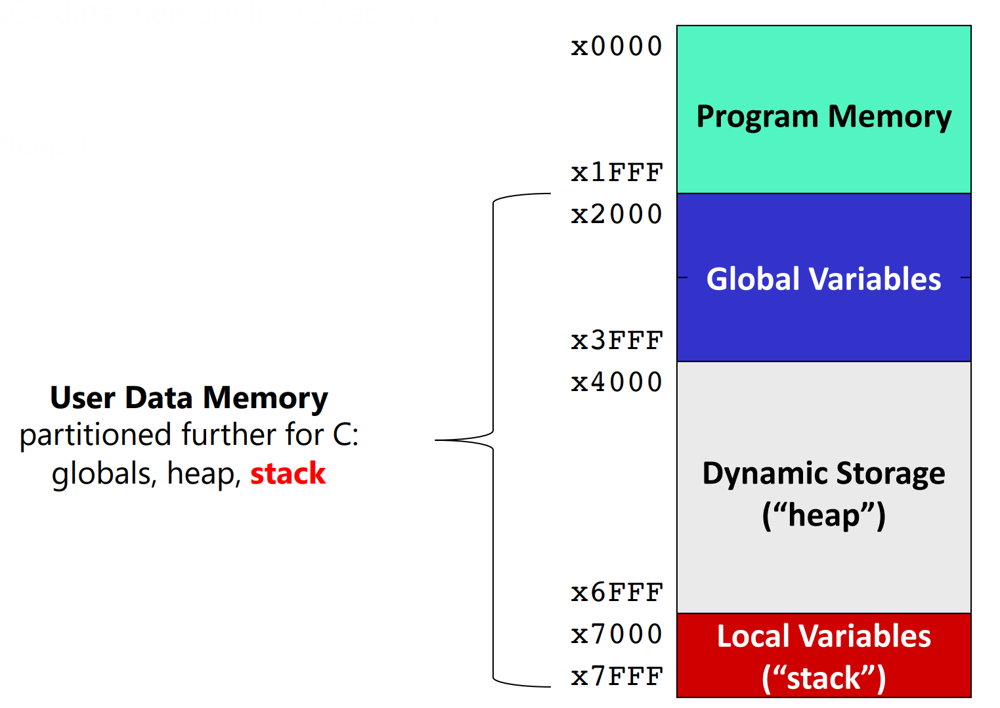
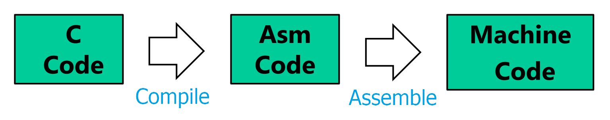

[Back to Main](../main.md)

# Introduction to C & The Stack
### Concept) C Language
- Props.)
  - Comparatively higher language compared to assembly and Machine language.
  - Imperative
    - Assignment statements that explicitly change memory values 
      - Syntax : `c = a+ b`
      - e.g.) C, C++, Java
    - cf.) Declarative Statements
      - It focuses on what the program should accomplish without specifying how to do it.
      - e.g.) SQL
  - Procedural
    - All code statements are contained in functions.
    - Functions can be bundled into libraries.
    - Functions are implemented using a [stack]().
  - File Oriented
    - Concept) File
      - A simple abstraction for permanent storage and I/O
    - C treats everything as files, including I/O.
  - Portability
    - The same C code can be [compiled](#concept-compilation) for different ISAs.
    - But not like Java, the [compiled](#concept-compilation) files are not compatible to other environments.

<br>

### Concept) Stack
- Desc.)
  - C uses a stack to store data.
    - Functions (like main) build a simple stack in data memory as they run.
  - Stack is at the bottom part of the [User Data Memory](m07.md#concept-partitioning-data-memory).
    ||
    |:-|
    ||

<br>

### Concept) Stack Frame
- Def.)
  - A logical grouping of data on the [stack](#concept-stack) that belongs to a single [function](#concept-c-language)
- Components)
  - Basic Three Components)
    - Local Variables
    - Return Value
    - Arguments
  - Full Description)
    |Address|Contents|Desc.|Rule|
    |:-:|:-:|:-|:-:|
    |(Stacking Up)|Temporaries, Arguments to callees|Temporary data and Arguments to other functions|R6|
    |↑|**Local Variables**|||
    |**FP**|Caller's [Frame Pointer](#concept-frame-pointer) (FP)||R5|
    |FP+1|Return Address (RA)|where to return after function completes||
    |FP+2|**Return Value** (RV)|||
    |↓|**Arguments**|||

<br>

### Concept) Frame Pointer
- Def.)
  - A register that holds a starting address for the frame.
- Prop.)
  - Suppose `A`, `B` are functions and `A` calls `B`.
    ```C
    int B(){
        return 0;
    }

    int A(){
        B();
        return 0;
    }
    ```
  - Then `B` stores `A`'s frame pointer in its [stack frame](#concept-stack-frame).
  - `A` stores arguments to `B` in its [stack frame](#concept-stack-frame).

<br>

### Concept) Compilation
- Desc.)
  - The process of translating human-readable source code written in a high-level programming language into assembly code.   
  
  - cf.) Some compilers like gcc perform compilation and assembling all at once!
- Props.)
  - Output Assembly File)
    - The output assembly file that the compiler generates has a format
      ```Assembly
          ; Load the Frame Pointer value that the complier assigned
          CONST R5, xFC       
          HICONST R5, x7F     ; R5 = x7FFC
          JSR main            ; Jump to the main subroutine

      main
          ; PROLOG : Store values like PC+1 and local variables on the stack.

          ; BODY : Load the stored values and do the operations

          ; EPILOGUE : Set up the return value and restore PC+1 to go back.

          RET
      ```
  - Compiler creates a [symbol table](#concept-symbol-table) as it parses the [.C](#concept-c-language) file

<br>

#### Concept) Symbol Table
- Desc.)
  - A table that the compiler creates to record where items are placed on the stack for a function
  - Instead of recording exact addresses for variables, it uses an offset.
    - Based on the [frame pointer](#concept-frame-pointer)!
- e.g.)
  ||
  |:-|
  ||


#### E.g.) Compiling C into Assembly 1
- C program)
  ```c
  int main(){
    /* Declare and initialize variables before program. 
       Following a,b, and c are local variables! */
    int a = 20;
    int b = 10;
    int c = 0;

    /* Multiply numbers. */
    c = a*b;
    
    /* Return from main. */
    return 0;   // Value 0 means success. Otherwise OS needs to check!
  }
  ```
  - Desc.)
    - The function `main()` is hard-coded in the OS.
    - All C programs must start in the function `main()`.
- The Assembly Output)
  ```Assembly
      ; Load the Frame Pointer value that the complier assigned
      CONST R5, xFC       
      HICONST R5, x7F     ; R5 = x7FFC <- The Frame Pointer!
      JSR main            ; Jump to the main subroutine
  
  main
      ; PROLOG : Store values like PC+1 and local variables on the stack.
      STR R7, R5, #1        ; Store R7 (PC+1) in stack at (x7FFC+1)
      CONST R7, #20         ; a = 20
      STR R7, R5, #-1       ;   then store a in stack at (x7FFC-1)
      CONST R7, #10         ; b = 10
      STR R7, R5, #-2       ;   then store b in stack at (x7FFC-2)
      CONST R7, #0          ; c = 0
      STR R7, R5, #-3       ;   then store c in stack at (x7FFC-3)
  
      ; BODY : Load the stored values and do the operations
      LDR R7, R5, #-1       ; Load a at (x7FFC-1) into R7
      LDR R0, R5, #-2       ; Load b at (x7FFC-2) into R0
      MUL R7, R7, R0        ; c = a*b
      STR R7, R5, #-3       ; Store the result of (c = a*b) at (x7FFC-3)
  
      ; EPILOGUE : Set up the return value and restore PC+1 to go back.
      CONST R7, #0          ; Setup the return value of 0 which is hard coded as "return 0"
      STR R7, R5, #0        ; Store the return value at the frame pointer address (x7FFC)
      LDR R7, R5, #1        ; Restore the initial R7 value at (x7FFC+1)
  
      RET                   ; return!
  ```


<br><br>

[Back to Main](../main.md)