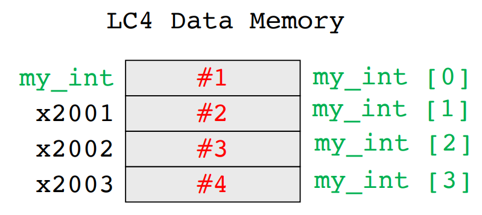

[Back to Main](../main.md)

# 10. C Variables, Pointers, and Arrays
### Concept) Variables in C
- Four Built-In Datatypes
  |Data Type|Width (bits)|
  |:-:|:-:|
  |`char`|8|
  |`int`|16/32/64|
  |`float`|32|
  |`double`|64|

#### Concept) Data Type Modifier
|Command|Functionality|E.g.|
|:-:|:-|:-|
|`long`|Double the width|`long int var1`|
|`short`|Halve the width|`short int var2`|
|`unsigned`|Binary is unsigned|`unsigned var2`|

#### Analysis) Variable Assignment in C, Assembly, and Stack
<table border="1">
    <tr>
        <th>C</th>
        <th>Assembly</th>
        <th> Stack </th>
    </tr>
    <tr>
        <td><pre><code>
int main() {
    char my_char = 'A';
    int my_int = 32767;
    float my_float = 0.5;
}
</code></pre></td>
        <td><pre><code>
main
    ;;; Prologue
    ; my_char = 'A'
    CONST R7, x41       ; 
    STR R7, R5, #-1     ; dmem[R5-1] = 'A'
    ; my_int = 32767
    CONST R7, xFF       ; 
    HICONST R7, x7F     ; 
    STR R7, R5, #-2     ; dmem[R5-2] = 32767
    ; my_float = 0.5
    CONST R7, x00       ; [IEEE 754 Format] 
    HICONST R7, x00     ; 0.5 = x3F00 0000
    STR R7, R5, #-3     ; dmem[R5-3] = x0000
    CONST R7, x00       ; 
    HICONST R7, x3F     ; 
    STR R7, R5, #-4     ; dmem[R5-4] = x3F00
</code></pre></td>
        <td></td>
    </tr>
</table>
<br>

### Concept) Type Casting
- Implicit Type Casting
  - Desc.)
    - From smaller to bigger
  - e.g.)
    ```c
    int a = 5;
    float b;
    b = a;        // b = 0.5 in IEEE 754 format.
    ```
- Explicit Type Casting
  - Desc.)
    - From bigger to smaller
    - Explicitly notify the data type
  - e.g.)
    ```c
    int a;
    float b = 5.6;
    a = (int) b;    // a = round(5.6) = 5.
    ```

<br>

### Concept) Array
- Desc.)
  - Any data type in C can be made into an array.
    - e.g.)
      ```c
      char my_char_array [5] 
      int my_int_array [4]
      float my_float_array [2]
      double my_double_array [6]
      ```
  - The name of an array in C is a label for the memory address where it is stored.
    - e.g.) `global_array` label in [previous assembly code](m07.md#using-assembly-directives).
  - Elements in an array are stored sequentially in memory.
  - The index operator `[]` matches offset in data memory from the label
- Syntax in C
  ```c
  int my_int [4] = {1,2,3,4};
  ```
  ```c
  int my_int [] = {1,2,3,4};
  ```
  ```c
  int my_int [4];
  my_int[0] = 1;
  my_int[1] = 2;
  my_int[2] = 3;
  my_int[3] = 4;
  ```

<table border="1">
    <tr>
        <th>C</th>
        <th>Assembly</th>
        <th> Stack </th>
    </tr>
    <tr>
        <td><pre><code>
int my_int [4] = {1,2,3,4};
</code></pre></td>
        <td><pre><code>
.DATA
.ADDR x2000
my_int          ; The label
.FILL #1
.FILL #2
.FILL #3
.FILL #4
</code></pre></td>
        <td></td>
    </tr>
</table>
<br>

  


<br><br>

[Back to Main](../main.md)