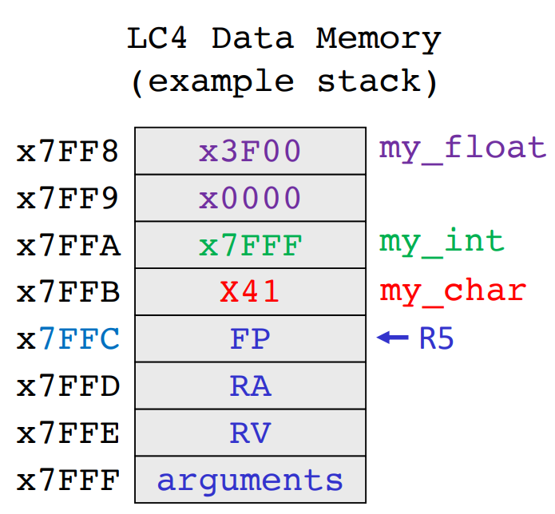

[Back to Main](../main.md)

# 10. C Variables, Pointers, and Arrays
### Concept) Variables in C
- Four Built-In Datatypes
  |Data Type|Width (bits)|
  |:-:|:-:|
  |`char`|8|
  |`int`|16/32/64|
  |`float`|32|
  |`double`|64|

#### Concept) Data Type Modifier
|Command|Functionality|E.g.|
|:-:|:-|:-|
|`long`|Double the width|`long int var1`|
|`short`|Halve the width|`short int var2`|
|`unsigned`|Binary is unsigned|`unsigned var2`|

#### Analysis) Variable Assignment in C, Assembly, and Stack
<table border="1">
    <tr>
        <th>C</th>
        <th>Assembly</th>
        <th> Stack </th>
    </tr>
    <tr>
        <td><pre><code>
int main() {
    char my_char = 'A';
    int my_int = 32767;
    float my_float = 0.5;
}
</code></pre></td>
        <td><pre><code>
main
    ; Prologue
    CONST R7, x41       ; my_char = 'A'
    STR R7, R5, #-1     ; dmem[R5-1] = 'A'

    CONST R7, xFF       ; my_int = 32767
    HICONST R7, x7F     ; 
    STR R7, R5, #-2     ; dmem[R5-2] = 32767

    
    CONST R7, x00       ; [IEEE 754 Format] 0.5 = x3F00 0000
    HICONST R7, x00     ; my_float = x3F000000
    STR R7, R5, #-3     ; dmem[R5-3] = x0000
    CONST R7, x00       ; 
    HICONST R7, x3F     ; 
    STR R7, R5, #-4     ; dmem[R5-4] = x3F00
</code></pre></td>
        <td></td>
    </tr>
</table>

  

[Back to Main](../main.md)