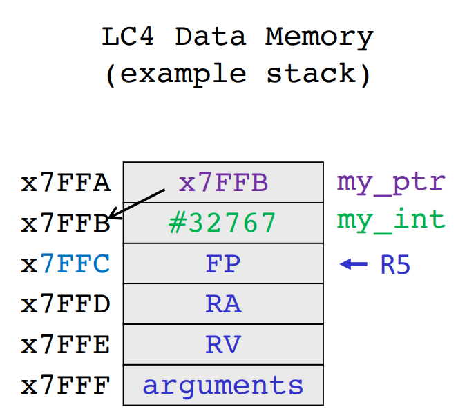
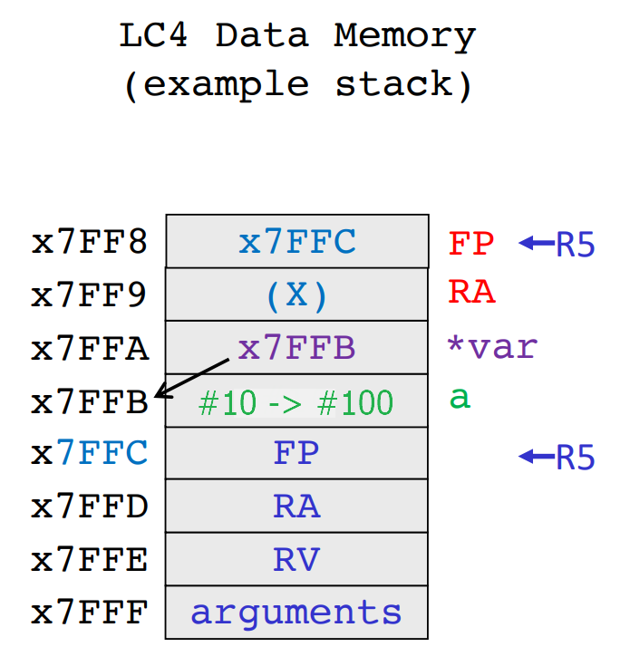
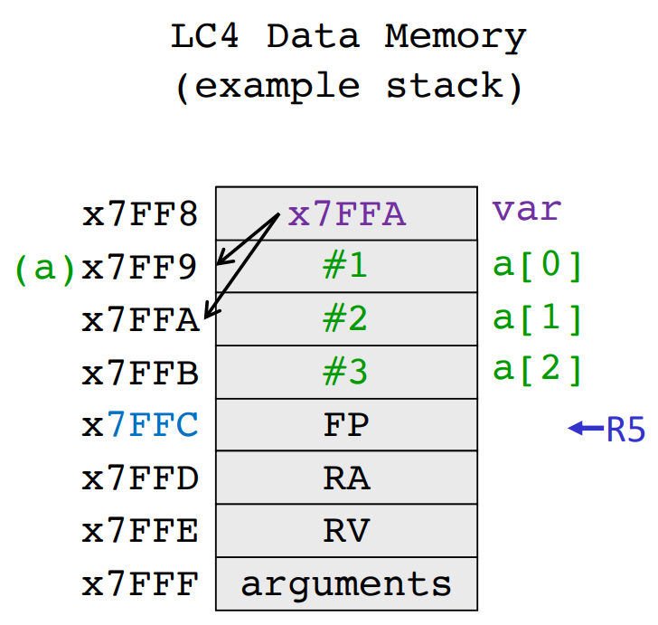
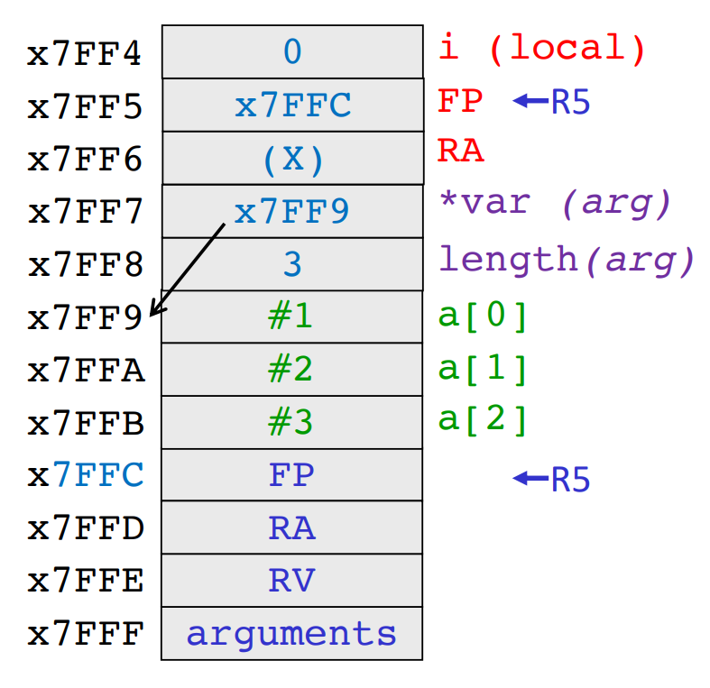
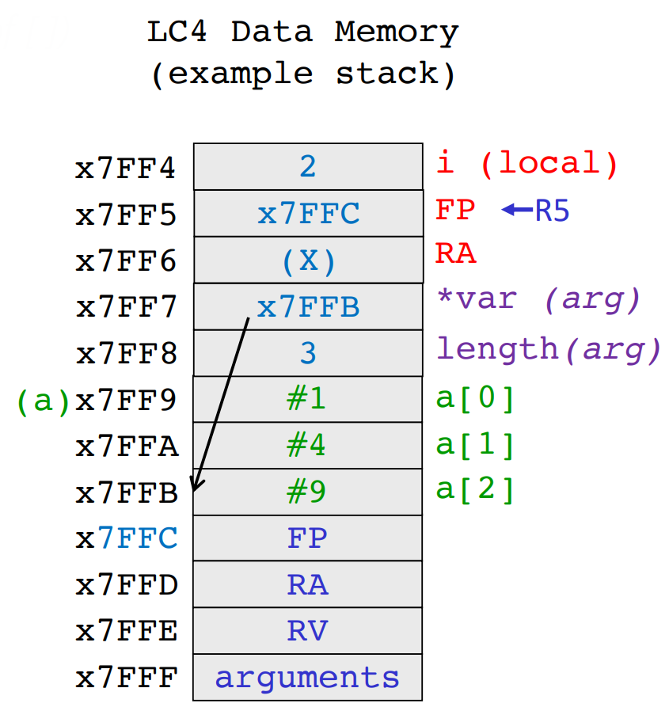
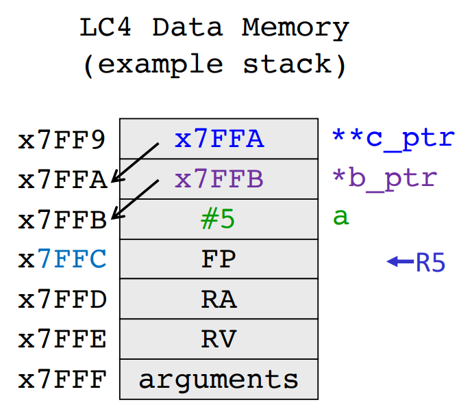

[Back to Main](../main.md)

# 10. C Variables, Pointers, and Arrays
### Concept) Variables in C
- Four Built-In Datatypes
  |Data Type|Width (bits)|# of rows in LC-4|
  |:-:|:-:|:-:|
  |`char`|8|1|
  |`int`|16/32/64|1/2/4|
  |`float`|32|2|
  |`double`|64|4|

#### Concept) Data Type Modifier
|Command|Functionality|E.g.|
|:-:|:-|:-|
|`long`|Double the width|`long int var1`|
|`short`|Halve the width|`short int var2`|
|`unsigned`|Binary is unsigned|`unsigned var2`|

#### Analysis) Variable Assignment in C, Assembly, and Stack
<table border="1">
    <tr>
        <th>C</th>
        <th>Assembly</th>
        <th> Stack </th>
    </tr>
    <tr>
        <td><pre><code>
int main() {
    char my_char = 'A';
    int my_int = 32767;
    float my_float = 0.5;
}
</code></pre></td>
        <td><pre><code>
main
    ;;; Prologue
    ; my_char = 'A'
    CONST R7, x41       ; 
    STR R7, R5, #-1     ; dmem[R5-1] = 'A'
    ; my_int = 32767
    CONST R7, xFF       ; 
    HICONST R7, x7F     ; 
    STR R7, R5, #-2     ; dmem[R5-2] = 32767
    ; my_float = 0.5
    CONST R7, x00       ; [IEEE 754 Format] 
    HICONST R7, x00     ; 0.5 = x3F00 0000
    STR R7, R5, #-3     ; dmem[R5-3] = x0000
    CONST R7, x00       ; 
    HICONST R7, x3F     ; 
    STR R7, R5, #-4     ; dmem[R5-4] = x3F00
</code></pre></td>
        <td></td>
    </tr>
</table>
<br>

### Concept) Type Casting
- Implicit Type Casting
  - Desc.)
    - From smaller to bigger
  - e.g.)
    ```c
    int a = 5;
    float b;
    b = a;        // b = 0.5 in IEEE 754 format.
    ```
- Explicit Type Casting
  - Desc.)
    - From bigger to smaller
    - Explicitly notify the data type
  - e.g.)
    ```c
    int a;
    float b = 5.6;
    a = (int) b;    // a = round(5.6) = 5.
    ```

<br>

### Concept) Array
- Desc.)
  - Any data type in C can be made into an array.
    - e.g.)
      ```c
      char my_char_array [5] 
      int my_int_array [4]
      float my_float_array [2]
      double my_double_array [6]
      ```
  - The name of an array in C is a **label** for the memory address where it is stored.
    - e.g.) `global_array` label in [previous assembly code](m07.md#using-assembly-directives).
    - cf.) It's different from [pointer](#concept-pointer) on that arithmetic is not allowed.
    - cf.) [Pointers](#concept-pointer) can be used to point at the address of the arrays.
  - Elements in an array are stored sequentially in memory.
    - cf.) Data are stored from **top to bottom** to synchronize with indexation!
      - ```LDR R0, R5, #1 ; <- Indexation!```
  - The index operator `[]` matches offset in data memory from the label
- Syntax in C
  ```c
  int my_int [4] = {1,2,3,4};
  ```
  ```c
  int my_int [] = {1,2,3,4};
  ```
  ```c
  int my_int [4];
  my_int[0] = 1;
  my_int[1] = 2;
  my_int[2] = 3;
  my_int[3] = 4;
  ```

<table border="1">
    <tr>
        <th>C</th>
        <th>Assembly</th>
        <th> Data Memory </th>
    </tr>
    <tr>
        <td><pre><code>
int my_int [4] = {1,2,3,4};
</code></pre></td>
        <td><pre><code>
.DATA
.ADDR x2000
my_int          ; The label
    .FILL #1
    .FILL #2
    .FILL #3
    .FILL #4
</code></pre></td>
        <td></td>
    </tr>
</table>
<br>

### Concept) User Defined Type
- Desc.)
  - The internal variables are called the field.
  - The fields should use the existing data types.
- Syntax)
  ```c
  struct fraction{
    int numerator;
    int denominator;
  }

  struct fraction my_frac;
  my_struct.numerator = 3;
  my_struct.denominator = 5;
  ```
  ```c
  typedef struct {
    int numerator;
    int denominator;
  } fraction;

  fraction my_frac;
  ```

<br>

### Concept) Pointer
- Def.)
  - A variable that can only contain the memory address of another variable.
- Props.)
  - Any data types can have pointers.
    - [Four built-in data types](#concept-variables-in-c)
    - [User defined data types](#concept-user-defined-type)
      - Refer to [dereferencing the field of a user defined data type below](#tech-dereferencing-the-field-of-a-user-defined-data-type-below).

#### Syntax) Declaring a Pointer
<table border="1">
    <tr>
        <th>Syntax in C</th>
        <th> Stack </th>
    </tr>
    <tr>
        <td>

- Directly assigning the address
  ```c
  int main(){
    int my_int = 32767;
    int* my_ptr = 0x7FFB;   // Directly assigning the address of my_int
  }
  ```
- Use `&` operator to get the address
  ```c
  int main(){
    int my_int = 32767;
    int* my_ptr = &my_int;   // Assigning the address of my_int using &.
  }
  ```

</td>
        <td></td>
    </tr>
</table>
<br>

#### Tech.) Dereferencing a Pointer
```c
int main() {
    int my_int = 32767;
    int* my_ptr = &my_int;
    printf(my_ptr);             // Prints x7FFB
    printf(*my_ptr;)            // Prints 32767 <- Dereferencing!
}
```
- Prop.)
  - In assembly dereferencing will require double `LDR`s.

#### Tech.) Dereferencing the field of a user defined data type below.
```C
typedef struct{
    int numerator;
    int denominator;
} fraction

fraction my_frac;
fraction* my_frac_ptr = &my_frac;
(*my_frac_ptr).numerator = 3;   // Way 1 : Dereference using *
my_frac_ptr->denominator = 5;   // Way 2 : Dereference using ->
```

#### Tech.) Using Pointer in Function
<table border="1">
    <tr>
        <th>Syntax in C</th>
        <th> Stack </th>
    </tr>
    <tr>
        <td>

```c
void square (int* var){     // var is a pointer!
    *var = (*var) * (*var);
}

int main(){
    int a = 10;
    square(&a);
}
```

</td>
        <td></td>
    </tr>
</table>
<br>

#### Tech.) Using Pointer to Arrays
<table border="1">
    <tr>
        <th>Syntax in C</th>
        <th> Stack </th>
    </tr>
    <tr>
        <td>

```c
int main(){
    int a[3] = {1,2,3};
    int* var = &a[0];   // Pointing at a[0]
    var = a;            // Pointing at a[0]
    
    printf(var[0]);     // 1
    printf(a[0]);       // 1
    printf(*var);       // 1
}
```

</td>
        <td></td>
    </tr>
</table>
<br>

#### Concept) Pointer Arithmetic
<table border="1">
    <tr>
        <th>Syntax in C</th>
        <th> Stack </th>
    </tr>
    <tr>
        <td>

```c
int main(){
    int a[3] = {1,2,3};
    int* var = a;       // Pointing at a[0]
    
    printf(var[0]);     // 1
    printf(a[0]);       // 1
    printf(*var);       // 1
    var++;              // Incrementing the pointer!
    printf(var[0])      // 2
    printf(a[0])        // 1
}
```

</td>
        <td></td>
    </tr>
</table>
<br>

#### Tech.) Passing Pointer to a Function
- Syntax 1) Passing the label

<table border="1">
    <tr>
        <th>Syntax in C</th>
        <th> Stack </th>
    </tr>
    <tr>
        <td>

```c
void square (int var[], int length){  // var[] denoting it's array!
  for (int i=0; i<length; i++){
    var[i] = var[i] * var[i];   // Dereferening with []
  }
}

int main(){
  int a[3] = {1,2,3};
  square(a, 3);    // Pass the length as well.
}
```

</td>
        <td></td>
    </tr>
</table>
<br>

- Syntax 2) Passing the address (pointer)
  
<table border="1">
    <tr>
        <th>Syntax in C</th>
        <th> Stack </th>
    </tr>
    <tr>
        <td>

```c
void square (int* var, int length){  // var : pointer variable 
  for (int i=0; i<length; i++){
    var[i] = var[i] * var[i];   // Dereferening with []
  }
}

int main(){
  int a[3] = {1,2,3};
  square(&a[0], 3);    // Address of a[0]
}
```

</td>
        <td></td>
    </tr>
</table>
<br>

- Applying the [pointer arithmetic](#concept-pointer-arithmetic) we can also do...
  
<table border="1">
    <tr>
        <th>Syntax in C</th>
        <th> Stack </th>
    </tr>
    <tr>
        <td>

```c
void square (int* var, int length){  // var : pointer variable 
  for (int i=0; i<length; i++, v++){ // Pointer arithmetic
    *var = (*var) * (*var);   // 
  }
}

int main(){
  int a[3] = {1,2,3};
  square(&a[0], 3);    // Address of a[0]
}
```

</td>
        <td></td>
    </tr>
</table>
<br>

#### Concept) Pointer to Pointer
- e.g.) Simple dereferencing
<table border="1">
    <tr>
        <th>Syntax in C</th>
        <th> Stack </th>
    </tr>
    <tr>
        <td>

```c
int main(){
  int a = 5;
  int* b_ptr = &a;
  int** c_ptr = &b_ptr;

  print(a);         // 5
  print(b_ptr);     // x7FFB
  print(c_ptr);     // x7FFA

  print(*b_ptr);    // 5
  print(*c_ptr);    // x7FFB
  print(**c_ptr);   // 5
}
```

</td>
        <td></td>
    </tr>
</table>
<br>

- e.g.) Swapping pointers
  ```c
  void swap_ptrs(int** a_ptr, int** b_ptr){
    int* tmp_ptr = NULL;  // Initialized to a Null pointer
    
    temp_ptr = *a_ptr;  // The value at a_ptr (address of int a)
    *a_ptr = *b_ptr;    // The value at b_ptr (address of int b)
    *b_ptr = tmp_ptr;
  }

  int main(){
    int a = 1;
    int b = 2;
    int* a_ptr = &a;
    int* b_ptr = &b;

    swap_ptrs(&a_ptr, &b_ptr);  // Addresses of pointer variables a_ptr and b_ptr!

    print(a,b);
    print(a_ptr, b_ptr);
  }
  ```

<br><br>

### Concept) Null Pointer
- Def.)
  - The value that we can initialize a pointer into.
- e.g.)
  ```c
  int main(){
    int a = 5;
    int* b_ptr = NULL;  // Initialize into Null pointer!

    print(a);
    print(b_ptr);
    print(*b_ptr);  // This will guarantee to cause a "segmentation fault"
  }
  ```

#### Concept) Segmentation Fault
- Desc.)
  - A type of error that occurs when a program tries to access a memory location it doesn't have permission to access

<br><br>

### Concept) void data type
- Def.)
  - `void` is a datatype that indicates the absence of data.
- e.g.)
  ```c
  void square (int* var){
    *var = (*var) * (*var);
  }

  int main(){
    int a = 10;
    square(&a);
  }
  ```

### Concept) Void Pointer
- Desc.)
  - Void Pointer `void*` is a typeless pointer.
  - Thus, it can point to any type of data.
  - In order to initialize it, we should typecast it.
- e.g.) Typecasting into `int*`
  ```c
  void square(void* var){ // argument is a void pointer
    int* my_cast = (int*) var; // var typecasted into int*
    *my_cast = (*my_cast) * (*my_cast);
  }

  int main(){
    int a = 10;
    square(&a); // the argument is in int* type!
  }
  ```

<br><br>

### Concept) Constants
- Def.)
  - A value that should not be changed
- How to declare?)
  1. Use `const`
     - For values that should never change!
  2. Use `#define`
     - Values that can be changed before compilation.
- e.g.)
  ```c
  #define RADIUS 15.0   // Stored in data memory while assembling.
  int main(){
    const double pi = 3.14159;  // Constant in stack!
    double area = pi * RADIUS * RADIUS;
  }
  ```

#### Concept) const Modifier and Pointers
1. Pointer to a constant
   - Desc.)
     - Cannot change what the pointer is pointing at.
   - e.g.)
     ```c
     const int* my_pointer;  // Cannot change the value of *my_pointer.
     int const *my_pointer;  // Same function with different syntax.
     ```
   - e.g.)
     ```c
     void square(const int* var){
      *var = (*var) * (*var); // This will cause error! Cannot modify *var.
     }

     int main(){
      int a = 10;
      square(&a);
     }
     ```
2. Constant pointer to a variable
   - Desc.)
     - Cannot change the address that the pointer holds.
   - e.g.)
     ```c
     int* const my_pointer; // the address is the constant!
     ```
3. Constant pointer to a constant variable
   - Desc.)
     - Cannot change both what the pointer is pointing at and the address that the pointer holds.
   - e.g.)
     ```c
     const int* const my_pointer; // Cannot change the address and what it holds.
     ```


<br><br>

[Back to Main](../main.md)