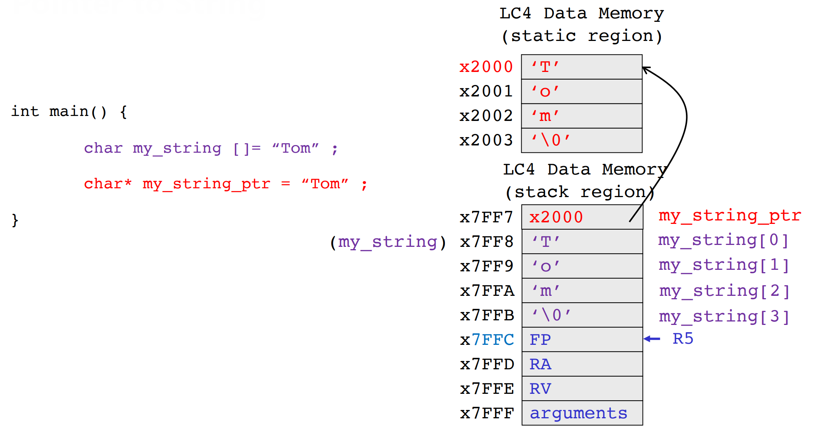
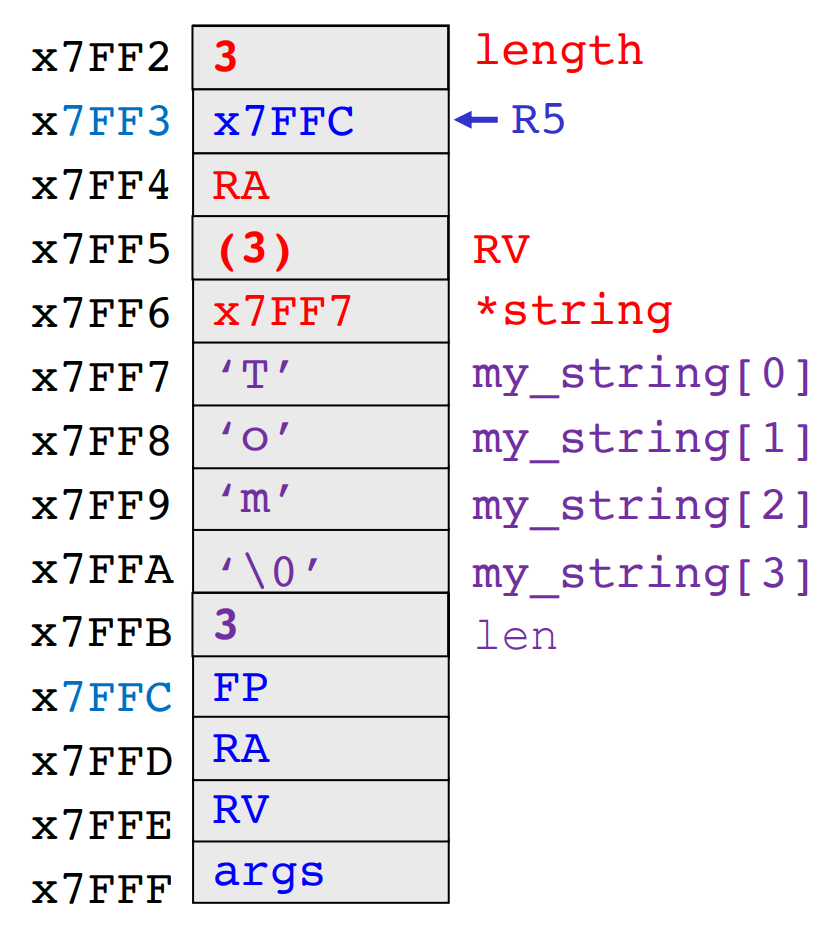
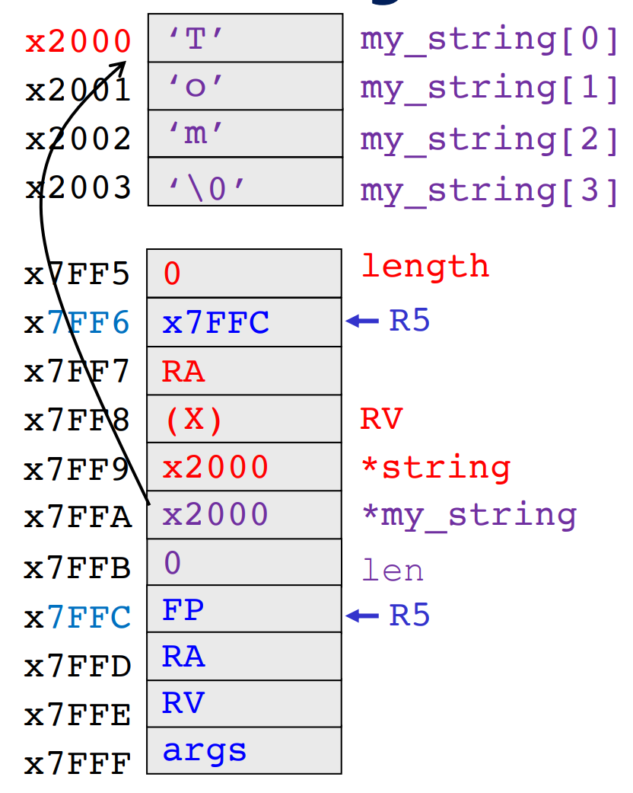
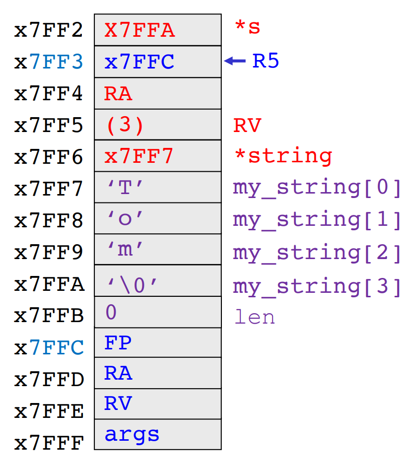
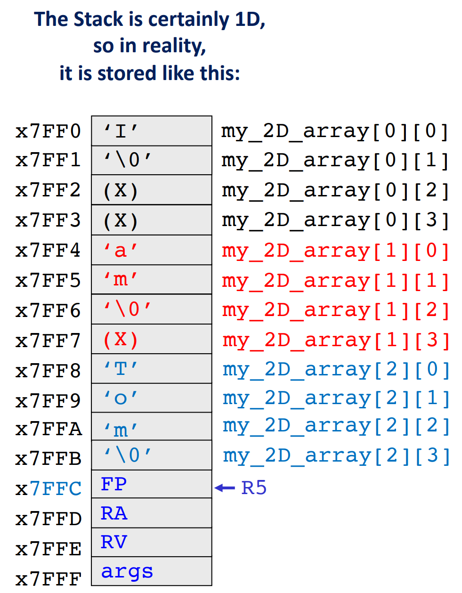
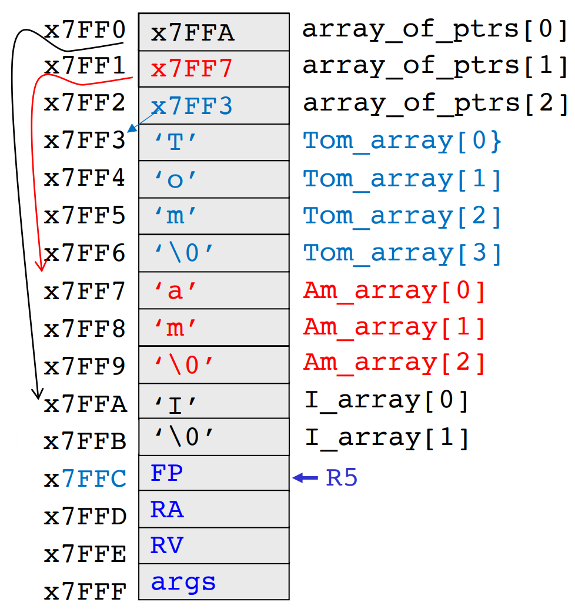

[Back to Main](../main.md)

# 11. Strings, Character Arrays, and Points to Strings
### Concept) String
- Desc.)
  - The standard C does not have a datatype string.
  - Precisely, it is a NULL terminated string.
  - The actual array resides on the stack and its identifier is the label of that array.
- Syntax)
  ```c
  char my_string1[] = {'T', 'o', 'm', '\0'};
  char my_string2[] = "Tom";
  ```
- Prop.)
  - Dereferencing and modifying the element is all possible.
    ```c
    print(my_string1[2]);   // 'm' will be printed.
    my_string2[0] = 'M';    // Tom becomes Mom.
    ```

<br>

### Concept) Literal (Pointer to a String)
- Desc.)
  - It is a pointer to a string.
  - Although initialized in the program, the actual array is stored as a [global variable](m10.md#concept-storage-classes-for-variables-in-c).
  - Read only!
- Syntax)
  ```c
  char* my_str_ptr = "Tom";
  ```
  - Desc.)
    - `my_str_ptr` is just a pointer variable in stack.
    - The actual array that `my_str_ptr` is pointing at is in global.
- Prop.)
  - Dereferencing works, but cannot modify the element.
    ```c
    print(my_str_ptr[2])    // Okay.
    // my_str_ptr[0] = 'M'  // Error!
    ```
    ||
    |:-:|
    ||

<br>

#### Concept) strlen
- Desc.)
  - A function in the Standard C Library `string.h`.
    - How to import `string.h`)
      ```c
      #include<string.h>
      ```

<table border="1">
    <tr>
        <th>Vers.</th>
        <th>Implementation in C</th>
        <th> Stack </th>
    </tr>
    <tr>
        <td>1</td>
        <td>

```c
/* strlen ver.1 */
int strlen(char* string){
    int length = 0;
    while (string[length] != '\0'){
        length++;
    }
    return length;
}

int main(){
    int len = 0;
    char my_string[] = "Tom";   // Char array in stack!
    len = strlen(my_string);
}
```

</td>
        <td></td>
    </tr>
    <tr>
        <td>2</td>
        <td>

```c
/* strlen ver.1 */
int strlen(char* string){
    int length = 0;
    while (string[length] != '\0'){
        length++;
    }
    return length;
}

int main(){
    int len = 0;
    char* my_string = "Tom";    // Literal
    len = strlen(my_string);
}
```

</td>
        <td></td>
    </tr>
    <tr>
        <td>3</td>
        <td>

```c
/* strlen ver.2 : Pointer Arithmetic */
int strlen(char* string){
    char* s;
    for (s=string; *c; c++) // s initialized to string.
    return (s-string);      // Terminating condition : *c=x00
                            // Increment pointer!
}

int main(){
    int len = 0;
    char my_string[] = "Tom";   // Char array in stack!
    len = strlen(my_string);
}
```

</td>
        <td></td>
    </tr>
</table>
<br>

#### Tech.) Maximum Length for String
- Consider the following code.
  ```c
  int main(){
    int len = 0;
    char my_string[6] = "Tom";  // char array of length 6
    len = strlen(my_string);    // 3

    my_string = "abcde";        // Reusable!
  }
  ```
  - Desc.)
    - The `char` array `my_string` has the length of 6.
    - But the literal `"Tom"` uses only 4 of them, including `'\0'` at the end.
    - Thus, when `strlen(my_string)` is called, it returns 3.
    - However, the 6 slot is secured in `my_string`.
    - Thus, we can reuse this variable for other literals with maximum length of 5.

<br>

### Tech.) Array of Strings
- Two ways to implement this
  - [2D Array](#1-2d-array)
  - [Array of String Pointers](#2-array-of-string-pointers)

#### 1) 2D Array

<table border="1">
    <tr>
        <th>Syntax in C</th>
        <th> Stack </th>
    </tr>
    <tr>
        <td>

```c
// Custom length counter
int strlen_2D (char my_2D_ptr [][4]){ // 4 cannot be ommited!
  int i=0; length=0;
  for (i=0; i<3; i++){
    length += strlen(my_2D_ptr[i]);
  }
  return length;
}

int main(){
  int len=0;

  // Declaration
  char my_2D_array [3][4] = {
    {'I', '\0'},
    {'a', 'm', '\0'},
    {'T', 'o', 'm', '\0'},
  }

  len = strlen_2D(my_2D_array);
  // 1+2+3
}
```

</td>
        <td></td>
    </tr>
</table>
<br>

- Prop.)
  - Fixed maximum length
  - Waste of memory.
  - When passing the array, we should tell the compiler the length of each row.
    - e.g.) `int strlen_2D (char my_2D_ptr [][4]){` <- 4


#### 2) Array of String Pointers

<table border="1">
    <tr>
        <th>Syntax in C</th>
        <th> Stack </th>
    </tr>
    <tr>
        <td>

```c
// Custom length counter
int strlen_2D (char** my_2D_ptr){ 
  int i=0; length=0;
  for (i=0; i<3; i++){
    length += strlen(my_2D_ptr[i]);
  }
  return length;
}

int main(){
  char I_array[] = {'I', '\0'};
  char Am_array[] = {'a', 'm', '\0'};
  char Tom_array[] = {'T', 'o', 'm', '\0'};

  char* array_of_ptrs [] = {I_array, Am_array, Tom_array};
}
```

</td>
        <td></td>
    </tr>
</table>
<br>


<br><br>

[Back to Main](../main.md)