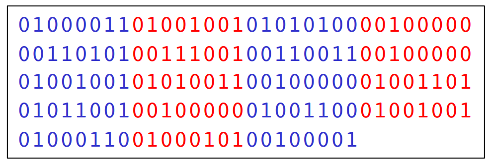
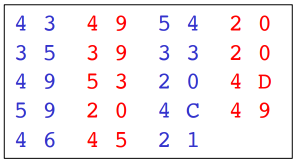
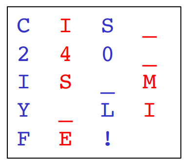
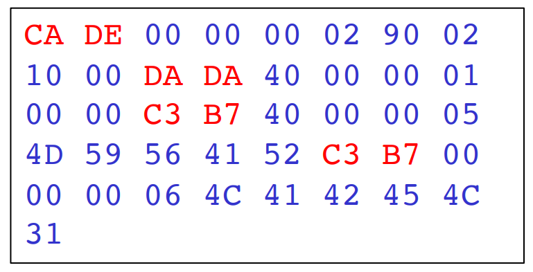
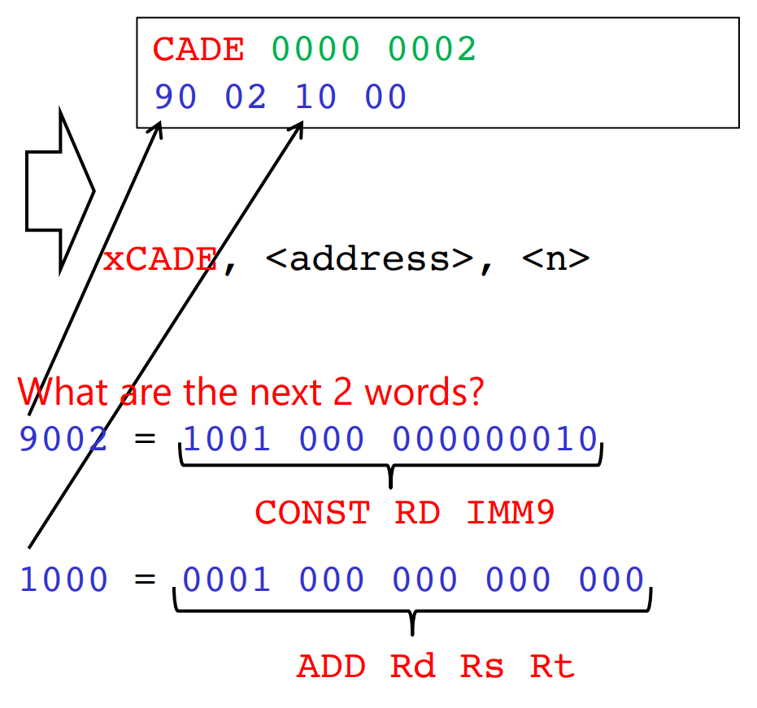
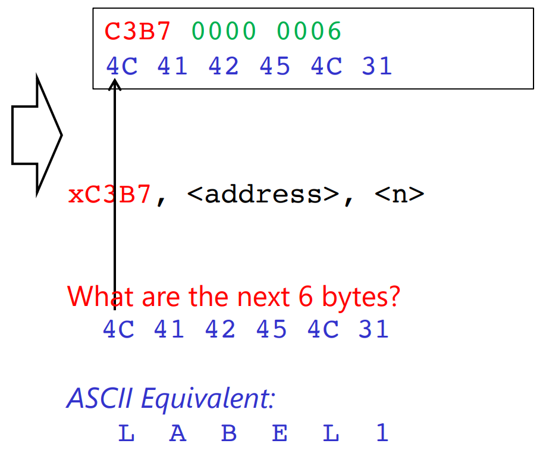

[Back to Main](../main.md)

# 12. C-Files (Basic I/O)
### Concept) File
- Def.)
  - Logical collections of 1s and 0s.
- Basic Types)
  - ASCII(Text) Files
    - Generally human readable.
    - e.g.) .c, .java, .asm
    - How to read?)
      |In binary|In hex|In ASCII|
      |:-:|:-:|:-:|
      ||||
  - Binary Files
    - Generally not human readable.
    - e.g.) .o, .exe, .jpg

<br>

### E.g.) PennSim's .obj File Format
- Five Sections)
  |Section|Mapping|Format|
  |:-:|:-:|:-:|
  |`CODE`|`.CODE` in .asm|`xCADE, <address>, <num_of_words>`|
  |`DATA`|`.DATA` in .asm|`xDADA, <address>, <num_of_words>`|
  |`SYMBOL`|Labels in .asm|`xC3B7, <address>, <num_of_words>`|
  |`FILENAME`|Name of the .C file the .asm came from|`xF17E, <num_of_bytes>`|
  |`LINE NUMBER`|Which .asm line came from which .C|`x715E, <address>, <line>, <file_index>`|
  - cf.) For LC-4, the word length was 16-bits.
- e.g.)

<table border="1">
<tr>
    <th>.asm</th>
    <th>.obj</th>
    <th>Desc.</th>
</tr>

<tr>
<td>

```assembly
.CODE
.ADDR x0000

LABEL1
    CONST R0, #2
    ADD R0, R0, R0

.DATA
.ADDR x4000
    MYVAR .BLKW x1
```

</td>

<td></td>
<td><br></td>
</tr>
</table>

<br><br>

### Concept) Endian
- Def.) Endianness
  - How the binary data in a file is ordered.
- Types)
  - Big Endian
    - Desc.)
      - Bytes are stored in file from MSB to LSB.
    - e.g.)
      - `CADE 0000 0002`
  - Little Endian
    - Desc.)
      - Bytes are stored in file from LSB to MSB.
    - e.g.)
      - `DECA 0000 0200`

<br><br>

### Concept) File Operations in C
|Category|C Operation|
|:-:|:-:|
|Open|[fopen()](#function-fopen)|
|Close|fclose()|
|Read|[fgetc()](#function-fgetc), [fgets()](#function-fgets), [fread()](#function-fread)|
|Write|[fputc()](#function-fputc), [fputs()](#function-fputs), [fwrite()](#function-fwrite)|
|Rewind||
|Seek||

#### Type) FILE
- Desc.)
  - A data type that holds information about an open file.
  - Information like place in the file system, our position in the file, etc.
  - OS dependent
- e.g.)
  ```c
  typedef struct{
    short int level;
    short int token;
    short int bsize;
    char fd;
    unsigned int flags;
    unsigned char hold;
    unsigned char *buffer;
    unsigned int istemp;
  } FILE;
  ```

<br>

#### Function) fopen()
- Desc.)
  - A helper function to open up a file
- Syntax)
  ```c
  FILE* fopen(const char *filename, const char *mode)
  ```
  - Argument Desc.)
    - `filename` : a string containing name of the file in the file system.
    - `mode` : a string containing the type of file access (read/write/etc.)
      |Argument|Meaning|
      |:-:|:-|
      |`"r"`|read only|
      |`"w"`|write enable (overwrite from the beginning)|
      |`"a"`|append to file (add stuff at the end)|
      |`"rb"`|open binary file for reading|
      |`"wb"`|open binary file for writing|
- Return)
  - If file does not exist or cannot be created, `NULL` is returned.
  - Otherwise, a pointer to the open [FILE](#type-file) is returned.

<br>

#### Function) fgetc()
- Desc.)
  - Reads character from a file and advances "position indicator"
  - Read 8-bit by 8-bit (ASCII)
- Syntax)
  ```c
  int fgetc (FILE* stream)
  ```
  - Argument Desc.)
    - `stream` : the pointer to an [open](#function-fopen) file one wishes to read a character from.
- Return
  - Returns a byte (1 character) read from the files as an integer.
  - If the file at its end, it returns `EOF`.
    - `EOF` is typically -1 and indicates it has reached the end of the file.

<br>

#### Function) fputc()
- Desc.)
  - Writes character to a file and advances "position indicator"
- Syntax)
  ```c
  int fputc(int character, FILE* stream)
  ```
  - Argument Desc.)
    - `character` : the character (byte) to be written
    - `stream` : pointer to an open file one wishes to read a character from
- Return
  - If no error occurs, it returns the same character that has been written.
  - If an error occurs, returns `EOF`.
- e.g.) Simple `fputc` example.
  ```c
  #include <stdio.h>

  int main(){
    FILE *my_file = NULL;
    my_file = fopen("tom.txt", "w");    // "tom.txt" opened with write mode.
    if (my_file == NULL) { return 1; }  // Return with error!

    fputc('T', my_file);
    fputc('o', my_file);
    fputc('m', my_file);

    fclose(my_file);      // Close the file and flush the buffer.
  }
  ```
- e.g.) Copying file using `fgetc` and `fputc`
  ```c
  #include <stdio.h>

  int main(){
    FILE *src_file = NULL;
    FILE *des_file = NULL;
    int byte_read;

    src_file = fopen("src_file.obj", "rb");     // Read binary obj file with rb mode.
    if (src_file == NULL) { return 1; }         // Return with error 1.

    des_file = fopen("des_file.obj", "wb");     // Write on binary obj file with wb mode.
    if (des_file == NULL) { return 2; }         // Return with error 2.

    do{
      byte_read = fgetc(src_file);
      if (byte_read == EOF) break;
      
      fputc(byte_read, des_file);
    } while (1) ;

    fclose(src_file);
    fclose(des_file);
  }
  ```

<br>

#### Function) fread()
- Desc.)
  - Reads data from a file into an array
- Syntax)
  ```c
  size_t fread(void *ptr, size_t size, size_t nmemb, FILE* stream)
  ```
  - Argument Desc.)
    - `ptr` : void pointer to an array you want to read data into
      - The datatype can be specified with the `size` and the `nmemb` argument.
    - `size` : size of a single element of your array
    - `nmemb` : the total number of elements in your array
    - `stream` : pointer to an open file to read from
- Return
  - The total number of elements successfully read
  - If this number is different from `nmemb` argument, you've hit `EOF` or and an error occurred.
  ```c
  #include <stdio.h>
  #define ARRAY_SIZE 4
  
  int main(){
    int array[10];    // Must initialize the size of the array!!!
    FILE* target_file = NULL;

    target_file = fopen("input_file", "rb");  // Read binary mode.

    fread(array, sizeof(int), 10, target_file);

    fclose(target_file);

    return 0;
  }
  ```

<br>

#### Function) fwrite()
- Desc.)
  - Writes data from an array into a file
- Syntax)
  ```c
  size_t fwrite(const void *ptr, size_t size, size_t nmemb, FILE* stream)
  ```
  - Argument Desc.)
    - `ptr` : void pointer to an array you want to write data from
      - The datatype can be specified with the `size` and the `nmemb` argument.
    - `size` : size of a single element of your array
    - `nmemb` : the total number of elements in your array
    - `stream` : pointer to an open file to write to
- Return
  - The total number of elements successfully written.
  - If this number is different from `nmemb` argument, an error occurred.
- e.g.)
  ```c
  #include <stdio.h>
  #define ARRAY_SIZE 4
  
  int main(){
    int num1 = 0xFEDC;
    int array[ARRAY_SIZE] = {0,1,2,3};
    FILE* target_file = NULL;
    
    target_file = fopen("output_file", "wb");   // Open with write binary mode.

    fwrite(&num1, sizeof(int), 1, target_file); // Write one integer.

    fwrite(array, sizeof(int), ARRAY_SIZE, target_file);  // Write whole array!

    fclose(target_file);
    
    return 0;
  }
  ```

<br>

#### Function) fgets()
- Desc.)
  - Reads a string from a file and stores it in the array of characters.
  - It stops reading either when
    - $`n-1`$ characters are read
    - the newline character is read
    - `EOF` is read
- Syntax)
  ```c
  char* fgets(char* str, int n, FILE* stream)
  ```
  - Argument Desc.)
    - `str` : pointer to an array of `char`s to read string into
    - `n` : maximum number of characters to be read from file (including `NULL`)
    - `stream` pointer to an open file to read from
- Return
  - On success, function returns pointer to `str`
  - On failure, `NULL` pointer is returned.
- e.g.) Error Examples
  ```c
  #include <stdio.h>

  int main(){
    char* array1;
    char* array2 = "Tom";
    char array3[3];
    FILE* target_file = NULL;

    target_file = fopen("output_file.txt", "w");

    /* Error Examples */
    fputs(array1, 4, target_file);    // Memory NOT allocated.
    fputs(array2, 4, target_file);    // Cannot write on the static memory.
    fputs(array3, 4, target_file);    // Not enough allocated memory!

    fclose(target_file);
    return 0;
  }
  ```

<br>

#### Function) fputs()
- Desc.)
  - Writes a string to a file
- Syntax)
  ```c
  char* fputs(const char* str, FILE* stream)
  ```
  - Argument Desc.)
    - `str` : pointer to array containing NULL terminated string.
    - `stream` : pointer to an open file to write to.
- Return
  - On success, returns a non-negative value.
  - Otherwise, returns EOF.
- e.g.)
  ```c
  #include <stdio.h>
  #define ARRAY_SIZE 4

  int main(){
    char array[ARRAY_SIZE] = {'T', 'o', 'm', '\0'};
    char* array2 = "Tom";
    FILE* target_file = NULL;

    target_file = fopen("output_file.txt", "w");

    fputs(array, target_file);    // Writing char array.
    fputs(array2, target_file);   // Writing literal on the static memory.
    fputs("TOM", target_file)     // Writing literal directly.

    fclose(target_file);
    return 0;
  }
  ```

<br>

#### Function) fprintf()
- Desc.)
  - Writes formatted string to a file
- Syntax)
  ```c
  int fprintf(FILE* stream, const char* format, ...) // Variadic argument!
  ```
  - Argument Desc.)
    - `stream` : pointer to an open file to read from
    - `format` : formatted string to be written to the file
      - optionally, the formatted string can embed format tags, replaced with these extra arguments
- Return
  - On success, total number of characters written
  - On failure, a negative number is returned
- e.g.)
  ```c
  #include <stdio.h>

  int main(){
    int a = 5;
    char* string = "world";
    FILE* target_file = NULL;

    target_file = fopen("output_file.txt", "w");

    fprintf(target_file, "Hello world\n");  // \n is parsed as the new line!
    fprintf(target_file, "Hello %s\n", string);  
    fprintf(target_file, "a = %d\n", a);  
    fprintf(target_file, "a = %x\n", a);  
    fprintf(target_file, "a's address = %p\n", &a); // print the address of a  
  }
  ```

<br>

#### Concept) File Handlers in C Library
- Desc.)
  - These handlers are always open.
  - Cannot close
    |Types|Functionality|
    |:-:|:-|
    |`stdin`|Standard input (console)|
    |`stdout`|Standard output (console, for output)|
    |`stderr`|Standard error (console, for error message)|
    |`printf`|Equivalent to `fprintf(stdout, "hi\n");`|

<br>


<br><br>

[Back to Main](../main.md)