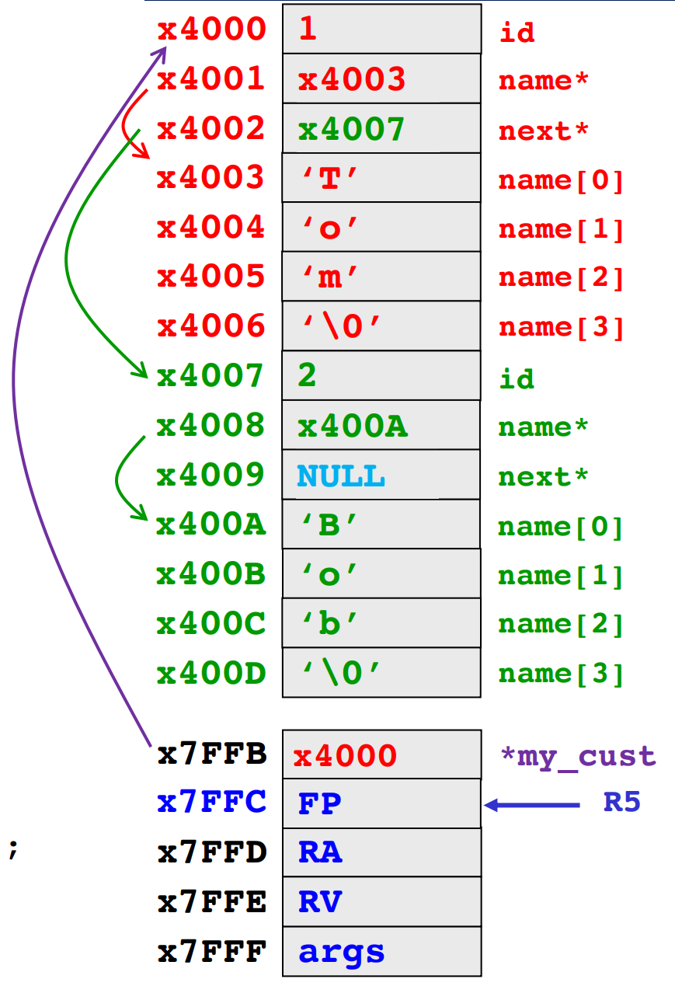

[Back to Main](../main.md)

# 13. C-Heap-Linked List
### Concept) Dynamic Memory Allocation
- Desc.)
  - "Dynamic" means "at run-time"
    - Not "at compile time"
- How?)
  - Stack memory cannot support the dynamic memory allocation.
    - e.g.)
        ```c
        int length = 2;
        int int_array[length];  // This one won't be compiled
        ```
        - Why?)
          - The value `2` is assigned at `length` during the runtime.
          - Thus, at the compile time, we cannot allocate the memory with the size of `length`.
  - Instead, **heap** memory can support this.
    |||
    |:-|:-|
    ||- Recall that **stack** and the **global region** must be known at compile time.<br>- But **heap** is accessible at runtime!|
    
<br>

### Concept) Heap API (malloc, free)
- Desc.)
  - Two basic functions that the programmer can interface with heap.
  - Heap is managed by user-level C runtime library: `libc`
  - Interface function declarations found in `stdlib.h`
- Functions)
  - `void* malloc(size_t size)`
    - Returns
      - a void pointer `void*` to a region on the heap of size in bytes.
        - i.e.) returning a generic pointer!
      - NULL if heap cannot fullfil request.
        - e.g.) Heap memory is full.
  - `void free(void* ptr)`
    - It clears reservation for address pointed to be `ptr`.
    - `malloc` must have reserved this address.
    - The identifier doesn't matter. It works with the address that the identifier is pointing at.
- Examples)
  - [1) Creating an Array at Runtime](m13eg.md#eg1-creating-an-array-at-runtime)
  - [2) Returning addresses on the Heap from Functions](m13eg.md#eg2-returning-addresses-on-the-heap-from-functions)
  - [3) Heap vs Other Regions of Memory](m13eg.md#eg3-heap-vs-other-regions-of-memory)
  - [4) Multidimensional Arrays on the Heap](m13eg.md#eg4-multidimensional-arrays-on-the-heap)
  - [5) Structures on the Heap](m13eg.md#eg5-structures-on-the-heap)

<br><br>

### Concept) Linked List Data Structure
- Basic Implementation)

<table border="1">
    <tr>
        <th>Case 3) Linked list of <code>struct</code>s on heap.</th>
        <th> Memory </th>
    </tr>
    <tr>
        <td>

```c
#include <stdlib.h>

typedef struct cust_struct {
    int id;
    char* name;
    struct cust_struct* next;  // Cannot use alias yet.
} customer;

int main(){
    customer* my_cust = malloc(sizeof(customer));
    my_cust->id = 1;
    my_cust->name = malloc(strlen("Tom")+1);
    strcpy(my_cust->name, "Tom");

    my_cust->next = malloc(sizeof(customer));
    my_cust->next->id = 2;
    my_cust->next->name = malloc(strlen("Bob")+1);
    strcpy(my_cust->next->name, "Bob");
    my_cust->next->next = NULL; // To notify that Bob is the last

    free(my_cust->next->name);
    free(my_cust->next);
    free(my_cust->name);
    free(my_cust);
    return 0;
}
```

</td>
        <td></td>
    </tr>
</table><br><br>

- Analysis)
  - Comparison with array structure
    - Possible implementations
      ```c
      customer my_customer_list[100];
      ```
      ```c
      customer* my_customer_list = malloc(100 * sizeof(customer))
      ```
    - Props.)
      - Arrays cannot dynamically adjust the size.
      - The size should be confirmed at the compile time.
      - Still, they can instantly access using indices.
  - Linked List Structure's...
    - Advantage)
      - Growth of the list can be dynamic.
      - A more efficient use of memory.
      - Shrinking / reordering our list can also be dynamic
      - These two advantages far outweigh the disadvantages!
    - Disadvantage)
      - Pointer & memory management is tricky
        - Instead, use [helper functions](#tech-linked-list-management-using-helper-functions)!
      - It’s more difficult to “traverse the list” (to find things)

<br>

### Tech.) Linked List Management Using Helper Functions
- Why needed?)
  - Managing a linked list can be difficult and impossible if you try to do it all in `main()`!
  - We’ll use C’s “multifile” development capability to create a library that contains our helper function
- Implementation)
  - Creating a header file : `customer.h`
    ```c
    typedef struct cust_struct{
      int id;
      char* name;
      struct cust_struct* next;
    } customer;

    /* Helper Function Definition! */
    customer* add_customer(customer* list, int id, char* name);
    ```
  - Creating the C file : `customer.c`
    ```c
    #include "customer.h" // Import customer and helper functions
    #include <stdlib.h>

    customer* add_customer(customer* list, int id, char* name){
      customer* new_customer = malloc(sizeof(customer));
      new_customer->id = id;
      new_customer->name = malloc(sizeof(name) + 1);
      strcpy(new_customer->name, name);
      new_customer->next = NULL;

      customer* header = list;
      while (list->next != NULL) { list = list->next; }
      list->next = new_customer;
      return header;
    }

    int main(){
      customer* customer_list = NULL;

      customer_list = add_customer(customer_list, 1, "Tom");
      customer_list = add_customer(customer_list, 2, "Bob");
    }
    ```


<br><br>

[Back to Main](../main.md)