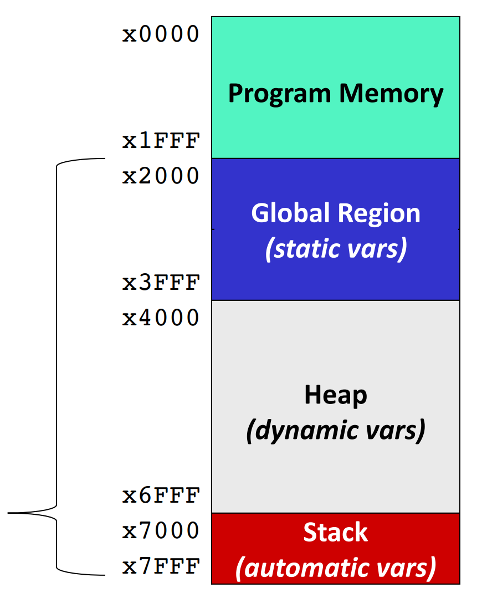

[Back to Main](../main.md)

# 13. C-Heap-Linked List
### Concept) Dynamic Memory Allocation
- Desc.)
  - "Dynamic" means "at run-time"
    - Not "at compile time"
- How?)
  - Stack memory cannot support the dynamic memory allocation.
    - e.g.)
        ```c
        int length = 2;
        int int_array[length];  // This one won't be compiled
        ```
        - Why?)
          - The value `2` is assigned at `length` during the runtime.
          - Thus, at the compile time, we cannot allocate the memory with the size of `length`.
  - Instead, **heap** memory can support this.
    |||
    |:-|:-|
    ||- Recall that **stack** and the **global region** must be known at compile time.<br>- But **heap** is accessible at runtime!|
    
<br>

### Concept) Heap API (malloc, free)
- Desc.)
  - Two basic functions that the programmer can interface with heap.
  - Heap is managed by user-level C runtime library: `libc`
  - Interface function declarations found in `stdlib.h`
- Functions)
  - `void* malloc(size_t size)`
    - Returns
      - a void pointer `void*` to a region on the heap of size in bytes.
        - i.e.) returning a generic pointer!
      - NULL if heap cannot fullfil request.
        - e.g.) Heap memory is full.
  - `void free(void* ptr)`
    - It clears reservation for address pointed to be `ptr`.
    - `malloc` must have reserved this address.
    - The identifier doesn't matter. It works with the address that the identifier is pointing at.
- Examples)
  - [1) Creating an Array at Runtime](m13eg.md#eg1-creating-an-array-at-runtime)
  - [2) Returning addresses on the Heap from Functions](m13eg.md#eg2-returning-addresses-on-the-heap-from-functions)
  - [3) Heap vs Other Regions of Memory](m13eg.md#eg3-heap-vs-other-regions-of-memory)
  - [4) Multidimensional Arrays on the Heap](m13eg.md#eg4-multidimensional-arrays-on-the-heap)
  - [5) Structures on the Heap](m13eg.md#eg5-structures-on-the-heap)
  - [6) Pointers to Structures on the Heap](m13eg.md#eg6-pointers-to-structures-on-the-heap)

<br><br>


<br><br>

[Back to Main](../main.md)