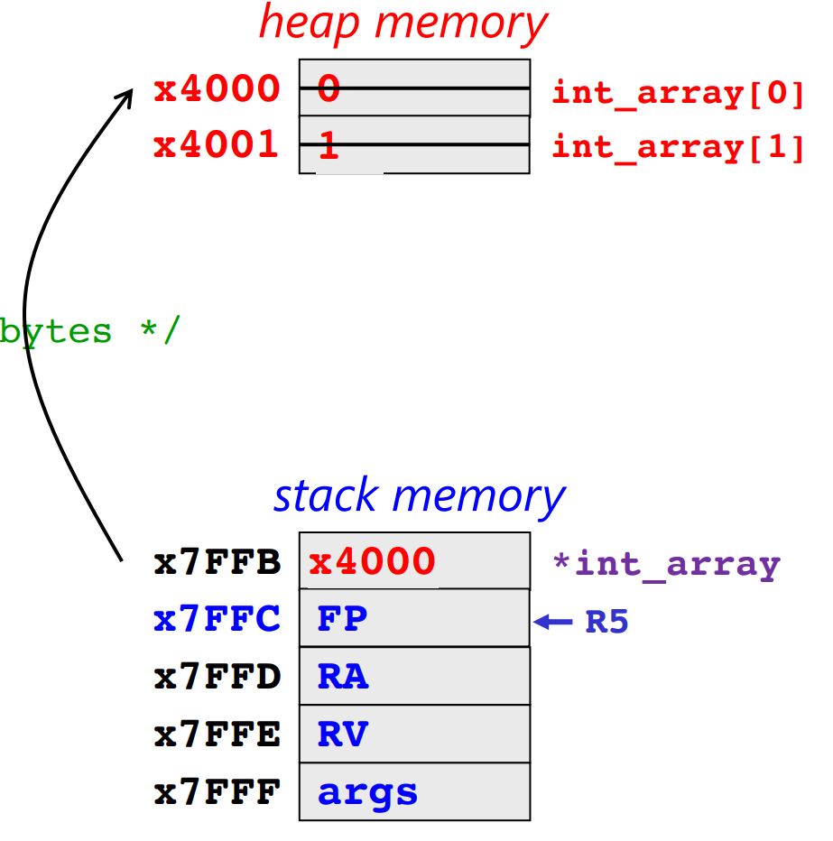
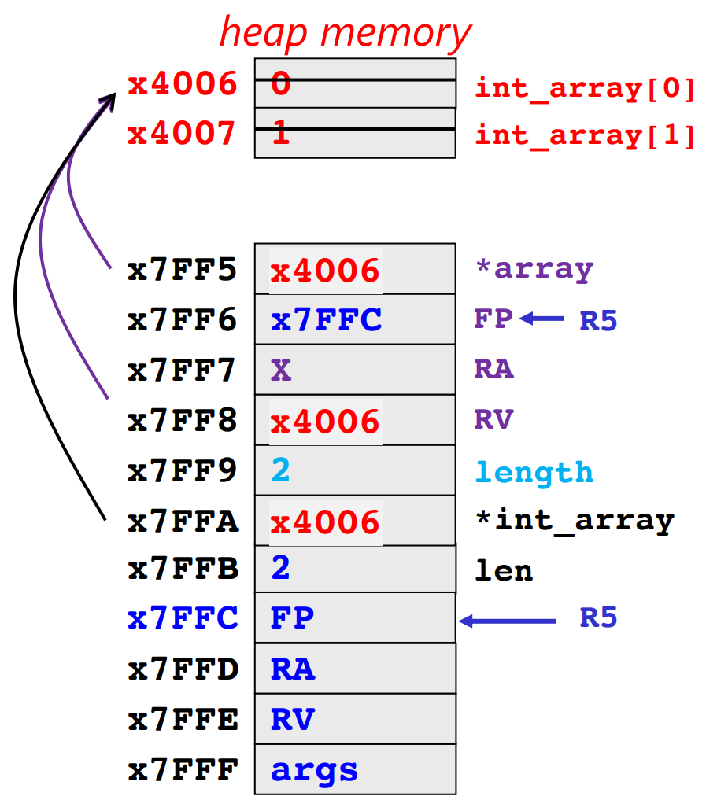
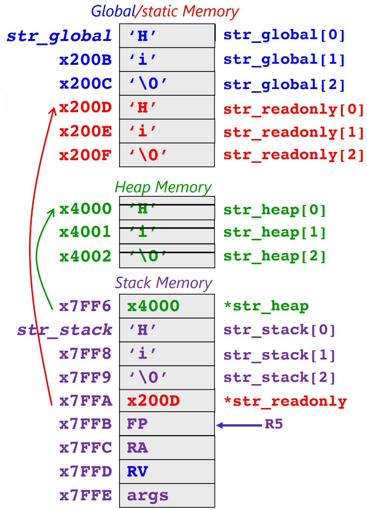
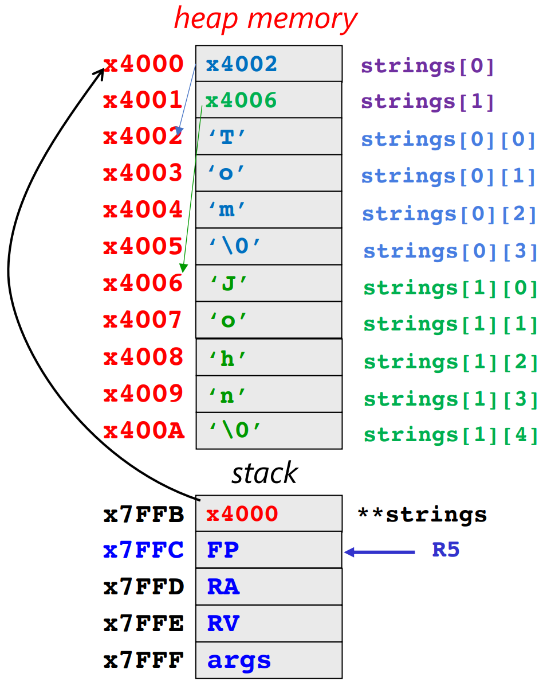

[Back to Note 13](m13.md#concept-heap-api-malloc-free)

## E.g.1) Creating an Array at Runtime

<table border="1">
    <tr>
        <th>Program in C</th>
        <th> Memory </th>
    </tr>
    <tr>
        <td>

```c
#include <stdlib.h>

int main(){
    int* int_array = NULL;
    int_array = malloc(2*sizeof(int));  // 2*8 bytes
    if (int_array == NULL) return 1;    // Validation check for malloc

    /* Assign values to the array */
    int_array[0] = 0;
    int_array[1] = 1;

    free(int_array);    // Free the reserved memory.
    return 0;
}
```

</td>
        <td></td>
    </tr>
</table><br><br>


## E.g.2) Returning addresses on the Heap from Functions

<table border="1">
    <tr>
        <th>Program in C</th>
        <th> Memory </th>
    </tr>
    <tr>
        <td>

```c
#include <stdlib.h>

int* create_array (int length){
    int* array = NULL;
    array = malloc(length * sizeof(int));   // Allocate memory with argument!
    return array;
}

int main(){
    int len = 2;
    int* int_array = NULL;

    int_array = create_array(len);      // malloc by create_array()
    if (int_array == NULL) return 1;    // Validation check

    /* Assign values to the array */
    int_array[0] = 0;
    int_array[1] = 1;

    free(int_array);    // Free the reserved memory.
    return 0;
}
```

</td>
        <td></td>
    </tr>
</table><br><br>


## E.g.3) Heap vs Other Regions of Memory

<table border="1">
    <tr>
        <th>Program in C</th>
        <th> Memory </th>
    </tr>
    <tr>
        <td>

```c
#include <stdlib.h>
#include <string.h>

char str_global[3];     // Global Region!

int main(){
    char* str_readonly = "Hi";  // Also global!
    char str_stack[3];          // Array in stack!
    char* str_heap = malloc(strlen(str_readonly)+1);    // In Heap!

    strcpy(str_global, str_readonly);   // Copy to global
    strcpy(str_stack, str_readonly);    // Copy to stack
    strcpy(str_heap, str_readonly);     // Copy to heap

    free(str_heap); // The only one that taking up heap space.
    return 0;
}
```

</td>
        <td></td>
    </tr>
</table><br><br>


## E.g.4) Multidimensional Arrays on the Heap

<table border="1">
    <tr>
        <th>Program in C</th>
        <th> Memory </th>
    </tr>
    <tr>
        <td>

```c
#include <stdlib.h>
#include <string.h>

int main(){
    char** strings = NULL;

    /* Allocate rows */
    strings = malloc(2 * sizeof(char*));    // Space for two (char*)s

    /* Allocate space for "Tom" */
    strings[0] = malloc(strlen("Tom")+1);   // +1 for the null character
    strcpy(strings[0], "Tom");

    /* Allocate space for "John" */
    strings[1] = malloc(strlen("John")+1);  // +1 for the null character
    strcpy(strings[1], "John");

    /* Order of free()-ing matters! */
    free(strings[0]);
    free(strings[1]);
    free(strings);
}
```

</td>
        <td></td>
    </tr>
</table><br><br>


## E.g.5) Structures on the Heap

<table border="1">
    <tr>
        <th>Program in C</th>
        <th> Memory </th>
    </tr>
    <tr>
        <td>

```c
#include <stdlib.h>


```

</td>
        <td></td>
    </tr>
</table><br><br>


## E.g.6) Pointers to Structures on the Heap

<table border="1">
    <tr>
        <th>Program in C</th>
        <th> Memory </th>
    </tr>
    <tr>
        <td>

```c
#include <stdlib.h>


```

</td>
        <td></td>
    </tr>
</table><br><br>


[Back to Note 13](m13.md#concept-heap-api-malloc-free)