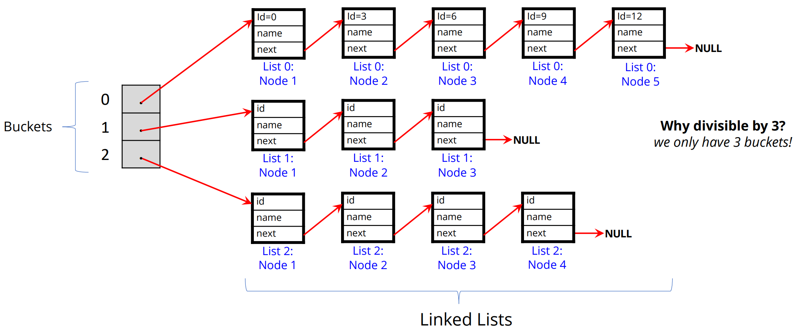

[Back to Main](../main.md)

# 14. Hash Tables
### Analysis) Array vs Linked List
||[Array](m10.md#concept-array)|[Linked List](m13.md#concept-linked-list-data-structure)|
|:-:|:-|:-|
|Pros|- Adding things to the end of an array is easy, if there is space   - Accessing with index is efficient.|- Easy to add new elements to the front or back as needed.  - Inserting or deleting in the middle of the list is not costly.|
|Cons|- Need to allocate a fixed size; cannot grow if you need to add more entries.   - Inserting or deleting from the middle of the array is costly.|- Searching involves traversing.|

 

### Concept) Hash Table Datastructure in C
- Desc.)
  - Combination of an [Array](m10.md#concept-array), [Linked List](m13.md#concept-linked-list-data-structure), and a Hashing Function
    - Advantages)
      - The “fast” addressability of an array 
      - The efficiency of a dynamically allocated linked list
- Structure)
  
  - Desc.)
    - Buckets are the array of pointers pointing at the head of each linked lists.
    - Hashing
- Operations)
  - Insertion
    - Apply Hash Function to the incoming data to determine the bucket it belongs in
    - Address the bucket, then insert the node into linked list addressed by the bucket #
  - Search
    - Apply Hash Function to the data we wish to find, to reveal its bucket #
    - Address the bucket, then search for the node in linked list addressed by the bucket #

### E.g.) Customer Hash Table
- Files
  - [customer.h](../scripts/m14/customer.h), [customer.c](../scripts/m14/customer.c)
    - Contains
      - the `struct` `customer`, which is the linked list
  - [customer_hash.h](), [customer_hash.c]()
    - Contains
      - the `struct` `customer_hash`, which is the hash table

  

[Back to Main](../main.md)