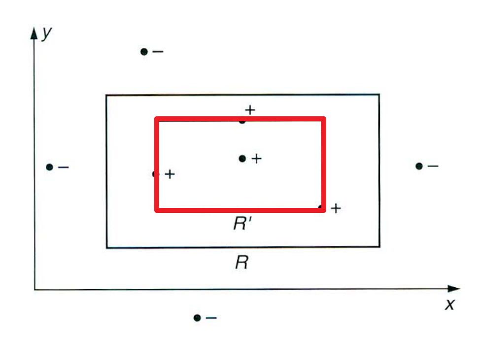
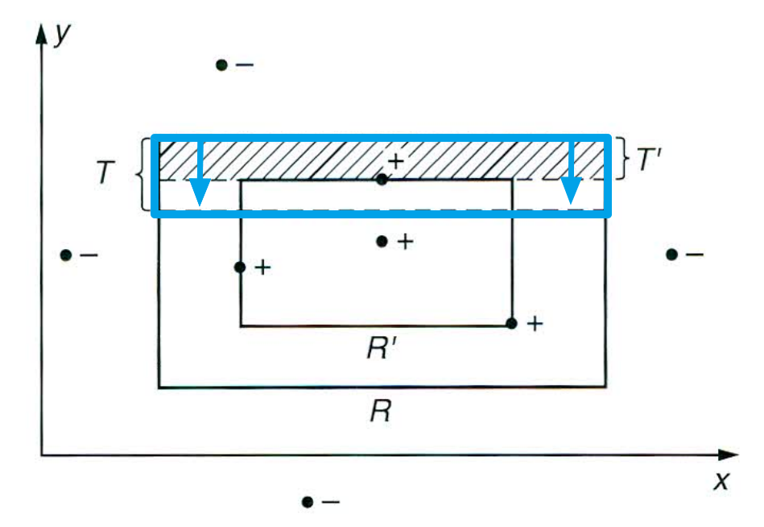

[Back to Main](../../main.md)

# 1.1 A Rectangle Learning Game
#### Objective)
- Learn an unknown axis-aligned rectangle $`R`$.
  - $`R \subset \mathbb{R}^2`$
  - $`R`$'s sides are parallel with the coordinate axes.

#### Learning Process)
  - The player receives information about $`R`$ only through the following process:
    - A random point $`p`$ is chosen in the plane according to some fixed probability distribution $`\mathcal{D}`$.
    - $`p`$ is given with a label indicating whether $`p`$ is contained in $`R`$ or not.
  - The player picks a hypothesis rectangle $`R'`$ with minimum examples.
    - How to measure the performance of $`R'`$)
      - Calculate the error of $`R'`$.
        - i.e.) the probability that a randomly chosen point from $`\mathcal{D}`$ falls in the region $`R\Delta R \equiv (R-R')\cup(R'-R)'`$.

#### Efficient Strategy for the Player)
- Request a "sufficiently large" number $`m`$ of examples.
- Then, choose the hypothesis $`R'`$ which gives the tightest fit to the positive examples.
  - i.e.) the one with the smallest area that includes all of the positive examples and none of the negative examples.
    - If no positive example is drawn, $`R'=\emptyset`$.
  - e.g.)
    ||
    |:-:|
    ||

### Tech) Setting Bounds
- Assertion)
  - For 
    - any target rectangle $`R`$ 
    - any distribution $`\mathcal{D}`$
    - any small value $`\epsilon \gt 0`$
    - any small value $`\delta \le \frac{1}{2}`$
  - fo a suitably chosen value of the sample size $`m`$,
    - we can assert
      - with the probability of $`1-\delta`$
      - the tightest-fit rectangle has error at most $`\epsilon`$ w.r.t. $`R`$ and $`\mathcal{D}`$
- Derivation)
  - Consider that $`\forall R' \subseteq R`$.
  - Then $`R\Delta R' = R-R'`$, which is the error region.
  - Since $`R`$ and $`R'`$ are the rectangles, we can express $`R-R'`$ as the union of four rectangular strips.
  - Put $`T'`$ the top most one.
    - cf.) Note that there are some overlaps between the strips on each corner.
  - Suppose, the weight under $`\mathcal{D}`$ of each strip is at most $`\frac{\epsilon}{4}`$.
    - i.e.) the probability w.r.t. $`D`$ of falling in a strip.
    - Then, we can conclude that the error of $`R'`$ is at most $`4\times\frac{\epsilon}{4} = \epsilon`$.
  - Define $`T \subseteq R`$ to be a rectangular strip, which encloses exactly weight $`\frac{\epsilon}{4}`$ under $`\mathcal{D}`$.
    ||
    |:-:|
    ||
    - i.e.) $`T'`$ sweep the top edge of $`R`$ downward until we swept out weight $`\frac{\epsilon}{4}`$
    - cf.) $`T'`$ can include $`T`$
      - iff. $`\nexists p\in T`$ appears in the sample $`S`$.
        - Why?) Suppose there is a point $`p\in T`$ that is in $`S`$.
          - Since $`T\subset R`$, $`p`$ is a positive example.
          - Then, it must be on the edge of $`T'`$ because $`T'`$ was the tightest fit.
            - Contradiction : $`T'`$ must include $`T`$.
  - By definition, the probability that a single draw from the distribution $`\mathcal{D}`$ misses the region $`T`$ is $`1-\frac{\epsilon}{4}`$.
  - Now, suppose $`m`$ samples are picked and put them $`S`$
  - Assuming i.i.d., the probability of $`m`$ independent picks miss $`T`$ is $`\left(1-\frac{\epsilon}{4}\right)^m`$.
  - We have only considered the top $`T'`$ but same can happen for the four strips : top, bottom, left right.
    - By the union bound ($`Pr[A\cup B] \le Pr[A]+Pr[B]`$),
      - the probability that any of the four strips of $`R-R'`$ has weight greater than $`\frac{\epsilon}{4}`$ is $`4\left(1-\frac{\epsilon}{4}\right)^m`$.
  - Now, we want to set $`m`$ that satisfies
    - $`4\left(1-\frac{\epsilon}{4}\right)^m \le \delta`$.
      - cf.) $`\delta`$ can be interpreted as the confidence.
        - The probability that the player misclassifies a new sample.
  - Using the inequality $`(1-x) \le e^{-x}`$,
    - $`4\left(1-\frac{\epsilon}{4}\right)^m \le 4(e^{-\epsilon/4})^m = 4e^{-\epsilon m/4}`$
  - Hence,   
    $`\begin{aligned}
      4e^{-\epsilon m/4} \le \delta &\Rightarrow e^{-\epsilon m/4} \le \delta/4\\
      &\Rightarrow -\epsilon m/4 \le \ln{(\delta/4)} \\
      &\Rightarrow  m \ge -(4/\epsilon) \ln{(\delta/4)} \\
      &\Rightarrow  m \ge (4/\epsilon) \ln{(4/\delta)} \\
    \end{aligned}`$

### Analysis) 
- Meaning)
  - $`m \ge -(4/\epsilon) \ln{(\delta/4)}`$
    - The tightest-fit algorithm takes a sample of at least $`-(4/\epsilon) \ln{(\delta/4)}`$ examples to form its hypothesis rectangle $`R'`$
    - Provided the above, we can assert that 
      - with the probability at least $`1-\delta`$, $`R'`$ will misclassify a new point
        - with probability at most $`\epsilon`$.
- Props.)
  - This analysis hold for any fixed probability distributions.
    - Only i.i.d. needed.
  - The sample size bound behaves as we might expect.
    - For greater **accuracy** by decreasing $`\epsilon`$
    - For greater **confidence** by decreasing $`\delta`$ 

[Back to Main](../../main.md)