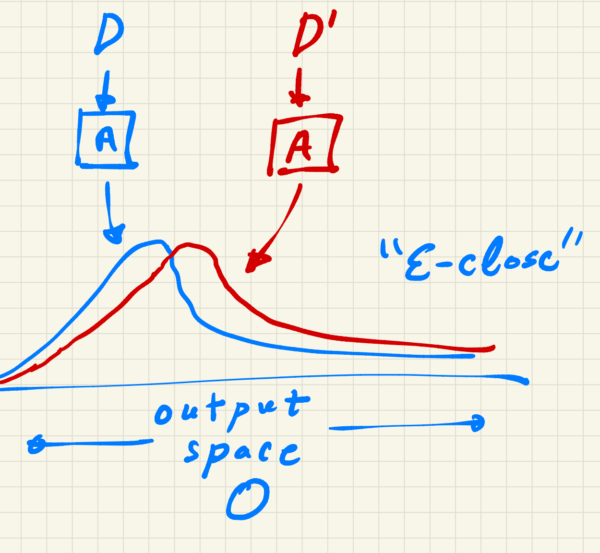
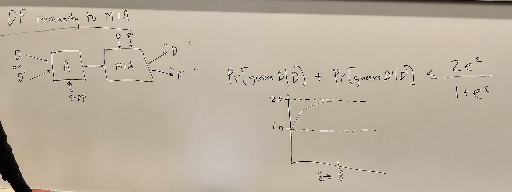

# 5. Privacy
### 5-1. Difference between security and privacy?

 Answer 

- Security
  - Control of access to the raw data
- Privacy
  - Allowing the certain uses of data but controlling the inference or the exfiltration

  

### 5-2. Explain One-Time-Pad (How it works, pros & cons)

 Answer 

- How it works)
  - For a N-bit binary code message (pad)
  - N-bit randomly generated key
  - Perform XOR operation   
    $`\begin{aligned}
        a \oplus b &= c \\
        c \oplus b &= (a\oplus b) \oplus b = a \oplus (b\oplus b) = a \oplus 0 = a
    \end{aligned}`$
- Pros)
  - Provable
  - Absolute Secrecy
- Cons)
  - Pad and key should have same length.
  - Every message requires fresh pad and key pair.
  - Keys can not be reused.
    - Attacker can infer from the previous encryptions.
  - Every individuals require separate keys

  

### 5-3 Public key cryptography (How it works, pros & cons)

 Answer 

- How it works)
  - Use the computational overhead to mimic randomness.
  - For the message $`x`$
    - encryption with public key $`e`$ : $`f_e(x)`$
    - decryption with private key $`d`$ : $`g_d(f_e(x)) = x`$
- e.g.) Prime number multiplication
  - Easy to get : $`113\times191 = 21583`$
  - Hard to get : $`21583 = 113\times191`$

  

### 5-4 Explain Fingerprints and Triangulation

 Answer 

- Fingerprint
  - Prop.)
    - Uniquely identifies an individual
  - e.g.)
    - CD's series of length of songs
    - Font download list in browsers
    - Geolocation data
- Triangulation
  - Combine other data to crash the anonymization 
  - Linkage attack

  

### 5-5 Anonymization

- Level of Privacy and Usefulness?
- 2 techniques for transformation
- What is **K-anonymity** and its limit?
- Limit of Anonymization (3)

 Answer 

- Level of Privacy and Usefulness?
  - Not private enough but very useful
- 2 techniques for transformation
  - Redaction : Removing the entire column (PII)
  - Coarsening : Reducing the resolution of a column
- K-anonymity
  - Desc.)
    - Perform redaction/coarsening until any row of $`\mathcal{D}`$ has copies more than $`K`$
  - Limit)
    - Hard to set $`K`$.
      - Too small, then vulnerable to triangulation attack
      - Too big, the data becomes useless
- Limit of Anonymization (3)
  - It pretends $`\mathcal{D}`$ is the only dataset ever.
  - No meaningful semantics or concrete definition
  - Vulnerable to reidientification/denonymization attacks

  

### 5-6 No harm what so ever

- Level of Privacy and Usefulness?
- What is this?
- Smoke example?

 Answer 

- Level of Privacy and Usefulness?
  - Too private and useless
- What is this?
  - Suppose $`x\in\mathcal{D}`$.
  - The model or the inference $`\mathcal{A}`$ is derived from $`\mathcal{D}`$.
  - If $`\mathcal{A}`$ causes harm to $`x`$, then don't do it.
- Smoke example?
  - I'm a smoker in the dataset.
  - With that data, a research proved that smoking is harmful to health.
  - The insurance premium increased for the smokers, including me.
  - Do not allow research that uses my data because it's harmful to me.

  

### 5-7 Differential Privacy

- Level of Privacy and Usefulness?
- What is indistinguishability?
- What is neighboring datasets?
- What is $`\epsilon`$-DP?
  - Def.)
    - Set notation
    - Point-wise notation
  - Props.)
    - $`\epsilon\uparrow\;\Rightarrow`$ privacy & usefulness?
    - Advantage of achieving low $`\epsilon`$?
    - Approximation using exponential function?
- Two general tools to get DP?
- Limits (3)

 Answer 

- Level of Privacy and Usefulness?
  - Satisfies both the high privacy and the usefulness
  - Between anonymization and no-harm-what-so-ever.
- Indistinguishability?
  - Def.)
    - The observer already knows datasets $`\mathcal{D}, \mathcal{D}'`$
    - Suppose a model $`A`$ infers $`r,r'`$ from $`\mathcal{D}, \mathcal{D}'`$ respectively.
    - An algorithm $`A`$ is indistinguishable if the observer cannot distinguish $`\mathcal{D}, \mathcal{D}'`$ just by looking at $`r,r'`$
- Neighboring datasets?
  - Dataset $`\mathcal{D}, \mathcal{D}'`$ are neighbors if they differ in only one row.
- $`\epsilon`$-DP?
  - Def.)
    - For 
      - $`\forall\mathcal{D}, \mathcal{D}'`$ (neighboring datasets)
      - output space $`\mathcal{O}`$
    - $`\exist \epsilon \gt 0`$ s.t.
      - Set notation : $`\forall \mathcal{S} \subseteq \mathcal{O}`$   
        $`\begin{aligned}
          & \frac{1}{e^\epsilon} \cdot \text{Pr}[A(\mathcal{D}')\in\mathcal{S}] \le \text{Pr}[A(\mathcal{D})\in\mathcal{S}] \le e^\epsilon \cdot \text{Pr}[A(\mathcal{D}')\in\mathcal{S}] \\
          \Leftrightarrow & \frac{1}{e^\epsilon} \le \frac{\text{Pr}[A(\mathcal{D})\in\mathcal{S}]}{\text{Pr}[A(\mathcal{D}')\in\mathcal{S}]} \le e^\epsilon \\
        \end{aligned}`$
      - Point-wise notation : $`\forall o \in \mathcal{O}`$   
        $`\begin{aligned}
          & \frac{1}{e^\epsilon} \cdot \text{Pr}[A(\mathcal{D}')=o] \le \text{Pr}[A(\mathcal{D})=o] \le e^\epsilon \cdot \text{Pr}[A(\mathcal{D}')=o] \\
          \Leftrightarrow & \frac{1}{e^\epsilon} \le \frac{\text{Pr}[A(\mathcal{D})=o]}{\text{Pr}[A(\mathcal{D}')=o]} \le e^\epsilon \\
        \end{aligned}`$
  - Props.)
    - $`\epsilon\uparrow\;\Rightarrow`$ privacy & usefulness?
      - Low privacy (distinguishable!), less noise added to data so very useful
    - Advantage of achieving low $`\epsilon`$?
      - High privacy is satisfied so less noise can be added to data
    - Approximation using exponential function?
      - $`\displaystyle\frac{1}{e^\epsilon}\approx 1 - \epsilon`$
- Two general tools to get DP?
  - Laplace Mechanism
  - Exponential Mechanism
- Limits (3)
  - Not suitable for auditing due to universal identifiers.
    - Satisfaction on certain datapoints does not guarantee the $`\epsilon`$-DP of $`A`$
  - The setting of $`\mathcal{D},\mathcal{D}'`$ itself discloses the private data.
  - Considers only the comparative probabilities, not the absolute probability value.

  

### 5-8 Does Stochastic Gradient Descent satisfy DP?

 Answer 

- Yes.
- Problem)
  - Repeated epochs and iteration may require more randomness.
  - This is hard to be applied to the large scale models.

  

### 5-9 q-Randomized Response Algorithm

- Goal
- Procedure
- How to get true $`p=\text{Pr}[\text{(yes)}]`$
- Indistinguishability?
- $`\epsilon`$-DP?

 Answer 

- Goal
  - Adopt the randomness to guarantee the privacy with the **plausible deniability** and incentivize the truthful answers.
- Procedure
  - Algorithm)
    - For $`q\in[0,1]`$
      - Answer truthfully with $`q`$
      - With the probability of 0.5
        - Answer "yes"
        - Answer "no"
- How to get true $`p=\text{Pr}[y]`$
  - Consider that   
    $`\begin{cases}
        \begin{aligned}
            \text{Pr}["y"\mid y] &= \underbrace{q \cdot 1}_{\text{truth}} + \underbrace{(1-q) \cdot 0.5}_{\text{random}} \\
            &= 0.5 + 0.5q
        \end{aligned}\\
        \begin{aligned}
            \text{Pr}["y" \mid n] &= \underbrace{q\cdot 0}_{\text{truth}} + \underbrace{(1-q) \cdot 0.5}_{\text{random}} \\
            &= 0.5 - 0.5q
        \end{aligned}
    \end{cases}`$
  - By the Law of total probability, we have   
    $`\begin{aligned}
        \text{Pr}["y"] &= p \cdot \text{Pr}["y"\mid y] + (1-p) \cdot \text{Pr}["y" \mid n] \\
        &= p\cdot(0.5 + 0.5q) + (1-p)\cdot(0.5 - 0.5q) \\
        &= 0.5 + (2p-1) \cdot 0.5q \\
        &= 0.5 - 0.5q + pq \\
    \end{aligned}`$
  - Thus, $`\displaystyle p = \frac{\text{Pr}["y"] - 0.5 + 0.5q}{q}`$
- Indistinguishability?
  - Yes
    - Why?)   
      |Input vector $`(\mathcal{D})`$|y|n|$`\cdots`$|y|
      |:-:|:-:|:-:|:-:|:-|
      |Randomization Algorithm $`(A)`$|$`\downarrow`$|$`\downarrow`$|$`\cdots`$|$`\downarrow`$|
      |Output from Algorithm  $`(A(\mathcal{D}))`$|"y"|"y"|$`\cdots`$|"n"|
      - If we change a datapoint in the input $`(\text{Pr}["y"])`$, it will change the distribution of the output $`p`$.
- $`\epsilon`$-DP?
  - Yes
    - Pf.)
      - Let $`o = [o_1, \cdots, o_i, \cdots, o_N] \in \{"y", "n"\}^N`$ be the randomized response output
        - i.e.) $`o=A(\mathcal{D})`$ where $`\mathcal{D}\in \{"y", "n"\}^N`$
      - $`\forall o\in\mathcal{O}`$
        - $`\displaystyle \text{Pr}_{\text{RR}}[o_1, \cdots, o_N] = \prod_{i=1}^N \text{Pr}_{\text{RR}}[o_i]`$
      - Put $`o' = [o_1, \cdots, o_i', \cdots, o_N]`$ be the neighboring data of $`o`$.
      - Then there can be two cases   
        $`\begin{cases}
          \text{Pr}_{\text{RR}}[o_i] = \text{Pr}["y"\vert y] \\
          \text{Pr}_{\text{RR}}[o_i'] = \text{Pr}["y"\vert n] \\
        \end{cases}`$ or $`\begin{cases}
          \text{Pr}_{\text{RR}}[o_i] = \text{Pr}["y"\vert n] \\
          \text{Pr}_{\text{RR}}[o_i'] = \text{Pr}["y"\vert y] \\
        \end{cases}`$
      - WLOG, consider the former case and we have,   
        $`\begin{aligned}
            \frac{\text{Pr}[A(\mathcal{D} = o)]}{\text{Pr}[A(\mathcal{D'} = o')]} &= \frac{\text{Pr}[o_1]\cdots\text{Pr}[o_{i-1}]\text{Pr}[o_{i}]\text{Pr}[o_{i+1}]\cdots\text{Pr}[o_{N}]}{\text{Pr}[o_1]\cdots\text{Pr}[o_{i-1}]\text{Pr}[o_{i}']\text{Pr}[o_{i+1}]\cdots\text{Pr}[o_{N}]} \\
            &= \frac{\text{Pr}[o_{i}]}{\text{Pr}[o_{i}']} = \frac{0.5 + 0.5q}{0.5 - 0.5q} = \frac{1+q}{1-q}
        \end{aligned}`$
      - We may get the bound of   
        $`\displaystyle \frac{1-q}{1+q} \le \frac{\text{Pr}[A(\mathcal{D} = o)]}{\text{Pr}[A(\mathcal{D'} = o')]} \le \frac{1+q}{1-q}`$
      - Thus, $`\displaystyle e^\epsilon = \frac{1+q}{1-q} \Leftrightarrow \epsilon = \ln\left(\frac{1+q}{1-q}\right)`$
      - Specifically, for $`q=0.5`$, 
        - we have $`\epsilon = \ln(3) \approx 1.1`$

  

### 5-10 Prove that DP is immune to Post processing attacks

 Answer 

- Let 
  - $`x, x'`$ : neighboring inputs
  - $`A`$ : an algorithm that satisfies $`\epsilon`$-DP
    - then the output $`o = A(x)`$ will be stochastic.
  - $`B`$ : an arbitrary algorithm that gets $`A(x)`$ as the input and outputs $`o'`$
    - $`o' = B(A(x))\in O'`$
  - $`T = \{o\in O \mid B(o)=o'\in O'\}`$
    - the set of all possible output of $`A(x)`$ given $`B(A(x))=B(o)=o'`$
- Then $`\text{Pr}[B(A(x)) = o'] = \text{Pr}[A(x)\in T]`$
- Also,    
  $`\begin{aligned}
    \text{Pr}[A(x)\in T] &\le e^\epsilon \text{Pr}[A(x')\in T] & (\because A \text{ is } \epsilon\text{-DP}) \\
    &= e^\epsilon \text{Pr}[B(A(x'))=o']
  \end{aligned}`$
- Therefore, $`\text{Pr}[B(A(x)) = o'] = e^\epsilon \text{Pr}[B(A(x'))=o']`$

  

### 5-11 Explain DP's immunity to Membership Inference Attack (MIA)

- Describe the problem using $`p, q`$
- What is the bound of $`(p+q)`$?
- What happens if 
  - $`\epsilon\rightarrow0`$ 
  - $`\epsilon\rightarrow\infty`$
 

 Answer 

- Describe the problem using $`p, q`$
  - Consider the post processing problem of $`B(A(x)) = o`$
    - The attacker knows the neighboring dataset $`x,x'`$
  - Let
    - $`\displaystyle p = \text{P}[(\text{Guess }x \text{ from } B) \mid (x\text{ was the input})]`$
    - $`\displaystyle q = \text{P}[(\text{Guess }x' \text{ from } B) \mid (x'\text{ was the input})]`$
  - $`(p+q)`$ will denote the probability that the attacker distinguishes $`x,x'`$ using the output from $`B`$
- What is the bound of $`(p+q)`$?
  - By the $`\epsilon`$-DP, we have $`\begin{cases}
      p \le e^\epsilon (1-q) \\
      q \le e^\epsilon (1-p) \\
    \end{cases}`$
  - Thus,   
    $`\begin{aligned}
      p+q &\le e^\epsilon (1-q) + e^\epsilon (1-p) \\
      &= e^\epsilon (2-p-q)
    \end{aligned}`$
  - Hence, $`\displaystyle p+q \le \frac{2e^\epsilon}{1+e^\epsilon}`$
- What happens if 
  - $`\epsilon\rightarrow0`$ 
    - $`p+q \rightarrow 1 \;\Rightarrow`$ Perfect privacy
      - cf.) Flipping coin is $`0.5+0.5 = 1`$
  - $`\epsilon\rightarrow\infty`$
    - $`p+q \rightarrow 2 \;\Rightarrow`$ : No privacy
      - Physically possible, but no reason to have $`\epsilon`$-DP with $`\epsilon\rightarrow\infty`$

  

### 5-12 Laplace Distribution
- PDF : $`f(v;b)`$
- $`\displaystyle\int_{-\infty}^\infty f(v) dv = 1`$
- What happens if $`b\rightarrow0 \text{ and } b\rightarrow\infty`$?
- What is the variance?

 Answer 

- PDF : $`\displaystyle f(v;b) = \frac{1}{2b} \exp\left(-\frac{\vert v\vert}{b}\right)`$
- $`\displaystyle\int_{-\infty}^\infty f(v) dv = ?`$
- What happens if $`b\rightarrow0 \text{ and } b\rightarrow\infty`$?
  - $`b\rightarrow0`$ : Flat distribution
  - $`b\rightarrow\infty`$ : More peaked at $`v=0`$
- What is the variance?
  - $`\displaystyle 2b^2`$

  

### 5-13 Laplace Mechanism

- Define the sensitivity $`\Delta f(X)`$
- Get $`\Delta f(X)`$ of
  - the mean function
  - the standard deviation
  - min/max function
  - median function

 Answer 

- Define the sensitivity 
  - $`\displaystyle\Delta f(X) \triangleq \max_{\forall x,x'} \left\vert f(x) - f(x') \right\vert`$ where $`x,x'`$ are neighbors
- Get $`\Delta f(X)`$ of
  - the mean function : $`\displaystyle\Delta f(X) = \frac{1}{n}`$
  - the standard deviation : $`\displaystyle\Delta f(X) = \frac{1}{\sqrt{n}}`$
  - min/max function : $`\displaystyle\Delta f(X) = 1`$
  - median function : $`\displaystyle\Delta f(X) = 1`$

  

### 5-14 LM Algorithm

- Procedure
- Prove that it satisfies $`\epsilon`$-DP
- What is the relationship between $`\epsilon`$ and noise?
- What is the $`b`$ value for the mean function $`f`$?
- What is the effect of increasing the number of dataset?

 Answer 

- Procedure
  - Compute $`f(X)`$
  - Draw $`v`$ from the Laplace Distribution with $`\displaystyle b = \frac{\Delta f(X)}{\epsilon}`$
  - Output $`f(X) + v`$
- Prove that it satisfies $`\epsilon`$-DP
  - Let 
    - $`x,x'`$ be the neighboring datasets
    - $`p_x,p_{x'}`$ be corresponding outputs from LM 
  - Then $`\forall o\in\mathcal{O}`$, we have   
    $`\begin{aligned}
      \frac{p_x(o)}{p_{x'}(o)} &= \frac{\frac{1}{2b}\exp(-\vert f(x)-o\vert / b)}{\frac{1}{2b}\exp(-\vert f(x')'-o\vert / b)} \\ 
      &= \exp\left(\frac{\vert f(x')-o\vert-\vert f(x)-o\vert}{b}\right) \\
      &\le \exp\left(\frac{\vert f(x')-  f(x)\vert}{b}\right) \\
      &= \exp\left(\frac{\Delta f(x)}{b}\right) = \exp\left(\frac{\Delta f(x)}{\Delta f(x) / \epsilon}\right) = e^\epsilon & \cdots\text{QED.} \\
    \end{aligned}`$
- What is the relationship between $`\epsilon`$ and noise?
  - $`\epsilon \uparrow \; \Rightarrow b \downarrow \;\Rightarrow`$ Low variance = less noise.
- What is the $`b`$ value for the mean function $`f`$?
  - $`\displaystyle b = \frac{1}{\epsilon n}`$
- What is the effect of increasing the number of dataset?
  - Even with the low value of $`\epsilon`$, we can get low value of $`b`$.
  - In other words, we can sacrifice less on giving the noise to achieve the privacy.
  - Thus, the output of the LM becomes more useful.
  

  

### 5-15 Exponential Mechanism

- Define utility.
- Define the sensitivity of the utility.
- What is the general optimization problem without DP in this setting?
- Why does the EM differ from the above case?
- From what distribution we draw sample?
- What happens if the followings change?
  - the utility
  - the sensitivity of the utility
- Advantage?
- Limit?

 Answer 

- Define utility.
  - For the input $`x\in \mathcal{I}`$ and the output $`o\in\mathcal{O}`$
    - $`u : \mathcal{I\times O}\rightarrow \mathbb{R}`$
      - $`u(x,o) \in\mathbb{R}`$
- Define the sensitivity of the utility.
  - $`\displaystyle\Delta u = \max_{\forall x,x'} \vert u(x,o) - u(x',o) \vert`$ where $`x,x'`$ are neighboring inputs.
- What is the general optimization problem without DP in this setting?
  - $`\displaystyle o^* = \arg\max_{o\in\mathcal{O}} u(x,o)`$
- Why does the EM differ from the above case?
  - It gives randomness over the output space proportional to the utility to preserve the DP.
- From what distribution we draw sample?
  - $`\text{P}[M(x) = o] \varpropto \exp\left(\displaystyle\frac{\epsilon u(x,o)/2\Delta u}{z(x)}\right)`$
- What happens if the followings change?
  - the utility : $`u(x,o)\uparrow\;\Rightarrow p \uparrow`$
    - Pick outputs that get larger utilities.
  - the sensitivity of the utility : $`\Delta u\uparrow\;\Rightarrow p \downarrow`$
    - Avoid outputs whose utilities changes too much.
    - Smooth output distribution to preserve indistinguishability
- Advantage
  - Can be used for the complex input space.
- Limit?
  - Drawing sample from this distribution is computationally expensive.
  - Not clear what utility is.

  

### 5-16 Multiple (Parallel) DP Computation
- Parallel Structure
  - For $`A_1, A_2`$ that satisfy $`\epsilon_1, \epsilon_2`$-DP respectively, does the parallel algorithm $`A(\mathcal{D}) = (A_1(\mathcal{D}), A_2(\mathcal{D}))`$ satisfy $`\epsilon`$-DP?
- When there are $`K`$ datasets and $`K`$ $`\epsilon`$-DP algorithms what does the entire composition satisfies $`\epsilon`$-DP?

 Answer 

- Parallel Structure
  - For $`A_1, A_2`$ that satisfy $`\epsilon_1, \epsilon_2`$-DP respectively, does the parallel algorithm $`A(\mathcal{D}) = (A_1(\mathcal{D}), A_2(\mathcal{D}))`$ satisfy $`\epsilon`$-DP?
    - Yes. $`(\epsilon_1 + \epsilon_2)`$-DP
- When there are $`K`$ datasets and $`K`$ $`\epsilon`$-DP algorithms what does the entire composition satisfies $`\epsilon`$-DP?
  - Yes.
    - $`K\cdot\epsilon`$-DP ($`\sqrt{K}\cdot\epsilon`$-DP)

  

# Paper Readings
|No|Paper|Desc.|
|:-:|:-|:-|
|1|[Broken Promises of Privacy: Responding to the Surprising Failure of Anonymization.](https://www.cis.upenn.edu/~mkearns/teaching/EADSpring25/#:~:text=Broken%20Promises%20of%20Privacy%3A%20Responding%20to%20the%20Surprising%20Failure%20of%20Anonymization.)|- Limit of anonymization technique|
|2|(V) [Differentially Private Query Release Through Adaptive Projection](https://www.cis.upenn.edu/~mkearns/teaching/EADSpring25/#:~:text=Differentially%20Private%20Query%20Release%20Through%20Adaptive%20Projection.)| - [below](#paper-5-2-differentially-private-query-release-through-adaptive-projection)|
|3|(V) [Confidence-ranked reconstruction of census microdata from published statistics](https://www.pnas.org/doi/epdf/10.1073/pnas.2218605120)| - Releasing Aggregate Statistics Carries Risk   - Reconstruction attack via Optimization can reveal the significant portion of the original data.|
|4|[Differential Privacy Overview](https://www.apple.com/privacy/docs/Differential_Privacy_Overview.pdf)| - Briefly explained in class   - Apple's brag about using DP|
|5|[How One of Apple's Key Privacy Safeguards Falls Short](https://www.wired.com/story/apple-differential-privacy-shortcomings/)| - Apple's Chosen Epsilon is Considered Too High|
|6|[Privacy Loss in Apple's Implementation of Differential Privacy on MacOS 10.12](https://arxiv.org/abs/1709.02753)| - Technical paper   - Disassembled the ios and figured out  at least $`\epsilon=14`$!|
|7|[Implementing Differential Privacy: Seven Lessons From the 2020 United States Census](https://hdsr.mitpress.mit.edu/pub/dgg03vo6/release/6)| - Traditional Census used techniques like anonymization   - In 2020, they started use DP|
|8|[See how your community is moving around differently due to COVID-19](https://www.google.com/covid19/mobility/)| - Google   - Geolocation of the Android devices (Hot places)   - Used DP|

### Paper 5-2) Differentially Private Query Release Through Adaptive Projection
- Desc.)
  - Generating Synthetic data
    - An algorithm $`A`$ that satisfies $`\epsilon`$-DP
      - input : $`D`$
      - output : $`\tilde{D}`$ s.t. have same schema as $`D`$
        - we want $`\tilde{D}`$ to be similar to $`D`$.
          - Similarity : inference made by $`\tilde{D}`$ should be similar to the one by $`D`$'
      - How?)
        - We may calculate the target statistics and add Laplace noise to them.
        - We want $`A`$ to output dataset that satisfies them.
- Graph)
  - Error-$`\epsilon`$ planes
    - error rate : the difference between query answers on the synthetic data and the correct answers on the real data
    - $`\epsilon`$ : the parameter for the $`\epsilon`$-DP (privacy!)

  

---

### 6-1 Neural Network
- Single Neuron : Describe the input and output
- Training Process
  - Describe the Loss Function
  - Optimization Technique?
- Explain Autoencoder (2)

 Answer 

- Single Neuron : Describe the input and output
  - $`f(w\cdot x)`$ where
    - $`x`$ : input
    - $`w`$ : weight vector
    - $`f(\cdot)`$ : activation function
- Training Process
  - Describe the Loss Function : $`\ell(w) = \sum_{i=1}^n (f(w\cdot x)-y)^2`$
  - Optimization Technique? : Backpropagation (chain rule)
- Explain Autoencoder (2)
  - Input and outout dimensionality are identical.
  - Smaller layers in the middle.

  

### 6-2 Biased / Stereotyped / Offensive / Toxic / Dangerous / Illegal Contents
- Describe the problem of "Bias vs Correlation"
- Describe the problem of "Toxic/Offensive Content vs Quotation"
- Mitigations (2)

 Answer 

- Describe the problem of "Bias vs Correlation"
  - We want to find a correlated inference that well generalize the fact.
  - However, there are cases that the inference made by the model contains the inappropriate bias
    - e.g.) A nurse is a female, and an engineer is a male.
- Describe the problem of "Toxic/Offensive Content vs Quotation"
  - There can be the case that the quoted data contains toxic or offensive content.
- Mitigations (2)
  - Curation of training
    - How?)
      - Remove the problematic data at first.
    - Limit)
      - But existing LLMs are already trained on massive dataset that is hard to be audited.
  - Guardrail model
    - How?)
      - While answering, ask human to rate the problem
    - Limit)
      - What if the human's response is subjective?
      - How do we form the general point of view?

  

### 6-3 Privacy / Copyright / Intellectual Property (IP) Notation / Stylistic Inference (지프리 풍)
- Give examples for privacy, copyright, stylistic inference issue.
- Mitigations(4)

 Answer 

- Give examples for privacy, copyright, stylistic inference issue.
  - Privacy : Get the address of a real person.
  - Copyright : New York Times article content in the answer
  - Stylistic Inference : Ghibli style cartoon
- Mitigations(4)
  - Policy/Legal/Regulatory Approaches
  - DP model training
  - Machine Unlearning
    - How?)
      - Intentionally delete certain data 
      - Prevent inference to include certain data
  - Data Sharding
    - How?)
      - Partition the data and train each model on them
      - Train final model using the ensemble of those small models.
      - If someone asks to delete the data, find a model and remove from the ensemble

  

### 6-4 Adversarial Attacks
- Give examples (3)
- Mitigation

 Answer 

- Give examples (3)
  - Image manipulation
  - Data poisoning
  - Spam filter attacks
- Mitigation
  - Robust adversarial training
    - How?)
      - Optimize $`\arg\min_{h\in H}\max_{\delta:\Vert\delta\Vert \le \alpha} \sum_i (h(x_i + \delta_i) - y_i)^2`$
      - where $`\delta`$ is the perturbation that manipulates the input a little.
    - Prop.)
      - The resulted model may be robust to the manipulation

  

### 6-5 Plagiarism / Cheating
- Give examples (2)
- Mitigations (2)

 Answer 

- Give examples (2)
  - College application essays
  - Writing samples in job application
- Mitigations (2) 
  - Train model to distinguish between human generated and LLM generated content.
    - Limit)
      - Arm race
  - Watermarking.

  

### 6-6 Hallucination
- What is hallucination?
- Mitigations (2)

 Answer 

- What is hallucination?
  - Plausible but verifiably false output
- Mitigations (2)
  - RAG
    - Query on the external database for the facts.
    - Use these retrieved data when generating new token
  - Kalai & Vempala
    - Let schema be the tuple of words that form facts.
    - We may call theses facts, the factoids.
    - However, among the numerous schema that LLM generates, only the fraction are the actual facts.
    - We may remedy this by filter outputs that does not exist in the external fact dataset.
    - But this disables the generalization of the model.
    - Kalai et al. suggests the lower bound of the ratio that the fact exists in the output that LLM generates.
      - $`\displaystyle\tau = \frac{\text{\# of facts occurring only once in data}}{\text{the size of the data}}`$
      - $`\displaystyle\vert\text{Pr}[\text{next sample is a new fact}] - \tau\vert \le \frac{1}{\sqrt{n}}`$
      - For any model, $`\text{(hallucination rate)} \ge \tau - (\text{model miscalibration})`$

  

# Paper Readings
|No|Paper|Desc.|
|:-:|:-|:-|
|1|Hallucination, Monofacts, and Miscalibration|- Pareto Distribution : $`\gamma\uparrow\;\Rightarrow`$Thinner tail $`\Rightarrow`$ More single occurrence rate $`\Rightarrow`$ More hallucination|
|2|AI model disgorgement Methods and choices|- Model disgorgement : the elimination or reduction of not only improperly used data, but also the effects of improperly used data on any component of an ML model  [How To]  - Retraining : Simply retrain excluding some data points. Expensive!  - Selective Forgetting / Machine Unlearning : Intentionally modifying the trained weights  - Compartmentalization : Data sharding  - Differential Privacy  - Dataset Emulation : Replace original dataset with the synthetic ones|