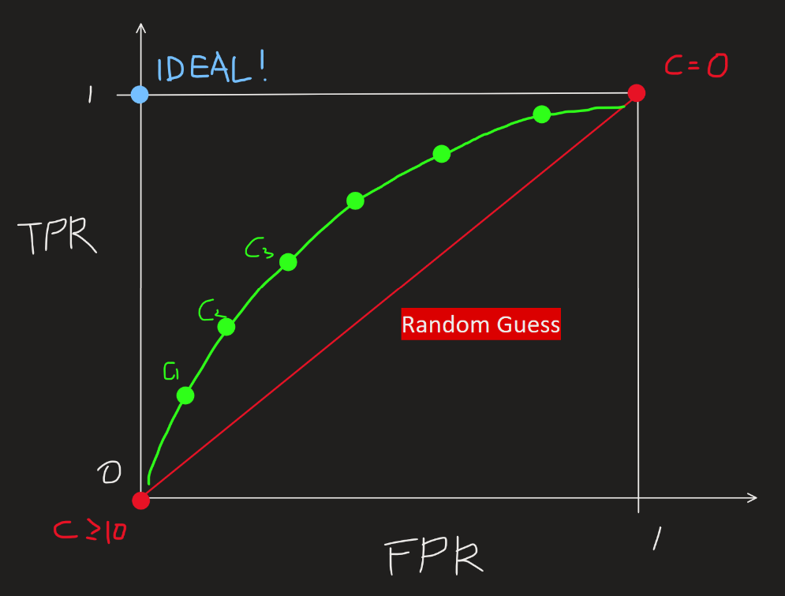

[Back to Main](../main.md)

# 2. Bias in Machine Learning: COMPAS and ProPublica

- Problem with Propublica's Conclusion)
  - Label Difference)
    - COMPAS returns the score in the scale of 0~10
      - semi-continuous scale
    - Propublica used the binary classification of High/Low risk.
    - Data points at the threshold may share similar properties but may be labeled radically in the binary classification problem.
  - Data
    - Recidivism
      - Propublica related COMPAS and the criminal record.
        - What if the defendant in the COMPAS recidivated in other regions? 
        - NOT recorded!

### Analysis
#### Propublica Predictor
- Model)
  - $`\hat{y} = \begin{cases}
    1 & \text{if COMPAS } \ge 7 \\ 0 & \text{otherwise}
  \end{cases}`$

#### Statistical Tools that Northpointe Used.
- Confusion Matrix)
  ||$`\hat{y}=0`$|$`\hat{y}=1`$|
  |:-:|:-:|:-:|
  |$`y=0`$|$`a`$|$`b`$|
  |$`y=1`$|$`c`$|$`d`$|
  - Statistics)
    |Stat.|Def.|Value in Confusion Matrix|
    |:-:|:-:|:-:|
    |Error Rate|$`\text{Pr}[\hat{y}\ne y]`$|$`\displaystyle\frac{b+c}{a+b+c+d}`$|
    |False Positive Rate ($`\text{FPR}`$)|$`\text{Pr}[\hat{y} = 1 \vert y=0]`$|$`\displaystyle\frac{b}{a+b}`$|
    |False Negative Rate ($`\text{FNR}`$)|$`\text{Pr}[\hat{y} = 0 \vert y=1]`$|$`\displaystyle\frac{c}{c+d}`$|
    |True Positive Rate ($`\text{TPR}`$)|$`\text{Pr}[\hat{y} = 1 \vert y=1]`$|$`\displaystyle\frac{d}{c+d}`$|
    |True Negative Rate ($`\text{TNR}`$)|$`\text{Pr}[\hat{y} = 0 \vert y=0]`$|$`\displaystyle\frac{a}{a+b}`$|
    - Props.)
      - $`\text{FPR} + \text{TNR} = 1`$
      - $`\text{FNR} + \text{TPR} = 1`$
- Thresholding Scores)
  - Have some "risk" score $`r \in [0, 10]`$.
  - Predict $`\hat{y}`$ based on $`r`$
    - $`\hat{y}=1 \Leftrightarrow r\ge c \; (\text{e.g. } c= 7)`$
      - Cases)
        - $`c = 0`$
          - Then **FPR = 1**, FNR = 0, **TPR =1**, TNR =0
          - Labeling every data point as 1.
        - $`c=11`$
          - Then **FPR = 0**, FNR = 1, **TPR =0**, TNR =1
          - Labeling every data point as 0.
        - We may get the FPR and TPR for every threshold value $`c\in [1, 10]`$.
- ROC Curve    
  
  - By plotting the ratio of FPR and TPR on each threshold we can get the ROC Curve.
  - $`\forall c \in [0, 11]`$, each $`\hat{y}`$ will have a point between $`c=0`$ and $`c=11`$.
- AUC (Area Under Curve)
  - This is a metric for assessing the accuracy of the model.
  - In this case, if there is a trajectory above the diagonal, this model is at least better than the random guess.

  

### How Northpointe rebuffed)
- Many descriptive statistics were used other than the racial back ground.
  - e.g.)
    - Older defendants tends not to recidivate and whites were older than blacks.
  - No statistical proof that race affected the scores.
- Must consider all the threshold to evaluate the accuracy of the model but Propublica used a single arbitrary threshold.
- Wrong use of statistics such as FPR and TPR
  - FPR and TPR can be used to plot ROC and AUC from this can be used as the statistics of accuracy.
  - However, Propublica used FPR and TPR as the proof of bias between races.
- Chose a different fairness score : AUC
  - If you want to make a comparison between Black and white, Propublica should have build independent confusion matrices.
  - Northepointe checked the ROC and AUC of separated White and Black candidates, and they had meaningful accuracy.

 

### Concept) Calibration
- Def.)
  - the process of adjusting a model so that its predicted probabilities match the actual observed frequencies
- ML Fairness?)
  - it is crucial to ensure that, across different groups (e.g., race, gender), the predicted probabilities carry the same meaning

  

[Back to Main](../main.md)